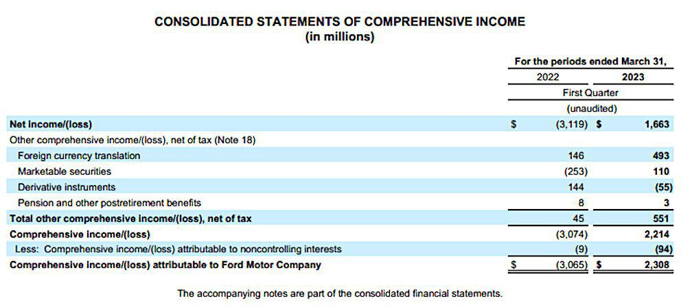

Understanding a company's financial health is crucial for investors, stakeholders, and management alike. Financial statements are fundamental tools that provide insights into a company's operations and financial position, guiding decisions and reacting to economic challenges and opportunities. Among these statements, the income statement and the statement of comprehensive income stand out as key documents, each serving a distinct purpose.

The income statement, also known as the profit and loss statement, focuses on a company's revenues and expenses during a specific period, providing a picture of its profitability. In contrast, the statement of comprehensive income includes items that do not immediately impact the company's net income. This broader view captures unrealized gains and losses, such as foreign currency adjustments and changes in the value of financial instruments, offering a more complete picture of a company's financial performance.



As algorithmic trading gains traction in financial markets, comprehension of these financial documents becomes increasingly important. Algorithmic trading involves using computer programs to execute trades based on predetermined criteria. These programs analyze a multitude of data points, including those from financial statements, to identify profitable trading opportunities. Understanding the nuances of the income statement and comprehensive income allows algorithmic traders to gain insights beyond immediate earnings, factoring in potential economic events that could influence future stock prices.

This article explores the intricacies of financial statements, focusing on the income statement and comprehensive income, and their relevance in algorithmic trading. An in-depth understanding of these statements is essential for anyone involved in financial markets; it enhances decision-making processes and assists in anticipating market movements. By integrating comprehensive financial insights, stakeholders can better forecast and make more informed decisions in today’s fast-paced financial environment.

## Table of Contents

## Understanding Financial Statements

Financial statements are detailed reports that encapsulate a company's financial activities and present a clear snapshot of its financial standing at a given time. These documents are vital tools for assessing aspects such as profitability, debt levels, and revenue, and they serve multiple stakeholders, including investors, management, and regulators.

The primary financial statements include:

1. **Balance Sheet**: This presents a company's assets, liabilities, and shareholders' equity at a specific moment. It's structured around the accounting equation: 
$$
   \text{Assets} = \text{Liabilities} + \text{Shareholders' Equity}

$$
   This equation underscores how assets are financed either by borrowing money (liabilities) or by the company's owners (equity).

2. **Income Statement**: Also known as the profit and loss statement, it details revenues and expenses over a specific time period, culminating in net income. The structure typically follows:
$$
   \text{Net Income} = \text{Total Revenues} - \text{Total Expenses}

$$
   This statement provides insight into the operational efficiency and profitability of the company over the reporting period.

3. **Cash Flow Statement**: This document tracks the cash inflows and outflows, segregating them into operations, investing, and financing activities. It shows how a company generates and utilizes cash, crucial for understanding liquidity and long-term solvency.

4. **Statement of Comprehensive Income**: Beyond the net income presented in the income statement, this statement includes items that do not pass through the net income but affect shareholders' equity. These can include unrealized gains and losses on investments, foreign currency translation adjustments, or changes in pension obligations. By integrating these elements, it provides a more encompassing view of a company's financial performance.

Understanding these financial statements is imperative for making informed business and investment decisions. For instance, while the income statement and cash flow statement highlight current profitability and [liquidity](/wiki/liquidity-risk-premium), the statement of comprehensive income presents a holistic picture by capturing broader financial changes impacting equity. Recognizing the nuances of each statement enables stakeholders to gauge a company's financial trajectory accurately and align their strategies and expectations accordingly.

## Comprehensive Income vs. Net Income

Comprehensive income represents a broader evaluation of a company's financial performance than net income, as it encompasses all changes in equity that are not transactions with owners. This includes net income and other comprehensive income (OCI) components, which capture unrealized gains and losses that do not immediately impact the net profit figure reported on the income statement. 

Other comprehensive income elements often consist of foreign currency translation adjustments, unrealized gains or losses from derivative instruments—which are measured at fair value—and adjustments for minimum pension liability, among others. These items reflect economic events that can influence a company's equity but are not included in the traditional net income as they are not realized. 

Net income, calculated as total revenues minus total expenses, is often highlighted in financial reports because it indicates the actual profitability of a company over a specified period. It provides a short-term view of performance by showing the results of the company’s operational efficiency, cost management, and revenue generation capability. The formula for net income can be expressed as:

$$
\text{Net Income} = \text{Total Revenue} - \text{Total Expenses}
$$

Focusing solely on net income might miss important aspects of a company's financial situation. For instance, a company might report a strong net income while experiencing significant unrealized losses in foreign investments or detrimental market conditions affecting the fair value of certain assets, which are captured only in the comprehensive income. Comprehensive income thus offers a more rounded financial narrative, integrating both realized income and potential adjustments stemming from various external factors.

The detailed distinctions between net income and comprehensive income become particularly useful when evaluating a company for long-term investments. A full grasp of these metrics can lead to more informed decisions by capturing potential risks and opportunities that affect the overall financial stability of a company. Investors can gain deeper insights by analyzing comprehensive income, as it signals potential future economic impacts from components not recognized in the immediate past performance depicted by net income.

## The Role of Comprehensive Income in Algorithmic Trading

Algorithmic trading utilizes advanced algorithms to automate the buying and selling of financial instruments, based on predefined criteria, to optimize trading performance and capitalize on market efficiencies. A key aspect of this process is harnessing data from financial statements, such as the statement of comprehensive income, to generate insights that drive trading strategies.

The statement of comprehensive income provides a broader perspective on a company's financial performance by including not only realized gains and losses but also unrealized ones — such as adjustments from foreign currency translations, changes in the fair value of derivatives, and pension adjustments. This expansive view is crucial for [algorithmic trading](/wiki/algorithmic-trading), where understanding the full scope of financial dynamics can reveal opportunities not immediately apparent on the income statement.

Algorithms can identify patterns and correlations within the comprehensive income data, informing trading models that better anticipate changes in market conditions or a company's financial outlook. By accounting for the wider financial impacts encapsulated in comprehensive income, such as those that reflect broader economic or market trends, trading algorithms are able to forecast stock price movements that might be missed when considering net income alone.

The integration of comprehensive income details into trading algorithms could be illustrated through a Python script that uses these data points. Consider the following pseudo-code highlighting how comprehensive income data can be sampled and analyzed for trading signals:

```python
import pandas as pd
from statsmodels.tsa.arima_model import ARIMA

# Load comprehensive income data
data = pd.read_csv('comprehensive_income_data.csv')
comprehensive_income = data['comprehensive_income']

# Generate a trading signal based on ARIMA model prediction
model = ARIMA(comprehensive_income, order=(1, 1, 1))
model_fit = model.fit(disp=0)

# Predict future comprehensive income and derive potential trading opportunities
forecast = model_fit.forecast(steps=5)[0]

# Example of analyzing forecast
for index, predicted_value in enumerate(forecast):
    if predicted_value > threshold:
        print(f"Significant movement anticipated at index {index}: Consider buying.")
    else:
        print(f"Minor movement anticipated at index {index}: Consider holding.")

# This script hypothetically forecasts the comprehensive income and generates a basic buy/hold signal.
```

This approach illustrates how comprehensively analyzing income data can refine predictive trading models. By leveraging comprehensive income figures, algorithms can capture economic events influencing stock prices in indirect ways, such as through [volatility](/wiki/volatility-trading-strategies) linked to currency fluctuations or adjustments in asset valuations.

Ultimately, a thorough understanding of comprehensive income data supports a more robust trading model, allowing algorithms to anticipate market movements that are not clearly reflected in net income figures alone. This capability enhances the sophistication of algorithmic trading, leading to potential advantages in a rapidly evolving financial landscape.

## Advantages and Disadvantages of Comprehensive Income

The statement of comprehensive income offers a nuanced perspective of a company's financial health by reporting both realized and unrealized gains and losses. This broader scope is advantageous for management and investors as it allows for a more holistic understanding of a company's financial activities. By capturing elements that extend beyond net income, such as foreign currency translation adjustments, changes in pension obligations, and gains or losses on available-for-sale securities, the statement aids in assessing the complete impact of financial transactions. This leads to more informed decision-making and strategic planning.

For algorithmic traders, the inclusion of comprehensive income data can refine trading models. These traders can leverage the expansive dataset to anticipate longer-term movements and trends that are not immediately apparent from the income statement alone. By analyzing comprehensive income, algorithms can detect subtle indicators of future profitability, potentially unveiling trading opportunities hidden beneath the surface.

Despite these advantages, the comprehensive income statement presents challenges, particularly due to the inclusion of unrealized items. While these items provide a broader picture, they can complicate financial analysis by introducing elements that may not reflect the company's short-term financial health accurately. For instance, fluctuations in market values of certain assets may lead to perceived volatility in financial results, even when core business operations remain stable.

Nevertheless, the comprehensive income statement remains an essential tool for evaluating a company’s financial performance. By integrating both realized and unrealized aspects, it delivers a complete overview that is crucial for assessing long-term financial health and crafting sophisticated trading strategies. Balancing the depth of insights with the complexity introduced by unrealized items is vital for those relying on comprehensive income as a key analytical tool.

## Conclusion

In the complex world of finance, possessing a clear understanding of a company's financial statements is indispensable. Financial statements, particularly the statement of comprehensive income and the income statement, each offer distinct insights that are crucial for a variety of stakeholders, including algorithmic traders. The statement of comprehensive income provides a fuller picture of a company's economic activities by encompassing both realized and unrealized gains and losses. This broader perspective is invaluable in sophisticated trading strategies, as it allows traders to anticipate potential impacts on stock prices that go beyond immediate earnings results.

As algorithmic trading continues to evolve, the integration of comprehensive financial insights becomes ever more critical. These insights enable more precise forecasting and facilitate informed decision-making that leverages the full spectrum of financial data. In essence, the synthesis of financial statements with algorithmic trading highlights the importance of detailed financial analysis in making strategic moves within today's fast-paced financial markets. Whether assessing long-term investment opportunities or executing short-term trades, a profound understanding of these financial documents can significantly enhance the effectiveness of trading strategies.

## References & Further Reading

[1]: ["Financial Statements: A Step-by-Step Guide to Understanding and Creating Financial Reports"](https://books.google.com/books/about/Financial_Statements.html?id=V9tEDwAAQBAJ) by Thomas Ittelson

[2]: ["International Financial Statement Analysis"](https://www.amazon.com/International-Financial-Statement-Institute-Investment/dp/1119628059) by Thomas R. Robinson, Elaine Henry, Wendy L. Pirie, and Michael A. Broihahn

[3]: ["Advances in Financial Machine Learning"](https://www.amazon.com/Advances-Financial-Machine-Learning-Marcos/dp/1119482089) by Marcos Lopez de Prado

[4]: ["Understanding Financial Statements"](https://online.hbs.edu/blog/post/how-to-read-financial-statements) by Lyn M. Fraser and Aileen Ormiston

[5]: ["Machine Learning for Algorithmic Trading: Predictive Models to Extract Signals from Market and Alternative Data for Systematic Trading Strategies with Python"](https://github.com/stefan-jansen/machine-learning-for-trading) by Stefan Jansen

[6]: ["Quantitative Trading: How to Build Your Own Algorithmic Trading Business"](https://www.amazon.com/Quantitative-Trading-Build-Algorithmic-Business/dp/1119800064) by Ernest P. Chan