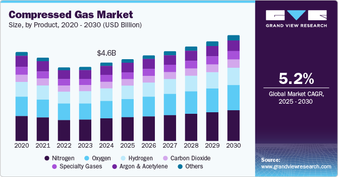

## Table of Contents

## What is a compressed market?

A compressed market is when the difference between the highest and lowest prices of a product or service is very small. This can happen because there are many sellers offering similar things, so they all have to keep their prices close to each other to stay competitive. When the market is compressed, it can be hard for sellers to make a lot of profit because they can't charge much more than their competitors.

This situation often happens in industries where products are very similar and customers can easily compare prices. For example, in the market for basic groceries, like milk or eggs, there are many stores selling the same items, so the prices stay close together. A compressed market can be good for buyers because they can find what they need at a lower price, but it can be challenging for sellers who want to stand out and earn more money.

## How does a compressed market differ from a regular market?

In a regular market, the prices of products or services can vary a lot. There might be some sellers charging high prices and others offering lower prices. This happens because the products might be different or because some sellers have a special way of attracting customers. In a regular market, sellers have more freedom to set their prices based on what they think people will pay, and they can make bigger profits if they can convince customers that their product is worth the extra cost.

In a compressed market, the prices are squeezed together, so there isn't much difference between the highest and lowest prices. This usually happens when there are many sellers offering very similar products, and customers can easily compare prices. Because of this, sellers in a compressed market have to keep their prices close to their competitors to stay in business. This can make it hard for them to earn big profits because they can't charge much more than others. A compressed market is often good for buyers because they can find what they need at a lower price, but it can be tough for sellers trying to stand out.

## What are the common causes of market compression?

Market compression often happens when there are a lot of sellers offering the same or very similar products. When many stores sell the same thing, like milk or smartphones, they all have to keep their prices close to each other. If one store tries to charge more, people will just go to another store that sells it cheaper. This competition pushes prices down and makes them stay close together.

Another cause of market compression is when customers can easily compare prices. With the internet, people can quickly look at different websites to see who has the best deal. This makes it hard for sellers to charge more than their competitors because customers will find the cheapest option. When everyone knows the prices, sellers have to keep their prices low to stay competitive.

Sometimes, market compression can also happen because of government rules or regulations. For example, if the government sets a maximum price for something like medicine, all sellers have to follow that price. This can make the prices in the market very close together. Also, in some industries, there might be a lot of rules about what can be sold and how, which can make products very similar and lead to compressed prices.

## Can you explain the economic impacts of a compressed market?

A compressed market can be good for buyers because it means they can find things at lower prices. When many sellers offer the same product, they all have to keep their prices low to attract customers. This can help people save money on things they need, like groceries or basic services. For example, if you need to buy milk, you can go to any store and find it for about the same price, which helps you stick to your budget.

On the other hand, a compressed market can be tough for sellers. When prices are squeezed together, it's hard for them to make big profits. They can't charge much more than their competitors, so they have to find other ways to make money, like selling more products or cutting costs. This can lead to less money being invested in new products or services because the rewards might not be worth the risk. Over time, this can slow down growth and innovation in the market.

## What industries are most affected by market compression?

Some industries are more likely to have compressed markets because their products are very similar and easy to compare. For example, the grocery industry often sees market compression because stores sell the same basic items like milk, eggs, and bread. Customers can easily check prices at different stores and choose the cheapest one. This means grocery stores have to keep their prices close to each other to stay competitive, which can make it hard for them to make a lot of profit.

Another industry affected by market compression is electronics, especially for common items like smartphones and laptops. Many companies make similar products with similar features, so customers can compare prices and specs easily online. This pushes companies to keep their prices low to attract buyers, which can squeeze their profits. In both these industries, market compression makes it tough for sellers but can be good for buyers who get to pay less for what they need.

## How can businesses identify if they are operating in a compressed market?

Businesses can tell if they are in a compressed market by looking at the prices of their products compared to others. If the prices of similar products from different sellers are very close, this is a sign of a compressed market. For example, if a business sells milk and sees that all the other stores in the area sell it for about the same price, this means the market is compressed. When prices don't change much and stay close together, it shows that sellers are all trying to match each other to keep customers.

Another way to spot a compressed market is by checking how easy it is for customers to compare prices. If people can easily go online or visit different stores to see who has the best deal, this can lead to a compressed market. When customers can quickly find the cheapest option, businesses have to keep their prices low to stay competitive. This is common in industries like groceries and electronics, where products are similar and easy to compare. If a business sees that customers are always looking for the lowest price, it's likely operating in a compressed market.

## What strategies can companies use to navigate a compressed market?

In a compressed market, companies need to find ways to stand out without relying too much on price. One good strategy is to focus on improving the customer experience. This can mean offering better service, making the shopping experience more enjoyable, or providing helpful information that customers need. By doing things that make customers happy, a company can build loyalty and get people to choose them over competitors, even if the prices are similar. Another approach is to offer unique products or services that others don't have. If a company can give customers something special, they might be willing to pay a little more, which can help the company make more money.

Another way to navigate a compressed market is by cutting costs to stay profitable. Companies can look for ways to save money in their operations, like using technology to make things more efficient or finding cheaper suppliers. By lowering their costs, they can keep their prices competitive while still making a profit. It's also important for companies to keep an eye on what their competitors are doing. If they see a chance to offer something better or different, they should take it. Staying flexible and ready to change can help a company do well in a compressed market.

## How does market compression affect pricing strategies?

In a compressed market, businesses have to be very careful about how they set their prices. Because there isn't much difference between the highest and lowest prices, companies can't charge much more than their competitors. If they do, customers will just go to another store that offers the same product for less. So, businesses often have to keep their prices close to others to stay in the game. They might focus on keeping costs low so they can still make a profit even if they can't charge a lot.

To stand out in a compressed market, companies might use other strategies besides just lowering prices. They could try to make their product or service special in some way, like adding extra features or offering better customer service. This can make customers choose them over others, even if the prices are similar. Another approach is to focus on selling more products or services, so even if the profit on each one is small, they can make up for it with higher [volume](/wiki/volume-trading-strategy). In a compressed market, businesses need to be smart and flexible to find ways to succeed without relying too much on price alone.

## What are the long-term effects of sustained market compression?

When a market stays compressed for a long time, it can be tough for businesses. They might struggle to make enough money because they can't charge much more than their competitors. This can lead to less money being spent on new ideas or improvements. Over time, this can slow down growth in the industry because businesses might not want to take risks if the rewards are small. Some companies might even leave the market if they can't make it work, which can leave fewer choices for customers.

On the other hand, a long-term compressed market can be good for buyers. They can keep buying things at low prices because businesses have to stay competitive. This can help people save money and make it easier for them to afford what they need. But if too many businesses leave the market or stop trying to improve, the quality of products or services might go down. In the end, a sustained compressed market can create a balance where buyers save money, but businesses and the overall industry might face challenges.

## How do regulatory bodies respond to market compression?

Regulatory bodies might step in when they see a compressed market. They want to make sure that businesses can still make money and that the market stays healthy. Sometimes, they might set rules to stop prices from getting too low. This can help businesses by giving them a bit more room to make a profit. They might also look at the market to see if there are any unfair practices, like big companies forcing prices down too much, and they can make rules to stop this from happening.

Another thing regulatory bodies might do is help businesses find ways to stand out without just lowering prices. They can encourage companies to come up with new ideas or improve their products. This can make the market more competitive in a good way, where businesses are trying to be better instead of just cheaper. By doing this, regulatory bodies hope to keep the market balanced so that both businesses and customers can do well.

## What role does technology play in managing or exacerbating market compression?

Technology can make market compression worse because it helps people compare prices easily. With the internet and apps, customers can quickly see who has the cheapest price for things like groceries or electronics. This pushes businesses to keep their prices low to stay competitive. When everyone knows the prices, it's hard for any one store to charge more than others. This can make the market even more compressed, making it tough for businesses to make money.

On the other hand, technology can also help businesses manage market compression. They can use technology to cut costs, like using software to make their work more efficient or finding cheaper suppliers online. This can help them keep their prices low while still making a profit. Technology can also help businesses stand out by improving the customer experience. For example, they can use apps to offer better service or make shopping easier. By doing this, businesses can attract customers even in a compressed market.

## Can you discuss any case studies of successful adaptation to a compressed market?

One good example of a company adapting to a compressed market is Walmart. They sell a lot of the same things as other stores, like groceries and household items, which means they have to keep their prices low to stay competitive. Walmart uses technology to keep their costs down. They use computers to manage their stores and warehouses, which helps them save money. They also buy things in big amounts to get better deals from suppliers. By keeping their costs low, Walmart can offer low prices and still make money, even in a compressed market.

Another example is Southwest Airlines. In the airline industry, prices can be very close together, especially for common routes. Southwest figured out a way to stand out by keeping things simple. They only fly one type of plane, which makes it easier to keep their costs down. They also offer friendly service and let people change their flights without charging extra fees. By focusing on good service and low costs, Southwest can keep their prices competitive and still make a profit, even when the market is compressed.

## References & Further Reading

[1]: Bergstra, J., Bardenet, R., Bengio, Y., & Kégl, B. (2011). ["Algorithms for Hyper-Parameter Optimization."](https://papers.nips.cc/paper/4443-algorithms-for-hyper-parameter-optimization) Advances in Neural Information Processing Systems 24.

[2]: ["Advances in Financial Machine Learning"](https://www.amazon.com/Advances-Financial-Machine-Learning-Marcos/dp/1119482089) by Marcos Lopez de Prado

[3]: ["Evidence-Based Technical Analysis: Applying the Scientific Method and Statistical Inference to Trading Signals"](https://www.amazon.com/Evidence-Based-Technical-Analysis-Scientific-Statistical/dp/0470008741) by David Aronson

[4]: ["Machine Learning for Algorithmic Trading"](https://github.com/stefan-jansen/machine-learning-for-trading) by Stefan Jansen

[5]: ["Quantitative Trading: How to Build Your Own Algorithmic Trading Business"](https://books.google.com/books/about/Quantitative_Trading.html?id=j70yEAAAQBAJ) by Ernest P. Chan