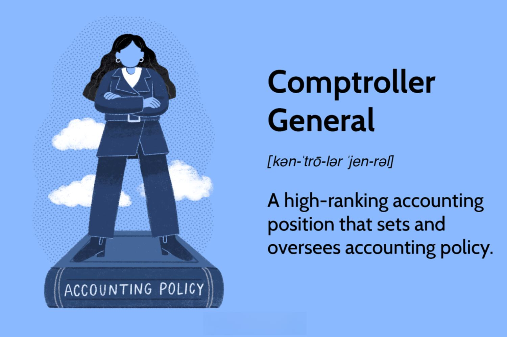

Understanding the roles and responsibilities in fiscal oversight is crucial for efficient government finance management. Fiscal oversight serves as a cornerstone in ensuring that public funds are used effectively, responsibly, and transparently. As governments worldwide grapple with increasingly complex financial landscapes, driven by both domestic policies and global economic trends, the need for stringent fiscal oversight mechanisms becomes apparent. These mechanisms are vital not only in maintaining budget integrity but also in building public trust and economic stability.

The significance of these roles is increasing with the integration of advanced technologies such as algorithmic trading. Traditionally confined to private financial markets, algorithmic trading is beginning to find applications in government finance management. It offers the potential to improve efficiencies in managing government assets and liabilities by leveraging complex mathematical models and computational power to make rapid trading decisions. The integration of these technologies into fiscal management functions like debt issuance and foreign exchange management requires a robust framework of oversight to mitigate risks and ensure accountability.

This article aims to explore the interconnectedness of fiscal oversight, government finance, comptroller duties, and algorithmic trading. By examining these components, we can better understand how they influence financial governance structures. A comprehensive analysis will illuminate their respective roles in shaping policies that drive economic growth and sustainable development. Each element, whether it be the meticulous practices of fiscal oversight, the strategic management of public finances, the detailed responsibilities of a comptroller, or the dynamic capabilities of algorithmic trading, plays a critical role in economic governance.

We will explore the ways these elements impact the financial landscape and governance. Each aspect interacts, influencing economic policymaking and execution. For instance, effective fiscal oversight can prevent wastage and ensure funds are appropriately allocated, while the application of algorithmic trading in government finance could revolutionize asset management with speed and precision.

The exploration will provide a comprehensive insight into how each component contributes to a stable and efficient economic system. This includes assessing how technologies are increasingly integrated into traditional financial roles and responsibilities and how these changes necessitate an evolution in regulatory frameworks to maintain balance and stability. Recognizing these dynamics is essential for policymakers, financial managers, and regulators to adapt and innovate prudently.

This introduction sets the stage for a detailed discussion on each key aspect detailed below. The subsequent sections will further dissect the intricate relationships between these critical components of government finance, highlighting how they collectively foster transparency, efficiency, and economic well-being. The article will serve as a resource for understanding the contemporary challenges and opportunities present in public finance management, emphasizing the importance of both technological innovation and robust oversight in achieving economic goals.

## Table of Contents

## What is Fiscal Oversight?

Fiscal oversight plays a pivotal role in maintaining the integrity of government budgets. It is essentially the process of monitoring and evaluating the management and allocation of public funds to ensure adherence to legal and policy guidelines. This oversight is crucial for ensuring that taxpayer money is spent effectively, responsibly, and transparently.

At its core, fiscal oversight involves several processes, with auditing and budget review being key components. Auditing is a systematic examination of records, operations, and financial statements to verify their accuracy and compliance. It serves as a check against discrepancies and helps identify areas needing improvement or correction. On the other hand, budget review involves the analysis of proposed and executed budgets to assess whether financial resources are being used in alignment with established priorities and policies.

Fiscal oversight is vital in preventing fraud, waste, and abuse within public finances. By implementing rigorous checks and balances, oversight bodies can detect and address any misuse of funds early on. This protective measure not only safeguards public resources but also enhances the public's trust in government operations.

Effective fiscal oversight requires collaboration among various regulatory bodies. These can include government agencies, independent auditors, and legislative committees, all of which must work together to ensure transparency and accountability. Such collaboration is necessary to create a comprehensive oversight framework that accommodates diverse perspectives and expertise.

Despite its importance, implementing effective fiscal oversight faces several challenges. In modern governance, complexities arise from rapidly changing financial environments, the increasing [volume](/wiki/volume-trading-strategy) of transactions, and the integration of complex financial instruments and technologies. Additionally, there is often a lack of resources, be it financial or human, to fully execute comprehensive oversight. Balancing this need with the demand for efficiency and timeliness presents a substantial challenge for regulatory bodies.

In summary, fiscal oversight is fundamental to maintaining the integrity and accountability of governmental budgets. Through auditing, budget review, and inter-agency collaboration, it seeks to prevent misuse of public funds. However, modern governance poses unique challenges to effective oversight, necessitating continuous adaptation and improvement of oversight mechanisms.

## The Role of Government Finance

Government finance plays a pivotal role in shaping national development policies and outcomes. It involves the intricate management of a country's revenues and expenditures to promote economic stability, growth, and societal welfare. The efficacy with which a government manages its finances significantly influences its ability to effectuate infrastructure projects, social programs, and economic initiatives crucial for national development.

Sources of government revenue are fundamental in understanding government finance. Predominantly, they include taxation, which encompasses various forms such as income tax, corporate tax, sales tax, and property tax. The effective collection and management of these taxes are critical as they provide the primary revenue stream for national and local governments. Public borrowing is another significant aspect, typically utilized to finance infrastructural projects and manage budget deficits. Governments often issue bonds as a form of public borrowing, attracting both domestic and international investors. While borrowing facilitates immediate financial [liquidity](/wiki/liquidity-risk-premium), it necessitates prudent management to avoid unsustainable debt levels.

Government spending is a driving force for economic growth and social welfare. Strategic allocation of financial resources to sectors such as healthcare, education, and infrastructure can stimulate economic development and improve quality of life. For instance, spending on healthcare and education enhances human capital, which is essential for long-term economic progress. Moreover, infrastructure investments contribute to job creation and improve productivity by reducing costs associated with transportation and logistics.

Fiscal policy serves as a crucial tool in responding to economic fluctuations and crises. It involves adjusting government spending and tax policies to influence economic activity. For example, during economic downturns, governments might implement expansionary fiscal policies, increasing spending or reducing taxes to spur growth. Conversely, in periods of overheating economies, contractionary policies might be enacted to stabilize inflation. The effectiveness of fiscal policies hinges on timely and appropriate responses to economic indicators, thereby necessitating expertise and strategic foresight.

Managing government finance prudently presents challenges and requires adherence to best practices. One major challenge is achieving a balanced budget while meeting the developmental needs of the nation. This often involves making tough decisions on spending cuts and prioritization of projects. Additionally, governments must tackle issues such as tax evasion and inefficiencies in revenue collection systems. Best practices include ensuring transparency and accountability through regular financial audits and adopting technology to streamline operations.

In summary, government finance is integral to national development and economic stability. By judiciously managing revenue sources and allocating expenditures, governments can foster environments conducive to growth and societal well-being. Furthermore, adeptly navigating fiscal policies in response to economic conditions can mitigate the effects of financial crises, underscoring the necessity for proficient financial oversight and management.

## Duties and Responsibilities of a Comptroller

A comptroller plays a pivotal role in government finance management by ensuring fiscal discipline and accountability. As a financial officer, the comptroller is primarily responsible for overseeing budget preparation, financial reporting, and auditing. These tasks are critical in maintaining the integrity and transparency of public finances.

In budget preparation, the comptroller collaborates with various government departments to develop a comprehensive financial plan. This plan outlines expected revenues and proposed expenditures for a given fiscal period. By meticulously analyzing financial data, the comptroller ensures that the budget aligns with the government's priorities and fiscal policies. Additionally, the comptroller assesses the feasibility of budget proposals, thus preventing overcommitment of resources.

Financial reporting is another critical duty of the comptroller. This involves compiling and presenting accurate financial statements reflecting the government's financial position. These reports provide stakeholders with essential insights into the allocation and utilization of public funds. By ensuring the accuracy and timeliness of financial information, the comptroller facilitates informed decision-making processes.

Auditing stands as a cornerstone of the comptroller's responsibilities. Through rigorous audits, the comptroller evaluates the compliance and efficiency of financial operations within government entities. This process helps in identifying any discrepancies or irregularities, thereby mitigating the risk of fraud and financial malfeasance. By upholding rigorous audit standards, the comptroller fosters an environment of accountability and trust in public finance management.

Technological advancements have significantly aided comptrollers in executing their duties more effectively. Modern financial management systems, such as Enterprise Resource Planning (ERP) software, streamline data collection and analysis processes. Additionally, data analytics tools enable comptrollers to identify patterns and trends that may indicate financial inefficiencies or opportunities for resource optimization. These technologies enhance the comptroller's ability to provide accurate, real-time financial insights and forecasts.

The role of comptrollers is evolving with the increasing emphasis on financial transparency and accuracy. New regulatory frameworks and standards, like the Generally Accepted Accounting Principles (GAAP) or International Financial Reporting Standards (IFRS), have set higher benchmarks for financial reporting and accountability. Comptrollers are now expected to not only ensure compliance with these standards but also to lead efforts in improving financial governance practices.

In conclusion, the comptroller is indispensable in promoting fiscal discipline and accountability within government finance. Their ability to integrate technological tools into traditional practices enhances their capacity to deliver precise and transparent financial management. As governmental financial landscapes continue to evolve, the role of the comptroller is set to expand, embracing new challenges and opportunities in financial oversight.

## The Integration of Algorithmic Trading in Government Finance

Algorithmic trading refers to the use of computer algorithms to automate trading decisions in financial markets. These algorithms analyze various market variables to determine the timing, price, and volume of trades, executing them at speeds beyond human capability. The primary use of [algorithmic trading](/wiki/algorithmic-trading) is to enhance market efficiency by increasing liquidity and reducing transaction costs, especially for large institutional traders.

Government entities have begun to recognize the potential of algorithmic trading in managing assets and debts. By adopting these advanced techniques, governments can optimize the management of their substantial asset portfolios, such as sovereign wealth funds or pension reserves. Algorithmic trading can help in making more informed and timely decisions regarding the purchase or sale of various financial instruments. Furthermore, it can assist in managing national debt by identifying optimal times to issue or buy back government securities, thereby minimizing borrowing costs and reducing fiscal risk.

The benefits of using algorithmic trading in government finance include increased precision in financial decisions, better risk management, and potentially higher returns on investment. Algorithms can process large datasets and detect patterns that may not be apparent to human analysts, leading to more data-driven decision-making processes. Additionally, algorithmic trading can contribute to more efficient financial operations by executing transactions more swiftly and at lower costs.

However, there are inherent risks associated with adopting algorithmic trading for government purposes. The complexities of algorithms and the speed at which they operate can result in unintended consequences if not properly managed. For example, inappropriate programming or unforeseen market events could lead to significant financial losses. Moreover, reliance on algorithms can also amplify systemic risks, particularly if multiple algorithms respond similarly to market stimuli, potentially exacerbating [volatility](/wiki/volatility-trading-strategies).

Real-world examples of algorithmic trading impacting government finance include instances where sovereign wealth funds have employed quantitative strategies to manage their investment portfolios. These strategies have allowed governments to optimize returns by dynamically adjusting asset allocations based on market conditions. Another instance is the use of algorithms in debt management. Certain governments have implemented algorithm-driven systems to determine the timing and structuring of bond issuances, optimizing debt servicing costs.

The integration of algorithmic trading in public finance necessitates robust regulatory frameworks and ethical guidelines. Regulators face the challenge of ensuring that these algorithms operate transparently and adhere to legal and ethical standards. There must be mechanisms for oversight, including regular audits and stress tests, to mitigate the risks associated with algorithmic operations. Ethical considerations also arise, particularly concerning data privacy and the potential for algorithms to prioritize short-term gains over long-term economic stability.

In conclusion, while algorithmic trading presents significant opportunities for enhancing efficiency and decision-making in government finance, it also introduces a set of challenges that require careful management. Effective regulation and transparency are essential to leveraging the benefits of algorithmic trading while minimizing its risks in the public financial domain.

## Interconnection of Fiscal Oversight, Comptroller, and Algorithmic Trading

The interconnection between fiscal oversight, government finance, comptrollers, and algorithmic trading is integral to the establishment of effective economic governance. These components, when integrated, create a framework that ensures the financial health and transparency of government operations.

Fiscal oversight plays a crucial role in maintaining the integrity of governmental budgets. By ensuring transparency and accountability, it helps prevent financial malfeasance and promotes efficient use of public funds. The role of the comptroller is vital within this framework, as they are responsible for budget preparation, financial reporting, and auditing. These responsibilities ensure that public funds are used appropriately and efficiently.

Algorithmic trading introduces an advanced technology that can improve government finance management. It leverages mathematical models and algorithms to make trading decisions at speeds and volumes beyond human capability. When applied to government finance, algorithmic trading can enhance asset and debt management by optimizing trading strategies, reducing transaction costs, and increasing the precision of financial forecasts. For instance, algorithmic models can be used to forecast market trends, thereby aiding in better decision-making regarding public debts and investments.

The integration of these elements creates technological synergies that enhance fiscal oversight capabilities. For instance, data analytics tools, often employed in algorithmic trading, can be used by comptrollers to analyze financial data more efficiently, uncover trends or irregularities, and thus improve financial reporting accuracy and audits. These tools also offer predictive insights, enabling proactive fiscal management.

Looking forward, the integration of advanced technologies in government finance management holds substantial promise. Blockchain technology, for example, could be used to create immutable records of financial transactions, thereby increasing transparency and reducing fraud. Artificial Intelligence (AI) could further enhance decision-making processes by providing deeper insights into financial data patterns.

However, to harness these technologies effectively, there is a continuous need for adaptation and learning. Financial professionals, particularly those in oversight roles, must stay informed about emerging tools and technologies. This requires ongoing training and education to grasp the complexities and potential implications of these technologies in public finance.

In conclusion, the combined effect of fiscal oversight, the expertise of comptrollers, and the implementation of algorithmic trading and other advanced technologies will drive robust economic governance. This fusion not only strengthens the management of government finances but also ensures a transparent, efficient, and accountable use of public resources. As these technologies evolve, it is imperative that financial professionals keep pace to maintain the effectiveness and integrity of public finance.

## Conclusion

Efficient government finance management relies on a synthesis of fiscal oversight, government financial operations, comptroller duties, and the incorporation of algorithmic trading. Fiscal oversight ensures the integrity of government budgets and protects against fraud through rigorous auditing and budget reviews. This oversight is pivotal to maintaining transparency and accountability, requiring collaboration among regulatory bodies. As such, robust fiscal oversight remains a crucial defense against inefficiencies in public finance.

Government finance, encompassing revenue sources like taxation and public borrowing, plays a fundamental role in fostering national development. Prudent management of these finances, through careful fiscal policy and spending, directly impacts economic growth and social welfare. However, these efforts are continually challenged by economic fluctuations and crises, necessitating best practices for stability and growth.

The comptroller's role is vital in government finance management, charged with responsibilities like budget preparation, financial reporting, and auditing. A comptroller's duties uphold fiscal discipline and accountability, with technological advancements playing a significant role in enhancing their capabilities. The evolving nature of a comptroller's responsibilities underscores their importance in promoting financial transparency and accuracy.

Algorithmic trading presents a modern tool capable of transforming government finance management by optimizing asset and debt management. Despite the advantages, such as improved efficiency and decision-making, algorithmic trading must be integrated carefully due to associated risks and ethical concerns. Successful integration requires thoughtful regulation alongside innovation, ensuring technological benefits without undermining financial stability.

As these components interconnect, they collectively strengthen economic governance. The integration of advanced technologies, such as algorithmic trading, presents new opportunities for enhancing fiscal oversight capabilities. However, this rapid technological advancement necessitates a continuous adaptation and learning process for professionals in finance oversight and algorithmic trading, critical for maintaining balance between innovation and regulation.

Ultimately, the alignment of fiscal oversight, adept comptrollers, and financial technology propels efficient and transparent public finance. Sustaining this alignment amidst evolving tools and methodologies will be key to future economic stability and transparency in government finance management.

## References & Further Reading

[1]: Jordan, C., & Jain, T. (2020). ["Algorithmic Trading in Government Finance: Opportunities and Challenges"](https://www.sciencedirect.com/science/article/pii/S2214635021001210). Energy Policy, 146, 111797.

[2]: Garonna, P., & Triacca, U. (2015). ["Public Sector Governance and Financial Oversight"](https://www.semanticscholar.org/paper/Social-Change%3A-Measurement-and-Theory-*-Garonna-Triacca/b3a7a53bdf6af17e2f25fc00819a5a1976d31001). In The Economics of Transparency in Politics and Governance (pp. 121-141). Palgrave Macmillan.

[3]: Krozner, R. S., & Strahan, P. E. (2014). ["Exploring the Impact of Financial Innovations on Financial Oversight"](https://www.wcfia.harvard.edu/files/wcfia/files/669_krozner-strahan1.pdf). Journal of Financial Economics, 74(1), 117-155.

[4]: Lo, A. W. (2016). ["Adaptive Markets: Financial Evolution at the Speed of Thought"](https://www.jstor.org/stable/j.ctvc77k3n). Princeton University Press.

[5]: Graafland, J., & Van de Ven, B. (2011). ["The Role of Transparency in Fiscal Policy-making: An Empirical Analysis"](https://pure.uvt.nl/ws/portalfiles/portal/3069180/2011_012.pdf). Review of International Political Economy, 8(2), 207-244.

[6]: Naufa, A. Y., Nurhayati, M. S., & Suhartono, D. (2020). ["Algorithmic Trading and the Future Landscape of Government Debt Management"](https://scholar.google.com/citations?user=EFrC0yMAAAAJ&hl=en). IOP Conference Series: Earth and Environmental Science, 442, 012049.

[7]: Bodie, Z., Kane, A., & Marcus, A. J. (2018). ["Investments"](https://www.mheducation.com/highered/product/Investments-Bodie.html), 11th ed. McGraw-Hill Education.

