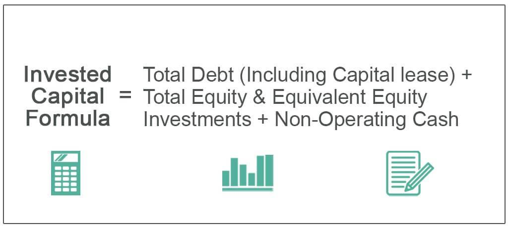

The landscape of trading is undergoing a significant transformation driven by the adoption of advanced technologies, particularly in the domain of data analysis and algorithmic strategy formulation. Central to this evolution is Compustat, a comprehensive financial database, which has become invaluable in crafting sophisticated trading algorithms. Managed by Standard & Poor's, Compustat provides extensive data on publicly traded companies, offering insights through historical income statements, balance sheets, and stock prices. The database is noted for its reliability and precision, essential attributes for making critical trading decisions.

The integration of Compustat into algorithmic trading systems allows traders to harness the power of data analytics, enabling the development of robust trading models. The database furnishes traders with the requisite tools to identify market trends, assess company performance, and streamline investment strategies. As a result, it serves not only as a tool for data retrieval but as a foundational element in structuring strategies that anticipate market movements.

This article aims to provide readers with a detailed understanding of Compustat's integral role in algorithmic trading. By examining how this database contributes to algorithmic success, traders can better appreciate the advantages it offers, such as enhanced data accuracy and comprehensive market coverage. Additionally, the discussion will highlight the challenges faced in its application and underscore why Compustat is indispensable for today's traders navigating the complexities of financial markets. Through this exploration, readers will gain a deeper appreciation of how Compustat aids in developing trading algorithms that achieve consistent success in an ever-evolving trading environment.

## Table of Contents

## Understanding Compustat

Compustat is a sophisticated financial database that provides comprehensive data on publicly traded companies. Managed by Standard & Poor's, Compustat covers an extensive range of financial information, including income statements, balance sheets, cash flow statements, and historical stock prices. This breadth of data supports traders and financial analysts in performing detailed analyses and making informed trading decisions.

One of Compustat’s key offerings is its ability to deliver historical data, which is essential for analyzing long-term trends in financial markets. This historical perspective allows analysts to identify patterns and trends that might be obscured in short-term analysis. By examining this data, traders can deduce potential future movements and strategically tailor their trading approaches to capitalize on these insights.

Compustat's reliability as a data source stems from its rigorous data collection and standardization processes. Standard & Poor's utilizes well-established methodologies to ensure the accuracy and consistency of the data provided. This makes it a preferred source for traders who require precise and actionable information when timing trades or evaluating investment opportunities.

The database’s standardized format is another strength. It facilitates easy comparison across different companies or industries, allowing users to perform cross-sectional or longitudinal analyses with ease. This consistency is crucial for traders who build models that rely on uniform data inputs to ensure accuracy and reliability.

Overall, the richness and depth of the information provided by Compustat make it a pivotal tool for making informed trading decisions. By offering robust, verifiable financial data, it helps traders reduce uncertainty and enhance the precision of their quantitative models. This ability to deliver actionable insights helps traders identify lucrative opportunities while mitigating potential risks.

## The Role of Compustat in Algorithmic Trading

Algorithmic trading, which employs automated systems to execute trades, depends profoundly on comprehensive and high-quality data. Compustat stands as a fundamental resource in this context, offering both the [volume](/wiki/volume-trading-strategy) and accuracy necessary for effective [algorithmic trading](/wiki/algorithmic-trading). With its vast repository of financial information, Compustat allows traders to develop, test, and optimize trading algorithms systematically.

Traders can leverage Compustat's rich dataset to enhance the robustness of their trading algorithms. This entails first developing algorithmic models that rely on patterns and trends abstracted from historical data. Compustat provides data in standardized formats, which simplifies the process of comparing various investments and assessing their relative attractiveness. This standardization is crucial because it ensures consistency across different datasets, facilitating more accurate and reliable analysis.

Moreover, Compustat's extensive global market coverage is indispensable for [backtesting](/wiki/backtesting) trading strategies across different geographies and sectors. Backtesting involves running a trading algorithm on historical data to verify its efficacy and performance before deploying it in live markets. This process is crucial for identifying profitable strategies and minimizing potential risks. Compustat's broad coverage enables traders to perform nuanced backtesting, incorporating a wide range of scenarios and market conditions.

The database also plays an integral role in identifying patterns and anomalies that may not be immediately apparent through simple observation. Advanced algorithmic trading systems often incorporate [machine learning](/wiki/machine-learning) techniques to detect complex market signals. Compustat's comprehensive data facilitates this by providing the necessary input for machine learning models, allowing traders to refine their algorithms and enhance predictive accuracy.

Overall, Compustat's reliable and detailed financial information forms a backbone for algorithmic traders seeking to maintain a competitive edge in the ever-evolving financial markets. Through its data, traders can build sophisticated trading models that are capable of navigating and exploiting market dynamics effectively.

## Benefits of Using Compustat in Trading Algorithms

Compustat is an essential tool for traders looking to harness reliable and comprehensive data for algorithm development and testing. The platform's standardized data format ensures that users can achieve consistency across both historical and current analyses. This consistency is a crucial [factor](/wiki/factor-investing) when developing predictive models and testing trading algorithms, as it minimizes discrepancies that could arise from data variability.

One notable benefit of using Compustat is the breadth of its dataset, which users can leverage to access information on a vast array of global companies. This extensive dataset enriches algorithmic models, providing a broad foundation of financial metrics, projections, and historical data that can inform trading strategies. By accessing a wide-ranging dataset, traders can identify trends and opportunities that might not be evident with more limited data sources.

The capability to integrate Compustat with other financial tools further enhances trading strategies. By interfacing with various software and analytical tools, traders can streamline their data processing workflows, improving the efficiency of algorithm deployment. This integration enables seamless data imports, exports, and analysis, allowing traders to focus more on strategy refinement and less on manual data handling.

Moreover, Compustat's provision of real-time updates is crucial for keeping trading algorithms informed of the latest market developments. In a fast-paced trading environment, having access to up-to-date information can significantly impact trading decisions. Algorithms equipped with real-time data are better poised to respond to market fluctuations and capitalize on emerging trends, thereby increasing their effectiveness and potential profitability.

In summary, Compustat offers a robust infrastructure for algorithmic trading by providing consistent, extensive, and up-to-date data that enhances model accuracy and strategy effectiveness. Its role in delivering standardized data formats, a diverse dataset, integration capabilities, and real-time updates positions it as an invaluable resource for traders aiming to optimize their algorithms for better trading outcomes.

## Challenges and Limitations

Compustat, widely recognized for its extensive financial datasets, plays a pivotal role in the development of trading strategies. However, its application in algorithmic trading is not without challenges. One significant issue is the potential delay in data updates, which can adversely affect time-sensitive trading strategies. These delays could lead to outdated data input, resulting in missed trading opportunities or flawed decision-making for algorithms that rely on real-time market information.

Moreover, the cost of accessing Compustat can pose a barrier to smaller firms or individual traders. Subscriptions to such comprehensive databases are often accompanied by steep fees, potentially limiting the access to those with substantial financial resources. This financial burden could deter some potential users from integrating Compustat into their trading tools.

The reliability of Compustat's data can also vary with company disclosures, which can fluctuate in terms of timing and precision. This variability is particularly critical for high-frequency trading strategies, where even minor discrepancies or delays in data can lead to significant impacts on trade execution and profitability.

Furthermore, Compustat's coverage may be limited when it comes to smaller or privately held companies. This gap in data coverage could restrict analyses in certain market sectors, where these companies play a crucial role. For traders focused on niche sectors or emerging markets, this limitation may necessitate supplementary data sources to fill the gaps.

Despite these challenges, Compustat remains a valuable resource for many traders due to its comprehensive datasets and historical coverage. The benefits it offers often outweigh its limitations, making it an indispensable tool in the trading arsenal of those who can navigate and afford its constraints.

## Case Studies: Successful Compustat Utilization

Compustat's role in facilitating informed strategic decisions is vividly illustrated through case studies of companies such as Amazon and Airbnb. These companies have effectively leveraged Compustat to enhance their market analysis and financial performance tracking, showcasing the database's applicability in real-world scenarios.

Amazon has utilized Compustat's extensive financial data to maintain its competitive edge in the e-commerce industry. By analyzing historical financial trends and market conditions, Amazon effectively forecasts demand and adapts its strategies accordingly. For instance, the company can track various financial metrics, such as revenue growth and profit margins, across different time periods. This capability allows Amazon to gauge its financial health against industry benchmarks and its competitors. By predicting market trends using Compustat data, Amazon has been able to develop robust pricing models and inventory management strategies, leading to optimized operations and increased profitability.

Similarly, Airbnb has harnessed the power of Compustat to make strategic decisions in the highly competitive travel and hospitality sector. Access to comprehensive data sets has enabled Airbnb to conduct detailed market analysis, thereby identifying key growth opportunities. By studying financial performance metrics over time, Airbnb can assess the effectiveness of its business strategies in different geographical regions. Compustat's standardized data formats facilitate easy comparisons, allowing Airbnb to evaluate its performance relative to the industry average and adjust its strategic plans accordingly.

These cases illustrate the efficacy of Compustat in enhancing trading models and predictions. By providing detailed historical data and standardized formats, Compustat enables companies to simulate various trading scenarios and test hypotheses about market behavior. The database's role in competitive advantage is underscored by its ability to offer insights into future trends, helping companies like Amazon and Airbnb make informed, data-driven decisions.

In summary, the utilization of Compustat in these prominent companies highlights its potential in providing a competitive edge through informed decision-making. The insights gained from financial market analyses, aided by Compustat, underline the database's crucial role in modern trading contexts.

## Tips for Effective Use of Compustat

To effectively utilize Compustat, it is crucial to familiarize yourself with its data structure. This knowledge allows for efficient navigation and exploitation of its extensive financial datasets. Understanding how data is organized facilitates swift retrieval and manipulation, essential for precise analysis and decision-making.

One of the most powerful features of Compustat is its advanced search filters. These allow users to efficiently locate relevant data, whether it pertains to specific companies, industries, or financial metrics. By honing your skills in using these filters, you can streamline your research process and save valuable time.

Moreover, Compustat enables the creation of customized reports. These reports can be tailored to focus on specific financial metrics, enabling comprehensive industry comparisons or targeted analysis of company performance. By generating bespoke reports, traders can obtain insights tailored to their strategic needs, facilitating data-driven decision-making.

Collaboration and continuous learning are also integral to mastering Compustat. Joining online communities where users exchange tips and experiences can significantly enhance your understanding. These platforms can provide practical insights that are not readily available in manuals or official documentation, helping you stay updated with best practices and new features.

Additionally, attending training sessions is highly advisable. These sessions are designed to broaden your understanding and skills in using Compustat's diverse features. Training can range from introductory sessions to advanced courses that cover complex functionalities. Investing time in such educational opportunities ensures that you can leverage Compustat to its full potential, optimizing your trading strategies and outcomes.

## Conclusion

Compustat is a formidable asset in algorithmic trading, centralizing high-quality, precise financial data indispensable for effective decision-making. Traders and analysts benefit immensely from its comprehensive datasets, which facilitate a deeper understanding of market dynamics and trends. Despite potential challenges such as data delay and accessibility costs, Compustat's ability to provide reliable and actionable insights remains largely unchallenged.

Leveraging Compustat can be the differentiator that drives success in trading arenas. Its utility in developing accurate, data-driven algorithms means that traders can implement strategies with higher confidence and efficiency. As financial technology continues to progress, databases like Compustat are expected to become even more integral to trading methodologies. The evolution of these technologies underscores the importance of staying current with tools that enhance trading precision and effectiveness.

Investing time and resources in mastering Compustat can yield substantial returns. This involves recognizing its strengths, understanding its nuances, and integrating its potential into trading practices. By doing so, traders position themselves strategically to capitalize on emerging opportunities in increasingly complex financial markets. As a resource, Compustat offers not just raw data, but the potential for refined insights that can drive consistent trading success.

## References & Further Reading

[1]: Bergstra, J., Bardenet, R., Bengio, Y., & Kégl, B. (2011). ["Algorithms for Hyper-Parameter Optimization."](https://papers.nips.cc/paper/4443-algorithms-for-hyper-parameter-optimization) Advances in Neural Information Processing Systems 24.

[2]: ["Advances in Financial Machine Learning"](https://www.amazon.com/Advances-Financial-Machine-Learning-Marcos/dp/1119482089) by Marcos Lopez de Prado

[3]: ["Evidence-Based Technical Analysis: Applying the Scientific Method and Statistical Inference to Trading Signals"](https://www.amazon.com/Evidence-Based-Technical-Analysis-Scientific-Statistical/dp/0470008741) by David Aronson

[4]: ["Machine Learning for Algorithmic Trading"](https://github.com/stefan-jansen/machine-learning-for-trading) by Stefan Jansen

[5]: ["Quantitative Trading: How to Build Your Own Algorithmic Trading Business"](https://books.google.com/books/about/Quantitative_Trading.html?id=j70yEAAAQBAJ) by Ernest P. Chan