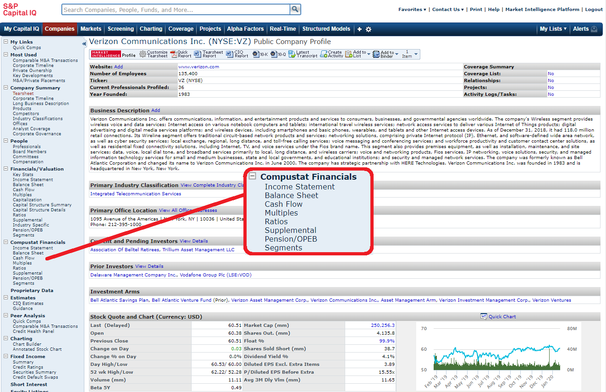

## Table of Contents

## What is Compustat?

Compustat is a database that contains financial, statistical, and market information about companies. It is used by researchers, analysts, and investors to study and analyze businesses. The data in Compustat comes from many different sources, like company reports and stock exchanges. This makes it a very useful tool for understanding how companies are doing financially.

The database covers a wide range of companies, from big corporations to smaller firms. It includes information on things like sales, earnings, and stock prices. People use Compustat to compare companies, look at trends over time, and make investment decisions. Because it has so much detailed information, it is a popular choice for anyone who needs to analyze business performance.

## Who owns Compustat?

Compustat is owned by S&P Global, a big company that gives out information about financial markets. S&P Global is known for things like credit ratings and stock market data. They bought Compustat to add to their collection of financial information tools.

S&P Global uses Compustat to help people who want to study companies and make smart investment choices. By owning Compustat, S&P Global can offer more detailed and useful data to their customers, like researchers and investors.

## What kind of data does Compustat provide?

Compustat provides a lot of different kinds of data about companies. It has financial information like how much money a company makes, how much it spends, and how much profit it earns. It also includes data on a company's assets, debts, and how much it pays in taxes. This helps people understand if a company is doing well financially.

Besides financial data, Compustat also gives information about a company's stock, like its price and how many shares are traded. It includes details on dividends, which are payments companies make to their shareholders. This data is useful for investors who want to know how a company's stock is performing and if it might be a good investment.

Compustat also has data on things like how many employees a company has, what industry it's in, and where it operates. This kind of information helps people compare companies and see trends over time. Whether you're a researcher, an analyst, or an investor, Compustat's data can help you make better decisions about businesses.

## How can Compustat data be accessed?

Compustat data can be accessed through different ways depending on what you need. Many universities and libraries have subscriptions to Compustat, so students and researchers can use it for free. If you are at a university, you can usually find Compustat through your school's library website or by asking a librarian for help. Companies and investors can also subscribe to Compustat directly through S&P Global, which owns it. This way, they can get the data they need for their work or investments.

Once you have access to Compustat, you can use it in different ways. You can download the data to use in your own analysis, or you can use the tools that come with Compustat to look at the data right away. These tools can help you make charts, do calculations, and compare companies easily. Whether you are doing research, analyzing a company's performance, or making investment decisions, Compustat's data can be a big help.

## What are the main features of the Compustat database?

Compustat is a powerful database that gives detailed information about companies. It includes financial data like how much money a company makes, spends, and earns in profit. It also has information about a company's assets, debts, and taxes. This helps people see if a company is doing well financially. Besides financial details, Compustat also provides data on a company's stock, including its price and trading [volume](/wiki/volume-trading-strategy). It tells you about dividends, which are payments companies make to shareholders. This information is useful for investors who want to know how a company's stock is doing and if it's a good investment.

Compustat also has other kinds of data, like how many employees a company has, what industry it's in, and where it operates. This helps people compare companies and see trends over time. You can access Compustat through universities and libraries if you're a student or researcher, or you can subscribe to it directly through S&P Global if you're a company or investor. Once you have access, you can download the data or use Compustat's tools to analyze it right away. These tools help you make charts, do calculations, and compare companies easily.

## How is Compustat data used in financial analysis?

Compustat data is used a lot in financial analysis because it gives a lot of detailed information about companies. Analysts use this data to look at how well a company is doing financially. They can see things like how much money the company makes, how much it spends, and how much profit it earns. This helps them figure out if the company is making money or losing it. They also use the data to compare different companies and see which ones are doing better. This is important for investors who want to choose the best companies to put their money in.

Besides looking at financial numbers, analysts also use Compustat data to understand a company's stock. They can see the stock's price, how many shares are being traded, and if the company is paying dividends. This helps them decide if the stock is a good investment. Compustat also gives information about other things like how many employees a company has and what industry it's in. By looking at all this data together, analysts can get a full picture of a company and make smart decisions about it.

## What industries does Compustat cover?

Compustat covers many different industries. It includes big companies and smaller ones too. You can find data on businesses in areas like technology, health care, energy, and finance. This means that whether you are interested in a company that makes computers, a hospital, an oil company, or a bank, Compustat has information about them.

The database also covers industries like manufacturing, retail, and transportation. So, if you want to know about a car factory, a clothing store, or a shipping company, Compustat can help. By including so many different types of businesses, Compustat makes it easy for people to study and compare companies across various sectors.

## How does Compustat ensure the accuracy of its data?

Compustat works hard to make sure its data is correct. They get their information from many places like company reports and stock exchanges. They also have a team of people who check the data carefully. If they find any mistakes, they fix them quickly. This way, people who use Compustat can trust that the numbers and facts are right.

Compustat also updates its data all the time. Companies change, and their financial information changes too. So, Compustat keeps adding new data and making sure it's up to date. This helps people get the latest information about businesses. By doing all these things, Compustat makes sure that the data it provides is both accurate and useful for everyone who uses it.

## Can Compustat data be integrated with other financial databases?

Yes, Compustat data can be integrated with other financial databases. This is helpful for people who want to use different kinds of information together. For example, someone might want to use Compustat data along with data from another database that has information about the economy. By combining these, they can get a better understanding of how companies are doing in relation to the bigger economic picture.

To integrate Compustat data with other databases, you often need special software or tools. These tools help you match up the data from different places so it all works together. Many companies and researchers use these tools to make their analysis easier and more complete. By using data from multiple sources, they can make better decisions and have a fuller picture of the financial world.

## What are the differences between Compustat North America and Compustat Global?

Compustat North America focuses on companies in the United States and Canada. It gives detailed financial and market data about these companies. This makes it a great tool for people who want to study or invest in businesses in North America. It includes information like how much money a company makes, how much it spends, and how its stock is doing. If you are interested in companies in the US or Canada, Compustat North America is the right choice.

Compustat Global, on the other hand, covers companies all over the world. It includes data from many different countries, not just North America. This is useful for people who want to look at companies in places like Europe, Asia, or South America. Like Compustat North America, it gives financial and market information, but it helps you see how companies are doing around the globe. If you need data on international companies, Compustat Global is the one to use.

## How can researchers benefit from using Compustat data?

Researchers can benefit a lot from using Compustat data because it gives them a lot of detailed information about companies. They can use this data to study how well a company is doing financially. They can look at things like how much money the company makes, how much it spends, and how much profit it earns. This helps researchers understand if the company is making money or losing it. They can also compare different companies to see which ones are doing better. This is important for researchers who want to write papers or do projects about business performance.

Compustat also helps researchers look at a company's stock. They can see the stock's price, how many shares are being traded, and if the company is paying dividends. This helps them understand how the stock is doing and if it's a good investment. Besides financial and stock data, Compustat gives information about other things like how many employees a company has and what industry it's in. By looking at all this data together, researchers can get a full picture of a company and make smart decisions about it. This makes Compustat a very useful tool for anyone doing research on businesses.

## What are some advanced analytical tools available with Compustat?

Compustat comes with many advanced tools that help people analyze data in smart ways. One of these tools is the Compustat Excel Add-In, which lets you pull data right into Excel. This makes it easy to make charts and do calculations without having to leave the program you're used to. Another tool is the Compustat Point-in-Time database, which gives you data as it was reported on specific dates. This is useful if you want to see how things looked at a certain point in the past, helping you study trends over time.

There's also the Compustat Xpressfeed, which is a tool that helps you get data quickly and easily. It's designed for people who need to work with a lot of data and need it to be fast. With Xpressfeed, you can set up automatic updates so you always have the latest information. These tools make it easier for researchers, analysts, and investors to use Compustat data to make better decisions and understand businesses better.

## References & Further Reading

[1]: Bergstra, J., Bardenet, R., Bengio, Y., & Kégl, B. (2011). ["Algorithms for Hyper-Parameter Optimization."](https://papers.nips.cc/paper/4443-algorithms-for-hyper-parameter-optimization) Advances in Neural Information Processing Systems 24.

[2]: ["Advances in Financial Machine Learning"](https://www.amazon.com/Advances-Financial-Machine-Learning-Marcos/dp/1119482089) by Marcos Lopez de Prado

[3]: ["Evidence-Based Technical Analysis: Applying the Scientific Method and Statistical Inference to Trading Signals"](https://www.amazon.com/Evidence-Based-Technical-Analysis-Scientific-Statistical/dp/0470008741) by David Aronson

[4]: ["Machine Learning for Algorithmic Trading"](https://github.com/stefan-jansen/machine-learning-for-trading) by Stefan Jansen

[5]: ["Quantitative Trading: How to Build Your Own Algorithmic Trading Business"](https://books.google.com/books/about/Quantitative_Trading.html?id=j70yEAAAQBAJ) by Ernest P. Chan