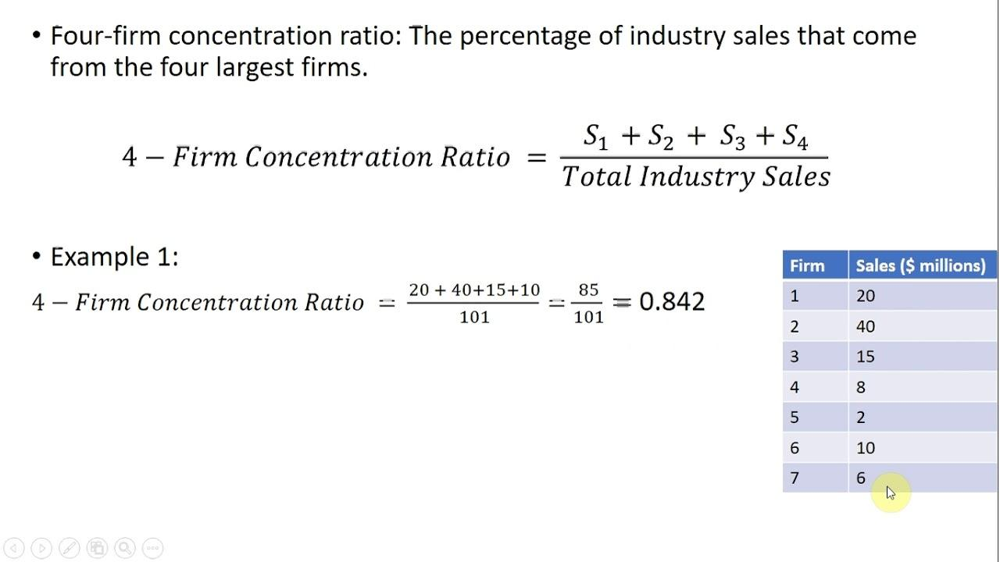

In today's financial landscape, understanding market dynamics is crucial for investors and businesses. At the core of this understanding lies the concentration ratio, an essential metric in market analysis that reveals the extent of competition within an industry. This ratio indicates whether a market is dominated by a few significant players or is competitive with numerous smaller firms. A comprehensive grasp of the concentration ratio allows stakeholders to assess and interpret market conditions effectively.

Algorithmic trading, a modern and increasingly popular investment strategy, often leverages data on market concentration to optimize trades. Through the analysis of concentration ratios, trading algorithms can identify market structures, volatility levels, and potential opportunities. This quantitative approach not only enhances trade execution but also aids in formulating strategies that align with existing market conditions.

This article explores the concentration ratio's application in market analysis, its calculation, and its relevance within algorithmic trading. By examining these aspects, readers will gain insights into how market concentration impacts both competition levels and trading strategies. This knowledge enables investors and traders to make informed decisions, allowing them to gain a competitive advantage in today's complex markets.

## Table of Contents

## What is the Concentration Ratio?

The concentration ratio is a metric that quantifies the market share held by the largest firms within an industry, thereby providing an indication of the level of competition. This measure is instrumental in assessing market structure and competition, as it reveals whether an industry is dominated by a few large players or comprises numerous smaller entities. Specifically, the concentration ratio is calculated by summing the market shares of the top firms in the industry. For example, the commonly utilized four-firm concentration ratio (CR4) aggregates the market shares of the four largest firms. A similar approach is applied for an eight-firm concentration ratio (CR8), aggregating the top eight firms’ market shares. 

A low concentration ratio typically suggests a highly competitive market characterized by the presence of many small firms that are vying for market share. In contrast, a high concentration ratio implies that the market is dominated by a small number of large firms, indicating an oligopoly or, in some cases, a monopoly. These high-concentration markets may exhibit less competitive behavior due to the significant market control exerted by the dominant firms.

Employing concentration ratios is crucial for economic analysis and strategic business planning, as they help analysts and executives understand the competitive dynamics of different markets. For instance, industries with high concentration ratios might face regulatory scrutiny due to the potential lack of competition, which can affect pricing, innovation, and overall market efficiency. Conversely, lower concentration ratios can indicate a more dynamic and potentially volatile market environment, where companies may need to focus strategically on differentiating their offerings to gain competitive advantage. 

Overall, grasping the concept of concentration ratios is essential for stakeholders seeking to evaluate market landscapes, anticipate competitive pressures, and make informed decisions regarding mergers, acquisitions, or strategic market entries.

## How the Concentration Ratio is Calculated

The concentration ratio is a straightforward metric used to evaluate the distribution of market power among the largest firms in an industry. To calculate the concentration ratio, one must sum the market share percentages of the largest firms within a particular industry. This calculation typically considers either the top four or eight firms, commonly referred to as the four-firm or eight-firm concentration ratios, respectively.

Mathematically, the concentration ratio ($CR_n$) can be represented as:

$$
CR_n = \sum_{i=1}^{n} S_i
$$

where $S_i$ represents the market share of the $i$-th largest firm, and $n$ corresponds to the number of firms being considered (such as four or eight).

For instance, if the top four firms in an industry hold market shares of 20%, 15%, 10%, and 5%, the four-firm concentration ratio would be calculated as:

$$
CR_4 = 20\% + 15\% + 10\% + 5\% = 50\%
$$

This calculation indicates that the top four firms collectively control 50% of the market. The simplicity of the concentration ratio makes it a useful tool for quickly assessing the level of competition and market structure. A low concentration ratio suggests a competitive market with numerous players, while a higher concentration ratio indicates that fewer firms dominate the market, potentially leading to oligopolistic conditions. 

In practice, the concentration ratio serves as an initial indicator, prompting further detailed analysis when necessary. This metric is particularly valuable in industries where market dynamics are of interest to policymakers, investors, and businesses for strategic planning and competition analysis.

## Interpreting the Concentration Ratio

A concentration ratio serves as a gauge of market competitiveness by measuring the proportion of market share held by the largest firms in an industry. The interpretation of these ratios can provide valuable insights into market conditions, affecting decision-making for investors and businesses. 

When the concentration ratio falls between 0% and 50%, it signifies a competitive market landscape. In such a market, many small firms coexist, preventing any single entity from gaining substantial control. This environment typically fosters innovation, competitive pricing, and diverse offerings, benefiting consumers and stimulating market dynamism.

A concentration ratio ranging from 50% to 70% indicates moderate market concentration. This level of concentration is characteristic of oligopolistic markets, where a few firms have significant but not exclusive control. In these markets, there is limited competition, and firms may engage in strategic interactions, such as price setting and collusion. The presence of a few dominant players can result in higher prices and reduced consumer choice compared to more competitive markets.

When the concentration ratio exceeds 70%, it signifies high market concentration, often leading to oligopoly or monopoly conditions. In such situations, a small number of firms dominate the market, possessing substantial control over pricing and output decisions. High market concentration can reduce competitive pressures, leading to less innovation and higher prices, potentially imposing significant barriers to entry for new competitors.

Understanding these thresholds is crucial for investors and market analysts, as they provide insight into the degree of market competition and the potential risks and opportunities that exist within an industry. A highly concentrated market may pose different strategic challenges and opportunities compared to a more fragmented one. Factors such as ease of entry, regulatory environment, and potential for innovation can also influence market dynamics and should be considered alongside concentration ratios when making informed investment or business decisions.

## Concentration Ratio in Algorithmic Trading

Algorithmic trading synthesizes vast data sets to execute trades with precision, where concentration ratios become a critical component. These ratios provide valuable insights into the competitive landscape of markets, which in turn influence trading strategies. 

Algorithms utilize concentration ratios to assess market trends, offering a measure of the degree of competition and control exercised by leading firms. A high concentration ratio typically suggests that a few firms dominate the market, which might result in reduced [volatility](/wiki/volatility-trading-strategies) due to these firms' market power. For trading strategies that thrive in volatile conditions, high market concentration might necessitate an adjustment toward less volatile assets or sectors.

Furthermore, concentration ratios assist in evaluating the diversity of investment portfolios. By understanding the dominance of specific firms or sectors within a market, algorithmic traders can diversify their portfolios to mitigate risks associated with high market concentration. This diversification can enhance trading performance by balancing potential gains and risks across a broader spectrum of investments.

For instance, a trading algorithm might be programmed to interpret a concentration ratio above 70% as a signal to adjust its trading strategy, perhaps by reducing its stake in heavily concentrated industries or seeking opportunities in more fragmented markets. By incorporating concentration ratios into their decision-making processes, algorithmic traders can better position themselves to capitalize on market inefficiencies and opportunities.

## Example Calculation of the Concentration Ratio

In a hypothetical technology industry, consider four firms labeled as A, B, C, and D, which have market shares of 25%, 30%, 20%, and 15% respectively. The concentration ratio is calculated by summing the market share percentages of these firms, which are traditionally the largest in the industry under analysis. 

In this example, the four-firm concentration ratio (CR4) is computed as follows:

$$
\text{CR4} = 25\% + 30\% + 20\% + 15\% = 90\%
$$

This high concentration ratio of 90% indicates that these four firms collectively control a significant portion of the market. Such a scenario is typically indicative of an oligopolistic market structure. In an oligopoly, a small number of firms have considerable market power to influence prices, output, and strategic decisions. 

The implications for trading and investments in such markets are substantial. For investors or traders using algorithmic strategies, recognizing a high concentration ratio can guide the adaptation of trading strategies to account for the reduced competition and potential for price setting by the leading firms. This often involves anticipating less volatility than in a more fragmented market, possibly affecting strategies centered around volatility [arbitrage](/wiki/arbitrage) or [trend following](/wiki/trend-following).

In summary, this example underlines the practical application of concentration ratios in assessing market dominance and supports informed decision-making for strategic investments.

## The Herfindahl-Herschman Index (HHI) as an Alternative

The Herfindahl-Herschman Index (HHI) is a widely recognized metric for assessing market concentration. It is computed by taking the sum of the squares of the market shares of all firms within an industry. The formula for HHI is:

$$

HHI = \sum_{i=1}^{n} (s_i^2)
$$

where $s_i$ represents the market share of firm $i$, expressed as a percentage, and $n$ is the total number of firms in the market. By squaring each firm's market share, the HHI places greater weight on the largest firms, thus providing a more refined measure of market dominance than the concentration ratio.

For example, consider an industry with four firms having market shares of 30%, 30%, 20%, and 20%. The HHI is calculated as:

$$

HHI = 30^2 + 30^2 + 20^2 + 20^2 = 3600 + 900 + 400 = 3800
$$

An HHI below 1500 typically indicates a competitive marketplace, while a score between 1500 and 2500 suggests moderate concentration. An HHI above 2500 points to high concentration, often associated with reduced competition and potential market power exerted by a few firms.

The advantage of using HHI alongside concentration ratios is that it captures both the number and size distribution of firms, offering a comprehensive gauge of market structure. For instance, two industries may exhibit similar concentration ratios, but differing HHIs might highlight differences in market power dynamics. Therefore, analyzing both metrics can yield critical insights into strategic business decisions and regulatory considerations.

## Conclusion

The concentration ratio is a critical tool in market analysis, offering valuable insights into the structure and competition within an industry. By assessing the market share of the largest firms, it helps identify whether a market is competitive, monopolistic, or oligopolistic. Understanding these dynamics is crucial for investors and businesses as it impacts strategic decisions, competitive positioning, and market entry opportunities.

In the context of [algorithmic trading](/wiki/algorithmic-trading), knowledge of market concentration is especially beneficial. Traders use this metric to refine their strategies and optimize returns, as it can provide early indications of market conditions that influence price movements. For instance, a high concentration ratio may suggest reduced volatility, prompting traders to adjust their algorithms accordingly to better manage risk and reward profiles.

As markets evolve with technological advancements and changing economic conditions, traditional metrics like the concentration ratio, along with alternatives such as the Herfindahl-Herschman Index (HHI), retain their importance for informed decision-making. These tools help in understanding shifts in market power and the implications for competition, pricing, and innovation.

Investors and traders can leverage insights from concentration ratios to gain a competitive advantage. By integrating these metrics into their analysis, they can better anticipate market behavior, make informed decisions, and ultimately enhance their performance in increasingly complex markets. The concentration ratio, alongside other advanced metrics, remains an indispensable component of comprehensive market analysis and strategy development.

## References & Further Reading

[1]: Tirole, J. (1988). ["The Theory of Industrial Organization."](https://books.google.com/books/about/The_Theory_of_Industrial_Organization.html?id=HIjsF0XONF8C) MIT Press.

[2]: Cabral, L. (2017). ["Introduction to Industrial Organization."](https://mitpress.mit.edu/9780262035941/introduction-to-industrial-organization/) MIT Press.

[3]: Martin, S. (1993). ["Advanced Industrial Economics."](https://archive.org/details/advancedindustri0000mart) Blackwell Publishers.

[4]: Pindyck, R. S., & Rubinfeld, D. L. (2012). ["Microeconomics."](https://books.google.com/books/about/Microeconomics.html?id=h6e7AAAAIAAJ) Pearson.

[5]: Gaughan, P. A. (2017). ["Mergers, Acquisitions, and Corporate Restructurings."](https://onlinelibrary.wiley.com/doi/book/10.1002/9781119380771) Wiley.

[6]: Lopez de Prado, M. (2018). ["Advances in Financial Machine Learning."](https://www.amazon.com/Advances-Financial-Machine-Learning-Marcos/dp/1119482089) Wiley.

[7]: Jansen, S. (2018). ["Machine Learning for Algorithmic Trading."](https://books.google.com/books/about/Hands_On_Machine_Learning_for_Algorithmi.html?id=tx2CDwAAQBAJ) Packt Publishing.