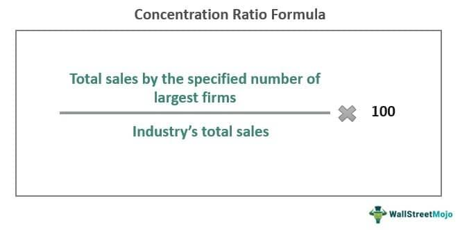

In today's rapidly evolving financial landscape, understanding the interplay between market concentration, competition, and algorithmic trading is crucial. Algorithmic trading has revolutionized how markets operate, raising questions about competition dynamics. By employing automated systems for executing trades based on pre-defined criteria, algorithmic trading has enhanced trade efficiency and speed. However, it has also introduced complexities in how financial markets must be analyzed and regulated.

This article explores economic theories related to market concentration and competition, emphasizing the impact of algorithmic trading within this framework. Market concentration—defined by metrics such as the concentration ratios CR4 and CR8, which denote the market share held by the top firms in an industry—plays a significant role in defining competitive environments. A high concentration ratio might suggest oligopolistic markets, potentially leading to reduced competition and higher prices for consumers.

As algorithms increasingly determine market behavior, understanding their potential to manipulate competition and influence prices is vital. These algorithms can rapidly respond to market changes, sometimes outpacing traditional human decision-making processes. This ability creates challenges for regulators and market participants alike in maintaining fair and competitive trading practices. There is growing scrutiny over the potential for algorithms to engage in price manipulation or collusion, either deliberately or inadvertently.

By exploring recent research and examples from the industry, we aim to provide a comprehensive overview of how market concentration, competition, and algorithmic trading interconnect and affect modern markets. The implications of these developments are profound, as they challenge traditional concepts of market behavior and regulation.

Finally, we will discuss what these developments mean for future regulatory approaches and market practices. The need for adaptive and innovative regulatory frameworks is pressing as the complexities of algorithmic-driven markets continue to grow. Understanding and effectively managing these dynamics is essential for safeguarding market integrity and ensuring that the benefits of algorithmic trading are realized without compromising competitive fairness.

## Table of Contents

## Understanding Market Concentration

Market concentration delineates the degree to which a few firms hold a substantial market share within an industry. It is a fundamental concept in competition economics, serving as an indicator of the market structure and the potential competitive behavior of firms. 

A commonly used tool to evaluate market concentration is the concentration ratio. The concentration ratio is typically expressed in terms of CR4 and CR8, which represent the market share of the top four and eight firms in an industry, respectively. These ratios reflect the level of competitiveness within a market. For instance:

$$
CR4 = \frac{\text{Market Share of Top 4 Firms}}{\text{Total Market Size}} \times 100
$$

$$
CR8 = \frac{\text{Market Share of Top 8 Firms}}{\text{Total Market Size}} \times 100
$$

High concentration ratios may signify oligopolistic market structures, characterized by few dominant firms. This can lead to reduced competition, enabling these firms to exert greater control over pricing, ultimately resulting in higher prices for consumers. The implications of market concentration are substantial, as firms within these structures might engage in strategic behaviors that limit competition, such as setting higher prices, reducing output, or creating barriers to entry.

Understanding concentration ratios is essential for analyzing the competitive landscape of any market sector, especially those that are inclined toward monopolistic or oligopolistic practices. Sectors like telecommunications, energy, and finance often show significant market concentration, leading to implications for consumer choice and pricing structures.

Quantitative analysis of market concentration is indispensable for regulators and policymakers to assess the need for antitrust interventions. Such interventions are intended to prevent anti-competitive practices that can harm consumer welfare. In an era where [algorithmic trading](/wiki/algorithmic-trading) and digital markets are becoming increasingly prevalent, maintaining a vigilant focus on concentration ratios allows for the anticipation of shifts in market power and the dynamics between competition and consumer pricing.

## Competition and Algorithmic Trading

Algorithmic trading refers to the use of computer-driven systems to automate the buying and selling of financial instruments based on coded algorithms. These systems can execute trades in fractions of a second, leveraging vast datasets and complex mathematical models to optimize performance. This technological innovation is significantly altering the landscape of market competition.

Firstly, algorithmic trading enhances the capabilities of market participants by facilitating rapid responses to fluctuating market conditions. Traditional human traders may take seconds or even minutes to analyze market data and execute trades, whereas algorithms can process information and act considerably faster. This swift execution not only increases the efficiency of markets but also offers a competitive advantage to those employing such technology, as milliseconds can determine profitability in modern financial markets.

While algorithmic trading increases efficiency, it also raises concerns regarding anti-competitive behaviors such as price manipulation and collusion. Algorithms can be programmed to detect and exploit patterns in the market, potentially leading to destabilizing effects. For example, algorithms might be used to engage in spoofing, a practice where traders submit large orders with no intention of executing them to create a false sense of demand or supply, thus manipulating prices.

Moreover, there is growing evidence that algorithmic systems, through learning and adaptation, can develop collusive behaviors without explicit human intervention. This phenomenon occurs when algorithms detect patterns in competitors' behaviors and adjust their own actions to maintain supra-competitive prices or limit market entry. These autonomous behaviors echo traditional collusion but occur at a speed and complexity that make detection challenging for regulators.

Understanding these algorithmic strategies is crucial for regulatory bodies tasked with maintaining market integrity. Regulators must possess a deep understanding of the algorithms to monitor their activities effectively. This includes developing advanced analytic tools and frameworks capable of dissecting algorithmic decision-making processes and identifying potential violations of fair trading principles.

Recent literature has emphasized the potential for algorithms to independently engage in anti-competitive practices. For example, studies indicate that algorithms using [reinforcement learning](/wiki/reinforcement-learning) can evolve strategies that resemble tacit collusion—a nuanced challenge for traditional antitrust enforcement frameworks. Such dynamics necessitate vigilant oversight and potentially, the development of new regulatory standards to mitigate the risks posed by algorithm-driven market environments.

In conclusion, while algorithmic trading represents a leap forward in trading efficiency and market fluidity, it also necessitates a reevaluation of regulatory practices to safeguard against the unintended consequences of algorithmic competition. Enhanced regulatory measures, informed by ongoing research and technological advancements, are crucial to fostering transparent and equitable financial markets.

## Implications of Algorithmic Competition

The advent of algorithmic trading has raised critical issues pertaining to regulatory effectiveness in curbing anti-competitive behaviors within financial markets. This automated trading mechanism allows for rapid execution of trades, frequently surpassing human capabilities, which poses challenges in maintaining a fair competitive landscape.

Adversarial algorithmic strategies have the potential to manipulate competitors' responses by instantly adapting to market changes and exploiting their mechanisms. This can potentially foster an environment conducive to tacit collusion, where algorithms independently converge on collusive strategies without explicit communication. Such behavior can lead to supra-competitive pricing, where prices remain artificially high, thus adversely impacting consumer welfare. Traditional competition laws, primarily designed for human-driven markets, may not adequately address these nuanced algorithmic strategies, thereby challenging existing legal frameworks.

The implications for regulatory bodies are significant. The automated and complex nature of algorithmic trading necessitates the development of new methodologies to effectively monitor and mitigate these emerging anti-competitive risks. Regulators must consider incorporating advanced technologies such as [artificial intelligence](/wiki/ai-artificial-intelligence) and [machine learning](/wiki/machine-learning) to analyze vast datasets in real-time, ensuring that potential manipulative practices can be detected and addressed swiftly.

Moreover, this complexity places a unique responsibility on regulatory bodies to innovate and adapt their approaches. Enhancing international collaboration among regulatory authorities is essential, given the global nature of financial markets and algorithmic trading's widespread adoption. By coordinating efforts and sharing insights, regulators can more effectively oversee algorithm-driven markets and uphold competitive fairness across borders.

## Regulatory and Policy Challenges

Current competition laws may not fully encompass the complexities introduced by algorithmic trading and its potential for anti-competitive practices. As algorithmic trading becomes increasingly sophisticated, regulatory frameworks struggle to keep pace with the rapid technological advancements and their implications for market dynamics. Traditional competition laws, primarily designed to address human-driven market activities, often fall short when applied to the automated, high-frequency decision-making processes characteristic of algorithmic trading. This gap poses significant challenges for regulators tasked with maintaining fair and competitive markets.

One of the primary challenges is the monitoring and analysis of vast datasets necessary to detect patterns of collusion and manipulation in real-time. Algorithmic trading systems can execute large volumes of trades at speeds and complexities beyond human capability, making traditional monitoring techniques inadequate. Regulators must employ advanced data analytics and machine learning tools to process and analyze these datasets effectively. The integration of artificial intelligence can enhance the detection of anomalous trading patterns that may indicate manipulative or collusive behavior, thus providing a more robust defense against anti-competitive practices.

Policy frameworks must also evolve by incorporating these technological advancements to effectively address the challenges posed by algorithmic trading. This evolution involves not only updating existing regulations but also developing new ones tailored to the unique characteristics of algorithmic trading environments. Such frameworks should consider the automated nature and scale of algorithm-driven transactions and the potential for these systems to inadvertently or deliberately mimic collusive behaviors.

The international nature of financial markets adds another layer of complexity to regulating algorithmic trading. Trading activities frequently span multiple jurisdictions, each with its regulatory standards and enforcement mechanisms. To effectively regulate global algorithmic trading markets, collaborative efforts among international regulatory bodies are crucial. Such cooperation would involve sharing information, aligning regulatory standards, and developing joint strategies to monitor and control algorithmic activities. Initiatives like the International Organization of Securities Commissions (IOSCO) provide a platform for regulators to collaborate and harmonize their approaches, aiming to create a more cohesive regulatory environment that can adapt to the challenges posed by algorithmic trading.

In summary, addressing the regulatory and policy challenges presented by algorithmic trading requires a multifaceted approach. This approach should integrate advanced technologies, adapt existing legal frameworks, and foster international collaboration to ensure that market integrity and competition are preserved in an increasingly automated trading world.

## Conclusion

Algorithmic trading signifies a major transformation in market dynamics, presenting both opportunities and challenges for competition and regulation. This technological advancement has ushered in efficiencies and faster trading capabilities, but it also means revisiting traditional understandings of market concentration and competition. Algorithmic trading can alter market structures, enabling greater precision and speed in transactions which can benefit market [liquidity](/wiki/liquidity-risk-premium) and pricing accuracy. However, the same attributes may facilitate anti-competitive behaviors, such as price manipulation or collusion, challenging existing competition norms.

Research and discussions are pivotal in creating effective regulatory frameworks that uphold market integrity. As technological capabilities expand, regulators must adapt their strategies and tools to address the intricate issues posed by algorithmic trading. Ensuring that these frameworks are robust enough to manage the complexities of modern trading environments requires continuous development and collaboration among regulatory bodies, industry stakeholders, and academia. This can include employing advanced analytical techniques and leveraging insights from machine learning to monitor and regulate market activities efficiently.

As algorithmic trading continues to advance, the imperative for regulatory bodies to innovate and respond with appropriate measures will grow. There is a critical need for dynamic regulatory responses that maintain the balance between fostering innovation and preventing market abuse. Ultimately, safeguarding fair and competitive markets in this evolving landscape will depend on vigilant monitoring, proactive policy-making, and global cooperation among regulatory entities.

## References & Further Reading

[1]: López de Prado, M. (2018). ["The 10 Reasons Most Machine Learning Funds Fail."](https://www.garp.org/hubfs/Whitepapers/a1Z1W0000054x6lUAA.pdf) The Journal of Financial Data Science, 1(1), 10-18.

[2]: Menkveld, A. J. (2013). ["High Frequency Trading and the New-Market Makers."](https://www.sciencedirect.com/science/article/pii/S1386418113000281) Journal of Financial Markets, 16(4), 712-740.

[3]: Stigler, G. J. (1964). ["A Theory of Oligopoly."](https://www.semanticscholar.org/paper/A-Theory-of-Oligopoly-Stigler/d33bef53cddf86e5719740df576e887ec64cfb00) Journal of Political Economy, 72(1), 44-61.

[4]: Gai, J., & Kapadia, N. (2010). ["Contagion in Financial Networks."](https://royalsocietypublishing.org/doi/10.1098/rspa.2009.0410) Theoretical Economics, 998, 1-30.

[5]: ["The Herfindahl-Hirschman Index."](https://www.investopedia.com/terms/h/hhi.asp) U.S. Department of Justice. 

[6]: Agrawal, S., Sundararajan, M., & Zame, W. R. (2022). ["Innovation, Trade, and Unemployment."](https://www.nber.org/papers/w24449) Journal of Economics & Management Strategy.

[7]: Securities and Exchange Commission (2010). ["Concept Release on Equity Market Structure."](https://www.sec.gov/rules-regulations/2010/01/concept-release-equity-market-structure).