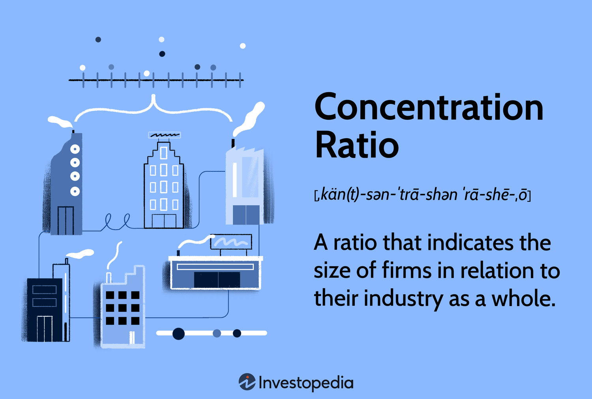

## Table of Contents

## What is a concentration ratio?

A concentration ratio is a way to measure how much of an industry is controlled by a few big companies. It shows the total market share held by the largest firms in that industry. For example, if the top four companies in an industry have a concentration ratio of 80%, it means those four companies control 80% of the market.

This measure helps people understand how competitive an industry is. If the concentration ratio is high, it means a small number of companies have a lot of power and there might not be much competition. On the other hand, a low concentration ratio suggests that the market is more spread out among many companies, which usually means more competition. Economists and business analysts use this information to study market structures and make decisions.

## Why is the concentration ratio important in economics?

The concentration ratio is important in economics because it helps us understand how competitive a market is. When a few big companies control a large part of the market, it means the concentration ratio is high. This can show that there might not be much competition, which could lead to higher prices and fewer choices for customers. Economists use this information to see if a market is working well or if it needs more competition to be fair.

On the other hand, a low concentration ratio means that many companies share the market, and there is more competition. This usually leads to better prices and more options for customers. By looking at the concentration ratio, governments and businesses can make decisions about policies and strategies to make markets more competitive and fair. It's a simple but powerful tool to check the health of an industry.

## How is the concentration ratio calculated?

The concentration ratio is calculated by adding up the market shares of the biggest companies in an industry. Usually, people look at the top four or eight companies. For example, if you want to find the four-firm concentration ratio, you take the market shares of the four largest companies and add them together. If Company A has 30% of the market, Company B has 25%, Company C has 15%, and Company D has 10%, then the four-firm concentration ratio is 30 + 25 + 15 + 10 = 80%.

This number tells you how much of the market is controlled by these top companies. If the ratio is close to 100%, it means a few big companies have most of the market power. If it's lower, it means the market is more spread out among many companies. Economists use this to see how competitive an industry is. A high concentration ratio might mean less competition and higher prices, while a low one might mean more competition and better prices for customers.

## What are the different types of concentration ratios?

There are a few different types of concentration ratios, but the most common ones are the four-firm and eight-firm concentration ratios. The four-firm concentration ratio is calculated by adding up the market shares of the four biggest companies in an industry. This gives you an idea of how much of the market is controlled by these top four companies. The eight-firm concentration ratio does the same thing but adds up the market shares of the eight biggest companies instead. These ratios help people see if a market is dominated by just a few big players or if it's more spread out among many companies.

Another type of concentration ratio is the Herfindahl-Hirschman Index (HHI). This is a bit more complicated because it doesn't just add up market shares; it squares them first. You take the market share of each company, square it, and then add all those numbers together. The HHI gives a more detailed picture of market concentration because it takes into account the size of all firms, not just the biggest ones. A high HHI means the market is very concentrated, while a low HHI means it's more competitive. Economists use the HHI to get a deeper understanding of how competitive an industry is.

## What does a high concentration ratio indicate about an industry?

A high concentration ratio means that a few big companies control most of the market in an industry. For example, if the four-firm concentration ratio is 80%, it shows that the top four companies have 80% of the market. This suggests that there isn't much competition because these big companies have a lot of power. When a few companies control most of the market, they can set higher prices and make more money because customers don't have many other choices.

This situation can be bad for customers because they might have to pay more for products or services. It can also make it hard for new companies to enter the market because the big companies already have so much control. Governments and economists watch concentration ratios to see if they need to do something to make the market more competitive. If the concentration ratio is too high, they might make rules to help new companies start up or to stop the big companies from working together to keep prices high.

## What does a low concentration ratio suggest about market competition?

A low concentration ratio means that the market is not controlled by just a few big companies. Instead, many companies share the market, which usually leads to more competition. When lots of companies are competing, they have to work harder to attract customers. This often means they offer better prices, more choices, and better service to stand out from their competitors.

Because there is more competition, customers benefit from lower prices and more options. It's also easier for new companies to enter the market because they don't have to fight against a few giant companies that control everything. Economists see a low concentration ratio as a sign of a healthy market where competition is strong, and customers have the power to choose what's best for them.

## How does the concentration ratio relate to market power?

The concentration ratio shows how much of an industry's market is controlled by a few big companies. If the concentration ratio is high, it means these big companies have a lot of market power. They can set higher prices and make more money because there aren't many other companies for customers to choose from. This is because when a few companies control most of the market, they have the power to influence prices and other market conditions.

On the other hand, a low concentration ratio means the market is shared by many companies. This leads to more competition, which is good for customers. When lots of companies are competing, they have to offer better prices and services to attract customers. This means the companies have less market power because they can't easily raise prices without losing customers to their competitors. So, the concentration ratio helps us understand how much power companies have in an industry.

## Can you give examples of industries with high and low concentration ratios?

Some industries have high concentration ratios, which means a few big companies control most of the market. For example, the soft drink industry in the United States has a high concentration ratio. Companies like Coca-Cola and PepsiCo together control a big part of the market. This means they have a lot of power to set prices and make decisions that affect the whole industry. Another example is the search engine market, where Google has a huge share, making it hard for other companies to compete.

On the other hand, some industries have low concentration ratios, meaning many companies share the market. The restaurant industry is a good example. There are thousands of restaurants, from big chains like McDonald's to small local places. This means no single company controls the market, and there's a lot of competition. Another example is the clothing industry, where many different brands and stores compete for customers, leading to a more spread-out market.

## What are the limitations of using concentration ratios to assess market structure?

Concentration ratios give a quick look at how much of an industry is controlled by a few big companies. But they have some problems. One big problem is that they only look at the biggest companies and ignore the rest. This can miss important parts of the market. For example, if there are many small companies that together have a big part of the market, the concentration ratio might say the market is not competitive when it really is.

Another problem is that concentration ratios don't tell us about how companies actually compete. Two companies might have big shares of the market but still compete hard against each other. Or, they might work together to keep prices high. Concentration ratios can't show this. Also, they don't change easily. If a new company starts to grow fast, the concentration ratio might not show this right away because it only looks at a certain moment in time. So, while concentration ratios are useful, they don't give the whole picture of how competitive an industry really is.

## How do concentration ratios vary across different countries and sectors?

Concentration ratios can be very different from one country to another and from one sector to another. In some countries, like the United States, certain industries like tech and soft drinks have high concentration ratios. This means a few big companies control most of the market. For example, in the tech industry, companies like Apple and Microsoft have big shares. In other countries, like those in Europe, some industries might be less concentrated because there are more rules to stop big companies from getting too powerful. This can lead to more competition and lower concentration ratios.

Different sectors also show different levels of concentration. For example, the airline industry often has a high concentration ratio because it costs a lot of money to start an airline, so only a few big companies can do it. On the other hand, the restaurant industry usually has a low concentration ratio because it's easier for new restaurants to open and compete. This means many small businesses can share the market, leading to more competition. So, concentration ratios can tell us a lot about how markets work in different places and industries.

## What alternative measures can be used alongside concentration ratios to analyze market concentration?

One alternative measure to use alongside concentration ratios is the Herfindahl-Hirschman Index (HHI). The HHI is calculated by taking the market share of each company in an industry, squaring it, and then adding all those numbers together. This gives a more detailed picture of market concentration because it takes into account the size of all firms, not just the biggest ones. A high HHI means the market is very concentrated, while a low HHI means it's more competitive. Economists use the HHI to get a deeper understanding of how competitive an industry is.

Another measure is the Lerner Index, which looks at how much a company can charge above its costs. If a company can charge a lot more than its costs, it might have a lot of market power. The Lerner Index helps show how much a company can use its power to set higher prices. By using the Lerner Index along with concentration ratios, economists can get a better idea of how much power companies have in a market. Both these measures help give a fuller picture of market concentration and competition.

## How have concentration ratios evolved over time in major economies, and what factors have driven these changes?

Over time, concentration ratios in major economies have changed because of many different things. In the United States, for example, the concentration ratios in some industries like technology and pharmaceuticals have gone up. This is because big companies like Google, Amazon, and Pfizer have grown a lot. They've bought smaller companies or gotten bigger on their own. Also, new technology and the way people buy things online have helped these big companies get even bigger. In other places, like Europe, rules to stop big companies from getting too powerful have helped keep concentration ratios lower in some industries.

In other parts of the world, like China, concentration ratios have changed because the government has helped some companies grow big. For example, in the car industry, a few big companies like SAIC Motor have gotten a lot of support from the government. This has made the concentration ratio higher in that industry. But in other sectors, like farming, there are still many small businesses, so the concentration ratio stays low. Overall, things like government rules, technology, and how companies grow or buy each other have all played a big part in how concentration ratios have changed over time in major economies.

## What is Understanding Market Concentration?

Market concentration delineates the degree to which a few firms hold a substantial market share within an industry. It is a fundamental concept in competition economics, serving as an indicator of the market structure and the potential competitive behavior of firms. 

A commonly used tool to evaluate market concentration is the concentration ratio. The concentration ratio is typically expressed in terms of CR4 and CR8, which represent the market share of the top four and eight firms in an industry, respectively. These ratios reflect the level of competitiveness within a market. For instance:

$$
CR4 = \frac{\text{Market Share of Top 4 Firms}}{\text{Total Market Size}} \times 100
$$

$$
CR8 = \frac{\text{Market Share of Top 8 Firms}}{\text{Total Market Size}} \times 100
$$

High concentration ratios may signify oligopolistic market structures, characterized by few dominant firms. This can lead to reduced competition, enabling these firms to exert greater control over pricing, ultimately resulting in higher prices for consumers. The implications of market concentration are substantial, as firms within these structures might engage in strategic behaviors that limit competition, such as setting higher prices, reducing output, or creating barriers to entry.

Understanding concentration ratios is essential for analyzing the competitive landscape of any market sector, especially those that are inclined toward monopolistic or oligopolistic practices. Sectors like telecommunications, energy, and finance often show significant market concentration, leading to implications for consumer choice and pricing structures.

Quantitative analysis of market concentration is indispensable for regulators and policymakers to assess the need for antitrust interventions. Such interventions are intended to prevent anti-competitive practices that can harm consumer welfare. In an era where [algorithmic trading](/wiki/algorithmic-trading) and digital markets are becoming increasingly prevalent, maintaining a vigilant focus on concentration ratios allows for the anticipation of shifts in market power and the dynamics between competition and consumer pricing.

## References & Further Reading

[1]: López de Prado, M. (2018). ["The 10 Reasons Most Machine Learning Funds Fail."](https://www.garp.org/hubfs/Whitepapers/a1Z1W0000054x6lUAA.pdf) The Journal of Financial Data Science, 1(1), 10-18.

[2]: Menkveld, A. J. (2013). ["High Frequency Trading and the New-Market Makers."](https://www.sciencedirect.com/science/article/pii/S1386418113000281) Journal of Financial Markets, 16(4), 712-740.

[3]: Stigler, G. J. (1964). ["A Theory of Oligopoly."](https://www.semanticscholar.org/paper/A-Theory-of-Oligopoly-Stigler/d33bef53cddf86e5719740df576e887ec64cfb00) Journal of Political Economy, 72(1), 44-61.

[4]: Gai, J., & Kapadia, N. (2010). ["Contagion in Financial Networks."](https://royalsocietypublishing.org/doi/10.1098/rspa.2009.0410) Theoretical Economics, 998, 1-30.

[5]: ["The Herfindahl-Hirschman Index."](https://www.investopedia.com/terms/h/hhi.asp) U.S. Department of Justice. 

[6]: Agrawal, S., Sundararajan, M., & Zame, W. R. (2022). ["Innovation, Trade, and Unemployment."](https://www.nber.org/papers/w24449) Journal of Economics & Management Strategy.

[7]: Securities and Exchange Commission (2010). ["Concept Release on Equity Market Structure."](https://www.sec.gov/rules-regulations/2010/01/concept-release-equity-market-structure).