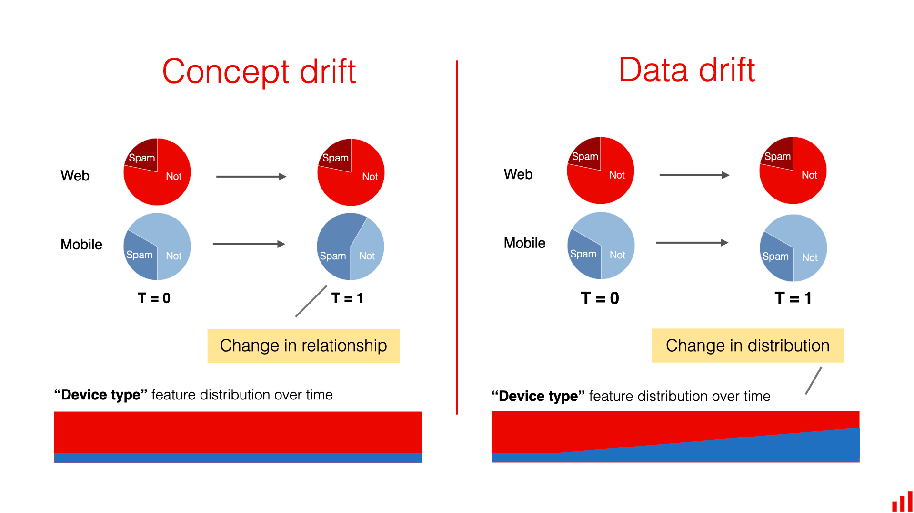

## Table of Contents

## What is concept drift in machine learning?

Concept drift in machine learning happens when the statistical properties of the target variable, which the model is trying to predict, change over time. This means that the patterns the model learned from the old data might not work well with new data. For example, if a model was trained to predict customer behavior based on past data, but customer preferences change over time, the model's predictions could become less accurate.

To deal with concept drift, machine learning models need to be updated or retrained with new data regularly. This helps the model keep up with changes in the data patterns. There are different methods to detect and adapt to concept drift, like monitoring the model's performance over time and adjusting it when the performance drops. Keeping a model up-to-date is important for it to stay useful and accurate.

## Why is concept drift important to consider in machine learning models?

Concept drift is important to consider in machine learning models because it can make a model's predictions less accurate over time. If the patterns in the data change, a model that was trained on old data won't be able to predict new data well. For example, if a model predicts what customers will buy based on past data, but customer tastes change, the model's guesses will be off. This can lead to bad decisions and lost opportunities because the model isn't keeping up with the real world.

To keep a machine learning model useful, it's important to check for concept drift and update the model regularly. By monitoring how well the model is doing and retraining it with new data, you can make sure it stays accurate. This way, the model can adapt to changes in the data and continue to make good predictions. Ignoring concept drift can make a model outdated and less helpful, so it's a key thing to watch out for in machine learning.

## What are the different types of concept drift?

Concept drift can be divided into different types based on how the data changes over time. One type is sudden drift, where the data changes all at once. For example, a new law might change how people behave suddenly. Another type is gradual drift, where the data changes slowly over time. This can happen when trends or technology change little by little. There's also incremental drift, where the data keeps changing in small steps, and recurring drift, where old patterns come back after being gone for a while.

Understanding these types of concept drift helps us know how to keep our [machine learning](/wiki/machine-learning) models working well. For sudden drift, we might need to retrain our model right away when we see the change. For gradual or incremental drift, we might need to keep updating the model bit by bit as the data changes. And for recurring drift, we might need to keep old models around so we can use them again if the old patterns come back. By knowing what type of drift we're dealing with, we can pick the best way to keep our models accurate and useful.

## How can concept drift be detected in a machine learning model?

Detecting concept drift in a machine learning model involves monitoring the model's performance over time. One way to do this is by using a method called error rate monitoring. This means you keep an eye on how often the model makes mistakes. If the error rate starts to go up, it might mean the data has changed, and the model is no longer working as well as it used to. Another way to detect drift is by using statistical tests to compare the old data the model was trained on with the new data it's trying to predict. If the data looks very different, it's a sign of concept drift.

There are also more advanced methods to detect concept drift, like using drift detection algorithms. These algorithms can spot changes in the data patterns by looking at things like the mean or variance of the data over time. For example, the ADWIN (Adaptive Windowing) algorithm can help detect sudden changes in the data. It does this by keeping track of a sliding window of data and checking if the data inside the window is different from the data outside it. If it finds a big difference, it can signal that concept drift has happened. By using these methods, you can keep your model up to date and make sure it keeps working well even when the world around it changes.

## What are some common methods to adapt machine learning models to concept drift?

To adapt machine learning models to concept drift, one common method is retraining the model with new data. This means you collect fresh data and use it to train the model again. By doing this, the model can learn the new patterns in the data and make better predictions. For example, if you're using a model to predict what products people will buy and their tastes change, retraining the model with new data about their current preferences can help it stay accurate.

Another method is using online learning, where the model keeps learning from new data as it comes in. Instead of retraining the whole model at once, online learning updates the model bit by bit with each new piece of data. This can be really helpful for dealing with gradual or incremental drift because the model can adapt slowly over time. For example, if you're predicting stock prices and the market changes a little every day, an online learning model can adjust its predictions to match these small changes.

A third approach is using ensemble methods, where you keep multiple models and switch between them or combine their predictions. If you notice concept drift, you can start using a new model trained on the latest data, or you can mix the predictions from old and new models to get the best results. This can be especially useful for dealing with recurring drift, where old patterns might come back. By keeping different models around, you can quickly switch to the one that works best with the current data.

## Can you explain the difference between sudden and gradual concept drift?

Sudden concept drift happens when the data changes all at once. Imagine you're using a model to predict what people will buy, and then a new law changes how people can shop. The data changes suddenly because of the new law, and the model needs to be updated right away to keep working well. Sudden drift can be tough because the model's predictions can go from good to bad very quickly. To deal with sudden drift, you might need to retrain the model as soon as you see the change in the data.

Gradual concept drift, on the other hand, happens when the data changes slowly over time. For example, if you're predicting what products people will buy and their tastes start to change little by little, the data will shift gradually. The model's predictions might get worse slowly, so you might not notice the drift right away. To handle gradual drift, you can update the model bit by bit as the data changes. This way, the model can keep up with the slow changes and stay accurate.

## How does concept drift affect the performance of a machine learning model over time?

Concept drift can make a machine learning model's predictions worse over time. When the data changes, the patterns the model learned from the old data might not match the new data. For example, if a model predicts what people will buy based on past data, but people's tastes change, the model's guesses won't be as good anymore. This means the model's error rate, or how often it makes mistakes, can go up. If the model doesn't get updated, it might keep making bad predictions and become less useful.

To keep the model working well, you need to check for concept drift and update the model regularly. This can mean retraining the model with new data or using methods like online learning, where the model keeps learning from new data as it comes in. By doing this, the model can adapt to changes in the data and stay accurate. Ignoring concept drift can make the model outdated and less helpful, so it's important to keep an eye on it and make sure the model stays up to date.

## What are the challenges in handling concept drift in real-time systems?

Handling concept drift in real-time systems can be tough because the data is always changing, and you need to keep the model working well without stopping it. One big challenge is figuring out when the drift is happening while the system is running. You need to watch the model's performance closely and use methods to spot changes in the data quickly. If you miss the drift, the model's predictions can get worse, and it might take a while to fix it.

Another challenge is updating the model fast enough to keep up with the changing data. In real-time systems, you can't just stop everything to retrain the model. You might need to use online learning, where the model learns from new data as it comes in. But this can be hard because you have to balance between learning from new data and keeping the model stable. If you change the model too much, it might forget what it learned before, but if you don't change it enough, it won't keep up with the new data.

## How can ensemble methods be used to mitigate the effects of concept drift?

Ensemble methods can help deal with concept drift by using more than one model to make predictions. If you notice that the data is changing, you can train a new model with the latest data and add it to the ensemble. This way, you can use the new model's predictions along with the old models' predictions. By doing this, you can keep the good parts of the old models while also getting the benefits of the new model that knows about the latest data. For example, if old patterns come back, you can use the old models again, and if new patterns show up, the new model can help.

Another way ensemble methods help with concept drift is by mixing the predictions from different models. You can use a weighted average of the predictions from all the models in the ensemble. If a model is doing well with the new data, you can give its predictions more weight. This way, the ensemble can adapt to changes in the data without having to retrain all the models at once. By using ensemble methods, you can keep your machine learning model working well even when the world around it changes.

## What role does data preprocessing play in managing concept drift?

Data preprocessing is important for managing concept drift because it helps make the data ready for the machine learning model. When the data changes over time, preprocessing can help by cleaning the new data, making sure it's in the right format, and maybe even changing it to match the old data better. For example, if you're predicting what people will buy and their tastes change, you might need to update how you handle the data to catch these new trends. By preprocessing the data well, you can help the model see the important changes and keep its predictions accurate.

One way data preprocessing can help with concept drift is by using techniques like normalization or feature scaling. If the new data has different ranges or scales than the old data, these techniques can make sure everything is on the same level. This can help the model understand the new data better and adapt to the changes. Another way is by using feature selection or extraction to focus on the parts of the data that are changing the most. By doing this, you can help the model pay attention to the right things and stay up to date with the new patterns in the data.

## How can transfer learning be applied to address concept drift?

Transfer learning can help with concept drift by using what a model already knows to learn from new data. Imagine you have a model that was trained on old data, but now the data has changed. Instead of starting from scratch, you can use transfer learning to take the old model and fine-tune it with the new data. This way, the model can quickly learn the new patterns without forgetting everything it knew before. For example, if you're predicting what people will buy and their tastes change, you can use transfer learning to update your model to catch these new trends without losing the old knowledge.

One way to do this is by using a technique called fine-tuning. You take the old model and let it learn from the new data, but you don't change everything about the model. You might only update the last few layers of a [neural network](/wiki/neural-network), for instance, so the model can adapt to the new data while keeping most of what it learned before. This can help the model stay accurate even when the data changes over time. By using transfer learning, you can make sure your model keeps up with the world around it and stays useful.

## What advanced techniques exist for predicting and preparing for future concept drift?

One advanced technique for predicting and preparing for future concept drift is using time series analysis. This method looks at how the data changes over time and tries to spot patterns that might signal when drift will happen. For example, if you're predicting what people will buy, you can use time series analysis to see if there are any trends or seasonal changes in the data. By understanding these patterns, you can get ready for future drift and update your model before its predictions start to get worse. This can help keep the model working well even when the data keeps changing.

Another technique is using meta-learning, which is like learning how to learn. With meta-learning, you train a model to understand how other models learn and adapt to new data. This way, when concept drift happens, the meta-model can help the main model adjust quickly. For example, if you're predicting stock prices and the market changes, a meta-model can help your main model learn the new patterns faster. By using meta-learning, you can make sure your model is always ready for changes in the data and stays accurate over time.

## References & Further Reading

[1]: Gama, J., Žliobaitė, I., Bifet, A., Pechenizkiy, M., & Bouchachia, A. (2014). ["A Survey on Concept Drift Adaptation."](https://dl.acm.org/doi/10.1145/2523813) Data Mining and Knowledge Discovery, 28(3), 759-781.

[2]: Lu, J., Liu, A., Dong, F., Gu, F., Gama, J., & Zhang, G. (2019). ["Learning under Concept Drift: A Review."](https://ieeexplore.ieee.org/document/8496795) IEEE Transactions on Knowledge and Data Engineering, 31(12), 2346-2363.

[3]: Widmer, G., & Kubat, M. (1996). ["Learning in the Presence of Concept Drift and Hidden Contexts."](https://link.springer.com/article/10.1007/BF00116900) Machine Learning, 23(1), 69-101.

[4]: Krawczyk, B., Minku, L. L., Gama, J., Stefanowski, J., & Woźniak, M. (2017). ["Ensemble Learning for Data Stream Analysis: A Survey."](https://www.sciencedirect.com/science/article/abs/pii/S1566253516302329) Information Fusion, 37, 132-156.

[5]: Žliobaitė, I. (2010). ["Learning under Concept Drift: An Overview."](https://arxiv.org/abs/1010.4784) Technical Report.

[6]: Tsymbal, A. (2004). ["The Problem of Concept Drift: Definitions and Related Work."](https://www.scss.tcd.ie/publications/tech-reports/reports.04/TCD-CS-2004-15.pdf) Computer Science Department, Trinity College Dublin.