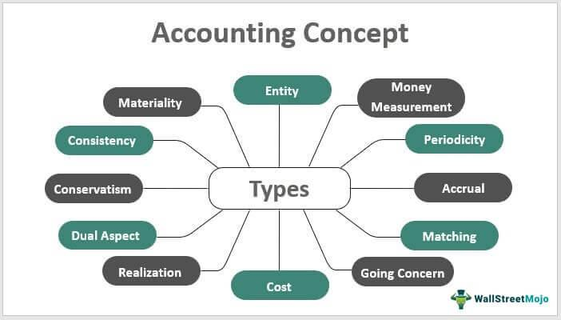

In the rapidly evolving world of finance, high-frequency trading and algorithmic trading have significantly transformed modern markets. These methodologies leverage sophisticated algorithms to execute trades at speeds and frequencies unattainable by human traders, thus reshaping traditional trading paradigms. Algorithmic trading, in particular, automates the trading process by using computer algorithms to execute pre-programmed trading instructions. This shift has introduced numerous opportunities, such as enhanced market efficiency and liquidity, leading to more competitive pricing and tighter bid-ask spreads.

However, the widespread adoption of algorithmic trading also presents various challenges that warrant careful consideration. Among these are ethical concerns related to transparency and fairness. The complexity and opacity of algorithms can obscure decision-making processes, making it difficult to ascertain the fairness of trades. Such concerns raise questions about an uneven playing field, where those with access to more advanced technology and resources potentially hold an advantage over others.



Algorithmic trading's impact on market dynamics, particularly concerning volatility, is another pivotal point of discussion. The ability of algorithms to execute trades in milliseconds has the potential to amplify market movements, contributing to events such as the 2010 "flash crash." In such scenarios, a rapid series of transactions set off by trading algorithms can lead to sudden and severe market declines, demonstrating the intrinsic link between algorithmic trading and market volatility.

Finally, regulatory considerations play a crucial role in shaping the interplay between algorithmic trading and market stability. Regulators worldwide grapple with the challenge of crafting frameworks that effectively mitigate risks without stifling innovation. Striking a balance between ensuring market integrity and fostering technological advancement is key to addressing the ethical and practical implications of algorithmic trading. This article will explore these dimensions to offer a comprehensive understanding of the benefits and challenges posed by algorithmic trading from financial, ethical, and regulatory perspectives.

## Table of Contents

## Understanding Algorithmic Trading

Algorithmic trading involves using computer algorithms to execute trading processes at high frequencies and make real-time decisions, a practice that has fundamentally transformed global financial markets. The primary objective of algorithmic trading is to enhance efficiency and liquidity by automating trading tasks, which were traditionally performed by human traders. These algorithms are designed to analyze market conditions and execute trades based on predefined criteria, such as price, timing, or volume.

The efficiencies introduced by algorithmic trading are largely due to its ability to process large volumes of market data at speeds unimaginable for human traders. This rapid execution capability enables traders to capitalize on momentary price fluctuations that occur within milliseconds. As a result, markets benefit from increased liquidity, as algorithmic trading provides continuous buying and selling, creating tighter bid-ask spreads and improving market depth.

Despite these advantages, [algorithmic trading](/wiki/algorithmic-trading) also introduces several risks attributable to its speed and reliance on complex computer systems. The speed of trading can exacerbate market fluctuations, particularly during periods of high [volatility](/wiki/volatility-trading-strategies). For instance, if algorithms react simultaneously to market events or erroneous signals, they can lead to significant price swings. Additionally, the reliance on computer systems makes markets vulnerable to technical failures, such as software glitches or connectivity issues, which might lead to unintended trades or market disruptions.

Algorithmic trading systems can be depicted as having multiple components, such as market data feed handlers, strategy engines, risk management modules, and execution engines. Here is a simplified Python snippet that illustrates a basic order execution process using an algorithmic strategy:

```python
def algo_trading_strategy(market_data):
    # Example strategy logic
    if market_data.current_price < market_data.moving_average:
        execute_order('buy', market_data.current_price, volume=100)
    elif market_data.current_price > market_data.moving_average:
        execute_order('sell', market_data.current_price, volume=100)

def execute_order(order_type, price, volume):
    # Simulating order execution
    print(f"Executing {order_type} order for {volume} units at price {price}")

# Simulated market data
class MarketData:
    def __init__(self, current_price, moving_average):
        self.current_price = current_price
        self.moving_average = moving_average

# Sample usage
market_data = MarketData(current_price=100.5, moving_average=101.0)
algo_trading_strategy(market_data)
```

In summary, while algorithmic trading significantly improves market operation by making it more efficient and liquid, it also increases the potential for swift, significant movements due to its inherent speed and complexity. This duality underscores the need for robust risk management and system safeguards to mitigate potential adverse effects.

## Market Impact of Algorithmic Trading

Algorithmic trading, characterized by its high-frequency and automated nature, has significantly influenced market dynamics, particularly in terms of volatility. One of the primary ways it impacts markets is through the quick execution of a vast number of trades, which can lead to increased volatility. This increased speed can both stabilize and destabilize markets, often exacerbating trends rather than offsetting them. For instance, during a market downturn, algorithmic trades may accelerate selling [momentum](/wiki/momentum) due to their ability to execute orders in milliseconds, causing prices to plummet at an accelerated rate.

A notable event highlighting the market impact of algorithmic trading is the 'Flash Crash' of May 6, 2010, which serves as a cautionary tale of the potential volatility induced by these systems. On that day, the Dow Jones Industrial Average (DJIA) plunged about 1,000 points, approximately 9%, in mere minutes, before recovering much of the loss within half an hour. Investigations revealed that high-frequency trading algorithms were a significant [factor](/wiki/factor-investing) in the crash. They generated a feedback loop, amplifying selling pressure when large sell orders interacted with these algorithms.

In technical terms, the 'Flash Crash' demonstrated how [liquidity](/wiki/liquidity-risk-premium) gaps can occur in electronic markets when high-frequency trading systems withdraw from the market, either due to self-preservation algorithms or triggered stop-loss mechanisms. This absence of liquidity providers can cause bid-ask spreads to widen dramatically, resulting in increased price swings. 

Furthermore, the deployment of algorithms following specific trading signals can lead to synchronized trading behaviors, where numerous systems act on similar triggers. This synchronization can lead to overcrowding in particular asset classes or market sectors, further escalating volatility. When many algorithms react to the same signals or conditions, they can drive excessive price swings, disrupting market equilibrium and challenging traditional price discovery mechanisms.

The influence of algorithmic trading on market volatility underscores the need for comprehensive risk management strategies and robust regulatory frameworks. These measures are essential to manage the speed and [volume](/wiki/volume-trading-strategy) of trades, maintaining market integrity while harnessing the efficiency benefits algorithmic trading offers.

## Ethical Considerations in Algorithmic Trading

Algorithmic trading, while revolutionary in enhancing market efficiency and liquidity, raises significant ethical considerations, primarily concerning transparency, fairness, and market accessibility. One of the most pressing issues is the potential creation of an uneven playing field due to differential access to advanced technology. 

In the landscape of trading, transparency is crucial as it assures market participants of fair access to information and execution. However, algorithmic trading systems, often designed with proprietary algorithms and sophisticated technology, can obscure trading intentions and strategies. This opacity can lead to a lack of trust among market participants who may feel disadvantaged or unable to compete fairly against those utilizing complex high-frequency trading models. Such scenarios challenge the principle of fairness, as institutional players with significant resources can leverage these technologies to gain unparalleled advantages over retail investors.

The principle of fairness is intrinsically linked to the accessibility of market opportunities. Algorithmic trading requires substantial investments in technology infrastructure, access to market data, and specialized quantitative skills. This requirement inherently favors large financial institutions and creates barriers for smaller traders and firms. Access to cutting-edge technology, like low latencies achieved through colocation services and direct market access (DMA), enables institutions to execute trades more quickly and effectively than those without such resources. Consequently, this technological divide exacerbates market inequities, disproportionately benefiting technologically advanced players.

Furthermore, the complexity of algorithms used in trading systems can create ethical dilemmas surrounding accountability and decision-making. Algorithms operate on pre-set parameters and historical data but are also capable of learning from new data, leading to autonomous decision-making that may not always align with ethical standards or regulatory guidelines. The lack of human oversight in real-time decision processes can result in unintended market consequences, such as exacerbating volatility or executing manipulative trading patterns inadvertently.

Given these ethical challenges, there is an ongoing debate about the responsibilities of market participants and the adequacy of regulatory frameworks to ensure fairness and transparency. Financial markets must consider implementing measures to make advanced technology more accessible, perhaps through shared platforms or providing educational resources to level the playing field. Additionally, enhanced scrutiny of algorithmic strategies and their impacts on market conditions can help cultivate a more equitable and trust-enhancing trading environment.

Addressing these ethical concerns requires a concerted effort by regulators, market participants, and technologists to ensure that algorithmic trading aligns with the core principles of fairness, transparency, and accessibility that are fundamental to the integrity of financial markets.

## Regulations and Risk Management

Financial regulators worldwide are increasingly addressing the challenges posed by algorithmic trading, recognizing both its potential benefits and the systemic risks it introduces. As trading systems become more sophisticated, the need for robust risk management practices and comprehensive regulatory frameworks becomes critically important.

### Regulatory Frameworks

1. **Transparency and Reporting**: One primary concern surrounding algorithmic trading is the lack of transparency. Regulators have thus mandated more rigorous reporting requirements, ensuring that firms engaging in high-frequency trading (HFT) and other algorithmic strategies provide detailed accounts of their activities. This requirement aims to enable better oversight and understanding of market dynamics.

2. **Circuit Breakers**: To prevent extreme market volatility, many stock exchanges have implemented circuit breakers. These mechanisms halt or slow down trading when prices move sharply in a short period, providing time for markets to stabilize and for traders to assess their positions. The flash crash of 2010 highlighted the necessity of such measures, as automated trades rapidly exacerbated the sell-off.

3. **Order-to-Trade Ratios**: Some regulatory bodies have introduced rules limiting the order-to-trade ratios, which control the number of orders a trader can place relative to actual executed trades. This regulation aims to reduce excessive and potentially destabilizing market speculation that can result from high-order messaging.

4. **Latency Floors**: By intentionally delaying trade executions by a small fraction of a second, latency floors aim to level the playing field between traders with varying levels of access to high-speed trading technology. This regulation is designed to reduce the advantage of firms with superior technology infrastructures.

### Risk Management Practices

1. **Pre-Trade Risk Controls**: To mitigate the risks associated with erroneous trades, firms are required to implement pre-trade risk controls. Such controls include monitoring trade size, price checks, and volume throttling, ensuring that trades made by automated systems conform to preset parameters.

2. **Real-Time Monitoring**: The capability to monitor trades and market conditions in real-time is essential for identifying and mitigating potential risks. Advanced analytics and machine learning models are increasingly employed to detect anomalies and trading patterns that may signal underlying risks.

3. **Stress Testing and Scenario Analysis**: Firms are encouraged to conduct regular stress tests and scenario analyses to evaluate their resilience under extreme market conditions. By simulating market disruptions, firms can better understand potential vulnerabilities and adjust their strategies accordingly.

4. **Dynamic Risk Limits**: Implementing dynamic risk limits that can adjust to changing market conditions is a practice aimed at ensuring ongoing compliance with risk management frameworks. These limits are updated automatically based on volatility indices and liquidity metrics, providing a more adaptive risk control mechanism.

### International Collaboration and Harmonization

Given the global nature of financial markets, international cooperation among regulatory bodies is essential. Collaborations facilitated by organizations such as the International Organization of Securities Commissions (IOSCO) focus on harmonizing regulations across jurisdictions to prevent regulatory [arbitrage](/wiki/arbitrage) and improve the overall stability of financial markets.

In conclusion, as algorithmic trading continues to evolve, maintaining a balance between innovation and security is crucial. Through enhanced regulations and risk management practices, regulators aim to foster markets that are not only efficient but also resilient to the unique challenges posed by automated trading systems.

## Conclusion

Algorithmic trading has undeniably reshaped the financial landscape, offering enhanced efficiency, increased market liquidity, and greater access to trading opportunities. The integration of sophisticated algorithms enables rapid decision-making and high-frequency transactions, which can lower costs and improve execution quality for market participants. However, these advancements come with significant challenges that must be addressed to harness their full potential sustainably and ethically.

One primary concern is the risk of exacerbated market volatility. With algorithms capable of executing thousands of trades per second, markets could experience rapid fluctuations that potentially destabilize financial systems. Notably, the 2010 flash crash underscored the vulnerabilities inherent in high-speed trading environments. Consequently, industry stakeholders and regulators must prioritize robust risk management strategies to mitigate such risks.

Ethical challenges also abound, particularly in relation to market fairness and transparency. The use of advanced algorithms and technology can place smaller or less technologically advanced firms at a disadvantage. This disparity may lead to an uneven playing field where only well-resourced entities can fully leverage algorithmic trading. Ensuring fair access to technology and information is crucial in maintaining equitable market conditions.

To address these concerns, a collaborative effort involving regulators, traders, and technologists is essential. Regulators need to develop and enforce rules that promote transparency and mitigate undue market influence by algorithmic trades. Traders, on their part, should embrace ethical guidelines that foster fair competition and responsible algorithm use. Meanwhile, technologists should focus on designing systems that are not only efficient but also aligned with ethical standards and risk safeguards.

In conclusion, the future of financial markets hinges on striking a balance between harnessing the benefits of algorithmic trading and managing its associated risks and ethical dilemmas. Only through coordinated efforts can the industry ensure fair, transparent, and sustainable trading environments that serve the broader interests of the global economy. The path forward lies in a commitment to innovation coupled with a strong dedication to ethical practices and prudent regulation.

## References & Further Reading

[1]: Aldridge, I. (2013). ["High-Frequency Trading: A Practical Guide to Algorithmic Strategies and Trading Systems."](https://www.amazon.com/High-Frequency-Trading-Practical-Algorithmic-Strategies/dp/1118343506) Wiley Finance.

[2]: Lewis, M. (2014). ["Flash Boys: A Wall Street Revolt."](https://en.wikipedia.org/wiki/Flash_Boys) W. W. Norton & Company.

[3]: Narang, R. K. (2013). ["Inside the Black Box: A Simple Guide to Quantitative and High-Frequency Trading."](https://onlinelibrary.wiley.com/doi/book/10.1002/9781118662717) Wiley Finance.

[4]: Budish, E., Cramton, P., & Shim, J. (2015). ["The High-Frequency Trading Arms Race: Frequent Batch Auctions as a Market Design Response."](https://academic.oup.com/qje/article/130/4/1547/1916146) The Quarterly Journal of Economics.

[5]: IOSCO. (2011). ["Regulatory Issues Raised by the Impact of Technological Changes on Market Integrity and Efficiency."](https://www.iosco.org/library/pubdocs/pdf/IOSCOPD354.pdf) International Organization of Securities Commissions.