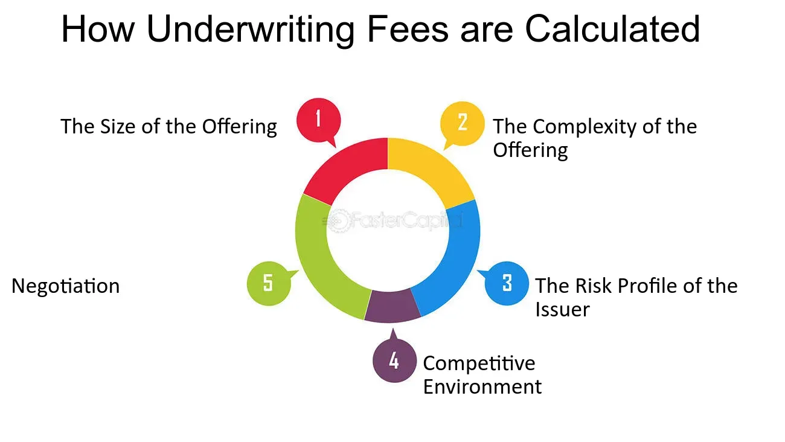

## Table of Contents

## What are concession fees in the context of underwriting?

Concession fees are payments that underwriters receive when they sell securities like stocks or bonds to investors. When a company wants to raise money by selling securities, it hires an underwriter to handle the sale. The underwriter buys the securities from the company at a lower price and then sells them to investors at a higher price. The difference between these two prices is where the underwriter makes money, and part of this difference is the concession fee.

These fees are important because they motivate underwriters to sell the securities quickly and efficiently. The more securities they sell, the more concession fees they earn. This system helps companies raise the money they need while also giving underwriters a reward for their work. Concession fees are just one part of the overall compensation that underwriters might receive, which can also include management fees and other types of payments.

## How do concession fees differ from other types of fees in underwriting?

Concession fees are different from other types of fees in underwriting because they are the money underwriters get for selling securities to investors. When underwriters sell stocks or bonds, they earn a small amount of money for each sale. This is the concession fee. It's like a reward for doing a good job at selling the securities.

Other types of fees in underwriting include management fees and underwriting fees. Management fees are paid to the lead underwriter for managing the whole process of selling securities. This fee is usually a percentage of the total amount of money raised. Underwriting fees, on the other hand, are what underwriters get for taking on the risk of buying the securities from the company before selling them to investors. These fees are different from concession fees because they are not based on how many securities are sold to investors but on the total amount of securities the underwriter agrees to buy.

## Who typically pays the concession fees?

The company that is selling the securities does not directly pay the concession fees. Instead, these fees come from the difference between the price the underwriter pays for the securities and the price at which they sell them to investors. This difference is called the "spread," and the concession fee is a part of this spread.

When an underwriter sells the securities to investors, they keep a small amount of money from each sale as the concession fee. This fee goes to the underwriters as a reward for selling the securities. So, while the company issuing the securities doesn't pay the concession fees directly, the money for these fees comes from the investors who buy the securities at the higher price set by the underwriter.

## How are concession fees calculated?

Concession fees are calculated based on the difference between the price the underwriter pays for the securities and the price they sell them to investors. This difference is called the "spread." The underwriter keeps a small part of this spread as the concession fee for each security they sell. So, if the underwriter buys a stock for $95 and sells it to an investor for $100, the spread is $5. The concession fee would be a portion of this $5, let's say $1 per stock sold.

The exact amount of the concession fee can vary depending on the agreement between the underwriter and the company issuing the securities. Sometimes, the concession fee might be a fixed amount per security, while other times it might be a percentage of the spread. The more securities the underwriter sells, the more concession fees they earn. This system motivates underwriters to sell as many securities as possible to investors.

## What is the purpose of concession fees for underwriters?

Concession fees are important for underwriters because they give them a reason to work hard to sell securities. When underwriters sell stocks or bonds, they get a small amount of money for each sale. This money is called the concession fee. It's like a reward that makes underwriters want to sell as many securities as they can. The more they sell, the more money they make from these fees.

These fees also help make sure that the process of selling securities goes smoothly. When a company wants to raise money by selling securities, they need underwriters to help them. The concession fees motivate underwriters to find investors quickly and efficiently. This way, the company can get the money it needs, and the underwriters get paid for their hard work.

## Can concession fees vary between different underwriting agreements?

Yes, concession fees can vary between different underwriting agreements. Each agreement between a company and an underwriter can set its own rules about how much the concession fee will be. Sometimes, the fee might be a fixed amount for each security sold, like $1 per stock. Other times, it could be a percentage of the difference between the price the underwriter pays and the price they sell the security for.

These variations happen because different companies and underwriters might have different needs and goals. For example, a small company might agree to a higher concession fee to make sure the underwriter works hard to sell their securities quickly. A big company with a well-known name might have more bargaining power and could negotiate a lower fee. This flexibility helps both companies and underwriters find an arrangement that works best for them.

## What factors influence the amount of concession fees?

The amount of concession fees can change based on a few things. One big [factor](/wiki/factor-investing) is how much risk the underwriter is taking. If the securities are hard to sell or if the market is not doing well, the underwriter might ask for a bigger concession fee to make up for the risk. Another factor is how much the company and the underwriter agree to. If the company is big and well-known, they might be able to get a smaller fee because they are less risky. But if the company is small or new, they might have to offer a bigger fee to get the underwriter to work hard.

Another thing that can affect concession fees is how competitive the market is. If there are a lot of underwriters wanting to work with the company, the fees might go down because the underwriters are trying to win the business. On the other hand, if there are not many underwriters interested, the fees might go up. The type of security being sold can also make a difference. Stocks might have different fees than bonds because they can be riskier or easier to sell. All these things together help decide how much the concession fee will be.

## How do concession fees impact the overall cost of an underwriting deal?

Concession fees are one part of the total cost a company pays when it hires an underwriter to sell its securities. These fees come from the difference between what the underwriter pays for the securities and what they sell them for to investors. This difference is called the spread, and the concession fee is a part of it. When the concession fee is higher, it means the underwriter gets more money for each security they sell, which can make the overall cost of the underwriting deal go up.

The total cost of an underwriting deal includes not just concession fees but also other fees like management fees and underwriting fees. Management fees are paid to the lead underwriter for managing the sale of the securities, and underwriting fees cover the risk the underwriter takes by buying the securities before selling them to investors. So, while concession fees are important, they are just one piece of the puzzle. The overall cost of the deal depends on all these fees together, and how they are set can affect how much the company ends up paying to raise money through selling securities.

## Are there any regulations or standards governing concession fees?

Yes, there are rules and standards that help control concession fees. These rules come from groups like the Securities and Exchange Commission (SEC) in the United States. The SEC makes sure that the fees underwriters charge are fair and that they follow the law. They do this to protect investors and make sure companies are treated fairly when they sell securities.

These rules can change depending on the country and the type of securities being sold. For example, in the U.S., the Financial Industry Regulatory Authority (FINRA) also has rules about how much underwriters can charge. They want to make sure that the fees are clear and that everyone knows what they are paying for. This helps keep the market honest and helps companies and investors trust the process of selling and buying securities.

## How do underwriters negotiate concession fees with issuers?

When underwriters negotiate concession fees with issuers, they talk about how much money the underwriter will get for selling each security. The underwriter wants a bigger fee to make more money, but the issuer wants to pay less to keep their costs down. They look at things like how risky the securities are, how well-known the issuer is, and how competitive the market is. If the issuer is a big, well-known company, they might be able to get the underwriter to agree to a smaller fee. But if the issuer is smaller or less known, they might have to offer a bigger fee to get the underwriter to work hard on selling their securities.

The negotiation can also depend on how much the underwriter wants to work with the issuer. If there are a lot of underwriters wanting to work with the issuer, the fees might go down because the underwriters are trying to win the business. But if there are not many underwriters interested, the fees might go up. Both sides want to find a deal that works for them. The underwriter wants to make sure they get paid enough for their work, and the issuer wants to make sure they can raise the money they need without paying too much in fees.

## What strategies can issuers use to minimize concession fees?

Issuers can minimize concession fees by choosing to work with well-known and reputable underwriters. When an issuer is big and well-known, they have more power to negotiate lower fees. They can also shop around and compare offers from different underwriters to find the best deal. If the market is competitive and many underwriters want to work with them, issuers can use this to their advantage to push for lower concession fees.

Another strategy is to make the securities easier to sell. If the securities are less risky or if the issuer has a good track record, underwriters might be willing to accept lower fees because they think it will be easier to sell the securities. Issuers can also offer other incentives to underwriters, like a larger role in future deals, which might make them more willing to accept lower concession fees in the current deal. By using these strategies, issuers can keep their costs down and make the underwriting process more affordable.

## How do global market conditions affect concession fee structures?

Global market conditions can change how much underwriters get paid in concession fees. When the market is doing well and people want to buy securities, underwriters might not need as big of a fee because it's easier to sell the securities. But if the market is not doing well, or if there's a lot of uncertainty, underwriters might ask for more money because it's harder to find people to buy the securities. They want to be paid more for taking on more risk.

Issuers also need to think about global market conditions when they are setting up their deals. If the market is strong, they might be able to get underwriters to agree to lower concession fees because there are a lot of people who want to buy securities. But if the market is weak, issuers might have to offer higher fees to make sure underwriters are willing to take on the risk of selling their securities. This balance between market conditions and fees is important for both issuers and underwriters to get a good deal.

## References & Further Reading

[1]: ["Advances in Financial Machine Learning"](https://www.amazon.com/Advances-Financial-Machine-Learning-Marcos/dp/1119482089) by Marcos Lopez de Prado

[2]: ["Evidence-Based Technical Analysis: Applying the Scientific Method and Statistical Inference to Trading Signals"](https://www.amazon.com/Evidence-Based-Technical-Analysis-Scientific-Statistical/dp/0470008741) by David Aronson

[3]: ["Machine Learning for Algorithmic Trading"](https://github.com/stefan-jansen/machine-learning-for-trading) by Stefan Jansen

[4]: ["Quantitative Trading: How to Build Your Own Algorithmic Trading Business"](https://www.amazon.com/Quantitative-Trading-Build-Algorithmic-Business/dp/1119800064) by Ernest P. Chan

[5]: Hendricks, D., Patel, J., & Zeckhauser, R. (1993). ["Hot Hands in Mutual Funds: Short-Run Persistence of Relative Performance, 1974-1988."](https://onlinelibrary.wiley.com/doi/abs/10.1111/j.1540-6261.1993.tb04703.x) The Journal of Finance, 48(1), 93-130.

[6]: Aldridge, I. (2013). ["High-Frequency Trading: A Practical Guide to Algorithmic Strategies and Trading Systems"](https://books.google.com/books/about/High_Frequency_Trading.html?id=6l0DDQAAQBAJ) by Irene Aldridge