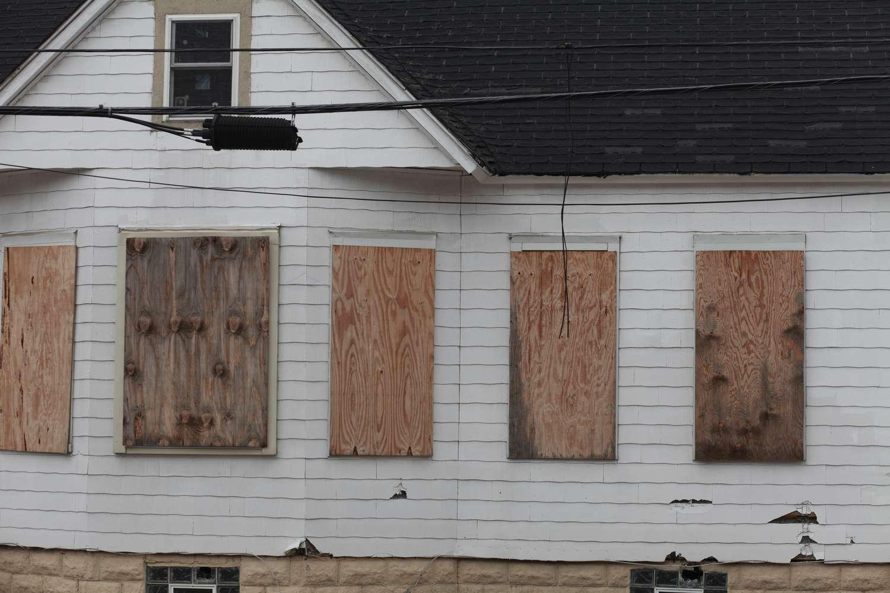

## Table of Contents

## What is condemnation in real estate?

Condemnation in real estate is when the government takes private property for public use. This is also known as eminent domain. The government might need the land to build roads, schools, or other public projects. When this happens, they have to pay the property owner a fair price for the land.

The process starts with the government telling the property owner that they want to take the land. This is called a notice of condemnation. If the owner agrees with the price offered, they can sell the property and the process is done. But if the owner thinks the price is too low, they can go to court. A judge will then decide how much the government should pay. This makes sure that the owner gets a fair deal, even if they don't want to sell their property.

## What is the difference between condemnation and eminent domain?

Condemnation and eminent domain are related ideas, but they are not exactly the same. Eminent domain is the power that the government has to take private property for public use. This power is given to the government so they can build things like roads, schools, or parks that everyone can use. The government can't just take the property; they have to follow certain rules and pay the owner for it.

Condemnation is what happens when the government actually uses its eminent domain power to take the property. It's the process of legally taking the property away from the owner. When the government wants to do this, they send a notice to the owner saying they want to take the land. If the owner and the government can't agree on a fair price, they might have to go to court to decide how much the government should pay. So, eminent domain is the right to take the property, and condemnation is the action of taking it.

## What are the main types of condemnation?

There are two main types of condemnation: total and partial. Total condemnation happens when the government takes the whole property. This means the owner loses all of their land and the government pays them for the entire property. For example, if the government needs to build a new highway, they might need to take someone's entire farm.

Partial condemnation is when the government only takes part of the property. This means the owner keeps some of their land, but the government takes a piece of it. The government still has to pay the owner, but only for the part they are taking. An example of this could be if the government needs to widen a road and takes a small part of someone's backyard.

## Can you explain the process of condemnation?

The process of condemnation starts when the government decides it needs to take someone's property for public use. They send a notice to the property owner, telling them that they want to take the land. This notice explains why the government needs the property and offers a price they think is fair. The owner can either accept this offer and sell the property, or they can say no if they think the price is too low.

If the owner says no to the offer, the government and the owner might try to negotiate a better price. If they still can't agree, they will go to court. In court, a judge will listen to both sides and decide how much the government should pay for the property. This makes sure the owner gets a fair price, even if they don't want to sell. Once the price is decided, the government pays the owner and takes the property.

The whole process can take a long time, sometimes months or even years. It's important for the government to follow the rules and make sure the owner gets paid fairly. This way, the government can build things like roads and schools that everyone can use, while still being fair to the people who own the land.

## What rights do property owners have during condemnation?

During condemnation, property owners have important rights that help protect them. One big right is the right to fair payment. The government can't just take the property without paying for it. They have to offer a price that is fair, and if the owner thinks the price is too low, they can say no. The owner can then go to court to get a judge to decide a better price.

Another right is the right to know why the government wants to take the property. The government has to tell the owner why they need the land, like if they want to build a new road or school. This helps the owner understand what is happening and why their property is needed. If the owner disagrees with the reason, they can also challenge it in court.

The process can take a long time, but these rights make sure that property owners are treated fairly. The government has to follow the rules and make sure the owner gets paid the right amount for their land. This way, the government can use the land for public projects, but the owner still gets treated fairly.

## How is the compensation for condemned property determined?

When the government wants to take someone's property through condemnation, they have to pay the owner for it. The amount they pay is called compensation. To figure out how much to pay, the government looks at how much the property is worth. They might hire someone called an appraiser to check the property and say what it is worth. The appraiser looks at things like how big the property is, what kind of buildings are on it, and what similar properties have sold for nearby.

If the owner thinks the government's offer is too low, they can say no and go to court. In court, both the government and the owner can bring their own appraisers to explain why they think the property is worth a certain amount. A judge listens to both sides and then decides how much the government should pay. This way, the owner gets a fair price for their property, even if they don't want to sell it. The goal is to make sure the owner is not losing money just because the government needs their land.

## What are some common reasons for condemnation of property?

The government might take someone's property because they need it for things that help the public. One common reason is to build roads. If the government wants to make a new highway or widen an old one, they might need to take land from people who live nearby. Another reason is to build schools or parks. These places are good for the community, but they need land, and sometimes the only way to get that land is by taking it from someone else.

Sometimes the government takes property to help with big projects that make the area better. For example, they might want to build a new airport or a big train station. These projects can help a lot of people, but they need a lot of space. The government might also take property to fix problems like bad buildings or to clean up dangerous areas. In all these cases, the government has to pay the owner a fair price for their land.

## Can condemnation proceedings be challenged, and if so, how?

Yes, property owners can challenge condemnation proceedings. If a property owner thinks the government's reason for taking their land isn't right, they can go to court to fight it. They might say that the government doesn't really need the land for public use, or that taking the land is not fair. The owner can hire a lawyer to help them argue their case in front of a judge. The judge will listen to both the owner and the government, and then decide if the condemnation can go ahead.

If the owner thinks the price the government offered for the land is too low, they can also challenge that. They can hire their own appraiser to check the value of the property and compare it to what the government offered. If the owner and the government can't agree on a fair price, they will go to court. In court, both sides will show their appraisals and argue about the right price. The judge will then decide how much the government should pay for the property, making sure the owner gets a fair deal.

## What is partial condemnation and how does it differ from total condemnation?

Partial condemnation is when the government takes only part of someone's property. For example, they might need a small piece of land to widen a road or build a sidewalk. The owner keeps the rest of their property, but they get paid for the part the government takes. This can be tricky because the owner might need to figure out how the loss of that part affects the value of what's left. If the owner thinks the government's offer for the part they're taking is too low, they can go to court to get a better price.

Total condemnation is different because it's when the government takes the whole property. This means the owner loses everything and the government pays them for the entire land and any buildings on it. For example, if the government needs to build a new highway, they might need to take someone's entire farm. The owner gets paid for the whole property, but they have to move and find a new place to live or work. Just like with partial condemnation, if the owner thinks the government's offer is too low, they can go to court to fight for a better price.

## How does condemnation affect property value and local communities?

When the government takes someone's property through condemnation, it can change how much the property is worth. If it's a partial condemnation, the value of what's left might go down because the property is smaller or less useful. For example, if part of a backyard is taken to widen a road, the house might not be as nice or valuable. With total condemnation, the owner gets paid for the whole property, but they have to find a new place, which can be hard and costly. The price the government pays is supposed to be fair, but if the owner thinks it's too low, they can go to court to get more money.

Condemnation can also affect the local community in big ways. When the government takes land to build things like roads, schools, or parks, it can make the area better for everyone. New roads can help people get around faster, and new schools and parks can make the community a nicer place to live. But it can also cause problems. People might have to move, and neighborhoods can change a lot. Some people might feel upset or sad about losing their homes or businesses. It's a big change, and it can take time for the community to get used to it.

## What are some historical examples of large-scale condemnation?

One big example of large-scale condemnation happened in the United States in the 1950s and 1960s. It was called urban renewal. The government wanted to fix up old and poor neighborhoods in cities. They took a lot of land from people to build new buildings, roads, and parks. Many people had to move out of their homes because of this. Some people thought it was good because it made the cities look nicer, but others were upset because they lost their homes and neighborhoods changed a lot.

Another example is the building of the Interstate Highway System in the United States. Starting in the 1950s, the government needed a lot of land to build these big roads that go across the country. They used condemnation to take land from people, even if they didn't want to sell. This helped make it easier for people to drive long distances, but it also meant that some people had to leave their homes. The highways changed the way cities and towns looked and how people lived in them.

## What future trends might impact condemnation practices in real estate?

In the future, new technology might change how the government takes land through condemnation. For example, drones and better mapping tools could help the government see exactly what land they need. This could make it easier to plan projects and figure out how much to pay people for their land. Also, new ways to talk to people online might make it simpler for the government to tell owners about condemnation and for owners to challenge the government's plans or prices.

Another thing that might change is how people think about what is good for the public. As more people care about the environment, the government might take more land to make parks or protect nature. But they might also have to think more about how taking land affects people's lives. This could mean more fights in court about whether the government's reasons for taking land are fair. Overall, the future of condemnation will likely involve new tools and changing ideas about what's best for communities.

## What is Algorithmic Trading in Real Estate?

Algorithmic trading has become increasingly prevalent in real estate investments, leveraging algorithmic systems to automate decision-making processes otherwise governed by human intuition and experience. These sophisticated algorithms analyze vast amounts of market data to identify patterns, trends, and anomalies, executing transactions at moments of optimal financial return.

The primary advantage of [algorithmic trading](/wiki/algorithmic-trading) lies in its ability to enhance investment efficiency. By automating the trading process, algorithms can perform tasks such as market analysis, valuation, and order placement at speeds unattainable by humans. This capability not only increases the [volume](/wiki/volume-trading-strategy) and speed of transactions but also significantly reduces human error and emotional decision-making.

Artificial intelligence (AI) and big data underpin the success of algorithmic trading systems. AI techniques, including [machine learning](/wiki/machine-learning) models, are employed to refine these algorithms, rendering them capable of processing ever-larger datasets to discern subtle market signals. Such algorithms can process historical real estate data along with dynamic market indicators—like interest rates, economic forecasts, and social media trends—to produce predictive models of price movements.

For instance, a simple moving average (SMA) might be used to track the average price of a real estate asset over a fixed period, offering insights into potential future price trends. The formula for an n-day SMA is:

$$
\text{SMA} = \frac{P_1 + P_2 + \ldots + P_n}{n}
$$

where $P_1, P_2, \ldots, P_n$ represent the closing prices over the last n days.

More complex approaches may involve neural networks and other machine learning models, which can adapt and improve over time as new data becomes available. Python, being a versatile and widely used language for data analysis, plays a central role in the development and implementation of these algorithms. Below is a simple Python snippet demonstrating the calculation of a moving average:

```python
import numpy as np

def moving_average(data, window_size):
    return np.convolve(data, np.ones(window_size)/window_size, mode='valid')

# Example usage with hypothetical real estate price data
real_estate_prices = [300000, 305000, 298000, 310000, 312000]
window_size = 3
averages = moving_average(real_estate_prices, window_size)
print(averages)
```

This approach highlights the intersection of technology and investment strategy as algorithms continuously evolve, acquiring insights from streaming data to make more informed investment decisions. As AI becomes more advanced, the precision and reliability of real estate market forecasts are expected to increase, affording investors more sophisticated tools for strategic planning and risk management in real estate markets.

## References & Further Reading

[1]: ["The Law of Eminent Domain: Fifty-State Survey"](https://www.amazon.com/Law-Eminent-Domain-Fifty-State-Survey/dp/1614386064) by Robert H. Thomas et al.

[2]: Scholtes, S. (2010). ["Algorithmic Trading in Real Estate Investment."](https://www.bizapedia.com/il/most-toys-wins-llc.html) Journal of Asset Management 11, 24-33.

[3]: ["Advances in Financial Machine Learning"](https://www.amazon.com/Advances-Financial-Machine-Learning-Marcos/dp/1119482089) by Marcos Lopez de Prado

[4]: Aronson, D. R. (2006). ["Evidence-Based Technical Analysis: Applying the Scientific Method and Statistical Inference to Trading Signals"](https://www.amazon.com/Evidence-Based-Technical-Analysis-Scientific-Statistical/dp/0470008741) Wiley.

[5]: Chan, E. P. (2009). ["Quantitative Trading: How to Build Your Own Algorithmic Trading Business"](https://github.com/ftvision/quant_trading_echan_book) Wiley Trading.

[6]: Jansen, S. (2020). ["Machine Learning for Algorithmic Trading"](https://github.com/stefan-jansen/machine-learning-for-trading) Packt Publishing.

[7]: Anderson, J. E. (2003). ["Public Purpose and Private Property: The Shrinking Rights of Property Owners."](https://archive.org/details/publicpolicymaki0000ande_i8c2) The Independent Review.