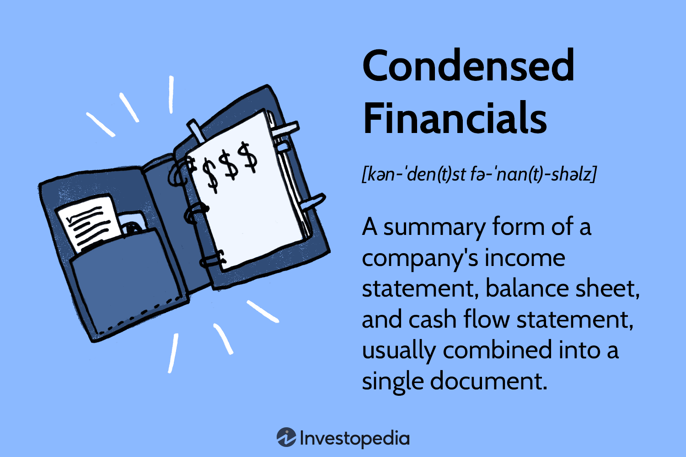

In today’s rapidly evolving financial landscape, the ability to quickly interpret and utilize financial data is more crucial than ever. As businesses and investors navigate complex economic environments, tools such as financial statements, condensed financials, financial reporting, and algorithmic trading play a vital role in shaping informed decision-making processes. These components are not only foundational for assessing a company's financial health but also integral to developing strategies that can enhance investment outcomes and business growth.

Financial statements, comprising the balance sheet, income statement, cash flow statement, and statement of shareholders' equity, offer distinct perspectives on a company's financial performance. These documents are indispensable for understanding a business's economic activities and conditions. As the business world becomes more data-driven, the need for concise and accessible financial summaries has led to the use of condensed financial statements. These condensed versions present streamlined insights that are particularly useful during audits or when a rapid overview is required.



Furthermore, transparent financial reporting practices are essential for maintaining investor trust and supporting strategic decisions within an organization. By disclosing crucial financial information, businesses can better communicate their performance and stability to stakeholders. This transparency is paramount not only for regulatory compliance but also for sustaining investor confidence, which is vital in a competitive market.

Algorithmic trading represents another intersection of financial data and technology, where complex algorithms execute trades based on data-driven insights. In this sphere, financial statements provide the raw data required to craft quantitative strategies, enabling automated buy and sell decisions that can potentially enhance trading efficiency and accuracy.

Collectively, these concepts underscore the importance of mastering financial data interpretation. By integrating detailed financial analysis with strategic planning, investors and businesses can optimize their financial strategies and navigate the financial landscape more effectively. This article aims to provide a comprehensive understanding of these concepts and their interconnections, equipping readers with the necessary knowledge to leverage financial data efficiently.

## Table of Contents

## What Are Financial Statements?

Financial statements are formalized documents that record the financial activities and illustrate the monetary conditions of an entity. These statements serve as the cornerstone for evaluating a company's financial health, providing stakeholders with critical insights into its performance and strategic positioning.

The four primary financial statements essential for this assessment are the balance sheet, income statement, cash flow statement, and statement of shareholders' equity. Each offers a unique viewpoint on a company's financial operations.

1. **Balance Sheet**: Known as the statement of financial position, the balance sheet provides a snapshot of a company’s assets, liabilities, and shareholders’ equity at a specific point in time. This financial document follows the fundamental accounting equation:
$$
   \text{Assets} = \text{Liabilities} + \text{Shareholders' Equity}

$$

   This equation ensures that the document is balanced and reflects the financial structure of the company.

2. **Income Statement**: Also referred to as the profit and loss statement, the income statement summarizes the revenues, expenses, and profits or losses for a company over a particular reporting period. The primary aim is to show the net income of the company, calculated as:
$$
   \text{Net Income} = \text{Total Revenue} - \text{Total Expenses}

$$

   This provides stakeholders with insight into the company's operational efficiency and profitability over time.

3. **Cash Flow Statement**: This document is designed to show the inflow and outflow of cash within an organization. It is divided into three sections—operating activities, investing activities, and financing activities—which collectively account for cash transactions during the period. The cash flow statement is crucial for assessing a company’s liquidity and its capacity to generate cash.

4. **Statement of Shareholders' Equity**: This statement brings together changes in the equity section of the balance sheet over a reporting period. It covers components such as retained earnings, net income, dividends paid, and stock issuances. This statement is pivotal in understanding the changes in ownership equity and how profits are utilized or distributed by the company.

Understanding these financial statements comprehensively aids various stakeholders—including investors, creditors, and management—in making informed decisions. By systematically analyzing these documents, individuals can gain a nuanced understanding of a company's financial landscape, contributing to strategic planning and evaluation.

## Understanding Condensed Financials

Condensed financial statements serve as abridged versions of a company’s full financial records, offering a snapshot of its financial position without the comprehensive details found in standard financial statements. These statements include summarized versions of core financial documents such as the balance sheet, income statement, and cash flow statement. They are designed to provide essential financial information quickly, which can be particularly useful in situations where time or access to full financial records is limited.

A primary advantage of condensed financial statements is their utility in providing a high-level overview for stakeholders, such as managers, auditors, or investors who need to assess the financial status of a company without wading through extensive details. This high-level view can be particularly beneficial during preliminary audits, management reviews, or when a quick financial assessment is necessary.

For instance, during an internal financial review, the condensed income statement might present only key line items such as total revenue, gross profit, operating income, and net income, omitting granular details like specific operating expenses or income sources. This brevity helps decision-makers quickly ascertain the company's financial performance over a particular period without being bogged down by specifics that might not be immediately relevant.

While condensed financial statements streamline information, they do not substitute for comprehensive financial analysis and should not be the sole basis for major financial decisions. They are inherently limited, as the summarization process may omit important details that could affect the interpretation of a company’s financial health.

A practical example where condensed financials are used is the preparation of interim financial reports. Companies often publish these during a fiscal year to inform stakeholders about mid-term financial performance without the full detail of annual reports. During these periods, condensed financials facilitate timely decisions by providing an essential glimpse into financial operations.

In conclusion, condensed financial statements are an effective tool for providing a quick overview of a company's financial health. By focusing on key financial information, they serve the needs of stakeholders who require essential data promptly, although they should be used judiciously in conjunction with more detailed financial analysis for critical decision-making.

## The Role of Financial Reporting

Financial reporting is a critical process that involves the dissemination of financial information to a variety of stakeholders, including investors, creditors, regulators, and management. This process is governed by established standards and principles, such as Generally Accepted Accounting Principles (GAAP) or International Financial Reporting Standards (IFRS), ensuring consistency and reliability across different reporting entities and periods.

The primary objective of financial reporting is to provide stakeholders with clear, accurate, and timely insights into an organization's financial performance and position. This transparency enables stakeholders to make informed decisions regarding investment, lending, and management strategies. For instance, investors rely on financial reports to evaluate a company's profitability, growth potential, and risk exposure, which influences their investment choices.

Accurate financial reporting is essential for maintaining investor confidence. Transparency in financial reporting fosters trust by minimizing information asymmetry between the organization and its stakeholders. When financial information is presented in a transparent manner, it reduces uncertainties and speculation based on incomplete or misleading data. This trust is crucial, as it impacts an organization's ability to raise capital and sustain its operations.

Moreover, effective financial reporting aids internal management in strategic planning and resource allocation. By analyzing financial statements, managers can identify trends, measure performance against benchmarks, and make data-driven decisions to enhance operational efficiency and profitability. Financial reporting also serves as a vital tool for regulatory compliance, ensuring that organizations adhere to legal requirements and avoid penalties.

Incorporating technology into financial reporting processes can enhance accuracy and efficiency. Automated systems streamline data collection and analysis, reducing the likelihood of human error, and enabling real-time financial insights. As financial technology evolves, the integration of [artificial intelligence](/wiki/ai-artificial-intelligence) and [machine learning](/wiki/machine-learning) in financial reporting has the potential to further improve data analytics and predictive capabilities.

In summary, financial reporting plays a crucial role in the economic ecosystem by providing stakeholders with essential information. Its emphasis on accuracy and transparency not only upholds investor trust but also enables organizations to make strategic decisions that drive growth and stability.

## Financial Statements in Algorithmic Trading

Algorithmic trading, commonly known as algo trading, employs complex algorithms to automate buy and sell decisions based on quantitative data analysis. Financial statements are pivotal in providing the foundational data required to construct these algorithms. They play a critical role by offering insights into a company's financial health, which is essential for the formulation of data-driven trading strategies.

The importance of financial statements in [algorithmic trading](/wiki/algorithmic-trading) lies primarily in the rich datasets they offer. These data sets include key metrics such as revenue growth, profit margins, asset turnover ratios, and others that can be systematically analyzed and modeled into trading algorithms. By utilizing structured data from balance sheets, income statements, and cash flow statements, algorithmic traders can quantify factors that influence stock prices and predict potential market movements.

Financial statements can be integrated into algorithms in several ways. For instance, traders can develop algorithms that trigger trade actions when a company posts earnings above or below forecasts. Python, a programming language popular in the data analytics and finance community, can be leveraged to create these algorithms. Here's an example snippet demonstrating how one might use a company’s earnings data to inform trading decisions:

```python
import pandas as pd

# Sample data: company earnings report
earnings_data = pd.DataFrame({
    'Company': ['CompanyA', 'CompanyB', 'CompanyC'],
    'Reported_Earnings': [2.75, 3.50, 1.25],
    'Expected_Earnings': [2.50, 3.40, 1.30]
})

def check_earnings(df):
    # Check if reported earnings exceed expected earnings
    df['Action'] = df.apply(lambda row: 'BUY' if row['Reported_Earnings'] > row['Expected_Earnings'] else 'SELL', axis=1)
    return df

# Generate buy or sell signals
trading_signals = check_earnings(earnings_data)
print(trading_signals)
```

Traders can use similar logic to assess other financial metrics, integrating them into more comprehensive algorithms that capture real-time market data and execute trades within milliseconds. The combination of historical data from financial statements and real-time data models allows for more accurate predictions regarding future price movements.

While financial statements offer valuable data, it is crucial to recognize their limitations in algo trading. The data is inherently historical and might not always accurately predict future market behavior. However, by coupling the analysis of financial statements with sophisticated algorithms, traders can better mitigate risks and enhance trading performance through improved predictive accuracy.

In conclusion, the integration of financial statements into algorithmic trading represents a blend of data analysis, financial expertise, and technological advancement. By accurately interpreting these statements and designing efficient algorithms, traders can leverage financial data to optimize trading strategies and maximize investment returns.

## Key Financial Ratios for Algorithmic Trading

Financial ratios serve as powerful tools for evaluating key aspects of a company's financial health, particularly in the context of algorithmic trading. These ratios distill complex financial data into manageable metrics, allowing for efficient analysis and comparison. Financial ratios such as the debt-to-equity ratio, net profit margin, and current ratio provide insight into a company's leverage, profitability, and [liquidity](/wiki/liquidity-risk-premium), respectively. Each of these components is crucial for creating and refining algorithmic trading strategies, enabling traders to make informed and timely decisions.

### Debt-to-Equity Ratio

The debt-to-equity ratio is a measure of a company's financial leverage, calculated by dividing total liabilities by shareholder equity:

$$
\text{Debt-to-Equity Ratio} = \frac{\text{Total Liabilities}}{\text{Shareholder Equity}}
$$

This ratio indicates the proportion of debt financing used relative to equity financing. A high ratio may suggest that a company is aggressively financing its growth with debt, which can be risky if not managed properly. In algorithmic trading, the debt-to-equity ratio helps assess risk levels associated with a company, allowing algorithms to balance between potential returns and financial stability.

### Net Profit Margin

Net profit margin assesses a company's profitability by showing the percentage of revenue that translates into profit:

$$
\text{Net Profit Margin} = \left( \frac{\text{Net Income}}{\text{Revenue}} \right) \times 100
$$

This ratio highlights how effectively a company converts sales into actual profit. A higher net profit margin indicates greater efficiency and cost control. Trading algorithms often utilize this ratio to identify companies with robust financial health and operational efficiency, enhancing potential returns.

### Current Ratio

The current ratio evaluates a company's ability to cover its short-term obligations using its short-term assets:

$$
\text{Current Ratio} = \frac{\text{Current Assets}}{\text{Current Liabilities}}
$$

This liquidity ratio provides insight into a company's short-term financial health. A ratio greater than 1 suggests that the company has more assets than liabilities, indicating good liquidity. Algorithmic trading strategies incorporate the current ratio to assess liquidity risks, ensuring that investments are directed toward financially stable companies.

### Integration in Algorithmic Trading

In algorithmic trading, these financial ratios are integrated into complex models and strategies to automate trading decisions. These models analyze financial health and market conditions concurrently, optimizing buy and sell signals to maximize returns. Python, a popular language for developing trading algorithms, can be used to calculate these ratios. Below is an example code snippet illustrating how these ratios might be computed:

```python
def calculate_ratios(financial_data):
    debt_to_equity = financial_data['total_liabilities'] / financial_data['shareholder_equity']
    net_profit_margin = (financial_data['net_income'] / financial_data['revenue']) * 100
    current_ratio = financial_data['current_assets'] / financial_data['current_liabilities']
    return debt_to_equity, net_profit_margin, current_ratio

financial_data = {
    'total_liabilities': 500000,
    'shareholder_equity': 300000,
    'net_income': 70000,
    'revenue': 350000,
    'current_assets': 150000,
    'current_liabilities': 100000
}

ratios = calculate_ratios(financial_data)
print("Debt-to-Equity Ratio:", ratios[0])
print("Net Profit Margin:", ratios[1])
print("Current Ratio:", ratios[2])
```

In conclusion, financial ratios are indispensable tools in algorithmic trading. By providing clear indicators of financial health, these ratios guide the development of data-driven strategies, enabling traders to execute well-informed decisions efficiently.

## Using Financial Statements Effectively

Financial statements serve as fundamental tools for investors and traders, providing a clear picture of a company's finances. However, their effectiveness is not without limitations. One primary limitation is their reliance on historical data. Financial statements typically reflect past performance, which may not necessarily indicate future performance, making it crucial for traders to incorporate current and forward-looking data in their analysis.

Furthermore, financial statements can be susceptible to manipulation. Creative accounting practices, such as altering balance sheet entries or income recognition methods, can misrepresent a company's true financial health. This potential for manipulation underscores the importance of skepticism and thorough analysis when evaluating financial statements.

To navigate these challenges, traders should extend their analysis beyond the financial statements themselves. Incorporating market trends can provide valuable insights into how a company might perform under current economic conditions. For instance, understanding industry dynamics, economic indicators, and geopolitical factors can contextualize the data from financial statements.

Qualitative analysis adds another layer of depth to financial decision-making. It involves assessing non-financial elements such as management quality, competitive advantages, regulatory environment, and brand strength. These factors, while not directly quantifiable, can significantly impact a company's performance and are crucial for a comprehensive analysis.

Traders can use various analytical tools and techniques to integrate these elements effectively. For instance, Python offers a robust ecosystem for data analysis, with libraries like Pandas and NumPy that can handle large datasets, and Matplotlib or Seaborn for visualizing trends. Python's flexibility allows traders to construct models that incorporate both quantitative and qualitative data, enhancing the robustness of their trading strategies.

Here's a simple Python code snippet that demonstrates how financial data, market trends, and qualitative factors can be collated and analyzed:

```python
import pandas as pd
import numpy as np

# Mock financial data
financial_data = pd.DataFrame({
    'Year': [2020, 2021, 2022],
    'Revenue': [1000, 1100, 1200],
    'Profit': [100, 150, 200],
})

# Mock market trend data
market_trends = pd.Series([1.03, 1.05, 0.98], index=[2020, 2021, 2022])

# Calculate a basic performance metric
financial_data['Performance_Index'] = financial_data['Profit'] * market_trends.values

# Include qualitative assessment as a factor
qualitative_factors = {'Management_Score': [0.9, 0.85, 0.95]}
qualitative_data = pd.DataFrame(qualitative_factors, index=[2020, 2021, 2022])

# Integrate qualitative factors
financial_data['Adjusted_Performance_Index'] = financial_data['Performance_Index'] * qualitative_data['Management_Score']

print(financial_data)
```

By integrating financial data with market trends and qualitative assessments, traders can create a more nuanced and forward-looking analysis of their investments. This comprehensive approach not only mitigates the limitations of traditional financial statement analysis but also enhances the ability to make informed and strategic investment decisions.

## Conclusion

Mastering financial statements and their application in algorithmic trading is crucial for enhancing decision-making capabilities in finance and investment. Financial statements provide essential insights into a company's financial health, offering quantitative metrics that are fundamental to analyzing business performance. By leveraging these insights, investors can make informed decisions that align with their strategic objectives.

In algorithmic trading, financial statements serve as the backbone for developing robust trading algorithms. They supply the raw data necessary for quantitative analysis, crafting strategies that automate investment decisions. The integration of financial analysis into algorithmic trading enables traders to exploit market inefficiencies and optimize portfolio performance. For example, utilizing key financial ratios such as the debt-to-equity ratio, net profit margin, and current ratio can form the basis of sophisticated trading models that evaluate a company's stability, profitability, and liquidity.

Additionally, integrating detailed financial analysis with strategic planning empowers businesses to refine their financial strategies. This integration allows for the identification of opportunities for cost reduction, revenue enhancement, and risk mitigation. In practice, this might involve using financial statement data to adjust business plans or inform merger and acquisition decisions. By holistically analyzing both quantitative financial data and qualitative market factors, investors can boost the precision of their forecasts and improve investment outcomes.

In conclusion, by harnessing the power of financial statements, investors and businesses gain a decisive edge in strategic decision-making. The synergy of careful financial analysis and strategic planning facilitates the optimization of financial strategies, paving the way for improved financial performance and sustainable growth.

## References & Further Reading

[1]: [International Financial Reporting Standards (IFRS)](https://www.ifrs.org/content/dam/ifrs/publications/pdf-standards/english/2021/issued/part-a/ifrs-1-first-time-adoption-of-international-financial-reporting-standards.pdf)

[2]: Fama, E. F., & French, K. R. (1996). ["The Capital Asset Pricing Model: Theory and Evidence."](https://www.aeaweb.org/articles?id=10.1257/0895330042162430) Journal of Economic Perspectives, 18(3), 25-46.

[3]: [Generally Accepted Accounting Principles (GAAP)](https://www.accounting.com/resources/gaap/)

[4]: Hendershott, T., Jones, C. M., & Menkveld, A. J. (2011). ["Does Algorithmic Trading Improve Liquidity?"](https://onlinelibrary.wiley.com/doi/full/10.1111/j.1540-6261.2010.01624.x) The Review of Financial Studies, 24(8), 2550-2592.

[5]: ["Financial Statement Analysis and Security Valuation"](https://cie-advances.asme.org/files-library-Documents/financial-statement-analysis-and-security-valuation.pdf) by Stephen H. Penman

[6]: Durbin, M. (2011). ["All About High-Frequency Trading."](https://www.mhebooklibrary.com/doi/book/10.1036/9780071743457) McGraw-Hill Education.