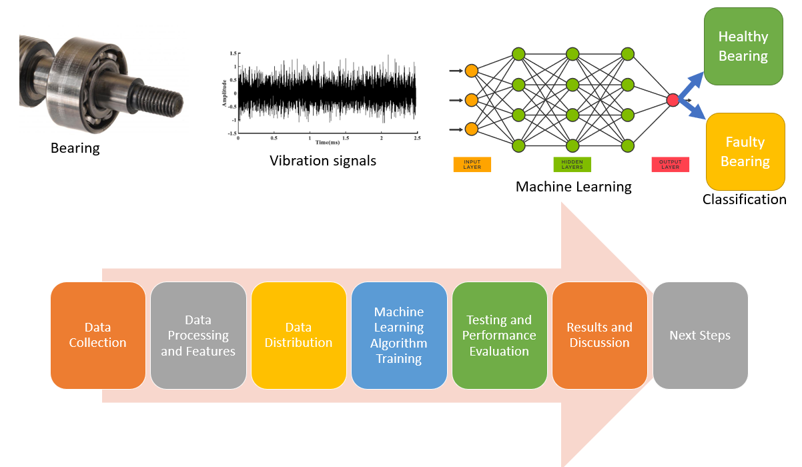

## Table of Contents

## What is condition in the context of machine learning?

In the context of machine learning, a condition refers to a specific criterion or set of criteria that data must meet. This concept is often used in decision-making processes within algorithms, where certain actions are taken only if the data satisfies the specified conditions. For example, in a decision tree, a condition might be used to split the data at a node, where the algorithm checks if a feature value is above or below a certain threshold. If the condition is met, the data goes down one branch; if not, it goes down another.

Conditions are also crucial in conditional probability, which is a fundamental concept in many machine learning models, especially in Bayesian methods. Conditional probability is the probability of an event given that another event has occurred. For instance, in a spam filter, the model might calculate the probability that an email is spam given that it contains certain keywords. This can be expressed as $$P(\text{Spam} | \text{Keyword})$$, where the condition is the presence of the keyword. Understanding and correctly applying conditions helps in building more accurate and efficient machine learning models.

## How does conditioning affect machine learning models?

Conditioning plays a key role in shaping how machine learning models work and make predictions. It helps models focus on specific parts of the data that matter for making decisions. For example, in a decision tree, conditioning is used to split data into different groups based on certain rules. If a condition like "Is the temperature above 20 degrees?" is true, the data goes one way; if not, it goes another way. This helps the model understand patterns and make better predictions by considering only the relevant data at each step.

In other types of models, like those using conditional probability, conditioning is used to update the model's beliefs based on new information. For instance, a spam filter might use the condition "Does the email contain the word 'free'?" to decide if an email is more likely to be spam. This can be shown with the formula $$P(\text{Spam} | \text{'free'})$$, which means the probability of an email being spam given that it contains the word 'free'. By conditioning on specific features, the model can adjust its predictions to be more accurate and tailored to the data it sees.

## Can you explain the difference between conditional and unconditional models in machine learning?

Conditional models in machine learning make predictions based on specific conditions or information. They look at certain parts of the data to make their guesses. For example, a conditional model might predict if it will rain today based on the current humidity and temperature. It uses these conditions to adjust its predictions. In math terms, a conditional model might use a formula like $$P(\text{Rain} | \text{Humidity}, \text{Temperature})$$ to calculate the probability of rain given the current humidity and temperature.

Unconditional models, on the other hand, make predictions without looking at specific conditions. They don't consider extra information when making their guesses. For example, an unconditional model might predict the chance of rain today without considering humidity or temperature. It just gives a general prediction based on all the data it has seen before. In math, an unconditional model might use a formula like $$P(\text{Rain})$$ to calculate the overall probability of rain without any additional conditions.

Both types of models have their uses. Conditional models are great when you have specific information that can help improve predictions. Unconditional models are simpler and can be useful when you don't have extra information or when you want a general prediction.

## What are some common applications of conditional machine learning?

Conditional machine learning is used a lot in things like spam filters. These filters look at certain words or patterns in emails to decide if they are spam or not. For example, if an email has the word "free" in it, the model might think it's more likely to be spam. This can be shown with the formula $$P(\text{Spam} | \text{'free'})$$, which means the chance of an email being spam given that it has the word "free". By using these conditions, spam filters can do a better job of keeping unwanted emails out of your inbox.

Another common use is in recommendation systems, like those used by Netflix or Amazon. These systems look at what you've watched or bought before to suggest new things you might like. For instance, if you've watched a lot of sci-fi movies, the system might recommend other sci-fi movies to you. This is based on the condition of your past viewing history. By considering these conditions, recommendation systems can give you more personalized and relevant suggestions, making your experience better.

## How is conditional probability used in machine learning?

Conditional probability is a big part of machine learning. It helps models make better guesses by looking at specific information. For example, a spam filter uses conditional probability to figure out if an email is spam based on words like "free". The formula for this is $$P(\text{Spam} | \text{'free'})$$, which means the chance of an email being spam given that it has the word "free". By using these conditions, the model can adjust its predictions to be more accurate and helpful.

In another example, machine learning models use conditional probability in decision trees. These models split data into different groups based on certain rules. If a condition like "Is the temperature above 20 degrees?" is true, the data goes one way; if not, it goes another way. This helps the model understand patterns and make better predictions by considering only the relevant data at each step. By focusing on specific conditions, machine learning models can become smarter and more effective at what they do.

## What is the role of conditional generative models?

Conditional generative models are used to create new data that looks like the data they were trained on, but with a twist. They can make new images, text, or sounds based on certain conditions. For example, if you want to generate a picture of a dog, you can tell the model to make it a specific breed, like a golden retriever. The model then uses the condition "golden retriever" to create an image that matches what you asked for. This is really useful in things like art, design, and even making fake data for testing.

In machine learning, conditional generative models use a formula called conditional probability to do their job. They look at the probability of creating something new given certain conditions. For example, if you want to generate a sentence that starts with "The cat," the model calculates $$P(\text{sentence} | \text{"The cat"})$$ to figure out what words should come next. By using these conditions, the model can make more accurate and relevant outputs. This helps in applications like text generation, where you want the model to write something that fits a specific topic or style.

## How do conditional random fields work in machine learning?

Conditional Random Fields (CRFs) are a type of model used in machine learning to predict sequences of labels based on given data. Imagine you have a sentence and you want to label each word as a part of speech, like noun, verb, or adjective. CRFs look at the whole sentence and consider how the labels of nearby words might influence each other. For example, if one word is labeled as a verb, the next word might be more likely to be a noun. CRFs use this idea to make better guesses about the labels by considering the entire context of the data.

In math terms, CRFs calculate the probability of a sequence of labels given the observed data. This is shown with the formula $$P(\text{Labels} | \text{Data})$$. They do this by looking at how likely each label is on its own and how likely it is given the labels of the other parts of the sequence. This makes CRFs very good at tasks like speech recognition, where understanding the whole sentence helps in figuring out what each word is. By considering the relationships between different parts of the data, CRFs can make more accurate predictions.

## What are the challenges of implementing conditional models?

Implementing conditional models can be tricky because they need a lot of data to work well. If you don't have enough data that matches the conditions you're looking at, the model might not learn the right patterns. For example, if you're trying to predict if an email is spam based on certain words, you need lots of emails with those words to train the model properly. Without enough data, the model might make wrong guesses, and you might end up with spam in your inbox or miss important emails.

Another challenge is that conditional models can be more complicated to set up and run than simpler models. They need to handle different conditions and adjust their predictions based on these conditions. This can make them slower and harder to understand. For instance, in a decision tree, the model has to check many conditions at each step, which can take more time and computing power. If not done right, these models might also overfit, meaning they work well on the data they were trained on but not on new data. This can make them less useful in real-world situations.

## How can one evaluate the performance of conditional machine learning models?

To evaluate the performance of conditional machine learning models, you can use different methods depending on what you want to measure. One common way is to use metrics like accuracy, which tells you how often the model's predictions are correct. For example, if you're using a model to predict if an email is spam based on certain words, you can check how many times it gets it right. Another important metric is precision and recall, which help you understand how well the model does when it says something is true or when it misses something. Precision is how many of the positive predictions are actually correct, and recall is how many of the actual positives the model catches. You can use formulas like $$ \text{Precision} = \frac{\text{True Positives}}{\text{True Positives} + \text{False Positives}} $$ and $$ \text{Recall} = \frac{\text{True Positives}}{\text{True Positives} + \text{False Negatives}} $$ to calculate these.

Another way to evaluate conditional models is by using cross-validation. This means splitting your data into different parts and testing the model on each part while training it on the others. This helps you see how well the model works on data it hasn't seen before, which is important for making sure it will work well in real life. You can also look at the model's performance on specific conditions to see if it's doing well in all cases or if it's struggling with some. For example, if your model predicts rain based on temperature and humidity, you might want to check how well it does when the temperature is high versus when it's low. By looking at these different aspects, you can get a good idea of how reliable and useful your conditional model is.

## What advanced techniques exist for optimizing conditional models?

One advanced technique for optimizing conditional models is using Bayesian optimization. This method helps find the best settings for the model by trying different combinations and learning from the results. It's like playing a game where you get better at choosing the right moves over time. Bayesian optimization is really useful when you want to make your model work better but don't want to check every possible setting, which can take a long time. It uses a formula called the acquisition function to decide which settings to try next, making the process smarter and faster.

Another technique is using gradient-based methods, like gradient descent, to fine-tune the model's parameters. These methods work by calculating how much each parameter affects the model's performance and then adjusting them little by little to improve the results. For example, if you're trying to predict if an email is spam based on certain words, gradient descent can help you figure out which words are most important and how much weight to give them. The formula for updating parameters in gradient descent is $$ \theta = \theta - \alpha \nabla J(\theta) $$, where $$ \theta $$ are the parameters, $$ \alpha $$ is the learning rate, and $$ \nabla J(\theta) $$ is the gradient of the cost function. By using these techniques, you can make your conditional models more accurate and efficient.

## Can you discuss some cutting-edge research in conditional machine learning?

One exciting area of research in conditional machine learning is the development of conditional generative adversarial networks (cGANs). These models can create new data, like images or text, based on specific conditions. For example, a cGAN can generate a picture of a dog, but you can tell it to make the dog a certain breed, like a golden retriever. Researchers are working on making these models more accurate and faster. They use techniques like Wasserstein loss to improve how the model learns from the data. This helps the model create more realistic and varied outputs. By using formulas like $$P(\text{Image} | \text{Condition})$$, cGANs can adjust their generation process to fit the given conditions better.

Another cutting-edge area is the use of conditional variational autoencoders (CVAEs). These models are good at understanding and generating data based on specific conditions. For example, a CVAE can generate sentences that start with "The cat" by calculating $$P(\text{Sentence} | \text{"The cat"})$$. Researchers are exploring ways to make CVAEs more efficient and capable of handling complex conditions. They are using techniques like hierarchical latent variables to capture more detailed information about the data. This helps the model generate more accurate and contextually relevant outputs. By improving these models, researchers aim to make them useful in applications like personalized content generation and advanced data analysis.

## How do conditional models integrate with other AI technologies like deep learning?

Conditional models work well with deep learning because they can use deep learning's ability to learn from complex data. Deep learning models, like neural networks, are good at finding patterns in big datasets. When you add conditions to these models, they can focus on specific parts of the data that matter for making predictions. For example, a deep learning model can predict if an email is spam by looking at many different features of the email. By adding conditions, like checking if the email has the word "free," the model can adjust its predictions to be more accurate. This can be shown with the formula $$P(\text{Spam} | \text{'free'})$$, which means the chance of an email being spam given that it has the word "free."

In another example, conditional models can be used with deep learning to create new images or text that fit certain conditions. This is done using models like conditional generative adversarial networks (cGANs) or conditional variational autoencoders (CVAEs). These models use deep learning to learn how to generate realistic data, and the conditions help them create data that matches what you want. For instance, if you want to generate a picture of a dog but specify it should be a golden retriever, the model uses the condition to create an image that looks like a golden retriever. By integrating conditional models with deep learning, we can make AI systems smarter and more useful for tasks like personalized content generation and advanced data analysis.