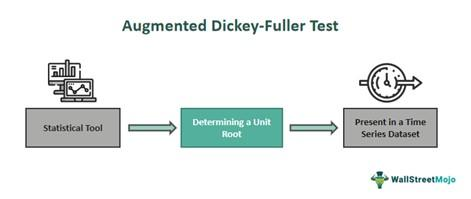

The Conditional Augmented Dickey-Fuller (CADF) test is a statistical methodology designed to assess the stationarity of a time series, making it a fundamental tool in the field of algorithmic trading. Stationarity is a crucial property of a time series where its statistical characteristics, like mean and variance, do not change over time. For traders, particularly those focused on mean-reversion strategies, identifying stationarity is essential, as it implies that prices will revert to a historical average over time.

Cointegration and stationarity are interconnected concepts that play a pivotal role in the identification of trading opportunities involving pair strategies. Cointegration refers to a scenario where a linear combination of two or more non-stationary series results in a stationary series, suggesting a stable long-term relationship among them. This property is particularly useful in constructing pairs for trading, as it allows traders to exploit price divergences between two cointegrated assets, expecting that any deviation will be temporary and eventually correct itself through mean reversion.



The CADF test enhances the basic Augmented Dickey-Fuller (ADF) test by incorporating a conditional framework. Standard ADF tests focus on determining whether a single time series has a unit root, implying non-stationarity. However, the ADF lacks adequate capability to provide the hedge ratio essential for effective pairs trading. The augmentation in CADF test allows it to not only test for stationarity in a conditional setting but also to determine the optimal hedge ratio between two assets, offering a more precise tool for traders aiming to exploit the mean-reverting nature of the cointegration relationship.

Understanding these distinctions and enhancements provided by the CADF test over the standard ADF test enables algorithmic traders to execute more accurate and profitable mean reversion strategies. By identifying cointegrated pairs with the right hedge ratios, traders can effectively construct and monitor trading strategies that are poised to benefit from predictable price movements, enhancing the reliability and potential returns of their trades.

## Table of Contents

## Understanding the Augmented Dickey-Fuller (ADF) Test

The Augmented Dickey-Fuller (ADF) test is a statistical methodology employed to ascertain whether a given time series is stationary, with a specific focus on detecting the presence of unit roots. A time series is considered stationary when its statistical properties, such as mean and variance, remain constant over time. Detecting stationarity is crucial in time series analysis, as many statistical models assume the series to be stationary in order to make valid predictions and inferences.

At its core, the ADF test is an augmented version of the Dickey-Fuller test, designed to address some of its limitations, particularly the issue of autocorrelation in the residuals. The standard Dickey-Fuller test assesses for a unit root by estimating the following regression:

$$
\Delta y_t = \alpha + \beta t + \gamma y_{t-1} + \epsilon_t
$$

where $\Delta y_t$ is the first difference of the series $y_t$, $\alpha$ is a constant, $\beta t$ is a time trend, $\gamma$ is the coefficient of the lagged level of the series, and $\epsilon_t$ represents the error term. The null hypothesis $H_0$ posits that the series has a unit root ($\gamma = 0$), indicating non-stationarity, while the alternative hypothesis $H_1$ suggests stationarity ($\gamma < 0$).

The ADF test extends this by accounting for higher-order autoregressive processes, thus handling possible autocorrelation in the error terms. This is achieved by including lagged differences of the dependent variable:

$$
\Delta y_t = \alpha + \beta t + \gamma y_{t-1} + \sum_{i=1}^{p} \delta_i \Delta y_{t-i} + \epsilon_t
$$

In this expanded model, $\sum_{i=1}^{p} \delta_i \Delta y_{t-i}$ introduces lagged terms to capture any autocorrelated structure. The appropriate number of lags, $p$, can typically be selected using criteria such as the Akaike Information Criterion (AIC) or the Bayesian Information Criterion (BIC).

Despite its usefulness in determining stationarity, the ADF test does not directly address the requirements for constructing effective pairs trading strategies in [algorithmic trading](/wiki/algorithmic-trading). Notably, it does not provide the hedge ratio—an essential component in pairs trading—because it only focuses on single time series properties rather than relationships between multiple series. For this reason, while the ADF test serves as a fundamental stationarity check, more comprehensive tests like the Conditional Augmented Dickey-Fuller (CADF) test are required to assess cointegration and derive hedge ratios, thereby enhancing the applicability of statistical [arbitrage](/wiki/arbitrage) methods.

## The Need for CADF in Algorithmic Trading

In algorithmic trading, accurately determining the hedge ratio is essential for executing pairs trading strategies effectively. Pairs trading involves selecting two assets with a high correlation that are expected to revert to their historical relationship over time. The hedge ratio, which dictates the proportion of each asset to hold in the portfolio, is crucial for constructing a market-neutral position that can potentially profit from deviations in their price relationship. 

The Conditional Augmented Dickey-Fuller (CADF) test is a valuable tool in this regard, as it builds upon the Augmented Dickey-Fuller (ADF) test by incorporating a cointegration framework. While the ADF test checks for stationarity and the presence of unit roots in individual time series, it does not provide the hedge ratio needed for pairs trading. In contrast, the CADF test enables traders to analyze the relationship between two asset series and determine the optimal hedge ratio that ensures the spread, or the difference between the prices of the two series, is stationary.

The CADF test extends the ADF test by accounting for the potential cointegrating relationship between asset pairs. Cointegration refers to the situation where a linear combination of two non-stationary series results in a stationary series. Hence, the CADF test evaluates whether there exists a cointegration relationship between the assets, which, if confirmed, provides a reliable hedge ratio for pairs trading. Mathematically, cointegration implies that for two time series, $X_t$ and $Y_t$, there exists a linear combination $Z_t = Y_t - \beta X_t$ that is stationary. The parameter $\beta$ in this linear equation represents the hedge ratio.

Implementing the CADF test involves modeling the relationship between the two assets and estimating the coefficient $\beta$. This process typically requires calculating the residuals of the regression model $Y_t = \alpha + \beta X_t + \epsilon_t$ and testing these residuals for stationarity using the CADF framework. If the test confirms stationarity, the cointegration relationship is established, and $\beta$ serves as the hedge ratio. 

By incorporating cointegration, the CADF test improves on the ADF test's limitations, offering traders a more effective tool for determining a statistically sound hedge ratio. This approach enables a more accurate execution of pairs trading strategies that rely on mean reversion, thus enhancing the potential for profitability in algorithmic trading scenarios.

## How CADF Test Enhances Pairs Trading Strategies

Pairs trading is a market-neutral trading strategy that involves the simultaneous buying and selling of two related assets, often stocks or exchange-traded funds (ETFs), with the aim of generating profit irrespective of market direction. The strategy hinges on the concept of cointegration, whereby two or more time series, though individually non-stationary, can form a stationary linear combination. This relationship implies that the spread, or difference, between the prices of the paired assets remains stable over time, fluctuating around a long-term equilibrium. Identifying such pairs is critical to implementing a successful pairs trading strategy.

The Conditional Augmented Dickey-Fuller (CADF) test enhances pairs trading by providing a sophisticated statistical approach to identify stationary spreads through the determination of hedge ratios. These ratios are essential for ensuring the spread adheres to a stationary process, thus meeting the criteria for cointegration.

In practical terms, the CADF test allows traders to establish the optimal hedge ratio, represented as $\beta$, between two asset prices, $X_t$ and $Y_t$, forming a spread $Z_t = Y_t - \beta X_t$. The CADF test evaluates whether this spread $Z_t$ is stationary, signifying a mean-reverting behavior. A stationary spread indicates that deviations from the historical mean are temporary, and the spread is likely to revert to its mean over time, providing trading opportunities.

By utilizing the CADF test, traders can move beyond the limitations of the standard ADF test, which does not account for the relationship between pairs directly. The CADF test, on the other hand, incorporates a cointegration framework that is specifically tailored for two time series, which allows for a robust assessment of the spread's stationarity. This statistical rigor enhances the reliability and effectiveness of pairs trading strategies, as it reduces the risk of false signals that might arise from non-stationary spreads.

Overall, the CADF test not only supports traders in identifying viable asset pairs for mean-reversion strategies but also aids in optimizing trading performance by maintaining market neutrality and maximizing the potential for profit.

## Implementing CADF in R for Backtesting

To implement the Conditional Augmented Dickey-Fuller (CADF) test in R for [backtesting](/wiki/backtesting) purposes, two key R libraries stand out: `tseries` for conducting Augmented Dickey-Fuller (ADF) tests and `quantmod` for acquiring historical financial data. These tools enable the determination of whether a time series and its residuals are stationary, a crucial aspect of mean-reversion strategies in algorithmic trading.

### Installation and Setup

Begin by ensuring that the necessary R packages are installed and loaded:

```r
install.packages("tseries")
install.packages("quantmod")

library(tseries)
library(quantmod)
library(urca) # Additional package for CADF
```

### Data Collection

Using `quantmod`, you can easily fetch historical data. For instance, let's consider downloading synthetic asset data:

```r
getSymbols("AAPL", from = "2020-01-01", to = "2023-01-01")
getSymbols("MSFT", from = "2020-01-01", to = "2023-01-01")
```

Assume `AAPL` and `MSFT` as proxies for constructing a pairs trading strategy.

### Example Implementation Using Synthetic Data

For the CADF test, creating synthetic spreads that exhibit potential cointegration gives us an illustrative example. Let's construct a synthetic spread:

```r
# Assuming the prices of AAPL and MSFT are already in place
spread <- Cl(AAPL) - Cl(MSFT)

# Plot the spread
plot(spread, main="Synthetic Spread", xlab="Time", ylab="Price")
```

### CADF Test Execution

The `urca` package aids in performing the CADF test. The following is a simplified procedure:

```r
library(urca)

# Perform CADF on the synthetic spread
cadf_test <- ca.jo(data.frame(Cl(AAPL), Cl(MSFT)), type = "trace", ecdet = "none", K = 2)

# Display test results
summary(cadf_test)
```
This test helps determine if the spread between `AAPL` and `MSFT` is stationary, implying cointegration.

### Interpreting Results

A successful CADF test will show a statistically significant result, often reflected by the test statistic exceeding the critical value. This indicates that the residuals of the price difference are stationary, a vital condition for robust pairs trading strategies.

### Conclusion

The integration of CADF into backtesting underscores its capacity to refine mean reversion trading strategies. Through libraries available in R, traders can effectively backtest and validate potential pairs for trading, yielding insights that support the development of profitable algorithmic strategies.

## Real-World Application: CADF on Financial Data

Applying the Conditional Augmented Dickey-Fuller (CADF) test to financial data enables traders to discover potential pairs trades by assessing the stationarity of spreads between two asset prices. This technique is particularly effective in identifying cointegrated securities that exhibit mean-reverting behavior over time.

One notable example is the application of the CADF test to exchange-traded funds (ETFs) like the iShares MSCI Australia [ETF](/wiki/etf-trading-strategies) (EWA) and the iShares MSCI Canada ETF (EWC). Traders use historical price data to evaluate whether these assets share a stable long-term relationship that can form the basis of a successful pairs trading strategy.

The process begins by obtaining historical price data for both EWA and EWC. Standard financial data repositories, such as Yahoo Finance, provide accessible sources for this information. The next step involves determining a potential hedge ratio and then computing the spread between the two ETFs using this ratio. The spread is defined as:

$$
\text{Spread}_t = \text{EWA}_t - \beta \times \text{EWC}_t
$$

where $\beta$ is the hedge ratio between EWA and EWC, which aims to minimize the risk of the spread.

By applying the CADF test to the computed spread, traders can ascertain whether it is stationary, which is a key criterion for effective pairs trading. A statistically significant result from the CADF test, indicating stationarity, suggests that the spread will likely revert to its mean over time, making it a candidate for profitable trading opportunities.

Practical implementation of this procedure often involves the use of computational tools and libraries. In the R programming language, libraries such as `quantmod` for accessing historical price data and `tseries` for conducting ADF and CADF tests are instrumental. Below is a simplified example, illustrating how these libraries can be utilized for a pairs trading strategy with EWA and EWC:

```r
library(quantmod)
library(tseries)

# Load historical data for EWA and EWC
getSymbols(c("EWA", "EWC"), src = "yahoo", from = "2020-01-01")

# Calculate daily returns
ewa_returns <- dailyReturn(Cl(EWA))
ewc_returns <- dailyReturn(Cl(EWC))

# Calculate the hedge ratio - for example, using linear regression
model <- lm(Cl(EWA) ~ Cl(EWC))
beta <- coef(model)[2]

# Calculate the spread
spread <- Cl(EWA) - beta * Cl(EWC)

# Apply the CADF test on the spread
adf_result <- adf.test(spread)
print(adf_result)
```

Applying this approach allowed traders to successfully identify times when the EWA and EWC diverged from their historical relationship, signaling a potential trade entry based on expected mean reversion. The empirical success of this method depends on careful attention to transaction costs and ongoing monitoring of the model's assumptions, such as the stability of the hedge ratio and market conditions.

## Limitations and Considerations

The Conditional Augmented Dickey-Fuller (CADF) test is indeed a powerful tool in algorithmic trading, particularly for constructing more effective pairs trading strategies by determining hedge ratios. However, it is important to recognize the inherent limitations and considerations associated with its implementation.

One significant limitation of the CADF test is its sensitivity to the choice of lag order. The lag length can markedly affect the power of the unit root tests, potentially leading to incorrect conclusions regarding the stationarity of the residuals. Selecting an inappropriate number of lags can either fail to capture the underlying process accurately or introduce unnecessary complexity, potentially resulting in misleading results. Common methods for lag length selection, such as the Akaike Information Criterion (AIC) or the Bayesian Information Criterion (BIC), can be employed to mitigate this issue, but they inherently involve trade-offs.

Another concern is the potential inefficiency of the CADF test in highly volatile markets. Volatility can obscure the test's ability to accurately identify stationary relationships, leading to unreliable hedge ratios. This scenario is particularly relevant in fast-moving financial markets where rapid price changes can induce structural breaks, thereby invalidating the assumptions of cointegration. 

Moreover, when implementing CADF-based trading strategies, consideration of transaction costs is vital. These costs can erode the potential profits from identified spread opportunities, especially in high-frequency trading. Traders must ensure that the anticipated returns from CADF strategies sufficiently outweigh the associated trading costs.

Rapid changes in market conditions also necessitate caution. Shifts in market dynamics can alter the cointegrated relationships identified by CADF, potentially leading to increased risks if not monitored vigilantly. Traders should, therefore, incorporate mechanisms to continuously reassess and adapt their strategies in light of new information and market behaviors.

Overall, while the CADF test offers substantial benefits in formulating mean-reversion strategies, its application requires careful attention to model specifications, market conditions, and trading costs to maximize effectiveness and risk management.

## Conclusion

The Conditional Augmented Dickey-Fuller (CADF) test serves as a highly valuable instrument in algorithmic trading, particularly for those employing mean reversion strategies. One of the primary functions of the CADF test is to discern cointegrated pairs effectively. By identifying such pairs, traders can develop more reliable and profitable strategies for pairs trading.

In mean reversion trading, the assumption is that specific asset prices will revert to a long-term mean. To capitalize on this, traders typically seek pairs of assets whose prices are cointegrated, meaning they exhibit a stable, long-term equilibrium relationship. The CADF test, by extending the standard Augmented Dickey-Fuller test with a cointegration framework, provides an improved mechanism for identifying these relationships. This enhanced capability allows traders to pinpoint the optimal hedge ratios necessary to maintain a stationary spread—a critical aspect for executing successful pairs trades.

Beyond its statistical robustness, the CADF test's ability to adapt to dynamic market conditions makes it a vital tool for algorithmic traders. By integrating statistical analysis and financial insights, traders can leverage the CADF test to craft strategies that respond swiftly to market movements, thereby improving the potential returns from pairs trading.

In conclusion, the CADF test mitigates the challenges associated with non-stationary data and provides a methodological advantage in the quest for consistent trading profits. By enhancing traders' ability to identify and exploit cointegrated relationships, the CADF test elevates the precision and effectiveness of algorithmic trading strategies focused on mean reversion.

## References & Further Reading

[1]: Engle, R. F., & Granger, C. W. J. (1987). ["Co-integration and error correction: Representation, estimation, and testing."](https://www.jstor.org/stable/1913236?read-now=1) Econometrica: Journal of the Econometric Society, 55(2), 251-276.

[2]: Banerjee, A., Dolado, J., Galbraith, J. W., & Hendry, D. F. (1993). ["Cointegration, Error Correction, and the Econometric Analysis of Non-Stationary Data."](https://academic.oup.com/book/36111) Oxford University Press.

[3]: Alexander, C. (2001). ["Market Models: A Guide to Financial Data Analysis."](https://www.casact.org/sites/default/files/old/marketmodels.pdf) John Wiley & Sons.

[4]: Tsay, R. S. (2010). ["Analysis of Financial Time Series."](https://onlinelibrary.wiley.com/doi/book/10.1002/9780470644560) John Wiley & Sons.

[5]: Harris, R. I. D. (1995). ["Using Cointegration Analysis in Econometric Modelling."](https://books.google.com/books/about/Using_Cointegration_Analysis_in_Economet.html?id=sFR0QgAACAAJ) Prentice Hall.

[6]: Chan, E. (2009). ["Quantitative Trading: How to Build Your Own Algorithmic Trading Business."](https://github.com/ftvision/quant_trading_echan_book) Wiley.