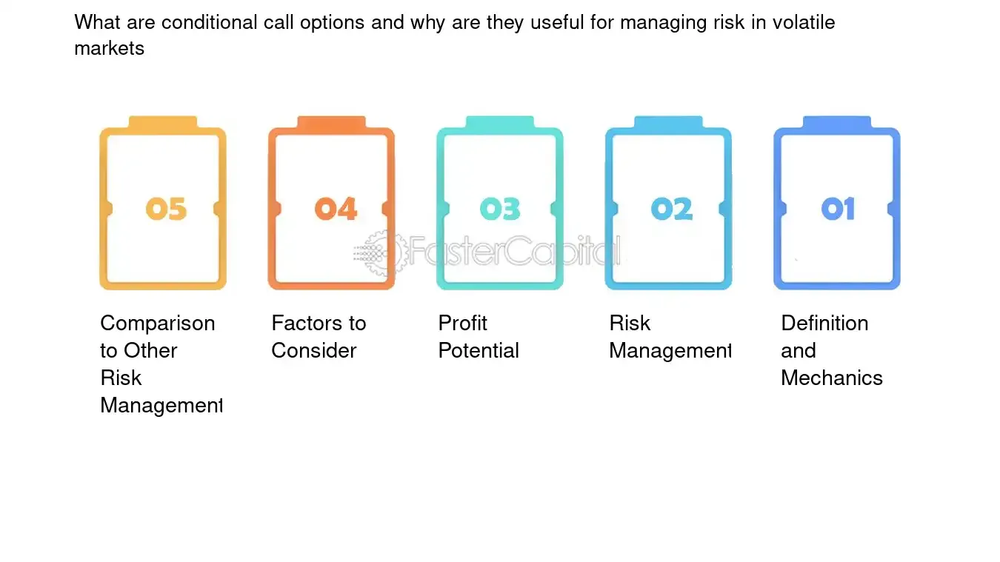

## Table of Contents

## What is a conditional call option?

A conditional call option is a type of financial agreement where the buyer gets the right, but not the obligation, to buy an asset at a set price, but only if certain conditions are met. These conditions can be things like the stock price reaching a certain level or an event happening. It's like a regular call option, but with an extra rule that must be satisfied before it can be used.

This kind of option can be useful for investors who want to make a bet on an asset but only if specific things happen first. For example, someone might buy a conditional call option on a company's stock that activates only if the company wins a big contract. This way, the investor can potentially profit from the stock's rise without having to buy it right away, and only if the condition is met.

## How does a conditional call option differ from a standard call option?

A conditional call option and a standard call option both give the buyer the right to buy an asset at a set price, but they work a bit differently. With a standard call option, you can buy the asset anytime before the option expires, as long as you pay the set price. It's like having a ticket that lets you buy something whenever you want, as long as you use it before it expires.

A conditional call option adds an extra rule. You can only use it to buy the asset if a specific condition happens. For example, the option might only work if the stock price hits a certain number or if a company announces good news. So, it's like a ticket that you can only use if something special happens first. This makes it more specific and can be useful if you want to bet on something happening before you buy.

## What are the common conditions attached to a conditional call option?

Common conditions attached to a conditional call option usually involve specific events or price levels that need to happen before the option can be used. For example, a condition might be that a stock price must reach or go above a certain level, like $50 per share. Another common condition could be a company announcing a big event, like winning a major contract or getting approval for a new product. These conditions make the option more focused and can help investors make bets on specific outcomes.

Sometimes, the conditions can be based on broader market events, like an index hitting a certain point or an economic report coming out with certain numbers. For instance, an option might only activate if the S&P 500 goes above 4,000 points. These types of conditions can be useful for investors who want to take advantage of big market moves or economic trends. Overall, the conditions attached to a conditional call option help tailor the investment to specific situations, making it a strategic tool for certain kinds of investors.

## Can you explain the mechanics of exercising a conditional call option?

Exercising a conditional call option means using it to buy the asset it's tied to, but only if the special rule or condition is met. Let's say you have a conditional call option on a company's stock, and the condition is that the stock price must hit $100. If the stock price actually reaches $100, then you can use your option to buy the stock at the price set in the option, like $90. But if the stock never gets to $100, your option won't work, and you can't use it to buy the stock.

When the condition is met, you can exercise the option by telling your broker you want to use it. You'll pay the set price from the option to buy the stock. It's like having a key that only works if a door is open. If the door (the condition) opens, you can use the key (the option) to go through and buy the stock. If the door stays closed, the key doesn't work, and you can't buy the stock with the option.

## What are the potential benefits of using a conditional call option for investors?

Conditional call options can be really helpful for investors who want to be more specific about when they buy something. They let you make a bet on a stock or an asset, but only if something special happens first. This can be good if you think a company's stock will go up because of good news, like winning a big contract. If the news happens, you can buy the stock at a lower price than it's trading at now. But if the news doesn't happen, you don't have to buy the stock, so you don't lose money on a bad bet.

These options can also help you manage risk better. Because you only have to buy if the condition is met, you can avoid buying at the wrong time. For example, if you think a stock will go up after a report comes out, you can set the condition to be that the report has to show good numbers. If the report is bad, you don't have to buy, and you save your money. This way, conditional call options give you a chance to make money if things go your way, but they also protect you if they don't.

## What risks should investors be aware of when dealing with conditional call options?

When using conditional call options, investors need to be careful about a few risks. One big risk is that the condition might never happen. If the stock doesn't reach the price you set or the event you're waiting for doesn't occur, your option won't be worth anything. You'll lose the money you paid for the option, and you won't get to buy the stock at the lower price you wanted.

Another risk is that even if the condition is met, the stock might not go up as much as you hoped. If the stock only goes up a little bit after the condition happens, you might not make as much money as you expected. Plus, there's always the chance that something unexpected happens in the market, which can affect the stock price and make your option less valuable. So, it's important to think about these risks before deciding to use a conditional call option.

## How do conditional call options affect the pricing of the underlying asset?

Conditional call options can affect the price of the underlying asset in a few ways. When investors buy these options, they're betting on the asset reaching a certain price or event happening. This can create more demand for the asset, pushing its price up a bit. For example, if many people buy conditional call options on a stock because they think it will go up if the company wins a big contract, that demand can make the stock's price go up even before the contract is won.

On the other hand, if the condition for the option doesn't happen, it can make the asset's price go down. When the condition isn't met, the options become worthless, and investors might sell the asset they were hoping to buy with the option. This can increase the supply of the asset in the market, which can lower its price. So, conditional call options can add a bit of extra movement to the asset's price, depending on whether the condition is met or not.

## What are some real-world examples of conditional call options in financial markets?

A real-world example of a conditional call option could be an investor buying an option on a pharmaceutical company's stock. The condition might be that the option can only be exercised if the company gets approval for a new drug from the FDA. If the drug gets approved, the stock price usually goes up, so the investor can buy the stock at a lower price set in the option and then sell it for a profit. But if the drug doesn't get approved, the option won't work, and the investor won't have to buy the stock.

Another example is in the energy sector, where an investor might buy a conditional call option on an oil company's stock. The condition could be that the option is only valid if oil prices go above a certain level, like $80 per barrel. If oil prices do go up, the investor can use the option to buy the stock at a lower price and then sell it when the stock price goes up with the oil prices. If oil prices stay below $80, the option won't be usable, and the investor won't have to buy the stock.

## How do regulatory frameworks impact the use of conditional call options?

Regulatory frameworks can make a big difference in how conditional call options are used. Different countries have different rules about what kinds of options can be traded and who can trade them. For example, some places might say that only certain investors, like big institutions, can use these options. This means that smaller investors might not be able to use them at all. Also, the rules can affect how these options are made and sold, making sure they're clear and fair for everyone.

Regulators also keep an eye on how these options are used to make sure they don't cause problems in the market. They might set limits on how many options can be bought or sold to stop the market from getting too wild. If there are too many conditional call options on one stock, it could make the stock's price go up and down a lot, which could be bad for the market. So, the rules help keep things stable and protect investors from getting into risky situations.

## What advanced strategies can be employed using conditional call options?

One advanced strategy with conditional call options is called a "straddle." This is when an investor buys a conditional call option and a conditional put option on the same stock at the same time. The conditions for both options might be tied to a big event, like a company's earnings report. If the stock price goes up a lot after the event, the call option can be used to buy the stock at a lower price and then sell it for a profit. If the stock price goes down a lot, the put option can be used to sell the stock at a higher price than it's trading at now. This way, the investor can make money no matter which way the stock moves, as long as the move is big enough.

Another strategy is called "hedging." Investors might use conditional call options to protect other investments they have. For example, if you own a stock but you're worried about a big event that could make the stock price drop, you can buy a conditional put option with a condition tied to that event. If the event happens and the stock price goes down, you can use the put option to sell the stock at a higher price and limit your losses. This way, the conditional call option acts like insurance for your other investments, helping you manage risk better.

A third strategy is using conditional call options for "speculation." If you think a stock will go up because of a specific event, like a company winning a big contract, you can buy a conditional call option with that event as the condition. If the event happens, you can use the option to buy the stock at a lower price and then sell it for a profit. This lets you bet on the stock going up without having to buy it right away, which can be a smart way to take advantage of specific situations without spending too much money upfront.

## How can conditional call options be used in portfolio management and hedging?

Conditional call options can be a smart tool for managing a portfolio. They let investors make bets on certain things happening, like a stock going up if a company wins a big contract. If the condition happens, the investor can buy the stock at a lower price than it's trading at now and then sell it for a profit. This can help grow the portfolio without having to buy the stock right away. It's like having a ticket that only works if something special happens, which can be a good way to add to the portfolio without spending too much money upfront.

They're also useful for hedging, which is like getting insurance for other investments. If you own a stock but you're worried about something bad happening that could make the stock price drop, you can buy a conditional put option with a condition tied to that event. If the event happens and the stock price goes down, you can use the put option to sell the stock at a higher price than it's trading at now. This can help limit your losses and protect your portfolio from big drops. So, conditional call options can help you manage risk better and keep your investments safer.

## What are the latest trends and innovations in the use of conditional call options?

One of the latest trends in using conditional call options is the rise of digital platforms that make it easier for people to buy and sell them. These platforms use technology to help investors set up options with very specific conditions, like a stock hitting a certain price or a company announcing good news. This makes it easier for more people to use conditional call options, not just big investors. Also, these platforms often have tools that help investors understand how their options might do, which can make it less risky to use them.

Another innovation is how conditional call options are being used with other financial tools, like ETFs and cryptocurrencies. Investors are starting to use these options to bet on the prices of whole groups of stocks or digital currencies. For example, someone might buy a conditional call option on a tech [ETF](/wiki/etf-trading-strategies), with the condition that the ETF goes up if a new tech law gets passed. This can help investors make money from big trends in the market. Plus, with cryptocurrencies being so new and unpredictable, conditional call options can be a way to bet on them without buying them right away, which can be less risky.

## References & Further Reading

[1]: Black, F., & Scholes, M. (1973). ["The Pricing of Options and Corporate Liabilities,"](https://www.cs.princeton.edu/courses/archive/fall09/cos323/papers/black_scholes73.pdf) The Journal of Political Economy, 81(3), 637-654.

[2]: Hull, J. C. (2012). ["Options, Futures, and Other Derivatives."](https://www.semanticscholar.org/paper/Options%2C-Futures%2C-and-Other-Derivatives-Hull/89bdee500c8623864fc9eb7a471546aa713acc44) Prentice Hall.

[3]: Vozlyublennaia, N. (2014). ["Investor Attention, Index Performance, and Return Predictability,"](https://www.sciencedirect.com/science/article/pii/S0378426613004822) Journal of Banking & Finance, 41, 17-35.

[4]: Glasserman, P. (2003). ["Monte Carlo Methods in Financial Engineering."](https://link.springer.com/book/10.1007/978-0-387-21617-1) Springer.

[5]: Espinosa, R. A., & Yip, D. K. (2004). ["Is Algorithmic Trading Good for the Market?"](https://www.semanticscholar.org/paper/Fiscal-and-monetary-policy-interactions-in-an-model-Espinosa-Yip/7fcd5c316edffbc847b7ae0892624b1d94a16f52) Journal of Financial Transformation, 12, 56-63.