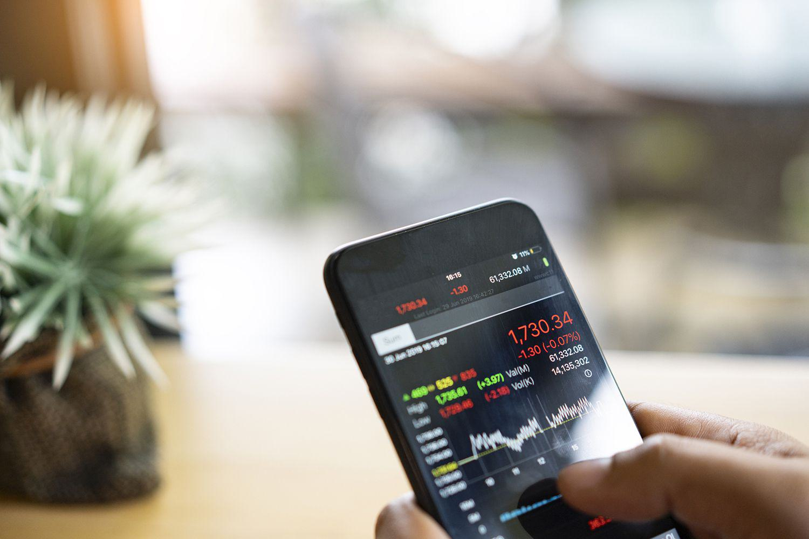

Financial derivatives are essential instruments in modern financial markets, providing a versatile array of tools for risk management, speculation, and income generation. Among these instruments, conditional call options stand out for their unique provisions within the bonds market. These options offer substantial benefits to bondholders by incorporating clauses that protect against early redemption risks, thereby maintaining investment security in volatile interest rate environments.

The integration of conditional call options with advanced trading strategies and algorithmic trading (algo trading) amplifies their effectiveness, allowing investors to navigate complex market conditions with enhanced precision. Algorithmic trading, through its automated systems and sophisticated algorithms, facilitates swift and accurate trading decisions, reducing human error and optimizing transaction execution. By employing these systems in the context of option trading, investors can exploit market inefficiencies and devise strategies that are robust to changes in market dynamics.



This article examines the multifaceted nature of financial derivatives, emphasizing the significance of conditional call options and their interplay with option trading and algorithmic strategies. By understanding these financial instruments and strategies, sophisticated investors can unlock new potential for optimized trading outcomes, achieving better risk-adjusted returns. The insights provided aim to equip investors with the knowledge to leverage these tools effectively, adapting to the evolving landscape of financial markets.

## Table of Contents

## Understanding Financial Derivatives

Derivatives are financial instruments that derive their value from an underlying asset, which can include stocks, bonds, commodities, currencies, interest rates, or market indexes. These sophisticated contracts play a versatile role in financial markets, fulfilling a range of purposes such as hedging, speculation, and price discovery.

Common derivatives include futures, options, and swaps. Futures contracts obligate the buyer to purchase, or the seller to sell, an asset at a predetermined future date and price. Options, on the other hand, provide the holder the right, but not the obligation, to buy or sell an underlying asset at a specified strike price before the contract expires. Swaps are agreements between two parties to exchange sequences of cash flows for a set period, often used to hedge against fluctuations in interest rates or commodity prices.

Derivatives enable investors to hedge against adverse price movements in an asset, effectively acting as insurance. For instance, a farmer might use futures contracts to lock in the sale price of their crops, protecting against the risk of a price drop. They also serve as a vehicle for leveraging, allowing investors to control large positions with a fraction of the necessary capital investment. This characteristic can amplify both potential gains and potential losses, necessitating careful management.

Price discovery is another vital function, as derivatives markets reflect and forecast future price expectations. They also provide access to otherwise unavailable assets or markets, which can be particularly useful for global investors seeking to diversify portfolios across borders.

The inherent high leverage associated with derivatives makes them potent financial instruments. For example, through options, an investor can control a significant amount of the underlying asset with a relatively small premium. This leverage can increase both the potential for profit and the risk of loss, requiring prudent analysis and risk management strategies.

To mitigate risks due to leverage and market [volatility](/wiki/volatility-trading-strategies), investors rely on thorough analysis. Mathematical models, such as the Black-Scholes model for option pricing, and computational methods play critical roles in this process. These models help in understanding how different variables affect derivative pricing and enable traders to make informed decisions.

Risk management techniques, including stress testing and scenario analysis, are essential in exploring how different market conditions could impact a derivative portfolio. These tools are crucial for safeguarding against potential downsides and ensuring that the underlying assumptions remain valid under various market scenarios.

Overall, financial derivatives are integral to modern finance, offering both opportunities and challenges. A deep understanding of their mechanisms and careful risk management can unlock their potential while managing the associated risks effectively.

## Conditional Call Options: An Overview

A conditional call option is a specific provision attached to callable bonds designed to protect bondholders from the potential adverse effects of early call actions by bond issuers. This provision requires issuers to provide a replacement bond of comparable maturity and yield if they choose to call the original bond. The replacement bond is typically non-callable, ensuring bondholders a continued investment opportunity without the immediate threat of reinvestment risk.

Conditional call options are particularly advantageous for bonds classified as high-yield or junk bonds. These bonds generally have a higher probability of being called early due to prevailing [interest rate](/wiki/interest-rate-trading-strategies) fluctuations or improved credit ratings, which can lead to decreased yields over time. By including a conditional call option, bondholders are afforded a layer of protection, keeping their investments relatively secure despite adverse changes in market conditions.

Additionally, bondholders are safeguarded against potential losses that might arise if market conditions, like shifting interest rates, prompt issuers to call bonds sooner than anticipated. For instance, if interest rates decrease significantly, issuers are more likely to call bonds to refinance at lower rates, leaving bondholders to reinvest at lower yields. Conditional call options mitigate this risk by ensuring that bondholders can maintain an investment with terms similar to the original, thus providing stability and continuity.

These provisions are especially significant in volatile interest rate environments. They offer investors a measure of security against market unpredictability and other downside risks associated with bond investments. By assuring a continued investment in either the original or a comparable instrument, conditional call options effectively enhance the attractiveness of callable bonds to cautious investors looking to minimize exposure to fluctuating market conditions.

## Option Trading and Its Strategies

Options trading is a versatile approach in financial markets that offers participants the flexibility to manage risk and capitalize on market movements. Options are derivative instruments, providing the holder the right, though not the obligation, to either purchase (in the case of call options) or sell an asset (put options) at a specified price, known as the strike price, before a certain expiration date.

### Types of Options

1. **Call Options**: These provide the holder with the right to purchase the underlying asset at the strike price. Traders buy call options when they anticipate an upward movement in the asset price.

2. **Put Options**: These confer the right to sell the underlying asset at the strike price. Acquisition of put options typically suggests an expectation of the asset's depreciation.

### Trading Strategies

Options traders utilize a variety of strategies to mitigate risk and enhance potential returns:

- **Straddles**: This strategy involves buying both a call and a put option at the same strike price and expiration date, enabling traders to profit from significant price movement in either direction.

- **Strangles**: Similar to straddles, strangles involve purchasing a call and a put but at different strike prices, generally with the same expiration date, aiming to benefit from volatility.

- **Spreads**: This technique includes buying and selling options of the same class (calls or puts) on the same underlying asset with different strike prices or expiration dates. Spreads, such as bull spreads and bear spreads, are designed to limit potential losses while capping gains.

- **Collars**: This strategy is employed to limit the range of potential returns. A collar involves holding the underlying asset, buying a protective put, and selling a call option, effectively capping both potential gains and losses.

### Factors Influencing Options Trading

Options trading demands a thorough comprehension of several crucial factors:

- **Implied Volatility (IV)**: This is a measure of the market's forecast of a likely movement in an asset's price. Higher implied volatility suggests greater expected fluctuations, impacting the premium of options.

- **Time Decay**: Options are time-sensitive instruments, and their value diminishes as they approach expiration. This decay accelerates as the expiration date nears, a concept quantified as theta in options Greeks.

- **Underlying Asset's Price Movements**: The price of the underlying asset significantly affects options value. Delta measures this sensitivity, indicating how much the option's price is expected to move for a $1 change in the asset's price.

### Risk Management

Effective options trading necessitates sophisticated risk management to safeguard against substantial market shifts. Traders must monitor the Greeks (Delta, Gamma, Theta, Vega, and Rho) to understand risk exposure and adjust strategies accordingly. Dynamic hedging techniques can be utilized to manage risk, while position sizing and stop-loss orders serve as additional risk mitigation tools.

By employing these strategies and management techniques, traders can navigate the complexities of options markets and strive to achieve their financial objectives.

## Algorithmic Trading: The Edge in Modern Markets

Algorithmic trading, often referred to as algo trading, employs automated systems that execute trades based on preprogrammed criteria, offering significant advantages in terms of speed and precision while minimizing human error. This method leverages sophisticated mathematical models and computational algorithms to analyze extensive datasets rapidly. By doing so, traders can devise and implement intricate trading strategies that respond swiftly and dynamically to market conditions, thereby enhancing both performance and risk management.

In the domain of options trading, where complexities abound due to the need to manage multiple variables—and often, multiple option legs—algo trading proves exceptionally beneficial. The capacity to automate the execution of complex multi-leg strategies, such as iron condors and butterfly spreads, allows traders to react to market fluctuations instantaneously, which is critical for exploiting opportunities in volatile markets.

A vital component of [algorithmic trading](/wiki/algorithmic-trading) is [backtesting](/wiki/backtesting). Through this process, traders test their algorithms against historical market data to ascertain their effectiveness and profitability under a variety of market scenarios. This retrospection is crucial for refining trading strategies, ensuring they are well-suited to current and future market environments.

The principal advantages of algorithmic trading include speed, efficiency, and the ability to seize short-lived market opportunities. Automated systems can execute orders in milliseconds, significantly faster than manual trading. This speed is not just about executing trades quickly; it's also about analyzing and reacting to real-time market data in a way that capitalizes on transient pricing anomalies or [arbitrage](/wiki/arbitrage) opportunities.

For those interested in developing their own trading algorithms, Python has emerged as a popular language due to its robust libraries and frameworks such as NumPy, pandas, and scikit-learn, which facilitate data analysis, modeling, and implementation. Here is a simple example of a backtesting loop in Python, which checks a basic moving average crossover strategy:

```python
import pandas as pd

# Load historical data into a DataFrame
data = pd.read_csv('historical_data.csv')

# Calculate moving averages
data['Short_MA'] = data['Close'].rolling(window=10).mean()
data['Long_MA'] = data['Close'].rolling(window=50).mean()

# Define buy and sell signals
data['Signal'] = 0
data.loc[data['Short_MA'] > data['Long_MA'], 'Signal'] = 1  # Buy signal
data.loc[data['Short_MA'] < data['Long_MA'], 'Signal'] = -1 # Sell signal

# Backtest
data['Position'] = data['Signal'].shift()
data['Returns'] = data['Close'].pct_change()
data['Strategy_Returns'] = data['Returns'] * data['Position']

# Calculate cumulative returns
cumulative_return = (data['Strategy_Returns'] + 1).cumprod()

print(f"Cumulative Return: {cumulative_return[-1]}")
```

The ability to develop and implement such strategies underscores the transformative impact of algorithmic trading on modern financial markets. By effectively integrating data analysis with agile execution capabilities, algorithmic trading equips investors with powerful tools to navigate and optimize within today's fast-paced trading environments.

## Integrating Derivatives, Options, and Algo Trading

The integration of financial derivatives, options, and algorithmic trading represents a transformative approach to achieving precision and optimized outcomes in trading. By combining these elements, investors can harness advanced strategies and technological efficiencies that reduce human error and enhance decision-making processes.

Automated systems are particularly adept at managing complex option strategies, such as condors, butterflies, and spreads. These strategies involve multiple leg trades that require precise timing and execution to capitalize on market opportunities. Automation ensures that these complex strategies are executed seamlessly, without the delays or errors that can occur with manual trading interventions.

Conditional call options, a specific type of financial derivative, offer bondholders fixed yield protection by mitigating reinvestment risks associated with early bond redemption. When integrated into automated trading systems, these options can further optimize yields. By automating the exercise of conditional call options, traders can ensure that yield protection features are leveraged at optimal times, thus preserving the intended financial outcomes despite market volatility.

Combining derivatives, options, and algorithmic trading also enhances risk management and allows for dynamic hedging. Automated trading systems can rapidly adjust to leverage changes in market conditions, enabling prompt capture of arbitrage opportunities that are often short-lived. This ability to respond in real-time is crucial in volatile markets, providing traders with a strategic advantage.

Moreover, the intersection of these financial tools grants investors greater confidence and strategic flexibility when navigating complex market scenarios. By integrating conditional call options with sophisticated option strategies and algorithmic trading, investors can deploy a comprehensive suite of tools designed to maximize returns while managing risks effectively. This holistic approach to trading not only enhances profitability but also ensures resilience in diverse and ever-changing market environments.

## Challenges and Risks

Integration of derivatives, options, and algorithmic trading provides a cutting-edge approach to financial markets but is accompanied by significant challenges and risks. One primary concern is the possibility of system malfunctions and erroneous outputs from trading algorithms. Automated systems depend heavily on technology for their efficiency and speed, making them vulnerable to software bugs, hardware failures, and connectivity issues. Such technical faults can lead to substantial financial losses, especially in high-frequency or high-stakes trading environments.

Market shifts represent another potential risk, as they can render algorithmic assumptions invalid, resulting in financial setbacks if the algorithms aren't rigorously tested. For example, sudden economic events or geopolitical developments can cause market volatility that challenges the assumptions embedded in trading models. Algorithms that rely on historical data might fail to adapt to these market transformations. To mitigate this risk, robust models must be developed through extensive backtesting and ongoing refinement.

The regulatory environment governing derivative and algorithmic trading is critical for ensuring transparency and mitigating systemic risks. Regulatory frameworks continuously evolve, demanding that traders and financial institutions remain informed and compliant with the latest rules and regulations. Compliance not only safeguards investments but also minimizes legal liabilities. Regulatory bodies, such as the Securities and Exchange Commission (SEC) in the United States, provide guidelines and enforce standards to maintain market integrity.

Ongoing risk management requires traders to maintain updated systems capable of adapting to both regulatory changes and market dynamics. Continual updates and technological improvements are necessary to ensure that trading systems remain robust and reliable. As part of risk management, traders should conduct comprehensive backtesting and stress-testing on their systems. Backtesting uses historical data to simulate how a trading strategy might perform, while stress-testing evaluates how algorithms respond to extreme market conditions.

By acknowledging these risks and implementing rigorous management protocols, traders can better navigate the complexities of modern financial markets. However, a proactive approach to risk management and compliance is crucial for leveraging the full potential of derivatives and algorithmic trading strategies responsibly.

## Conclusion: The Future of Finance with Derivatives and Algo Trading

The future of finance is intricately linked to the advancements in derivatives and the rise of trading technologies like algorithmic trading. This interplay between complex financial instruments and sophisticated computing methods promises to reshape market opportunities and strategies.

As financial markets evolve, the union of intricate financial products with cutting-edge algorithms and data analytics is unlocking new avenues for investors. Complex derivatives, such as conditional call options, when synergized with algorithmic trading, offer unprecedented precision, speed, and adaptability in executing trades. This combination allows investors to respond more dynamically to market trends and volatility, enabling higher returns on investments through enhanced market insights and execution strategies.

Investors who embrace these technologies are well-positioned to capitalize on emerging opportunities. By leveraging algorithmic trading, they can benefit from improved decision-making processes and refined risk management strategies. This technological edge results in more accurate market predictions, optimized portfolio allocations, and increased trading efficiency. The ability to process large volumes of data in real-time and execute trades with minimal latency significantly enhances market position.

Continual learning and adaptation are essential as the financial and regulatory landscapes progress. As algorithmic models and financial products evolve, staying informed and responsive to changes is crucial. The rapid pace of technological innovations necessitates an ongoing commitment to education and adaptation, ensuring that strategies remain effective and compliant with regulatory standards.

Integrating traditional financial doctrines with modern trading technology provides a solid foundation for future financial endeavors. This integration not only supports traditional investment strategies but also introduces novel approaches that can harness the full potential of emerging technologies. Through this synergy, investors can achieve a balance between tried-and-tested financial principles and innovative technologies, paving the way for sustainable growth and success in the finance sector.

Overall, the convergence of derivatives and algorithmic trading represents a transformative phase in finance. As these elements continue to develop, they promise to not only enhance trading capabilities but also redefine the very fabric of financial markets, offering substantial opportunities for those ready to adapt and thrive in this new era.

## References & Further Reading

[1]: Black, F., & Scholes, M. (1973). ["The Pricing of Options and Corporate Liabilities,"](https://www.cs.princeton.edu/courses/archive/fall09/cos323/papers/black_scholes73.pdf) The Journal of Political Economy, 81(3), 637-654.

[2]: Hull, J. C. (2012). ["Options, Futures, and Other Derivatives."](https://www.semanticscholar.org/paper/Options%2C-Futures%2C-and-Other-Derivatives-Hull/89bdee500c8623864fc9eb7a471546aa713acc44) Prentice Hall.

[3]: Vozlyublennaia, N. (2014). ["Investor Attention, Index Performance, and Return Predictability,"](https://www.sciencedirect.com/science/article/pii/S0378426613004822) Journal of Banking & Finance, 41, 17-35.

[4]: Glasserman, P. (2003). ["Monte Carlo Methods in Financial Engineering."](https://link.springer.com/book/10.1007/978-0-387-21617-1) Springer.

[5]: Espinosa, R. A., & Yip, D. K. (2004). ["Is Algorithmic Trading Good for the Market?"](https://www.semanticscholar.org/paper/Fiscal-and-monetary-policy-interactions-in-an-model-Espinosa-Yip/7fcd5c316edffbc847b7ae0892624b1d94a16f52) Journal of Financial Transformation, 12, 56-63.