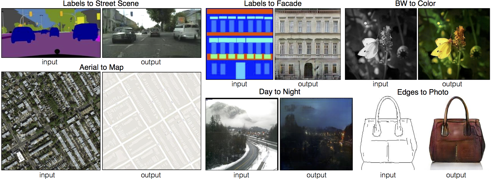

## Table of Contents

## What is conditional image-to-image translation in machine learning?

Conditional image-to-image translation in machine learning is a technique where one image is transformed into another image based on certain conditions or labels. Imagine you have a picture of a summer scene, and you want to change it to look like winter. The condition here is "winter," and the machine learning model uses this condition to guide the transformation, ensuring that the output image reflects a winter scene. This method is useful in various applications, such as turning sketches into realistic images, converting black-and-white photos to color, or even changing the style of an image while keeping its content.

The process involves training a model on pairs of images, where one image is the input and the other is the desired output, along with the condition that specifies how the transformation should be done. For example, if the condition is "day to night," the model learns to take a daytime image and convert it into a nighttime version. The key to success in conditional image-to-image translation is having a robust dataset that covers various scenarios and conditions, allowing the model to generalize well to new, unseen images. This technique has become increasingly popular due to its versatility and the impressive results it can achieve in altering images according to specific user-defined criteria.

## How does Pix2Pix work as a conditional image-to-image translation model?

Pix2Pix is a type of machine learning model that helps turn one image into another based on specific conditions. It uses something called a Generative Adversarial Network (GAN), which has two parts: a generator and a discriminator. The generator tries to create new images that look real, while the discriminator checks if the images are real or fake. They work together to get better at their jobs. In Pix2Pix, the generator takes an input image and a condition, like turning a sketch into a photo, and tries to create the output image. The discriminator then looks at the output to see if it matches the condition and looks realistic.

The way Pix2Pix learns is by looking at many pairs of images, where one image is the input and the other is the desired output. For example, if you want to turn sketches into photos, you show the model lots of sketches and their corresponding photos. The model keeps trying to make better photos from sketches, and the discriminator keeps getting better at telling real photos from fake ones. Over time, the generator gets really good at making photos that look just like the real ones, based on the conditions given. This makes Pix2Pix a powerful tool for tasks like turning black-and-white photos into color or changing the style of an image while keeping its content.

## What are the key components of a Pix2Pix model?

The Pix2Pix model is made up of two main parts: the generator and the discriminator. The generator takes an input image and a condition, like turning a sketch into a photo, and creates an output image. It tries to make the output image look as real as possible based on the condition. The discriminator looks at the output image and decides if it's real or fake. It compares the generated image to real images to see if it matches the condition and looks realistic. Both parts work together to improve over time, with the generator getting better at creating realistic images and the discriminator getting better at spotting fakes.

The training process of Pix2Pix involves showing the model many pairs of images. For example, if you want to turn sketches into photos, you show the model lots of sketches and their corresponding photos. The generator tries to make a photo from a sketch, and the discriminator checks if the photo looks real. They keep going back and forth, with the generator trying to fool the discriminator and the discriminator trying to get better at spotting the fakes. Over time, the generator gets really good at making photos that look just like the real ones, based on the conditions given. This makes Pix2Pix a powerful tool for tasks like turning black-and-white photos into color or changing the style of an image while keeping its content.

## Can you explain the concept of a Generative Adversarial Network (GAN) in the context of image translation?

A Generative Adversarial Network, or GAN, is a type of [machine learning](/wiki/machine-learning) model that helps create new images. It works by using two parts: a generator and a discriminator. The generator tries to make new images that look real, while the discriminator checks if the images are real or fake. They work together like a game, where the generator tries to fool the discriminator by making better and better images, and the discriminator tries to get better at spotting the fakes. In the context of image translation, the generator takes an input image and changes it into another image based on certain conditions. For example, it might turn a sketch into a photo or change a daytime scene into a nighttime one.

In image translation, the GAN's generator uses the input image and the condition to create the output image. The condition tells the generator what kind of change to make, like turning a black-and-white photo into a color one. The discriminator then looks at the output image and decides if it looks real and matches the condition. If the discriminator thinks the image is fake, it sends feedback to the generator, which then tries to improve its next attempt. Over time, the generator gets really good at making images that look just like the real ones, based on the conditions given. This makes GANs a powerful tool for tasks like turning sketches into photos or changing the style of an image while keeping its content.

## How does OASIS differ from Pix2Pix in terms of architecture and performance?

OASIS and Pix2Pix are both used for turning one image into another, but they work a bit differently. OASIS uses a special kind of GAN called a StyleGAN, which is good at making images that look very realistic. Instead of just trying to make the output image match the input image like Pix2Pix, OASIS focuses on making the output image look like it could be a real photo, even if it's different from the input. This means OASIS can create more varied and detailed images. OASIS also uses a thing called a semantic layout, which helps guide the generator to make sure the output image matches the condition better.

In terms of performance, OASIS can create images that look more realistic and diverse than Pix2Pix. While Pix2Pix is good at making images that closely match the input, OASIS can produce images that look more like real photos, even if they don't match the input as closely. This makes OASIS better for tasks where you want the output to look very realistic and varied. However, OASIS might need more time to train because it's more complex, and it might not be as good at keeping the exact details of the input image as Pix2Pix. So, the choice between OASIS and Pix2Pix depends on what you need the images for.

## What role does the discriminator play in models like Pix2Pix and OASIS?

In models like Pix2Pix and OASIS, the discriminator plays a crucial role in making sure the generated images look real and match the given conditions. It acts like a judge, looking at the output images and deciding if they are real or fake. If the discriminator thinks an image is fake, it gives feedback to the generator, which then tries to improve its next attempt. This back-and-forth helps the generator get better at creating realistic images that meet the conditions.

The discriminator's job is especially important in OASIS, where the goal is to create very realistic and varied images. In OASIS, the discriminator not only checks if the image looks real but also makes sure it matches the semantic layout given as a condition. This helps OASIS produce images that are not just realistic but also fit well with the intended style or scene. In both Pix2Pix and OASIS, the discriminator's role is key to improving the quality and accuracy of the generated images over time.

## How is LipGAN used for conditional image-to-image translation, specifically for lip synchronization?

LipGAN is a special kind of machine learning model that helps match a person's lip movements in a video to what they are saying. It uses a type of GAN, which means it has a generator and a discriminator working together. The generator takes a video of someone talking and the audio of what they should be saying, and it tries to change the lip movements to match the new audio. The discriminator checks if the new lip movements look real and if they match the audio well. By working together, the generator gets better at making the lip movements look right, and the discriminator gets better at spotting when they don't match.

LipGAN is really useful for things like dubbing movies or videos into different languages. When you dub a video, you want the lip movements to match the new language, so it looks like the person is really speaking that language. LipGAN helps make this process easier and more realistic. It can take a video in one language, change the audio to another language, and then adjust the lip movements to fit the new words. This makes the dubbed video look more natural and believable.

## What are the training challenges associated with models like Pix2Pix and how can they be addressed?

Training models like Pix2Pix can be tricky because they need a lot of good data to learn from. If the data isn't varied enough, the model might not work well on new images it hasn't seen before. Also, training these models takes a lot of time and computer power, which can be a problem if you don't have strong computers. Another challenge is making sure the model doesn't just copy the input image but actually changes it in the right way. Sometimes, the model might focus too much on the small details of the input and not enough on the overall look of the output.

To address these challenges, you can start by making sure you have a big and diverse dataset. This means having lots of different examples so the model can learn from many scenarios. You can also use techniques like [data augmentation](/wiki/data-augmentation), which means changing the images a bit to make more examples. For example, you might flip or rotate the images to give the model more to learn from. To help the model focus on the right things, you can use special loss functions that guide it to pay attention to the overall look of the image, not just the small details. This can help the model create better and more realistic outputs.

## How do loss functions in conditional image-to-image translation models contribute to the quality of generated images?

Loss functions in conditional image-to-image translation models are like the rules that tell the model how well it's doing. They measure how close the generated image is to the real one and how well it matches the given condition. For example, if the model is supposed to turn a sketch into a photo, the loss function checks if the photo looks real and if it matches the sketch. By using different loss functions, we can guide the model to focus on different things, like making sure the colors are right or the shapes are correct. This helps the model create better images that look more like what we want.

One common loss function used in these models is called the adversarial loss. This loss comes from the discriminator part of the GAN, which tries to tell if the generated image is real or fake. The generator tries to fool the discriminator, and the adversarial loss helps the generator get better at making realistic images. Another important loss function is the reconstruction loss, which measures how well the generated image matches the input image or the given condition. By balancing these different loss functions, the model can produce high-quality images that not only look real but also accurately reflect the intended changes.

## What are some advanced techniques used to improve the realism and accuracy of image translations in models like OASIS?

OASIS uses a special type of GAN called StyleGAN, which helps make the generated images look very realistic. One advanced technique OASIS uses is called semantic layout guidance. This means the model uses a kind of map to guide it in creating the output image. The map tells the model what different parts of the image should look like, helping it make sure the output matches the condition better. This technique helps OASIS produce images that are not only realistic but also fit well with the intended scene or style.

Another technique used in OASIS is called adaptive instance normalization. This helps the model change the style of the image while keeping the content the same. It does this by adjusting the way the model processes the input image, making sure the output image looks like it belongs to the new style. By using these advanced techniques, OASIS can create images that are more varied and detailed than models like Pix2Pix, making the image translations more realistic and accurate.

## How can conditional image-to-image translation models be evaluated and what metrics are commonly used?

Conditional image-to-image translation models are evaluated by checking how well they turn one image into another based on the given conditions. People look at things like how realistic the new image looks and how well it matches the condition. For example, if the model is supposed to turn a sketch into a photo, they check if the photo looks real and if it follows the sketch closely. They also look at how consistent the model is when it translates different images. This means checking if the model does a good job every time, not just sometimes.

Common metrics used to evaluate these models include the Fréchet Inception Distance (FID), which measures how similar the generated images are to real images. A lower FID score means the images look more realistic. Another metric is the Structural Similarity Index (SSIM), which checks how similar the generated image is to the target image in terms of structure. The Peak Signal-to-Noise Ratio (PSNR) is also used to measure the quality of the generated image compared to the target image. These metrics help people understand how well the model is doing and where it might need to improve.

## What are the current limitations of models like LipGAN and potential areas for future research?

Models like LipGAN, which are used to make lip movements match new audio, still have some challenges. One big problem is that they can struggle with making the lip movements look completely natural. Sometimes, the movements might look a bit off or not match the audio perfectly. Another issue is that these models need a lot of data to learn from. If they don't have enough examples of different people talking, they might not work well for everyone. Also, training these models takes a lot of time and computer power, which can be hard to get.

Future research in this area could focus on making the lip movements look more natural and realistic. Researchers might try new ways to train the models so they can learn from less data or learn faster. They could also look into making the models work better for different people, no matter their age, gender, or accent. Another interesting area could be to combine LipGAN with other technologies, like real-time translation, to make it easier to dub videos into different languages on the fly. This could help make videos more accessible to people all over the world.