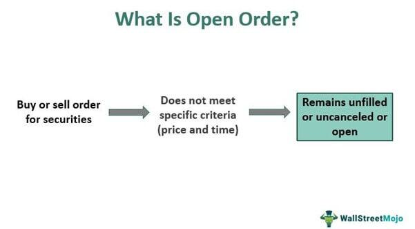

In financial markets, traders and investors are constantly seeking methods to enhance their trading efficiency and profitability. One such method that has gained popularity is the use of conditional order trading, which, when combined with algorithmic (algo) trading, offers a powerful toolset for executing trades. Conditional order trading allows the specification of criteria that must be met for trades to occur, such as price levels or time frames. When these criteria are integrated into algorithm-driven processes, trades can be executed with increased precision and speed, minimizing human error and emotional decision-making.

Algo trading, on the other hand, leverages computer algorithms to perform trades based on set strategies, processing vast amounts of data in real-time. The synergy between conditional order trading and algo trading creates a robust mechanism that not only automates the execution of trades but also tailors them according to specific market conditions. This integration can lead to significant improvements in trading outcomes, especially in fast-paced markets where responsiveness and efficiency are key.



This article explores the synergies between conditional order trading and algo trading, providing insights into how these strategies work and can be leveraged. We will break down the fundamentals, benefits, and potential pitfalls of these trading strategies. By understanding how conditional orders can be embedded within algorithms, traders can gain greater control over their investments, ensuring trades meet pre-defined benchmarks. This combinatorial approach allows for enhanced risk management, as trades are not only automated but also strategically initiated.

By the end of this article, readers will have a clearer understanding of how to integrate conditional order strategies with algo trading in their trading practices. This integration is not without its challenges, and a thorough comprehension of both the tools and the ever-changing landscape of the financial markets is vital for success. As we explore these innovative strategies, the potential to transform trading practices through the effective use of technology will become evident.

## Table of Contents

## Understanding Financial Markets

Financial markets are essential systems within the economy where individuals, companies, and governments engage in the buying and selling of financial instruments. These instruments, including stocks, bonds, derivatives, and commodities, represent claims on future cash flows or physical goods. The diversity and volume of transactions within financial markets support economic stability and growth by facilitating the efficient allocation of resources and effective risk management.

Stock markets, such as the New York Stock Exchange (NYSE) and the NASDAQ, are where equity shares of companies are traded. Investors gain partial ownership of companies and hope for returns through dividends or capital appreciation. Bond markets enable the issuance and trading of debt securities, where governments, municipalities, and corporations borrow money from investors with promises of periodic interest payments and the return of principal at maturity.

Commodities markets trade raw materials like oil, gold, and agricultural products. Futures and options contracts in these markets allow participants to hedge against price fluctuations, thereby managing risk. Efficient financial markets also include [forex](/wiki/forex-system) markets, where currencies are exchanged, facilitating international trade and investment.

The efficiency of financial markets is crucial for multiple reasons. They determine asset prices through the interaction of supply and demand, facilitating [liquidity](/wiki/liquidity-risk-premium) – the ease with which assets can be bought or sold without affecting their price. By doing so, they enable savers to lend financial resources to those who require capital for productive use, such as starting or expanding a business.

Economic stability and growth depend on how well these markets function. For instance, during times of financial crisis, market inefficiencies can lead to widespread economic disturbances. Ensuring smooth operation is thus pivotal, and regulators often play a key role in maintaining transparency, preventing fraud, and enforcing fair trading practices.

To optimize investment decisions, traders in financial markets utilize a myriad of strategies and tools. These include [fundamental analysis](/wiki/fundamental-analysis), assessing a company's financial health and market potential, and technical analysis, using statistical trends from trading activity. The recent integration of [artificial intelligence](/wiki/ai-artificial-intelligence) and [machine learning](/wiki/machine-learning) in financial trading offers even more sophisticated tools for analyzing market trends and making predictive decisions.

Understanding the structure and function of financial markets is essential for employing trading strategies effectively, such as conditional order trading and [algorithmic trading](/wiki/algorithmic-trading). With a firm grasp of market dynamics, traders can harness these advanced strategies to optimize trading efficiency and improve their overall financial outcomes.

## What is Conditional Order Trading?

Conditional order trading refers to a trading strategy where trades are only executed when specific predetermined criteria are met. This precision allows traders to navigate the complexities of financial markets by tailoring trade execution based on market conditions. The primary function of these orders is to manage risk and streamline trade execution, ensuring trades occur under optimal conditions.

These conditions could be related to specific price levels, market events, or other timing criteria. For instance, a trader might want to purchase a stock only when its price drops to a certain value or sell if it experiences a specific price increase. By automating these decisions, traders can limit emotional responses and reduce the likelihood of missed opportunities due to delayed reactions.

Common types of conditional orders include:

1. **Stop-Loss Orders**: These are designed to limit an investor's loss on a security position. For example, if a stock is purchased at $50, a stop-loss order might be placed at $45. If the stock falls to $45, the stop-loss order triggers a market sell order, limiting the loss to approximately $5 per share. 

2. **Take-Profit Orders**: These orders allow traders to lock in profits when a security reaches a certain price. For instance, if a stock is bought at $50, and the desired profit takes the price to $60, a take-profit order at $60 would automatically sell the stock when this price level is reached, securing the profit.

3. **Trailing Stops**: A more dynamic form of stop order, trailing stops adjust as the price of the security moves in the trader's favor. If a stock is bought at $50 with a trailing stop set $5 below its highest market price, as the stock price increases, the stop price rises accordingly. If the stock reaches $60, the stop order will adjust to $55, protecting a $5 profit if the stock price begins to fall.

These strategies are particularly useful in volatile markets where price changes can be rapid and significant. By setting conditional orders, traders leverage market conditions efficiently, ensuring they capitalize on advantageous movements while protecting against unfavorable ones. Enhanced risk management is achieved by automating these processes, facilitating trades only when pre-defined strategic conditions are satisfied. This automation helps mitigate the effects of emotional or impulsive decision-making that often plagues manual trading attempts.

 to Algorithmic Trading

Algorithmic trading, often referred to as algo trading, is a method of trading financial securities through the implementation of computer algorithms that execute trades based on predetermined criteria. This technology-driven approach to trading markedly reduces the necessity for human intervention, enabling substantial enhancements in the speed, accuracy, and consistency of trade executions.

One of the significant advantages of algorithmic trading is its ability to process and analyze vast datasets swiftly, executing complex trading strategies with efficiency levels that surpass those achievable by human traders. Algorithms can be designed to continuously scan market data, identify trading opportunities, and execute trades at optimal prices, all within microseconds. This ability to respond quickly to market changes makes algo trading an attractive option for traders looking to exploit short-term price movements or [arbitrage](/wiki/arbitrage) opportunities.

The versatility of algorithmic trading spans across various financial sectors, including equities, commodities, and foreign exchange. In equities, for instance, traders might use algorithms for strategies such as [statistical arbitrage](/wiki/statistical-arbitrage), [market making](/wiki/market-making), or [trend following](/wiki/trend-following). In commodities markets, algorithmic trading can capitalize on fluctuations in supply and demand dynamics, while in foreign exchange, it can take advantage of differences in currency pair pricing across different exchanges.

For investment firms and traders, algo trading serves as a tool to capture short-term market inefficiencies—defined as deviations from the expected price path that can be exploited for profit. These inefficiencies might arise from temporary mispricing, market overreactions, or discrepancies across trading venues. By employing sophisticated algorithms, traders can design and backtest strategies that target these inefficiencies with high precision and minimal delay.

The role of machine learning and artificial intelligence is becoming increasingly prominent in the evolution of algorithmic trading. These technologies facilitate the development of more adaptive algorithms that can learn from historical data and refine their strategies dynamically as market conditions change. The ability to incorporate machine learning models like neural networks or decision trees into trading algorithms provides an additional layer of sophistication and predictive capability.

In summary, algorithmic trading represents a significant advancement in the way trades are executed, offering substantial improvements over manual trading methods. By leveraging the computational power of algorithms, traders can achieve superior performance, reduce transaction costs, and manage risk more effectively. This method continues to grow in adoption and complexity, driven by ongoing technological innovations and the relentless pursuit of competitive advantage in the financial markets.

## Combining Conditional Orders with Algo Trading

By combining conditional orders with algorithmic trading, traders can significantly enhance their execution strategies, achieving more precise and efficient results. The integration of these two techniques allows for a highly automated trading process wherein conditional orders can be programmed into algorithms, enabling automatic responses to specific market conditions such as price movements, trading volumes, or market news.

Incorporating conditional orders within algorithmic trading involves embedding predetermined conditions directly into trading algorithms. This configuration ensures that trades are executed only when set criteria, such as reaching a certain price level or timing, are met. By doing so, traders take full advantage of the real-time data processing capabilities inherent in algorithms, while ensuring meticulous control over the initiation and execution of trades. This dual approach capitalizes on the strengths of automation and precision, allowing for more strategic market involvement.

Automating the application of conditional orders through algorithms also contributes to enhanced risk management. Trades can be executed based on clearly defined criteria, reducing the influence of human error and emotion, which are often present in manual trading. For instance, by setting stop-loss orders within an algorithm, traders can automatically limit potential losses without manually monitoring market conditions.

Moreover, advanced traders can optimize the parameters of conditional orders dynamically. Algorithms can be programmed to adjust these parameters in real-time, adapting to the swiftly changing market conditions. This flexibility allows traders to stay current with market trends and [volatility](/wiki/volatility-trading-strategies), further improving the effectiveness of their trading strategies. For example, a trading algorithm could adjust the threshold for a stop-loss order based on the volatility observed in the market, using statistical measures like the standard deviation, which can be calculated dynamically:

```python
import numpy as np

# Example function to calculate dynamic stop-loss based on market volatility
def calculate_stop_loss(current_price, historical_prices):
    volatility = np.std(historical_prices)
    stop_loss = current_price - 2 * volatility
    return stop_loss

# Example usage
historical_prices = [100, 101, 102, 103, 104]
current_price = 105
dynamic_stop_loss = calculate_stop_loss(current_price, historical_prices)
print("Dynamic Stop-Loss Level:", dynamic_stop_loss)
```

This integration of conditional orders and algorithmic trading not only enhances precision and efficiency but also empowers traders to maintain a competitive edge in fast-paced markets. As both market conditions and technologies evolve, this combination is poised to offer even more sophistication and adaptability in executing successful trading strategies.

## Benefits of Using Conditional Order and Algo Trading

Using conditional order trading alongside algorithmic trading significantly enhances the precision and flexibility of trade execution. The automation inherent in algo trading mitigates the influence of human error and emotional biases, leading to more disciplined trading decisions. 

One of the critical advantages of this integration is the ability to backtest trading strategies. Backtesting involves running the trading algorithm on historical data to assess its potential effectiveness. This process helps traders refine their strategies to improve performance before they are applied in live markets. For example, a trader might evaluate a moving average crossover strategy using historical stock data to test its robustness.

Furthermore, the integration of conditional orders with algorithmic trading often results in cost savings. This is primarily achieved through improved execution prices and reduced latency. By executing trades at optimal times and prices, traders can potentially lower transaction costs and optimize returns. Algorithms can swiftly adapt to market conditions, ensuring that orders are executed when market conditions align precisely with the trader's predefined criteria. 

In addition to cost efficiency, this strategic combination enhances capital management and investment protection. By automating execution with precise conditions, traders can effectively manage their portfolios, ensuring that capital is deployed and withdrawn according to carefully calculated risk parameters. For instance, conditions can be set to automatically sell assets if a predefined loss threshold is exceeded, safeguarding against significant losses in volatile markets. 

Overall, the combination of conditional orders and algorithmic trading creates a robust framework that empowers traders to operate with heightened accuracy, strategic foresight, and risk management capability.

## Challenges and Risks

Despite the numerous advantages of combining conditional orders with algorithmic trading, there are significant challenges and risks associated with their implementation. One of the primary concerns is technical failures, which can arise due to software bugs, server outages, or connectivity issues. Such failures can lead to disrupted trading activities and substantial financial losses. To mitigate these risks, it is essential for traders to have robust infrastructure and reliable backup systems in place.

Another challenge is the rapidly changing market conditions. Algorithms and pre-set conditions that perform well under certain market scenarios may become ineffective or even counterproductive if the market dynamics shift. This is particularly relevant in highly volatile markets where prices can move unpredictably. It's crucial for traders to implement adaptive strategies that can respond to real-time market changes.

Overfitting is another significant risk in algorithmic trading. This occurs when algorithms are excessively tailored to historical data, capturing noise rather than the underlying market patterns. While these overfitted algorithms may show impressive backtest results, they often fail in live trading environments. To combat overfitting, traders should focus on creating robust models that generalize well and avoid excessive complexity.

Maintaining the effectiveness of conditional orders and trading algorithms requires continuous monitoring and adjustment. Regular analysis helps identify potential issues and opportunities for optimization. Traders must stay informed on market developments and technological advancements to ensure that their strategies remain relevant and effective. In summary, while conditional order and algorithmic trading offer considerable benefits, they demand careful management to navigate the potential technical, market, and modeling risks.

## Conclusion

Conditional order trading and algorithmic trading represent sophisticated strategies that can significantly enhance trading outcomes. These strategies combine automation and precision, offering traders the ability to respond swiftly and effectively to market conditions. However, to harness their full potential, careful planning, testing, and risk management are imperative. Automated trading operations must be meticulously tested and reviewed to ensure reliability and efficiency, and continuous monitoring is essential to adapt to ever-changing market conditions.

The integration of conditional orders within algorithmic trading frameworks allows traders to exploit market opportunities with increased agility. For instance, embedding conditional rules into trading algorithms enables the automatic execution of trades based on predefined criteria, such as price thresholds or market events. This level of automation permits traders to operate with a high level of precision, optimizing trade execution while minimizing emotional bias and human error.

Despite these advantages, traders must remain vigilant and continually educate themselves to maintain a competitive edge. The financial markets are in a constant state of flux, and remaining informed about the latest trends, tools, and technologies is vital. This ongoing education also involves revisiting and refining algorithms and strategies to align with the latest market data and conditions, preventing stagnation and ensuring continued relevance and effectiveness.

As technology advances, the potential for these strategies to evolve and provide competitive edges in trading will continue to grow. Emerging technologies such as artificial intelligence and machine learning offer further opportunities to enhance algorithmic trading strategies, enabling more sophisticated data analysis and decision-making capabilities. By leveraging these advancements, traders can refine their approaches, adapt to new challenges, and potentially achieve superior trading outcomes.

## References & Further Reading

[1]: Lee, C. M. C., & Swaminathan, B. (2000). ["Price Momentum and Trading Volume."](https://onlinelibrary.wiley.com/doi/abs/10.1111/0022-1082.00280) The Journal of Finance, 55(5), 2017-2069.

[2]: Hasbrouck, J. (2003). ["Intraday Price Formation in U.S. Equity Markets."](https://onlinelibrary.wiley.com/doi/10.1046/j.1540-6261.2003.00609.x) The Review of Financial Studies, 16(2), 525–569.

[3]: Pardo, R. (2008). ["The Evaluation and Optimization of Trading Strategies."](https://onlinelibrary.wiley.com/doi/book/10.1002/9781119196969) Wiley Trading Series.

[4]: Cartea, Á., Jaimungal, S., & Penalva, J. (2015). ["Algorithmic and High-Frequency Trading."](https://assets.cambridge.org/97811070/91146/frontmatter/9781107091146_frontmatter.pdf) Cambridge University Press.

[5]: Aldridge, I. (2013). ["High-Frequency Trading: A Practical Guide to Algorithmic Strategies and Trading Systems."](https://www.amazon.com/High-Frequency-Trading-Practical-Algorithmic-Strategies/dp/1118343506) Wiley Trading.