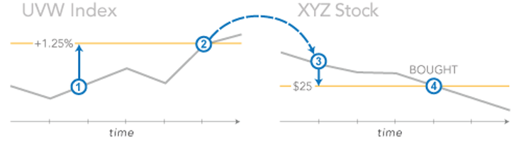

## Table of Contents

## What is a conditional order in financial markets?

A conditional order in financial markets is a type of order that only gets activated when certain conditions are met. For example, you might set a conditional order to buy a stock if its price drops to a specific level. This can help you automate your trading decisions based on your strategy without needing to watch the market all the time.

These orders are useful for investors who want to take advantage of market movements without constantly monitoring prices. For instance, if you think a stock is a good buy at $50 but it's currently trading at $60, you can set a conditional order to buy it automatically if it reaches $50. This way, you can set your trading rules in advance and let the market do the work for you.

## How does a conditional order differ from a standard order?

A conditional order is different from a standard order because it only works when certain things happen first. A standard order, like a market order or a limit order, goes through right away or as soon as possible. But a conditional order waits for something specific, like a stock price hitting a certain number, before it does anything.

For example, if you want to buy a stock but only if it goes down to $50, you can set a conditional order for that. Your order won't do anything until the stock actually reaches $50. On the other hand, if you use a standard limit order to buy at $50, it will try to buy as soon as the stock hits $50, without waiting for any other conditions. So, conditional orders give you more control over when your trades happen.

## What are the common types of conditional orders?

There are several common types of conditional orders that people use in the stock market. One type is called a stop order. This is when you tell your broker to buy or sell a stock once it reaches a certain price. For example, if you own a stock and want to sell it if the price drops to $40, you can set a stop order at $40. This helps protect your money if the stock price falls too much.

Another type is a stop-limit order. This is a bit more complicated because it combines a stop order with a limit order. When the stock hits your stop price, instead of buying or selling right away, it turns into a limit order. So, if you set a stop-limit order to sell at $40 with a limit of $39.50, your order will only go through if the stock price is between $40 and $39.50. This gives you more control but can be riskier if the stock price moves quickly past your limit.

A third type is a trailing stop order. This order follows the stock price as it goes up. You set a percentage or a dollar amount that the stock can fall before you want to sell. For example, if you set a 10% trailing stop on a stock that's at $100, your order will trigger if the stock drops to $90. But if the stock goes up to $110, your trailing stop moves up to $99. This way, you can lock in profits as the stock price rises.

## Can you explain how a stop-loss order works as a conditional order?

A stop-loss order is a type of conditional order that helps protect your money when you're investing in stocks. When you set a stop-loss order, you tell your broker to sell your stock if the price drops to a certain level. For example, if you bought a stock at $50 and you don't want to lose more than $5, you can set a stop-loss order at $45. This means that if the stock price falls to $45, your order will automatically sell the stock to stop your losses from getting bigger.

Using a stop-loss order is like setting a safety net for your investments. It's especially useful if you can't watch the stock market all the time. By setting a stop-loss order, you can go about your day knowing that if the stock price drops too much, your order will kick in and sell the stock before you lose too much money. It's a simple way to manage risk without having to constantly check on your investments.

## What is a take-profit order and how is it used?

A take-profit order is another type of conditional order that helps you make money from your investments. When you set a take-profit order, you tell your broker to sell your stock when it reaches a certain price that you think is good enough. For example, if you bought a stock at $50 and you think it's a good idea to sell it if it goes up to $60, you can set a take-profit order at $60. This way, if the stock price hits $60, your order will automatically sell the stock, and you'll lock in your profit without having to watch the market all the time.

Using a take-profit order is like setting a goal for your investment. It's helpful if you want to make sure you don't get too greedy and miss out on a good profit. By setting a take-profit order, you can enjoy the benefits of your investment without worrying about the stock price going down after it reaches your target. It's a simple way to manage your gains and make sure you sell at the right time.

## How do trailing stop orders function in trading?

Trailing stop orders are a special type of conditional order that helps you make money and protect your profits at the same time. When you set a trailing stop order, you tell your broker to sell your stock if it drops by a certain amount or percentage from its highest price. For example, if you bought a stock at $100 and set a 10% trailing stop, your order will sell the stock if it drops to $90. But here's the cool part: if the stock price goes up to $110, your trailing stop moves up too, to $99. This way, you can keep making money as the stock price rises, but you also have a safety net that moves with the price.

Using a trailing stop order is like having a smart friend who watches the stock market for you. It automatically adjusts to lock in your profits as the stock price goes up, but it also knows when to sell if the price starts to drop too much. This can be really helpful if you want to make the most of a rising stock without having to check the prices all the time. It's a simple way to manage your investments and make sure you don't miss out on profits while also protecting your money.

## What are the advantages of using conditional orders in trading?

Using conditional orders in trading has many advantages. They help you set up your trading plans ahead of time without needing to watch the market all day. For example, if you want to buy a stock but only if it drops to a certain price, you can set a conditional order and go about your day. This way, you can take advantage of market movements without having to be glued to your computer. It's like setting an alarm that only goes off when the stock hits your target price, making it easier to follow your trading strategy.

Another big advantage is that conditional orders help you manage risk and lock in profits. With a stop-loss order, you can set a limit on how much money you're willing to lose on a stock. If the price drops to your set level, the order will automatically sell the stock, protecting your investment. On the other hand, a take-profit order lets you set a goal for when to sell a stock to make a profit. And a trailing stop order can help you make the most of a rising stock by automatically adjusting to lock in gains as the price goes up. All these features help you stay in control of your investments and make smarter trading decisions.

## What are the potential risks or disadvantages of using conditional orders?

Using conditional orders in trading can sometimes lead to problems. One big risk is that the stock price might move really fast and go right past your conditional order. For example, if you set a stop-loss order at $40, but the stock suddenly drops from $50 to $30, your order might sell at $30 instead of $40. This means you could lose more money than you planned. Also, if the market is very busy and lots of people are trading, your order might not happen at the exact price you set, which can mess up your trading plan.

Another problem is that conditional orders can sometimes make you miss out on good opportunities. If you set a take-profit order at $60 and the stock keeps going up to $70, you'll sell at $60 and miss out on extra profits. Plus, if the stock price goes up and down a lot, your trailing stop order might sell too early and you could lose out on more gains. So, while conditional orders can help manage risk and lock in profits, they can also limit how much money you make if the market moves in ways you didn't expect.

## How can conditional orders be used to manage risk in a trading portfolio?

Conditional orders can help manage risk in a trading portfolio by setting automatic sell points that protect your investments. For example, if you set a stop-loss order, it tells your broker to sell a stock if its price drops to a certain level. This way, you can limit how much money you might lose on a single stock. If the stock price falls too much, the stop-loss order kicks in and sells the stock before your losses get too big. This is like having a safety net that catches you if the stock market takes a bad turn.

Another way conditional orders help manage risk is by locking in profits with take-profit orders. If you think a stock has reached a good price to sell, you can set a take-profit order at that price. This means the stock will be sold automatically when it hits your target, so you don't miss out on making money. It's like setting a goal for your investment and making sure you reach it without having to watch the market all the time. By using these orders, you can protect your portfolio from big losses and make sure you take home some profits.

Trailing stop orders also play a big role in managing risk. They move with the stock price, so if the stock goes up, your trailing stop moves up too. This means you can keep making money as the stock rises, but if it starts to fall, the order will sell the stock and protect your gains. It's a smart way to follow a rising stock without getting too greedy, helping you balance the risk and reward in your trading portfolio.

## What are some advanced strategies that utilize conditional orders?

One advanced strategy that uses conditional orders is called the "bracket order." This strategy is like putting a safety net around your trade. You start by buying a stock, and then you set up three conditional orders at the same time: a stop-loss order to limit your losses, a take-profit order to lock in your gains, and sometimes a trailing stop order to follow the stock price as it goes up. This way, you cover all your bases. If the stock price drops too much, the stop-loss order sells it to protect your money. If it goes up to your target, the take-profit order sells it to make a profit. And if it keeps going up, the trailing stop can sell it at the best possible price. It's like having a team of helpers watching your stock for you.

Another strategy is using conditional orders to trade in a volatile market. When stock prices move a lot, you can set up multiple stop orders at different price levels. For example, if you think a stock might go up or down quickly, you can set a stop-loss order at a low price to protect against big drops, and also set a take-profit order at a high price to catch any big jumps. You might even set several take-profit orders at different prices to take advantage of smaller moves. This way, you can make money from the ups and downs without having to watch the market all the time. It's like setting up a series of traps to catch the stock price no matter which way it goes.

## How do market conditions affect the effectiveness of conditional orders?

Market conditions can really change how well conditional orders work. When the market is calm and prices move slowly, conditional orders usually do what you want them to do. For example, if you set a stop-loss order at $40, the stock will probably sell right around that price. But when the market gets wild and prices jump around a lot, things can get tricky. If the stock price suddenly drops from $50 to $30, your stop-loss order might sell at $30 instead of $40. This means you could lose more money than you planned. So, in a busy market, conditional orders might not work as well as you hoped.

Also, different market conditions can affect how much money you make with conditional orders. In a market that's going up, a trailing stop order can help you make more money by following the stock price as it rises. But if the market starts to fall, the same trailing stop order might sell your stock too early, and you could miss out on a chance for the price to go back up. So, it's important to think about what the market is doing when you set up your conditional orders. They can be really helpful, but you need to know that the market can sometimes do things you don't expect.

## What technological tools are available to help traders set up and manage conditional orders?

There are many technological tools that traders can use to set up and manage conditional orders. One of the most common is trading platforms like E*TRADE, TD Ameritrade's thinkorswim, and [Interactive Brokers](/wiki/interactive-brokers-api)' Trader Workstation. These platforms let you easily set up different types of conditional orders, like stop-loss, take-profit, and trailing stop orders. They have user-friendly interfaces where you can input your conditions and see how they might work with charts and other tools. This makes it easier to keep an eye on your trades and make sure your orders are working the way you want them to.

Another helpful tool is trading apps on smartphones. Apps like Robinhood, Webull, and Charles Schwab's mobile app let you set up conditional orders right from your phone. This is great if you're always on the go and don't have time to sit at a computer. These apps often have simple menus and buttons that make it easy to set up your orders quickly. Plus, they usually send you notifications if your orders are triggered, so you can stay updated no matter where you are. Using these tools can help you manage your trades better and make sure your conditional orders are doing their job.

## References & Further Reading

[1]: Lee, C. M. C., & Swaminathan, B. (2000). ["Price Momentum and Trading Volume."](https://onlinelibrary.wiley.com/doi/abs/10.1111/0022-1082.00280) The Journal of Finance, 55(5), 2017-2069.

[2]: Hasbrouck, J. (2003). ["Intraday Price Formation in U.S. Equity Markets."](https://onlinelibrary.wiley.com/doi/10.1046/j.1540-6261.2003.00609.x) The Review of Financial Studies, 16(2), 525–569.

[3]: Pardo, R. (2008). ["The Evaluation and Optimization of Trading Strategies."](https://onlinelibrary.wiley.com/doi/book/10.1002/9781119196969) Wiley Trading Series.

[4]: Cartea, Á., Jaimungal, S., & Penalva, J. (2015). ["Algorithmic and High-Frequency Trading."](https://assets.cambridge.org/97811070/91146/frontmatter/9781107091146_frontmatter.pdf) Cambridge University Press.

[5]: Aldridge, I. (2013). ["High-Frequency Trading: A Practical Guide to Algorithmic Strategies and Trading Systems."](https://www.amazon.com/High-Frequency-Trading-Practical-Algorithmic-Strategies/dp/1118343506) Wiley Trading.