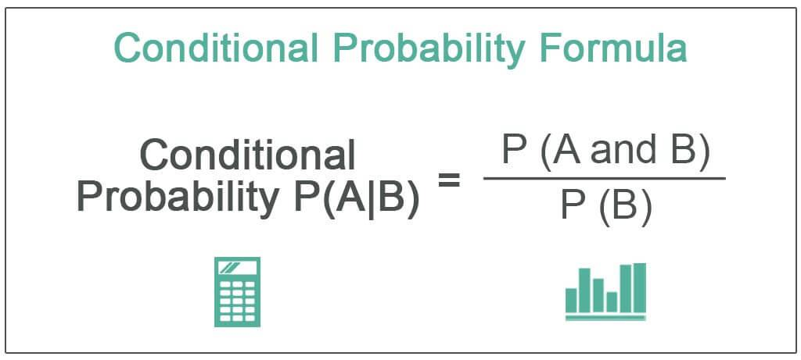

## Table of Contents

## What is conditional probability?

Conditional probability is a way to figure out the chance of something happening, but only if something else has already happened. Imagine you want to know the likelihood of it raining today, but you only care about this if the sky is cloudy. So, you look at the probability of rain given that the sky is already cloudy. This is different from just looking at the overall chance of rain, because now you're focusing only on days when it's cloudy.

To calculate conditional probability, you use a special formula. The formula is P(A given B) = P(A and B) / P(B). Here, P(A given B) means the probability of event A happening if event B has already happened. P(A and B) is the probability of both events A and B happening together, and P(B) is the probability of event B happening. This formula helps you narrow down the possibilities and get a more accurate prediction based on the information you already have.

## How is conditional probability different from regular probability?

Regular probability is about finding the chance of something happening. It's like asking, "What are the odds of rolling a six on a die?" You look at all possible outcomes and figure out the probability without considering anything else. For example, if you roll a fair six-sided die, the probability of rolling a six is 1 out of 6, or about 17%.

Conditional probability is different because it looks at the chance of something happening, but only if something else has already happened. It's like asking, "What are the odds of rolling a six on a die, but only if I rolled an even number first?" Now, you're only considering the outcomes where the first condition (rolling an even number) is met. So, if you rolled a 2 or a 4 first, the probability of then rolling a six becomes 1 out of 3, or about 33%, because you're only looking at the even numbers (2, 4, and 6). This way, conditional probability gives you a more specific prediction based on what you already know.

## What is the formula for conditional probability?

The formula for conditional probability is P(A given B) = P(A and B) / P(B). This formula helps you find out the chance of something happening (event A) when something else has already happened (event B). In the formula, P(A given B) is the probability of event A happening if event B has already happened. P(A and B) is the probability of both events A and B happening together, and P(B) is the probability of event B happening.

Let's use an example to make it easier to understand. Imagine you want to know the chance of it raining today, but only if the sky is already cloudy. So, you're looking for P(rain given cloudy). To find this, you need to know P(rain and cloudy), which is the chance of both rain and cloudy skies happening together, and P(cloudy), which is the chance of just cloudy skies. By dividing P(rain and cloudy) by P(cloudy), you get the conditional probability of rain given that the sky is cloudy.

## Can you provide a simple example of calculating conditional probability?

Let's say you have a bag with 10 marbles: 6 red and 4 blue. You want to know the chance of picking a red marble if you already know you picked a marble from the bag. This is called conditional probability. The event you're interested in is picking a red marble (let's call this event A), and the event that already happened is picking any marble from the bag (let's call this event B).

To find the conditional probability of picking a red marble given that you picked a marble, you use the formula P(A given B) = P(A and B) / P(B). Here, P(A and B) is the chance of picking a red marble and picking any marble, which is the same as just picking a red marble, so P(A and B) = 6/10. P(B) is the chance of picking any marble from the bag, which is 10/10 or 1 (since you definitely picked a marble). So, P(A given B) = (6/10) / 1 = 6/10 = 0.6 or 60%. This means there's a 60% chance of picking a red marble if you know you picked a marble from the bag.

## How does the concept of independence relate to conditional probability?

The concept of independence is important when we talk about conditional probability. Two events are independent if the occurrence of one event does not affect the probability of the other event happening. For example, if you flip a coin and roll a die, whether the coin lands on heads or tails does not change the chance of rolling a six on the die. When events are independent, the conditional probability of one event given the other is the same as the regular probability of that event. So, if A and B are independent, P(A given B) = P(A).

On the other hand, if events are not independent, the occurrence of one event does affect the probability of the other event. Going back to our marbles example, if you pick a red marble first and don't put it back, the probability of picking another red marble changes because there are fewer marbles left. In this case, the conditional probability of picking a second red marble given that the first was red is different from the regular probability of picking a red marble. Understanding whether events are independent or not helps us know when to use conditional probability to get accurate predictions.

## What are the common applications of conditional probability in everyday life?

Conditional probability is something we use every day without even realizing it. Imagine you're checking the weather forecast. You might see that there's a 30% chance of rain overall, but if you know it's cloudy, the chance of rain might go up to 60%. This is conditional probability at work. You're looking at the chance of rain, but only because you know it's already cloudy. It helps you make better decisions, like whether to carry an umbrella or not.

Another common use is in medical tests. Let's say you go for a check-up, and the doctor tells you there's a 1% chance of having a certain disease. But if you test positive for the disease, that chance might jump to 90%. This is because the test result changes the probability. The doctor uses conditional probability to give you a more accurate prediction based on the test results. It's a way to understand how likely something is to happen, given that something else has already happened.

## How is conditional probability used in medical diagnostics?

In medical diagnostics, conditional probability helps doctors figure out how likely a patient has a certain disease after getting test results. Imagine a test for a disease that's pretty rare. The overall chance of having the disease might be low, like 1%. But if you test positive, the chance of actually having the disease might jump to 90%. This is because the positive test result changes the probability. Doctors use this to give patients a more accurate prediction based on their test results.

This idea is really important in medicine because it helps doctors make better decisions. For example, if a test is not very accurate, a positive result might not mean much if the disease is rare. Doctors need to know the chance of having the disease both before and after the test to understand how reliable the test is. By using conditional probability, they can tell patients how likely it is they have the disease, given the test result, which helps in deciding the next steps in treatment or further testing.

## Can you explain the use of conditional probability in machine learning and data science?

In machine learning and data science, conditional probability is super important because it helps computers make smart guesses. Imagine you're trying to predict if it will rain tomorrow based on today's weather. You'd look at past data where it was cloudy today and see how often it rained the next day. This is conditional probability in action. Computers use this idea to learn from data and make predictions. For example, in a spam filter, the computer might look at words in an email and see how often those words appear in spam emails. By using conditional probability, the computer can guess if a new email is likely to be spam based on the words it contains.

Another way conditional probability is used in machine learning is in something called Bayesian networks. These are like maps that show how different things are connected. For instance, if you're trying to predict if someone will buy a product, you might look at their age, income, and past buying habits. Each of these things can affect the others, and conditional probability helps figure out how. By understanding these connections, computers can make better predictions about what might happen next. This is really useful in areas like healthcare, where doctors might want to predict if a patient will get a certain disease based on their symptoms and medical history.

## How do Bayes' Theorem and conditional probability interrelate?

Bayes' Theorem is like a special tool that uses conditional probability to help us update our guesses about something. Imagine you want to know the chance of it raining today, but you already know it's cloudy. Conditional probability helps you figure out the chance of rain given that it's cloudy. Bayes' Theorem takes this a step further. It not only looks at the chance of rain given cloudy skies but also considers how often it's cloudy when it rains. This helps you make a more accurate guess about rain by combining what you already know with new information.

In simple terms, Bayes' Theorem is a way to update your beliefs based on new evidence. Let's say you think there's a 30% chance of rain today, but then you see it's cloudy. Using conditional probability, you might find out that when it's cloudy, the chance of rain jumps to 60%. Bayes' Theorem helps you combine this new information with your original guess to come up with a new, more accurate prediction. It's like a smart way to keep learning and adjusting your guesses as you get more information, which is really useful in fields like medicine, weather forecasting, and even figuring out if an email is spam.

## What are some advanced techniques for dealing with conditional probabilities in complex systems?

When dealing with complex systems, one advanced technique for handling conditional probabilities is using Bayesian networks. Think of these as maps that show how different things are connected. For example, if you're trying to predict if a patient will get a certain disease, you might look at their age, lifestyle, and family history. Each of these things can affect the others, and a Bayesian network helps figure out how. By understanding these connections, you can use conditional probability to make better predictions. This technique is super useful in areas like healthcare, where doctors need to consider many factors to diagnose and treat patients.

Another advanced technique is Monte Carlo simulations. This method uses random numbers to model different scenarios and see how likely they are. Imagine you're trying to predict how a stock market might behave. You can't know for sure what will happen, but you can use a computer to run thousands of different possible futures. By looking at the results, you can figure out the chance of different outcomes happening. This technique helps you understand the uncertainty in complex systems and make decisions based on probabilities. It's like playing out many "what if" scenarios to see what's most likely to happen.

## How can conditional probability be applied in financial risk assessment?

In financial risk assessment, conditional probability helps us figure out the chance of something bad happening, like a company going bankrupt or the stock market crashing, given that something else has already happened. For example, if a company's stock price drops a lot, we might want to know the chance of it going bankrupt. By looking at past data where a company's stock price dropped and then checking how often those companies went bankrupt, we can use conditional probability to make a better guess. This helps investors and financial analysts understand the risks they're facing and make smarter decisions about where to put their money.

Another way conditional probability is used in financial risk assessment is in credit scoring. When banks decide whether to give someone a loan, they look at things like the person's credit history, income, and other factors. They might know the overall chance of someone defaulting on a loan, but if they see that someone has missed payments before, the chance of defaulting goes up. By using conditional probability, banks can update their guess about how likely someone is to pay back a loan based on new information. This helps them decide if it's safe to lend money and how much interest to charge to cover the risk.

## What are the limitations and potential pitfalls when using conditional probability in practical scenarios?

Using conditional probability in real life can be tricky because it depends a lot on having good data. If the data you're using is not accurate or complete, your predictions might be way off. For example, if you're trying to predict if it will rain based on whether it's cloudy, but your data about past weather is wrong, your prediction about rain might be wrong too. Also, conditional probability assumes that the past will help predict the future, which isn't always true. Things can change, and what worked before might not work now.

Another problem is that people can make mistakes when they calculate conditional probabilities. It's easy to mix up the order of events or forget to update the probabilities correctly when new information comes in. This can lead to wrong predictions and bad decisions. For instance, in medicine, if a doctor doesn't consider all the factors that could affect a test result, they might tell a patient the wrong thing about their health. So, it's really important to be careful and double-check your work when using conditional probability in practical situations.

## What is Conditional Probability?

Conditional probability is a fundamental concept in probability theory that describes the likelihood of an event occurring given that another event has already taken place. It provides a way to update the probability of an event based on new information. In mathematical terms, the conditional probability of an event $A$ given that event $B$ has occurred is denoted as $P(A|B)$. This is calculated using the formula:

$$
P(A|B) = \frac{P(A \cap B)}{P(B)}
$$

where $P(A \cap B)$ represents the probability of both events $A$ and $B$ occurring simultaneously, and $P(B)$ is the probability of event $B$ occurring. It's crucial to note that this formula is valid only when $P(B) > 0$, since dividing by zero is undefined.

The distinction between independent and dependent events is pivotal when working with conditional probabilities. Independent events are those whose occurrence does not affect each other. In mathematical terms, two events $A$ and $B$ are independent if $P(A \cap B) = P(A) \times P(B)$. Consequently, the conditional probability of $A$ given $B$ is equal to the unconditional probability of $A$, that is, $P(A|B) = P(A)$.

Conversely, dependent events are those where the occurrence of one event affects the likelihood of the other. In these cases, the conditional probability provides a more precise measure of the likelihood of an event since it incorporates the influence that the preceding event has. Understanding whether events are independent or dependent is crucial for accurate probability calculations, especially in applications like finance and trading where decision-making is often based on sequential events.

## What is the Conditional Probability Formula and how do we understand it?

Conditional probability is an essential concept in probability theory, particularly in scenarios where the outcome of an event is dependent on another event. It is mathematically represented by the formula $P(A|B) = \frac{P(A \cap B)}{P(B)}$. This formula calculates the probability of event $A$ occurring given that event $B$ has already occurred. 

### Derivation of the Formula

To comprehend how the formula is derived, it is important to first understand the concept of joint probability, which is represented by $P(A \cap B)$. The joint probability refers to the likelihood of both events $A$ and $B$ occurring simultaneously. Given this context, the conditional probability $P(A|B)$ can be interpreted as the fraction of the probability space $P(B)$ that is occupied by the overlap of events $A$ and $B$.

The formula is derived from the definition of conditional probability itself. It starts with the idea that we are observing event $A$ within the narrowed space where event $B$ is true, hence the term $P(A \cap B)$, which signifies the intersection. Since we are interested in the space where $B$ occurs, $P(B)$ serves as the denominator to normalize this space.

### Simple Scenario: Dice Rolls

To illustrate, consider a simple scenario involving dice rolls. Suppose we have a six-sided die and event $A$ is rolling a number greater than 4, while event $B$ is rolling an even number. 

- $A = \{5, 6\}$
- $B = \{2, 4, 6\}$

The intersection of $A$ and $B$ is $A \cap B = \{6\}$. Calculating individual probabilities:

- $P(A) = \frac{2}{6} = \frac{1}{3}$
- $P(B) = \frac{3}{6} = \frac{1}{2}$
- $P(A \cap B) = \frac{1}{6}$

Thus, the conditional probability of rolling a number greater than 4 given that we rolled an even number is:

$$

P(A|B) = \frac{P(A \cap B)}{P(B)} = \frac{\frac{1}{6}}{\frac{1}{2}} = \frac{1}{3} 
$$

### Importance of Order of Events

Understanding the order of events $A$ and $B$ is crucial in conditional probability calculations. Unlike independent probabilities, conditional probabilities depend on the order in which events are considered, since $P(A|B)$ can be different from $P(B|A)$. This dependency on order reflects in many real-world scenarios where an understanding of sequential dependencies is necessary.

For instance, if we consider weather prediction, the probability of rain tomorrow given that it is cloudy today ($P(\text{Rain}|\text{Cloudy})$) is different from the probability of it being cloudy today given that it will rain tomorrow ($P(\text{Cloudy}|\text{Rain})$). Such differentiations are significant in making accurate predictions or decisions based on probabilities.

Understanding and using the correct form of conditional probability allows traders, scientists, and decision-makers to refine their strategies by considering the real conditional dependencies between events, leading to more accurate and informed outcomes.

## What are some real-life examples of conditional probability?

Weather forecasting is a practical application where conditional probability plays a significant role. Meteorologists utilize existing weather conditions, such as temperature, humidity, wind speed, and historical climate patterns, to calculate the likelihood of future weather events. For example, if forecast data indicates a high-pressure system moving into an area, the conditional probability of sunny weather increases. The prediction is based on the formula:

$$

P(\text{Rain}|\text{High Humidity}) = \frac{P(\text{Rain} \cap \text{High Humidity})}{P(\text{High Humidity})}
$$

This equation indicates that the probability of rain given high humidity is determined by the probability of both rain and high humidity occurring together, divided by the probability of high humidity.

In sports betting, conditional probability helps calculate the likelihood of a team’s performance given certain conditions, such as player injuries, weather conditions during play, or historical performance against a specific opponent. For instance, consider a football match where Team A typically wins 60% of games when playing at home. However, if their key player is injured, this probability might change. Conditional probability takes into account these new conditions to reassess the odds. Python code can model this:

```python
def conditional_probability(p_team_win, p_injury_and_win, p_injury):
    return p_injury_and_win / p_injury

p_team_home_win = 0.60
p_injury_and_win = 0.10  # Assuming Team A wins 10% of the time with the key player injured
p_player_injury = 0.15

p_win_given_injury = conditional_probability(p_team_home_win, p_injury_and_win, p_player_injury)
print("Probability of winning with player injured:", p_win_given_injury)
```

Sales forecasting leverages conditional probability to analyze promotion impacts on product sales. Retailers use past data to determine the effect of promotional events on future sales performance. For example, if historical data suggests that a 20% discount increases the probability of purchase by 40%, businesses use this information to plan future marketing strategies. This involves assessing historical sales data during promotions compared to non-promotional periods to predict future sales trends.

Traffic management systems use conditional probability to predict traffic flow patterns. Variables such as time of day, road works, and weather conditions are considered to estimate the likelihood of congestion on specific routes. A traffic prediction model might calculate:

$$

P(\text{Heavy Traffic}|\text{Rain}) = \frac{P(\text{Heavy Traffic} \cap \text{Rain})}{P(\text{Rain})}
$$

Understanding these probabilities enables traffic management systems to provide drivers with real-time updates and route suggestions, ultimately improving urban mobility and reducing congestion.

Each example demonstrates how conditional probability is a powerful tool for predicting outcomes based on relevant factors, enabling more informed and strategic decision-making across diverse domains.

## What are the applications of conditional probability in trading strategies?

Conditional probability plays a vital role in shaping effective trading strategies by enabling traders to make informed predictions based on historical data and current market conditions. One of the primary applications of conditional probability in trading is using historical insights to forecast future market trends. By analyzing past market behaviors and identifying patterns, traders can apply conditional probability to ascertain the likelihood of various market outcomes under similar future conditions. This analysis often involves assessing a multitude of factors, such as economic indicators, financial news, and historical price data, which can influence market trends. For example, if a particular financial policy historically resulted in an increase in stock prices, traders could use conditional probability to anticipate a similar outcome when such a policy is reintroduced.

Incorporating conditional probability within risk management frameworks is equally critical. Traders utilize conditional probability to evaluate potential risks associated with specific trading decisions, which helps them to identify and mitigate potential losses. By calculating the probability of adverse outcomes under various scenarios, traders can develop strategies that minimize exposure to risk while maximizing potential returns. This probabilistic approach is essential in uncertain market conditions, where the precise prediction of outcomes is challenging. For instance, a trader might use conditional probability to assess the likelihood of a stock's price dropping below a certain threshold, thereby informing decisions on setting stop-loss orders.

To illustrate the practical application of conditional probability in analyzing how stock prices impact investment decisions, consider a case study involving historical stock price data. Suppose a trader has data showing a company's stock typically increases by 5% after positive earnings announcements. By applying conditional probability, the trader can evaluate the probability that the stock will rise again given a new positive earnings report. This calculation involves determining the probability that both the earnings report is positive and the stock price increases, relative to the probability of the earnings report alone. In mathematical terms, this can be expressed as:

$$
P(\text{Increase}|\text{Positive Earnings}) = \frac{P(\text{Increase} \cap \text{Positive Earnings})}{P(\text{Positive Earnings})}
$$

By using this calculation, traders can make more informed decisions regarding the allocation of their investment capital in anticipation of the earnings announcement. This example underscores the importance of conditional probability in enhancing the accuracy of predictions and the effectiveness of trading strategies, particularly in complex and volatile market environments.

## References & Further Reading

[1]: ["Advances in Financial Machine Learning"](https://www.amazon.com/Advances-Financial-Machine-Learning-Marcos/dp/1119482089) by Marcos Lopez de Prado

[2]: ["Evidence-Based Technical Analysis: Applying the Scientific Method and Statistical Inference to Trading Signals"](https://www.amazon.com/Evidence-Based-Technical-Analysis-Scientific-Statistical/dp/0470008741) by David Aronson

[3]: ["Machine Learning for Algorithmic Trading"](https://github.com/PacktPublishing/Machine-Learning-for-Algorithmic-Trading-Second-Edition) by Stefan Jansen

[4]: ["Quantitative Trading: How to Build Your Own Algorithmic Trading Business"](https://www.amazon.com/Quantitative-Trading-Build-Algorithmic-Business/dp/0470284889) by Ernest P. Chan

[5]: Feller, W. (1968). ["An Introduction to Probability Theory and Its Applications."](https://books.google.com/books/about/An_Introduction_to_Probability_Theory_an.html?id=A6J4AGUwrPwC) John Wiley & Sons.

[6]: Ross, S. M. (2014). ["Introduction to Probability Models."](https://www.sciencedirect.com/book/9780124079489/introduction-to-probability-models) Academic Press.

[7]: Bodie, Z., Kane, A., & Marcus, A. J. (2014). ["Investments"](https://www.mheducation.com/highered/product/investments-bodie-kane/M9781264412662.html), McGraw-Hill Education.