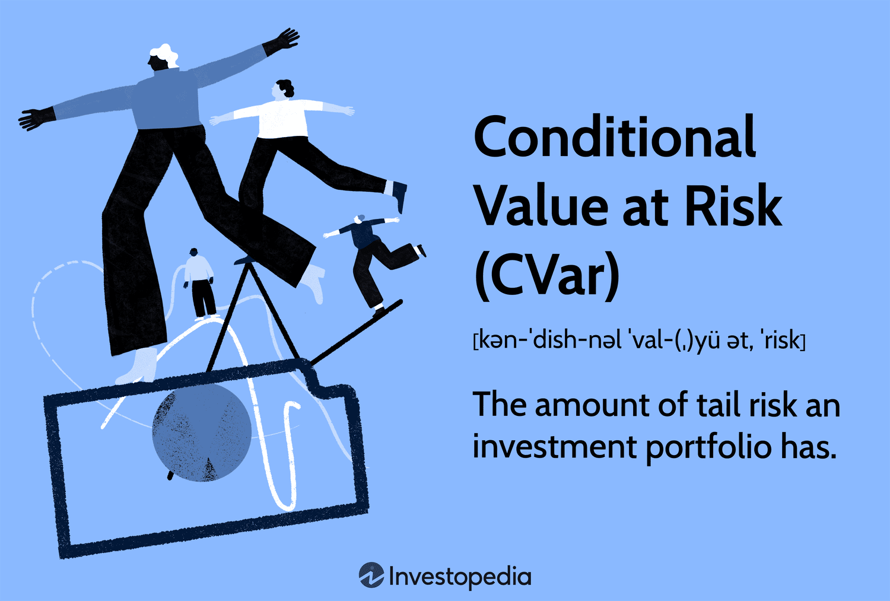

In the fast-paced world of algorithmic trading, understanding and managing financial risks is paramount. Algorithmic trading, which employs complex models and mathematical formulas to make high-speed trading decisions, requires a robust risk management framework to safeguard against potential financial losses. One of the key components of such a framework is the use of financial metrics. These metrics serve as vital tools for assessing, monitoring, and mitigating risks associated with market fluctuations and unexpected price movements.

This article focuses on Conditional Value at Risk (CVaR), a widely-used risk assessment tool that provides a more comprehensive evaluation of potential financial losses than traditional risk metrics. Unlike Value at Risk (VaR), which estimates the maximum expected loss within a specific confidence interval, CVaR goes further by predicting the average loss in instances where the losses exceed the VaR threshold. This capability makes CVaR especially useful in volatile markets where extreme losses can occur.



Integrating CVaR into algorithmic trading strategies can optimize performance by helping traders minimize potential losses while navigating complex market conditions. Through the strategic application of CVaR, traders can make informed decisions that enhance the profitability and sustainability of their trading operations.

This comprehensive guide is tailored for both novice and experienced traders seeking to refine their risk management strategies. It aims to provide insights into the essential financial metrics that drive successful algorithmic trading. By understanding and applying these metrics, traders can implement more sophisticated trading strategies that effectively manage risks and improve overall trading outcomes.

## Table of Contents

## Understanding Financial Metrics in Risk Management

Financial metrics are fundamental for effective risk management in trading, providing insights into potential risks and returns that traders must assess and adapt to efficiently. Among these metrics, Value at Risk (VaR), Beta, Alpha, and the Sharpe Ratio stand out as essential tools.

### Value at Risk (VaR)

VaR is a widely-used risk measure, quantifying the maximum potential loss of a portfolio over a specified time frame at a given confidence level. For instance, a one-day VaR of $1 million at the 95% confidence level indicates that there is only a 5% chance that the portfolio will lose more than $1 million in a single day. Mathematically, VaR is often calculated using historical simulation, variance-covariance, or Monte Carlo simulation methods. Its formula can be simplified as:

$$
\text{VaR}_{\alpha} = \text{P}_0 \times (\mu - z_{\alpha} \times \sigma)
$$

where $\text{P}_0$ is the initial portfolio value, $\mu$ is the expected return, $z_{\alpha}$ is the z-score for the confidence level, and $\sigma$ is the standard deviation of the portfolio's returns.

### Beta

Beta measures the [volatility](/wiki/volatility-trading-strategies), or systematic risk, of a security or portfolio in comparison to the market as a whole. A beta greater than 1 indicates that the asset is more volatile than the market, while a beta less than 1 suggests less volatility. Beta is crucial for understanding how changes in the market affect the value of individual stocks and for adjusting portfolios to align with risk tolerance. It is calculated as:

$$
\beta = \frac{\text{Cov}(R_i, R_m)}{\text{Var}(R_m)}
$$

where $\text{Cov}(R_i, R_m)$ is the covariance between the return of the investment and the return of the market, and $\text{Var}(R_m)$ is the variance of the market return.

### Alpha

Alpha represents a portfolio's return on investment compared to the benchmark index. It indicates the value that a portfolio manager adds or subtracts from a fund's return. A positive alpha shows that the portfolio has outperformed the market benchmark, while a negative alpha indicates underperformance. Alpha is calculated as:

$$
\alpha = R_i - \left( R_f + \beta(R_m - R_f) \right)
$$

where $R_i$ is the return on the investment, $R_f$ is the risk-free rate, and $R_m$ is the market return.

### Sharpe Ratio

The Sharpe Ratio measures the performance of an investment by adjusting for its risk, calculated by subtracting the risk-free rate from the return of the portfolio and dividing by the standard deviation of the portfolio's excess return. It is a vital metric for understanding the risk-adjusted returns of an investment:

$$
\text{Sharpe Ratio} = \frac{R_p - R_f}{\sigma_p}
$$

where $R_p$ is the expected portfolio return, $R_f$ is the risk-free rate, and $\sigma_p$ is the standard deviation of the portfolio's excess return.

### Integrating Financial Metrics

Incorporating these metrics into a trading strategy forms the basis of a robust risk management framework. By evaluating metrics like VaR, Beta, Alpha, and the Sharpe Ratio, traders can gain a comprehensive understanding of potential risks and make informed adjustments to their strategies. For algorithmic traders, these insights offer a data-driven method for optimizing performance while aligning with risk tolerance limits. By continuously measuring and adjusting the relevant financial metrics, traders develop strategies that are not only dynamic and adaptable but also well-positioned to capitalize on market opportunities effectively.

## The Role of Conditional Value at Risk (CVaR)

Conditional Value at Risk (CVaR), also referred to as Expected Shortfall, provides an in-depth assessment of financial risk, presenting a more exhaustive view than the traditional Value at Risk (VaR) metric. While VaR focuses on predicting the maximum expected loss over a specified confidence interval, it does not account for losses beyond that threshold. CVaR, by contrast, estimates the average loss in the worst-case scenarios, those found in the tail end of the loss distribution. This attribute makes CVaR an invaluable tool for risk managers, particularly in volatile markets where predicting extreme losses can significantly influence investment strategies.

The mathematical foundation of CVaR sets it apart as a more reliable predictor of risk. Formally, for a given confidence level $\alpha$, CVaR is defined as the expected loss assuming that the loss is beyond the VaR threshold. Mathematically, this can be expressed as:

$$
\text{CVaR}_{\alpha}(X) = \mathbb{E}[X | X \geq \text{VaR}_{\alpha}(X)]
$$

where $X$ represents the loss variable and $\mathbb{E}$ denotes the expected value. This definition aligns with the need to understand losses not just at a fixed point, but as an average of losses that exceed the VaR estimate.

In [algorithmic trading](/wiki/algorithmic-trading), CVaR's application is crucial for developing robust strategies that account for extreme market movements. By integrating CVaR with other risk metrics such as Beta, Alpha, and the Sharpe Ratio, traders can devise a more comprehensive risk management framework. For example, CVaR can be computed using Monte Carlo simulations to model a wide range of market scenarios, allowing algorithms to adapt dynamically to market conditions.

Consider a simple Python implementation to compute CVaR using historical returns:

```python
import numpy as np

def calculate_cvar(returns, confidence_level=0.95):
    sorted_returns = np.sort(returns)
    var_index = int((1 - confidence_level) * len(sorted_returns))
    var_value = sorted_returns[var_index]
    cvar_value = sorted_returns[sorted_returns <= var_value].mean()
    return cvar_value

historical_returns = np.random.normal(-0.01, 0.05, 1000) # Example returns
cvar = calculate_cvar(historical_returns)
print(f"Conditional Value at Risk (CVaR): {cvar:.4f}")
```

The integration of CVaR into trading systems allows for an enhanced understanding of risk-adjusted performance, supporting decision-making processes under uncertainty. By incorporating CVaR, traders can not only assess the likelihood of extreme losses but also tailor their strategies to mitigate potential impacts. This comprehensive approach ensures that trading models remain resilient, even amid turbulent market conditions.

## Algorithmic Trading and Financial Risk Management

Algorithmic trading employs sophisticated automated systems to execute transactions at speeds and volumes beyond human capability. This technological evolution necessitates a robust risk management framework to safeguard against financial losses. Risk management in algorithmic trading involves the careful assessment and mitigation of potential financial risks through advanced metrics, ensuring that automated strategies operate within acceptable risk parameters.

Algorithms designed for trading incorporate financial metrics such as Value at Risk (VaR), Conditional Value at Risk (CVaR), and the Sharpe Ratio to evaluate potential risks. These metrics help quantify risk, allowing trading systems to adjust their strategies dynamically. For instance, CVaR, also known as Expected Shortfall, provides a more nuanced risk measurement by estimating the average loss in unfavorable scenarios, offering a more complete risk assessment compared to traditional VaR which only gauges the maximum expected loss within a confidence interval.

The interplay between algorithmic models and risk management strategies is pivotal to a trading framework's success. Algorithms continuously analyze market data, adjusting strategies in real-time to optimize trade execution while adhering to predefined risk management guidelines. This dynamic adjustment to market conditions ensures the algorithm operates efficiently without exceeding the risk limits set by traders or financial institutions.

Real-world examples illustrate the successful integration of CVaR into trading algorithms. For instance, financial institutions have implemented algorithms that utilize CVaR to manage portfolios during periods of high volatility. By focusing on the tail-end of the loss distribution, these algorithms can mitigate extreme losses, maintaining financial resilience during turbulent market conditions.

Despite its advantages, the use of CVaR in algorithmic systems poses challenges and limitations. The accurate estimation of CVaR relies heavily on the quality and granularity of historical market data. Inadequate data or incorrect model assumptions can lead to inaccurate risk assessments, potentially undermining trading performance. Additionally, the computation of CVaR can be complex and resource-intensive, requiring advanced knowledge of financial modeling and programming, typically implemented in languages such as Python.

Moreover, the regulatory landscape and market conditions are continually evolving, necessitating a flexible risk management approach. Traders must ensure their algorithms are adaptable, incorporating the latest financial metrics and models to remain effective.

In summary, the integration of sophisticated risk metrics like CVaR into algorithmic trading systems is essential for managing financial risks effectively. By leveraging these advanced tools, traders can enhance their algorithmic strategies, ensuring consistent performance and resilience against adverse financial events.

## Implementing CVaR in Trading Algorithms

Integrating Conditional Value at Risk (CVaR) into trading algorithms involves a thorough understanding of both financial risk theory and practical technical implementation. CVaR, or Expected Shortfall, is a risk measure that provides the average loss occurring in the worst-case scenarios beyond a certain confidence level. Its application in algorithmic trading offers a more comprehensive assessment of potential losses compared to Value at Risk (VaR).

### Steps to Compute CVaR

To compute CVaR, one must first determine VaR, which is the threshold loss level that will not be exceeded with a specific confidence level. For example, if the VaR at a 95% confidence level is $X, then there is a 5% chance that losses will exceed this amount. CVaR is then calculated as the expected loss given that the loss is beyond the VaR threshold. The mathematical expression for CVaR at confidence level $\alpha$ is:

$$

\text{CVaR}_{\alpha} = \mathbb{E}[ \text{Loss} \ | \ \text{Loss} > \text{VaR}_{\alpha} ]
$$

In practice, CVaR can be computed using historical data, Monte Carlo simulations, or analytical methods depending on the characteristics of the portfolio and market data available.

### Software Tools and Programming Languages

Python is the preferred language for implementing CVaR due to its rich ecosystem of financial libraries and ease of integration with algorithmic trading platforms. Key libraries include `NumPy` for numerical computations, `Pandas` for data manipulation, and `SciPy` for statistical operations. Additionally, `PyPortfolioOpt` and `cvxpy` can be utilized for optimizing portfolios subject to CVaR constraints. For example:

```python
import numpy as np

def calculate_cvar(returns, alpha=0.95):
    sorted_returns = np.sort(returns)
    var_index = int((1 - alpha) * len(sorted_returns))
    var = sorted_returns[var_index]
    cvar = sorted_returns[:var_index].mean()
    return cvar
```

This basic function calculates CVaR from a list of portfolio returns at a 95% confidence level.

### Backtesting and Optimization

Backtesting is essential for validating CVaR-based strategies. By simulating a trading algorithm's performance on historical data, traders can assess how well the strategy manages risk and identify areas for improvement. Tools like `Backtrader` or `Zipline` allow for comprehensive [backtesting](/wiki/backtesting), enabling traders to refine their algorithms by minimizing CVaR during adverse market conditions.

### Continuous Improvement and Adaptation

Market conditions are perpetually evolving, making it vital for trading algorithms to adapt. Continuous monitoring and recalibration of CVaR metrics involve updating historical datasets and refining the algorithm's parameters to align with current market dynamics. Machine learning techniques, such as [reinforcement learning](/wiki/reinforcement-learning), can also be used to automate the adaptation process, ensuring that the algorithm remains responsive to new risk profiles.

In summary, implementing CVaR into trading algorithms requires a blend of financial risk modeling and technical proficiency. A robust framework that integrates CVaR with other financial metrics can significantly enhance the predictive accuracy and resilience of algorithmic trading strategies.

## Conclusion

Incorporating Conditional Value at Risk (CVaR) and other financial metrics into algorithmic trading systems is an effective approach for managing risks. CVaR provides a more comprehensive risk assessment by focusing on the tail end of the distribution, estimating potential losses in worst-case scenarios. This allows traders to have a clearer understanding of their risk exposure and to make informed decisions that can enhance trading performance. By applying these metrics, traders can not only optimize their portfolios but also improve their overall decision-making processes.

A solid risk management framework is essential for both high-frequency and other algorithmic trading practices. Such a framework enables traders to systematically identify, assess, and mitigate potential risks. Integrating CVaR and other advanced metrics, like the Sharpe Ratio or Beta, into trading algorithms ensures a more nuanced and responsive strategy that can adapt to evolving market conditions.

Staying updated with advancements in financial metrics and risk management tools is critical for maintaining a competitive edge. This requires continuous learning and adaptation as new methodologies and technologies emerge. Tools such as Python libraries for financial data analysis can be instrumental in building and testing these trading strategies. For instance, using libraries like `numpy` and `pandas` can streamline the data handling process, while libraries like `scipy` or `statsmodels` can aid in statistical computations necessary for assessing risk metrics.

Incorporating CVaR into your trading strategy involves understanding both the mathematical underpinnings and practical implementation aspects, including coding and backtesting. Continuous improvement cycles, leveraging tools like [machine learning](/wiki/machine-learning) for predictive analytics, can further enhance the adaptability of trading algorithms, ensuring they remain effective in changing market dynamics.

By equipping yourself with the necessary knowledge and skills to utilize financial metrics effectively, you can strategically position yourself to capitalize on market opportunities while safeguarding your investments against potential downturns.

## References & Further Reading

[1]: Rockafellar, R. T., & Uryasev, S. (2000). ["Optimization of Conditional Value-at-Risk."](https://sites.math.washington.edu/~rtr/papers/rtr179-CVaR1.pdf) Journal of Risk, 2(3), 21-42.

[2]: Jorion, P. (2006). ["Value at Risk: The New Benchmark for Managing Financial Risk."](https://books.google.com/books/about/Value_at_Risk_3rd_Ed.html?id=nnblKhI7KP8C) McGraw-Hill.

[3]: Pflug, G. C., & Wozabal, D. (2007). ["Ambiguity in Portfolio Selection."](https://www.semanticscholar.org/paper/Ambiguity-in-portfolio-selection-Pflug-Wozabal/84f25420cbb177e860534d39ac8b206c6a871ff8) Quantitative Finance, 7(4), 335-342.

[4]: Alexander, C. (2008). ["Market Risk Analysis Volume III: Pricing, Hedging and Trading Financial Instruments."](https://archive.org/details/marketriskanalys0001alex) John Wiley & Sons.

[5]: Fabozzi, F. J., Focardi, S. M., & Kolm, P. N. (2010). ["Quantitative Equity Investing: Techniques and Strategies."](https://www.semanticscholar.org/paper/Quantitative-Equity-Investing%3A-Techniques-and-Fabozzi-Focardi/1c49a2a53919f7e65cb96f16691b8ff726fd3cd7) John Wiley & Sons.