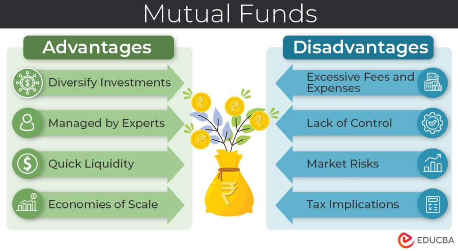

## Table of Contents

## What are mutual funds and how do they work?

Mutual funds are a type of investment where many people pool their money together to buy a variety of stocks, bonds, or other assets. This is managed by a professional who decides where to invest the money. When you invest in a mutual fund, you are buying shares of the fund, not the individual stocks or bonds it holds. This makes it easier for people who don't have a lot of money or time to invest in a diversified portfolio.

The value of your investment in a mutual fund goes up or down based on how well the investments in the fund perform. If the stocks or bonds in the fund do well, the value of the fund increases, and so does the value of your shares. If they do poorly, the value of your shares goes down. You can make money from mutual funds in two ways: by selling your shares for more than you paid for them, or by receiving dividends, which are payments made from the fund's earnings. This makes mutual funds a popular choice for people looking to grow their savings over time.

## What are the common fees associated with mutual funds?

When you invest in mutual funds, you might have to pay different fees. One common fee is the expense ratio. This is a yearly fee that pays for managing the fund and other costs. It's a percentage of your investment, so if you have $1,000 in a fund with a 1% expense ratio, you'll pay $10 a year. Another fee you might see is the sales load, which is like a commission for buying or selling shares in the fund. There are front-end loads, which you pay when you buy, and back-end loads, which you pay when you sell.

Some mutual funds also charge other fees. For example, there might be a fee if you don't keep your money in the fund for a certain amount of time. This is called a redemption fee. There can also be account fees if your account balance is too low. It's important to read the fund's prospectus, which is a document that explains all the fees and costs. Knowing these fees helps you understand how much of your investment is going towards costs and how much is actually working for you.

## How do the fees of mutual funds impact overall returns?

Fees in mutual funds can take a big bite out of your returns. Every dollar you pay in fees is a dollar that doesn't get invested and grow for you. Over time, even small fees can add up and make a big difference in how much money you end up with. For example, if you invest $10,000 in a fund with a 1% annual fee, after 20 years, those fees could eat up thousands of dollars that could have been [earning](/wiki/earning-announcement) more money for you.

It's important to think about fees when you pick a mutual fund. A fund with high fees needs to perform much better than a fund with low fees just to give you the same amount of money in the end. That's why many people choose funds with lower fees, like index funds, which often have expense ratios of 0.1% or less. By keeping fees low, more of your money stays invested and working for you over the long term.

## In what scenarios might mutual funds underperform compared to other investment options?

Mutual funds might underperform compared to other investment options if they have high fees. These fees can eat into your returns, leaving you with less money than if you had invested in something with lower costs, like an index fund or an [ETF](/wiki/etf-trading-strategies). If the mutual fund's expense ratio is high, it has to do much better than other investments just to make up for the fees. This can be hard to do, especially if the market is not doing well.

Another scenario where mutual funds might underperform is if the fund manager makes bad investment choices. Since mutual funds are actively managed, the success of the fund depends a lot on the manager's decisions. If the manager picks stocks or bonds that don't do well, the whole fund suffers. In contrast, other investments like index funds simply follow the market, so they don't rely on one person's choices.

Lastly, mutual funds can underperform in certain market conditions. For example, if the market is doing really well and certain sectors or stocks are leading the charge, a mutual fund might not be invested in those top performers. This can happen because the fund manager might have a different strategy or might be limited by the fund's investment goals. In such cases, other investments that are more focused or flexible might do better.

## What are the tax implications of investing in mutual funds?

When you invest in mutual funds, you need to think about taxes. If the mutual fund makes money from selling stocks or bonds, it might have to pay capital gains taxes. These taxes are passed on to you, the investor. You'll get a form called a 1099-DIV at the end of the year that tells you how much you owe. If you hold onto your mutual fund shares for more than a year, you'll pay long-term capital gains tax, which is usually lower than the short-term rate for shares held less than a year.

Another tax to consider is on dividends. Mutual funds often pay out dividends to shareholders, and these payments are taxable. If the dividends are qualified, they get taxed at the lower long-term capital gains rate. But if they're not qualified, you'll pay your regular income tax rate on them. It's a good idea to keep your mutual funds in a tax-advantaged account like an IRA or 401(k) if you can, because this can help you avoid or delay paying taxes on your earnings.

## How does the lack of control over investment choices in mutual funds affect investors?

When you invest in mutual funds, you give up some control over where your money goes. The fund manager decides which stocks or bonds to buy and sell. This can be good if the manager is really smart and picks winners, but it can be bad if the manager makes bad choices. You can't tell the manager to buy or sell certain things, so you have to trust them to do a good job. This lack of control can be hard for people who like to make their own investment decisions or have specific ideas about where they want to invest their money.

This can also affect how you feel about your investments. If the fund doesn't do well, you might feel frustrated because you can't do anything about it. On the other hand, if the fund does well, you might feel happy but also a bit out of the loop because you didn't make the choices yourself. It's a trade-off: you get the benefit of professional management, but you give up some control over your money.

## What are the risks of investing in actively managed mutual funds?

When you put your money into actively managed mutual funds, you take on some risks. One big risk is that the person managing the fund might not pick the best stocks or bonds. They try to do better than the market, but they don't always succeed. If they make bad choices, the value of your investment can go down. This can be frustrating because you don't get to choose what the fund buys or sells.

Another risk is that these funds often have higher fees than other types of investments. These fees can eat into your returns, leaving you with less money than you might have gotten from a cheaper investment. Over time, even small fees can add up and make a big difference in how much money you end up with. So, you need to think about whether the potential for higher returns is worth the extra cost and the risk of the fund manager not doing well.

## How can market conditions make mutual funds less advantageous?

Market conditions can make mutual funds less advantageous if the market is doing really well but the mutual fund isn't keeping up. This can happen because the fund manager might be limited by the fund's goals or might not pick the stocks that are doing the best. For example, if tech stocks are booming but the mutual fund doesn't have many tech stocks, it might not do as well as the market. This can be frustrating for investors who see other investments doing better.

Another way market conditions can affect mutual funds is during times of high market [volatility](/wiki/volatility-trading-strategies). If the market is going up and down a lot, the fund manager might make choices that don't work out well. They might sell stocks too soon or buy at the wrong time, which can hurt the fund's performance. In these situations, simpler investments like index funds, which just follow the market, might do better because they don't rely on someone's decisions.

## What are the alternatives to mutual funds and when might they be more beneficial?

One alternative to mutual funds is index funds. Index funds are a type of investment that tries to match the performance of a specific part of the market, like the S&P 500. They usually have very low fees because they don't need someone to pick stocks. They just buy all the stocks in the index. Index funds can be more beneficial when you want to keep costs low and don't want to rely on a fund manager's choices. They're also good if you believe the market will do well over time and you want to keep things simple.

Another alternative is exchange-traded funds (ETFs). ETFs are similar to index funds but you can buy and sell them throughout the day like stocks. They also have low fees and can track a wide range of investments, from stocks to commodities. ETFs might be more beneficial if you want to trade more often or if you want to invest in something very specific, like a certain industry or country. They can also be good if you're looking for more control over your investments because you can buy and sell them whenever you want.

A third alternative is individual stocks. When you buy individual stocks, you pick specific companies to invest in. This can be more beneficial if you have the time and knowledge to research companies and make your own investment decisions. It can also be more rewarding because you have full control over your choices. However, it's riskier because your money is tied to the performance of just a few companies, so you need to be careful and diversify your investments to reduce risk.

## How does the size of a mutual fund impact its performance and efficiency?

The size of a mutual fund can affect how well it does and how efficiently it works. When a mutual fund gets really big, it can be harder for the manager to find good investments. They might have to buy a lot of stocks or bonds to use all the money they have, and this can make it tough to beat the market. Big funds can also be less nimble, meaning they can't move quickly to buy or sell things when they need to. This can hurt the fund's performance because they might miss out on good opportunities or get stuck with bad investments.

On the other hand, a bigger fund can sometimes be more efficient because it can spread out its costs over more money. This means the expense ratio, which is the yearly fee you pay, might be lower. A lower expense ratio is good because it means more of your money stays invested and can grow over time. But, if the fund gets too big, the benefits of lower costs might not make up for the challenges of managing a large amount of money. So, the size of a mutual fund is something to think about when you're deciding where to invest.

## What role does investor behavior play in the disadvantageous nature of mutual funds?

Investor behavior can make mutual funds less advantageous. When people get scared and sell their mutual fund shares during a market downturn, they often end up selling at a loss. This is because they're selling when the price is low. If they had waited, the market might have gone back up, and they could have sold for more money. This behavior can hurt their returns and make mutual funds seem like a bad choice.

On the other hand, some investors might chase performance. They see a mutual fund doing really well and jump in, hoping to get the same good results. But by the time they buy in, the fund might already be at its peak. Then, if the fund's performance drops, they might sell in a panic, again selling low. This kind of behavior can lead to buying high and selling low, which is the opposite of what you want to do to make money in investing. So, how investors act can really affect how well mutual funds work for them.

## How can advanced investors use quantitative analysis to determine when mutual funds are disadvantageous?

Advanced investors can use quantitative analysis to figure out when mutual funds might not be the best choice by looking at numbers and data. They can compare a mutual fund's performance to a benchmark, like the S&P 500, to see if the fund is doing better or worse. If the fund is consistently underperforming the benchmark after accounting for fees, it might be a sign that the fund is not a good investment. They can also look at the fund's expense ratio and other fees to see how much they're paying for the fund's management. If the fees are high and the fund isn't doing well enough to make up for it, the investor might be better off with a cheaper investment like an index fund.

Another way advanced investors use quantitative analysis is by looking at the fund's risk-adjusted returns. They can use measures like the Sharpe ratio, which compares the fund's returns to its risk, to see if the fund is giving them enough return for the risk they're taking. If the Sharpe ratio is low, it might mean the fund is too risky for the returns it's providing. They can also look at the fund's turnover rate, which shows how often the fund manager is buying and selling investments. A high turnover rate can lead to higher taxes and fees, making the fund less advantageous. By using these numbers, advanced investors can make smarter choices about when mutual funds might not be the best option for their money.

## References & Further Reading

[1]: Bergstra, J., Bardenet, R., Bengio, Y., & Kégl, B. (2011). ["Algorithms for Hyper-Parameter Optimization."](https://dl.acm.org/doi/10.5555/2986459.2986743) Advances in Neural Information Processing Systems 24.

[2]: ["Advances in Financial Machine Learning"](https://www.amazon.com/Advances-Financial-Machine-Learning-Marcos/dp/1119482089) by Marcos Lopez de Prado

[3]: ["Evidence-Based Technical Analysis: Applying the Scientific Method and Statistical Inference to Trading Signals"](https://www.amazon.com/Evidence-Based-Technical-Analysis-Scientific-Statistical/dp/0470008741) by David Aronson

[4]: ["Machine Learning for Algorithmic Trading"](https://github.com/stefan-jansen/machine-learning-for-trading) by Stefan Jansen

[5]: ["Quantitative Trading: How to Build Your Own Algorithmic Trading Business"](https://www.amazon.com/Quantitative-Trading-Build-Algorithmic-Business/dp/1119800064) by Ernest P. Chan