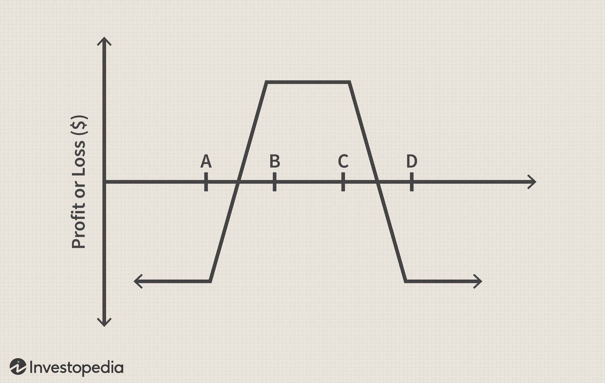

Financial derivatives are integral to modern trading, offering tools for hedging risk, speculating, and enhancing investment portfolios. Among the myriad of derivative strategies available, the condor spread stands out for its unique structure and applications, particularly when combined with algorithmic trading. This strategy, known for its non-directional approach, seeks to limit potential gains and losses by profiting from volatility patterns in the market.

The condor spread consists of four different transactions, typically utilizing either call or put options with the same expiration date. It is designed to yield profits when the underlying asset's price remains stable within a defined range. This approach distinguishes between two main types: the long condor, which aims to benefit from low volatility, and the short condor, which capitalizes on periods of high volatility. Navigating these options requires a profound understanding of market fundamentals and dynamics.



Algorithmic trading plays a critical role in managing the complexities inherent in executing a condor spread. By automating the intricate calculations involved, algorithms can adjust strategy parameters swiftly in response to changing market conditions, optimizing potential profits while minimizing risks. This synergy between financial derivatives and technology not only simplifies the management of multiple option positions but also enhances the efficacy of the condor spread as a trading strategy.

Understanding derivatives, particularly the condor spread, can significantly elevate your trading acumen. This article endeavors to provide comprehensive insights into the workings of the condor spread and its application within the financial markets, offering valuable knowledge for both seasoned traders and newcomers. Through exploring this strategy, you can gain a deeper appreciation for its complexity and potential advantages when applied adeptly in an algorithmic trading context.

## Table of Contents

## What is a Condor Spread?

A condor spread is a sophisticated options trading strategy that allows investors to set precise targets for both earnings and potential losses by using market volatility to their advantage. This strategy is classified as non-directional, meaning its profitability does not rely on significant movements in the underlying asset's price. Instead, it is ideally implemented in situations where the trader anticipates minimal price fluctuation, thus benefiting from price stability within a defined range.

The condor spread is constructed through four different transactions, involving either call options or put options with identical expiration dates. Typically, it consists of two lower strike options—either bought or sold—and two higher strike options engaging in the opposite action (if the lower strike options are bought, the higher strike are sold, and vice versa). These positions create a risk-limiting, profit-capping structure that visually resembles a condor bird's wingspan, hence the name.

The primary characteristics of a condor spread center around its two variants: the long condor and the short condor. A long condor spread, utilizing either calls or puts, is oriented towards low [volatility](/wiki/volatility-trading-strategies) situations. Here, the strategy profits if the underlying asset's price remains relatively stable or within the specific strike range. This approach results in a net debit for the trader, indicating an upfront cost for establishing the position.

Conversely, the short condor spread is implemented in anticipation of high volatility. In this strategy, traders benefit if the price of the underlying asset experiences significant movements, typically outside the condor's wingspan. This structure allows the trader to gain a net credit, where the premiums received from writing options surpass the premiums paid.

Despite its potential rewards, the condor spread is a complex and nuanced strategy. It requires a strong grasp of market dynamics, as well as the subtleties of options pricing and volatility modeling. Its layered structure involves multiple positions and trades that must be meticulously executed and managed. Expanding beyond basic strategies, the condor spread serves as a valuable tool for experienced traders aiming to harness market stability or uncertainty effectively.

## Types of Condor Spreads

A Condor Spread involves strategic utilization of options to capitalize on specific market conditions, primarily focusing on volatility and price stability. There are four primary types of condor spreads: Long Condor with Calls, Long Condor with Puts, Short Condor with Calls, and Short Condor with Puts. Each has unique characteristics, suited to different market expectations.

### Long Condor with Calls

This strategy involves four call options with different strike prices but the same expiration date. The position consists of buying one call at a lower strike price, selling two calls at middle strike prices, and buying one more call at a higher strike price. This configuration aims to profit from minimal price movement within a secure range. It results in a net debit, meaning the costs of establishing the position exceed the premiums received from writing the two middle calls. The maximum profit is achieved if the underlying asset's price at expiration is equal to the middle strike prices, minus the net premium paid.

### Long Condor with Puts

Analogous to the long call condor, this setup utilizes put options. It profits from limited price fluctuation and results in a net debit. The trader buys one put at a lower strike, sells two puts at intermediate strikes, and buys another put at a higher strike. The optimal scenario is for the underlying asset to settle at the middle strike prices at expiration, allowing the trader to profit minus the initial net premium paid.

### Short Condor with Calls

This approach involves selling a condor spread and is generally employed in anticipation of high volatility. Unlike the long condor, it results in a net credit. The trader sells one call at a lower strike, buys two calls at intermediate strikes, and sells another call at a higher strike. The objective is for the underlying asset price to move significantly away from the intermediate strikes, either above or below, by expiration, enabling the retention of the net premium received.

### Short Condor with Puts

Similar to the short call condor, but this strategy uses put options. The trader sells a put at a lower strike, buys two puts at intermediate strikes, and sells one more put at a higher strike. This also results in a net credit, profiting from significant price movement. If the asset price at expiration is outside the range of the intermediate strikes, the premium received is ideally retained.

### Choosing the Appropriate Condor Spread

Determining which condor spread to implement is contingent upon the trader's market outlook and volatility expectations. Long condor spreads, whether with calls or puts, typically suit scenarios where market volatility is low, and traders anticipate limited price movement. Conversely, short condor spreads are more advantageous in volatile markets, where significant price swings are expected. An astute understanding of market dynamics, historical volatility patterns, and strategic forecasting plays a crucial role in effectively selecting and timing these strategies.

## Implementation in Algorithmic Trading

Algorithmic trading has revolutionized the management and execution of complex options strategies like the condor spread by automating intricate processes and calculations. The essence of computer algorithms in this strategy is their ability to continuously monitor financial markets, facilitating timely and precise adjustments to strategies' parameters to maximize profits.

### Market Monitoring and Automation

One of the key aspects of implementing condor spreads in [algorithmic trading](/wiki/algorithmic-trading) is the automation of market monitoring. Algorithms can continuously assess real-time market conditions, such as price movements and volatility levels. This enables traders to automate the adjustment of strike prices and expiration dates to maintain a desired risk and reward profile. For instance, Python scripts utilizing libraries like NumPy and pandas can be used to streamline data analysis and decision-making processes.

```python
import numpy as np
import pandas as pd

# Example: Monitor market conditions
def monitor_market(data):
    # Simple moving averages for price trend analysis
    sma_short = data['Close'].rolling(window=10).mean()
    sma_long = data['Close'].rolling(window=50).mean()
    return sma_short, sma_long

data = pd.read_csv('market_data.csv')  # Example market data
sma_short, sma_long = monitor_market(data)

# Decision rule for algorithmic adjustments
if sma_short[-1] > sma_long[-1]:
    action = 'adjust_strategy_params'
else:
    action = 'no_change'
```

### Managing Multiple Positions

Condor spreads involve multiple positions with options trading. Algorithms simplify the task of managing these positions by tracking the performance of individual legs of the spread. This allows for efficient rebalancing or liquidation of positions based on pre-defined criteria. With Python, traders can use options trading libraries like QuantLib to execute trades and manage portfolios efficiently.

### Benefits and Limitations

A notable advantage of algorithmic trading in executing condor spreads is enhanced precision and speed in trading decisions, which human traders may not match consistently. Automation minimizes human errors and leverages [machine learning](/wiki/machine-learning) models to predict volatility, thereby optimizing the execution of strategies.

However, limitations exist. Dependence on historical data for algorithm training can lead to inaccuracies in unforeseen market conditions. Additionally, the requirement for substantial initial resources and technical expertise for setup and maintenance can be a barrier for some traders.

### Software and Platform Support

Various platforms and software offer robust support for algorithmic options trading of condor spreads. Platforms such as MetaTrader and Bloomberg Terminal, along with API services like [Interactive Brokers](/wiki/interactive-brokers-api), provide comprehensive tools for developing and deploying trading algorithms. These platforms offer features for [backtesting](/wiki/backtesting), real-time data analysis, and integration with scripting languages for custom strategy execution.

In conclusion, algorithmic trading significantly streamlines the execution of condor spread strategies, mitigating complexities associated with manual trading. Its implementation promises efficiencies and new profit channels, especially when equipped with the right technologies and tools.

## Advantages and Challenges

A condor spread, as a non-directional options strategy, provides a stable return profile when the underlying asset remains confined within a specified price range. This inherent stability is attractive to traders seeking predictable outcomes as long as the market does not exhibit extreme volatility. By effectively balancing potential gains and losses, a condor spread limits the risk assumed by the trader while defining potential profits.

However, executing a condor spread entails considerable complexity. This stems from the need to initiate four different transactions—usually involving options with the same expiration date but at different strike prices. The intricacy of coordinating these components can present significant challenges, particularly for those less familiar with options trading. Additionally, the costs of executing and maintaining these positions can be substantial, particularly when factoring in brokerage fees and the margin requirements that may apply.

To mitigate some of these challenges, reviewing historical market data and engaging in backtesting are essential practices. These efforts help traders refine their strategies by understanding how condor spreads might have fared under different market conditions. For example, by analyzing past volatility patterns, traders can better estimate the optimal range for profitable condor spread implementation.

Predicting volatility accurately is crucial for a successful condor spread strategy. This requires the use of sophisticated market analysis tools capable of processing large volumes of data and generating insights into future market behavior. Implementing software solutions that provide real-time analytics and predictive modeling can significantly enhance short and long-term strategy success.

Brokerage firms and trading software play pivotal roles in facilitating condor spread trades. Many brokerages offer platforms equipped with algorithms capable of automating the execution of complex option strategies like condor spreads. These platforms allow traders to set predefined conditions under which trades are executed, thereby reducing the likelihood of human error. Moreover, trading software often includes analytical tools and resources that aid traders in conducting the necessary technical analysis required for successful condor spread strategies.

In conclusion, while a condor spread offers distinct advantages in terms of risk management and predictable returns, it is accompanied by substantial challenges. A thorough understanding of market conditions, supported by robust analytical tools and reliable brokerage services, is necessary to harness the full potential of this advanced options strategy. Proper planning and execution, coupled with continuous learning and adaptation, are essential components of success in trading condor spreads.

## Conclusion

A condor spread arises as a sophisticated and adaptable strategy, pivotal for advanced options traders due to its defined risk and reward profiles. This strategy, characterized by a limited maximum gain and loss, offers traders a way to benefit from stable prices of an underlying asset, enhancing a balanced approach to trading.

The integration of algorithmic trading provides an effective means to manage and implement condor spreads, addressing the inherent complexity by automating the computational aspects and enabling real-time adjustment to market conditions. This technological leverage enhances precision and efficiency in executing such multifaceted strategies.

Despite its potential rewards, deploying a condor spread demands a nuanced comprehension of options dynamics and market fluctuations. The strategically layered positions require traders to possess an intricate understanding of both the theoretical constructs and practical applications of options trades.

Adaptation to changing market landscapes remains crucial for successfully executing condor spreads. As financial environments evolve, continuous education and the adoption of new data analysis techniques become indispensable for maintaining relevance and effectiveness in trading strategies.

Harnessing the benefits of a condor spread in modern trading necessitates prudent risk management practices and the judicious use of available technology. By crafting an informed strategy that balances risk with potential return, traders can optimize their trading outcomes while mitigating associated risks. This approach not only enhances profitability but also ensures a robust strategy in the ever-dynamic financial markets.

## Further Reading and Resources

For those seeking to further deepen their understanding of options trading strategies, including the condor spread, a range of resources are available to facilitate the learning process and enhance practical application skills.

Several online platforms offer comprehensive guides on options trading. Investopedia's "Options Trading Strategies" section provides an accessible introduction to a variety of strategies, including condor spreads. [Investopedia Options Trading](https://www.investopedia.com/options-trading-4689745) offers clear explanations and visual aids to help traders visualize complex options strategies.

In algorithmic trading, platforms like Interactive Brokers and TradeStation provide robust tools for executing condor spreads. These platforms support algorithmic trading with APIs that allow traders to code custom scripts, automate trades, and backtest strategies. Interactive Brokers, in particular, is known for its Trader Workstation (TWS) API, which supports complex option strategies and algorithmic trading. [Interactive Brokers API](https://www.interactivebrokers.com/en/index.php?f=5041)

Industry experts and experienced traders often share invaluable insights through blogs, webinars, and financial news websites. Names like Tom Sosnoff and Tony Battista, co-founders of tastytrade, offer insights and strategies through live shows and online content dedicated to options traders. Tastytrade's educational content investigates into both the theory and application of trading strategies. [Tastytrade](https://www.tastytrade.com)

For real-world case studies of condor spread applications, academic journals such as the Journal of Derivatives and the Journal of Finance provide peer-reviewed articles that analyze strategy performance in various market conditions. This kind of detailed analysis can provide a more nuanced understanding of how these strategies perform outside theoretical scenarios.

Finally, joining trading communities can be highly beneficial for peer learning and exchanging experiences. Online forums such as the r/options subreddit and platforms like Elite Trader foster environments where traders discuss strategies, share learnings, and offer tips. These communities can be invaluable for gaining insights from those who actively trade options regularly.

By leveraging these resources, traders can enhance their understanding of the condor spread strategy and other options trading methodologies, while gaining insights into practical execution in algorithmic trading environments.

## References & Further Reading

[1]: Wilmot, P., & Howison, S. (1995). ["The Mathematics of Financial Derivatives: A Student Introduction."](https://www.amazon.com/Mathematics-Financial-Derivatives-Paul-Wilmott/dp/0521497892) Cambridge University Press.

[2]: McMillan, L. G. (2004). ["Options as a Strategic Investment."](https://www.amazon.com/Options-Strategic-Investment-Lawrence-McMillan/dp/0735201978) New York Institute of Finance.

[3]: Hull, J. C. (2017). ["Options, Futures, and Other Derivatives."](https://www.semanticscholar.org/paper/Options%2C-Futures%2C-and-Other-Derivatives-Hull/89bdee500c8623864fc9eb7a471546aa713acc44) Pearson.

[4]: Pardo, R. (2008). ["The Evaluation and Optimization of Trading Strategies."](https://onlinelibrary.wiley.com/doi/book/10.1002/9781119196969) Wiley.

[5]: Black, F., & Scholes, M. (1973). ["The Pricing of Options and Corporate Liabilities."](https://www.cs.princeton.edu/courses/archive/fall09/cos323/papers/black_scholes73.pdf) Journal of Political Economy, 81(3), 637-654.

[6]: Taleb, N. N. (1997). ["Dynamic Hedging: Managing Vanilla and Exotic Options."](https://archive.org/details/dynamichedgingma0000tale) Wiley.

[7]: Benninga, S. (2014). ["Financial Modeling."](https://mitpress.mit.edu/9780262027281/financial-modeling/) MIT Press.

[8]: Klebaner, F. C. (2005). ["Introduction to Stochastic Calculus with Applications."](https://archive.org/details/introductiontost0000fima) Imperial College Press.

[9]: Aldridge, I. (2013). ["High-Frequency Trading: A Practical Guide to Algorithmic Strategies and Trading Systems."](https://www.amazon.com/High-Frequency-Trading-Practical-Algorithmic-Strategies/dp/1118343506) Wiley.