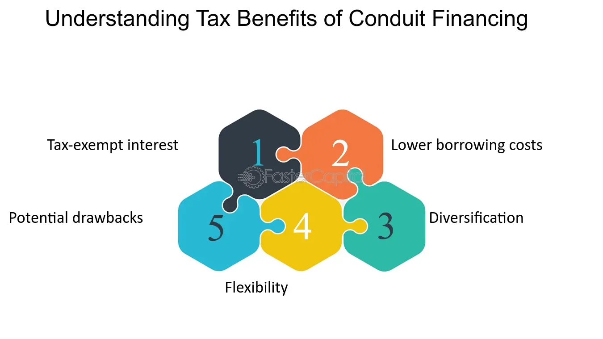

## Table of Contents

## What is conduit financing?

Conduit financing is a way for organizations to borrow money for big projects without paying high interest rates. It works by having a government or special authority issue bonds on behalf of the organization. The money raised from selling these bonds is then loaned to the organization to fund things like building hospitals, schools, or affordable housing.

This method is helpful because the bonds issued by the government or authority often have lower interest rates than what the organization could get on its own. This makes it cheaper for the organization to borrow the money it needs. Conduit financing is commonly used by non-profit groups, but it can also be used by private companies for projects that benefit the public.

## How does conduit financing work?

Conduit financing is a way for organizations to get money for big projects without paying a lot in interest. It works like this: a government or a special authority helps by issuing bonds. These bonds are like IOUs that the government or authority sells to investors. The money from selling these bonds is then given to the organization as a loan. The organization uses this loan to pay for things like building hospitals, schools, or affordable housing.

The cool thing about conduit financing is that the bonds issued by the government or authority usually have lower interest rates. This means the organization doesn't have to pay back as much money over time. It's like getting a discount on a loan! This method is often used by non-profit groups, but private companies can use it too, especially if their project helps the community.

## What are the common uses of conduit financing?

Conduit financing is often used by non-profit organizations to fund big projects that help the community. For example, they might use it to build new hospitals or schools. These projects can be really expensive, so getting a loan with a lower [interest rate](/wiki/interest-rate-trading-strategies) through conduit financing helps them save money. This way, they can focus more on helping people and less on paying back big loans.

Private companies can also use conduit financing, but usually only for projects that benefit the public. For instance, a company might use it to build affordable housing or to set up a new factory that will create jobs in the area. By using conduit financing, these companies can borrow money at a lower cost, which makes it easier for them to do projects that help the community.

## Who are the typical issuers of conduit bonds?

The typical issuers of conduit bonds are government agencies or special authorities. These can be state or local government bodies, like city or county governments, that have the power to issue bonds. They act as a go-between, or conduit, to help organizations get the money they need for big projects.

These issuers don't use the money themselves. Instead, they issue the bonds and pass the money on to the organizations, like non-profits or private companies, that are actually doing the projects. This helps those organizations get loans with lower interest rates, making it easier and cheaper for them to build things like hospitals, schools, or affordable housing.

## What are the benefits of conduit financing for borrowers?

Conduit financing helps borrowers get money for big projects at a lower cost. When a government or special authority issues bonds on behalf of the borrower, the interest rates on these bonds are often lower than what the borrower could get on their own. This means the borrower pays less money over time to pay back the loan. It's like getting a special deal on a loan because the government or authority is helping out.

This method is especially helpful for non-profit groups and organizations that are working on projects that benefit the community, like building hospitals, schools, or affordable housing. By using conduit financing, these organizations can focus more on their important work and less on worrying about big loan payments. It makes it easier for them to do good things for the community without financial stress.

## What are the benefits of conduit financing for investors?

Conduit financing can be a good deal for investors too. When they buy conduit bonds, they are lending money to the government or special authority that issued the bonds. These bonds often come with lower interest rates, which means the investor gets a steady, reliable return on their investment. It's like getting a safe and predictable way to earn money over time.

Plus, since conduit bonds are often backed by the government or authority, they are seen as less risky. Investors feel more secure knowing that the bonds are supported by a trusted entity. This makes conduit bonds an attractive option for people who want to invest their money without taking big risks.

## What are the risks associated with conduit financing for borrowers?

Conduit financing can be great for borrowers because it helps them get loans with lower interest rates. But there are some risks they need to think about. One big risk is that if the project they're working on doesn't go well, they might have a hard time paying back the loan. Even though the interest rates are lower, the loan amount can still be huge, and any problems with the project can make it tough to make the payments on time.

Another risk is that the bonds are often tied to the borrower's creditworthiness. If the borrower's financial situation gets worse, it might be harder for them to borrow money in the future. This could affect their ability to start new projects or even finish the current one. It's important for borrowers to carefully plan and manage their projects to make sure they can handle these risks and keep their finances stable.

## What are the risks associated with conduit financing for investors?

Conduit financing can be a good way for investors to earn money, but there are some risks they need to know about. One risk is that even though the bonds are backed by a government or special authority, the money to pay back the bonds actually comes from the borrower's project. If the project doesn't do well, there might not be enough money to pay back the investors. This means the investors could lose some or all of their money if the project fails.

Another risk is that the value of the bonds can go up and down. If interest rates in the market change, the value of the bonds can change too. If investors need to sell their bonds before they mature, they might get less money back than they expected. This can be a problem if they were counting on that money for something important. It's important for investors to understand these risks and think carefully before putting their money into conduit bonds.

## How does conduit financing impact the tax status of a project?

Conduit financing can affect the tax status of a project in a good way. When a government or special authority issues bonds for a project, the interest that investors earn from those bonds is often not taxed. This makes the bonds more attractive to investors because they get to keep more of the money they earn. For the organization doing the project, this can mean lower borrowing costs because more people want to buy the bonds.

However, there are some rules to follow. The project has to be for something that helps the community, like building a hospital or school. If the project doesn't meet these rules, the interest on the bonds might not be tax-free. This means the organization needs to make sure their project fits the rules to keep the tax benefits.

## What are the regulatory considerations for conduit financing?

When using conduit financing, there are some important rules that need to be followed. The government or special authority issuing the bonds has to make sure the project fits certain guidelines. For example, the project usually needs to be for something that helps the community, like building a hospital or school. There are also rules about how the money from the bonds can be used and how the project is managed. If these rules aren't followed, the bonds might lose their tax benefits, which could make them less attractive to investors.

Another thing to think about is that different states and local governments might have their own rules for conduit financing. This means that what works in one place might not work in another. Organizations need to check with the right government bodies to make sure they're doing everything correctly. It's important to follow these rules carefully to keep the benefits of conduit financing and avoid any legal problems.

## How does conduit financing compare to traditional municipal bonds?

Conduit financing and traditional municipal bonds both help organizations get money for big projects, but they work a bit differently. In conduit financing, a government or special authority issues bonds on behalf of an organization, like a non-profit or a private company. The money from these bonds is then loaned to the organization to build things like hospitals or schools. The cool thing about conduit financing is that the interest rates on these bonds are often lower, which makes it cheaper for the organization to borrow money. 

Traditional municipal bonds, on the other hand, are issued directly by the government to raise money for their own projects, like building roads or parks. The interest that investors earn from these bonds is usually tax-free, which makes them attractive. But, unlike conduit financing, the money from these bonds stays with the government and isn't passed on to another organization. So, while both types of bonds help with big projects, conduit financing is more about helping other organizations get cheaper loans, while municipal bonds are more about funding government projects directly.

## What are the latest trends and innovations in conduit financing?

In recent years, there have been some cool new trends and ideas in conduit financing. One big trend is the use of technology to make the process easier and faster. For example, some organizations are using online platforms to issue and manage conduit bonds. This makes it easier for them to reach investors all over the world and get the money they need more quickly. Another trend is focusing on projects that help the environment, like building green buildings or renewable energy projects. These projects are popular because they not only help the community but also help the planet.

Another innovation is the use of social impact bonds, which are a type of conduit bond that focuses on projects that have a big positive effect on society. These bonds are often used for things like improving education or helping people find jobs. Investors like these bonds because they can see the good they're doing, and the organizations using them can get money for projects that might be hard to fund otherwise. Overall, these trends and innovations are making conduit financing more flexible and helpful for organizations working on important projects.

## What are the risks of conduit financing?

Conduit financing represents a unique opportunity for investors to participate in funding projects that traditionally convey public benefits, such as schools, hospitals, and infrastructure projects like airports. However, unlike traditional municipal bonds, conduit bonds [carry](/wiki/carry-trading) a different risk profile primarily centered around the project's ability to generate sufficient revenue for repayment. It is crucial for investors to assess these risks comprehensively before committing capital.

One of the primary concerns is the reliance on project-specific revenues rather than municipal guarantees. This means that the project's financial success is pivotal to bond repayment. Investors need to meticulously analyze the project's particulars, including the projected revenue streams, anticipated costs, and the timeline for project completion. A detailed examination of revenue forecasts is essential because an overestimation could lead to a default on bond repayments. 

Default risk in conduit financing is inherently higher than with traditional municipal bonds because repayment depends entirely on the project's success, not on the creditworthiness of the municipal entity. To mitigate this risk, detailed project evaluation is necessary. This evaluation includes assessing the feasibility of revenue projections, understanding market demand, and considering any potential regulatory or operational hiccups that could impede progress.

Investors are encouraged to perform a thorough due diligence process. Evaluative metrics could include analyzing net present value (NPV) and internal rate of return (IRR) calculations, which can offer insights into the project's profitability. For instance, if a project’s cash flow is defined by $CF_t$ at time $t$, and $r$ is the discount rate, the NPV can be calculated as:

$$
NPV = \sum_{t=0}^{n} \frac{CF_t}{(1 + r)^t}
$$

A positive NPV suggests that the project's returns exceed the cost of capital, thus potentially reducing the default risk.

In summary, while conduit financing offers attractive opportunities, especially through potentially higher yields, it requires a robust understanding of the underlying project's ability to generate revenue. A comprehensive risk assessment framework, taking into account project specifics, costs, timelines, and market conditions, is imperative for investors aiming to mitigate the inherent risks associated with conduit financing.

## References & Further Reading

[1]: Fabozzi, F. J., & Jacobs, M. T. (2007). ["Conduit Financing's Role in Public Finance."](https://books.google.com/books/about/Bond_Markets_Analysis_and_Strategies_ten.html?id=bQpNEAAAQBAJ) Journal of Accounting and Public Policy, 26(3), 333-349.

[2]: Johnson, B. (2010). ["Algorithmic Trading & DMA: An Introduction to Direct Access Trading Strategies"](https://archive.org/details/algorithmictradi0000john). 4Myeloma Press.

[3]: Narang, R. K. (2009). ["Inside the Black Box: A Simple Guide to Quantitative and High-Frequency Trading"](https://onlinelibrary.wiley.com/doi/book/10.1002/9781118267738). Wiley Finance.

[4]: LeClair, H. (2012). ["The Conduit Financing Mechanism: Risks and Rewards."](https://fastercapital.com/content/Conduit-Financing--Conduit-Financing--The-Pathway-to-Liquidity-for-Special-Purpose-Entities.html) National Real Estate Investor.

[5]: Goldberger, M. L. (2006). ["High-frequency Trading: A Practical Guide to Algorithmic Strategies and Trading Systems"](https://search.library.wisc.edu/catalog/9911065844902121). McGraw-Hill Education.