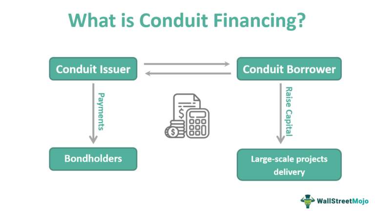

This article explores the themes of conduit financing and algorithmic trading, two significant concepts reshaping the modern financial landscape. Understanding both their risks and benefits can provide valuable insights for investors looking to make informed decisions.

Conduit financing serves as a unique mechanism for raising capital, particularly for large-scale, public-benefiting projects such as schools, hospitals, and airports. This method uses tax-exempt municipal bonds and typically involves a public-private partnership structure. Revenue generated from the project is used to repay bondholders, distinguishing it from traditional municipal financing that relies on municipal credit.



Algorithmic trading, on the other hand, is revolutionizing trading environments by employing high-speed automated processes to execute trades. It represents a substantial portion of daily global financial trades and offers advantages such as precision, speed, and reduced human error. Moreover, algorithmic trading has the potential to efficiently diversify portfolios and reduce trading costs.

Both conduit financing and algorithmic trading carry considerable upsides. However, they also expose investors to certain risks, necessitating a thorough understanding and assessment. By examining these aspects, this article aims to help investors navigate these methods, balancing potential returns against inherent risks and aligning their investments with their individual risk tolerance. As the financial world continues to evolve, staying informed about these impactful methods is essential for achieving success in the investment landscape.

## Table of Contents

## Understanding Conduit Financing

Conduit financing is a strategic mechanism employed to raise capital through tax-exempt municipal bonds, primarily aimed at funding public-benefit projects such as schools, hospitals, and airports. Unlike traditional municipal bonds that rely on the creditworthiness of the issuing municipality, conduit financing shifts the repayment responsibility to the revenue generated by the specific project being funded. This structure provides an alternative means of capital raising that can facilitate significant infrastructural developments without placing a direct financial burden on the municipality’s budget.

The key to understanding conduit financing lies in its public-private partnership structure. Typically, a governmental entity issues municipal bonds on behalf of a private or non-profit borrower. This borrower, often referred to as the conduit borrower, utilizes the funds raised to undertake public-benefit projects. The financial responsibilities are delineated such that the conduit borrower is responsible for making the bond payments. In effect, the bondholders' repayments are secured by the revenues generated from the project. For example, a hospital financed through conduit bonds would utilize its operational revenues to meet these financial obligations.

The structure of a conduit financing project often involves multiple stakeholders, including the issuing governmental entity, the conduit borrower, financial institutions, and bondholders. Each stakeholder has a specific role to play in the process. The issuing governmental entity provides the tax-exempt status to the bonds, enhancing their attractiveness to investors by offering potential tax benefits. The conduit borrower, on the other hand, is tasked with the implementation and operation of the project, ensuring it generates sufficient revenue to service the debt.

Repayment responsibility primarily lies with the project’s performance, which can introduce an element of risk. Unlike general obligation bonds, which are backed by the full faith and credit of the issuing municipality, conduit bonds' creditworthiness is tied to the project's success. This necessitates thorough due diligence and comprehensive financial projections to convince investors of the project's viability.

In conclusion, conduit financing represents a dynamic approach to funding public-benefit projects through a collaborative framework. It leverages the private sector's efficiency and innovation while providing public-sector support through tax-exempt financing. This method enables significant infrastructure developments without direct fiscal obligations on local governments, thereby broadening the scope for community enhancements and economic growth.

## Risks of Conduit Financing

Conduit financing represents a unique opportunity for investors to participate in funding projects that traditionally convey public benefits, such as schools, hospitals, and infrastructure projects like airports. However, unlike traditional municipal bonds, conduit bonds [carry](/wiki/carry-trading) a different risk profile primarily centered around the project's ability to generate sufficient revenue for repayment. It is crucial for investors to assess these risks comprehensively before committing capital.

One of the primary concerns is the reliance on project-specific revenues rather than municipal guarantees. This means that the project's financial success is pivotal to bond repayment. Investors need to meticulously analyze the project's particulars, including the projected revenue streams, anticipated costs, and the timeline for project completion. A detailed examination of revenue forecasts is essential because an overestimation could lead to a default on bond repayments. 

Default risk in conduit financing is inherently higher than with traditional municipal bonds because repayment depends entirely on the project's success, not on the creditworthiness of the municipal entity. To mitigate this risk, detailed project evaluation is necessary. This evaluation includes assessing the feasibility of revenue projections, understanding market demand, and considering any potential regulatory or operational hiccups that could impede progress.

Investors are encouraged to perform a thorough due diligence process. Evaluative metrics could include analyzing net present value (NPV) and internal rate of return (IRR) calculations, which can offer insights into the project's profitability. For instance, if a project’s cash flow is defined by $CF_t$ at time $t$, and $r$ is the discount rate, the NPV can be calculated as:

$$
NPV = \sum_{t=0}^{n} \frac{CF_t}{(1 + r)^t}
$$

A positive NPV suggests that the project's returns exceed the cost of capital, thus potentially reducing the default risk.

In summary, while conduit financing offers attractive opportunities, especially through potentially higher yields, it requires a robust understanding of the underlying project's ability to generate revenue. A comprehensive risk assessment framework, taking into account project specifics, costs, timelines, and market conditions, is imperative for investors aiming to mitigate the inherent risks associated with conduit financing.

## Benefits of Conduit Financing

Conduit financing offers several benefits that make it an attractive option for investors, particularly when compared to traditional municipal bonds. One of the primary advantages is the potential for higher yields. This is largely due to the increased risk associated with conduit bonds, as they rely on project-generated revenues rather than municipal guarantees. Investors who are willing to assume this additional risk can enjoy returns that are often significantly higher than those offered by more traditional options.

Tax benefits also play a crucial role in enhancing the attractiveness of conduit financing. Interest income from these bonds is often exempt from federal taxes, and in many cases, may also be exempt from state and local taxes, depending on the jurisdiction and the specific project. This tax-exempt status can make the effective yield on conduit bonds even more competitive, providing a compelling incentive for investors seeking tax-efficient income streams.

Another significant advantage is the relative ease of ownership transfer. Conduit bonds typically offer enhanced [liquidity](/wiki/liquidity-risk-premium) when compared to corporate bonds. This ease of transferability can be particularly advantageous in secondary markets, where investors may wish to quickly adjust their portfolios in response to changing market conditions or personal financial goals.

These benefits combine to make conduit bonds an appealing consideration for investors. Despite the inherent risks, such as dependency on the success and revenue generation of specific projects, the potential for higher yields, tax advantages, and liquidity makes conduit financing a versatile and powerful tool in an investor’s portfolio. These attributes illustrate why, despite the associated risks, conduit bonds remain a popular choice among discerning investors looking to diversify their holdings with tax-advantaged, higher-yield assets.

## The Rise of Algorithmic Trading

Algorithmic trading, also known as algo-trading or automated trading, utilizes computer programs to execute buy and sell orders on financial markets at speeds and frequencies that are impossible for human traders. This method leverages advanced algorithms to analyze trading patterns, determine the best prices, and execute trades autonomously with precision and optimal timing.

In today's financial markets, [algorithmic trading](/wiki/algorithmic-trading) has become a dominant force, accounting for a substantial portion of daily transaction volumes. Its rise to prominence can be attributed to several key advantages it offers over traditional manual trading methods.

Firstly, the precision of algorithmic trading ensures that trades are executed at the most favorable conditions available within the market. Algorithms employ real-time data to assess market conditions and execute orders without the delays associated with human decision-making processes. This accuracy minimizes slippage, i.e., the difference between the expected price of a trade and the actual price at execution, which can erode potential profits in highly volatile markets.

Secondly, speed is a critical [factor](/wiki/factor-investing) in algo-trading. Automated systems operate at millisecond-level speeds, allowing traders to capitalize on fleeting market opportunities that human traders might miss. This speed advantage enables the execution of high-frequency trading ([HFT](/wiki/high-frequency-trading-strategies)) strategies, where profitability hinges on conducting a large number of trades within short timeframes.

Moreover, algorithmic trading significantly reduces human error, which can arise from emotional decision-making or fatigue. By eliminating the human element, algorithms ensure that trading decisions are consistently based on pre-set criteria and statistical models, thereby improving reliability and performance.

Beyond these benefits, algorithmic trading provides the ability to efficiently diversify portfolios. By spreading trades across various asset classes and markets, algorithms can mitigate risks associated with individual investments. Portfolio diversification is achieved by concurrently running multiple strategies, each with tailored risk management parameters.

Lastly, one of the most compelling reasons for the widespread adoption of algorithmic trading is the reduction of trading costs. Automated systems can optimize the timing and sizing of trades to minimize transaction fees and market impact, enhancing overall profitability for traders and institutional investors.

The amalgamation of precision, speed, reduced error margins, diversification capabilities, and cost efficiencies underscores the transformative impact of algorithmic trading on the financial industry. As technological advances continue to progress, the prevalence and sophistication of algorithmic trading strategies are expected to expand further, reshaping modern financial markets.

## Risks of Algorithmic Trading

Algorithmic trading, while offering numerous advantages, also comes with a range of risks that investors must consider. One primary concern is the potential for technical failures, which can lead to significant financial losses. These failures can arise from hardware malfunctions, network issues, or software bugs. For instance, a system may be unable to execute trades at the intended speed, or may execute incorrect trades due to errors in the trading algorithm. Such incidents can result in substantial financial consequences, especially in fast-moving markets where delays or inaccuracies can lead to missed opportunities or inadvertent exposures.

Regulatory challenges also present risks for algorithmic trading. The fast-paced and automated nature of these trades can potentially facilitate market manipulation, such as spoofing or layering, where false market signals are generated to deceive other traders. Regulatory bodies continuously tighten controls to prevent such activities, but staying compliant with these regulations requires ongoing adjustments to trading algorithms. Additionally, differing regulatory environments across jurisdictions can complicate compliance for firms operating internationally.

Market [volatility](/wiki/volatility-trading-strategies) is another risk factor inherently tied to algorithmic trading. Many trading algorithms are designed to make decisions based on current market conditions; however, in highly volatile markets, these algorithms can react too quickly to price changes, leading to increased trading volumes and potential market disruptions. The "Flash Crash" of May 6, 2010, serves as a historical example when algorithms contributed to rapid market declines within minutes, followed by an equally rapid recovery. Such events highlight the potential for algorithms to amplify market movements.

Investors can mitigate these risks through several strategies. Implementing real-time monitoring systems allows for the early detection of technical issues and irregular trading patterns, enabling prompt corrective actions. Regular audits and stress testing of trading algorithms ensure they perform correctly under different market conditions. Additionally, establishing risk management protocols, such as setting predefined limits on trade volumes or employing circuit breakers, can prevent runaway trading and minimize losses.

Overall, while algorithmic trading offers significant benefits in terms of speed and efficiency, understanding and addressing its risks is crucial for safeguarding against financial losses and ensuring regulatory compliance.

## Future Trends in Algorithmic Trading

The future of algorithmic trading is poised for significant transformation, driven by advancements in [artificial intelligence](/wiki/ai-artificial-intelligence) (AI), big data, cloud computing, and evolving regulatory frameworks. The integration of AI and [machine learning](/wiki/machine-learning) into algorithmic trading systems promises to enhance their capabilities by enabling more sophisticated data analysis, pattern recognition, and predictive modeling. Traders are increasingly leveraging AI to process vast amounts of market data in real-time, improving decision-making accuracy and potentially increasing profitability.

One of the key advantages of AI in trading is the ability to implement adaptive algorithms that learn from historical data and adjust their strategies based on changing market conditions. For example, machine learning techniques such as decision trees, neural networks, and [reinforcement learning](/wiki/reinforcement-learning) can be used to refine trading strategies over time. Consider the following Python code snippet demonstrating a simple machine learning model applied to stock price prediction:

```python
from sklearn.ensemble import RandomForestRegressor
import numpy as np

# Sample feature set and target stock prices
X = np.array([[1.2, 0.7], [1.8, 1.1], [2.3, 1.5]])  # e.g., features like [volume](/wiki/volume-trading-strategy) and volatility
y = np.array([150, 155, 160])  # stock prices

# Initialize and train the model
model = RandomForestRegressor(n_estimators=100)
model.fit(X, y)

# Predicting future stock prices
future_features = np.array([[2.0, 1.2]])
predicted_price = model.predict(future_features)
print(predicted_price)
```

Cloud computing is democratizing access to sophisticated trading technologies, making it feasible for smaller firms to compete with larger institutions by providing scalable resources for data storage and computational power. This not only reduces the barriers to entry in algorithmic trading but also facilitates the implementation and testing of complex trading algorithms without the need for substantial upfront investments in infrastructure.

Regulatory advancements are expected to play a crucial role in shaping the future of algorithmic trading. Regulators worldwide are increasingly focusing on ensuring market stability and preventing abuse through high-frequency trading. Future regulations may include stricter requirements for risk management, algorithm testing, and transparency. These regulatory developments aim to create a safer trading environment that fosters investor confidence while minimizing the potential for market manipulation.

The evolution of algorithmic trading will likely continue to impact global financial markets by increasing efficiency, enhancing liquidity, and reducing transaction costs. As technologies evolve, market participants must remain agile, adapting to new tools and frameworks to maintain a competitive edge. Integrating AI, capitalizing on cloud resources, and navigating the regulatory landscape will be essential for traders seeking to harness the full potential of algorithmic trading in the years to come.

## Conclusion

Conduit financing and algorithmic trading have both significantly transformed the investment landscape, providing innovative approaches and altering how funds are raised and trades executed. Knowledge of their respective risks and benefits is critical for making informed investment decisions. Conduit financing offers the potential for high returns, especially through tax-exempt benefits on municipal bonds, but carries the inherent risk of project-specific revenue generation challenges. Understanding the financial structure and repayment responsibilities in such projects can help investors manage these risks effectively.

Algorithmic trading, on the other hand, has revolutionized trading with its ability for high-speed execution and enhanced precision while minimizing human error. Nonetheless, the risks linked to technical failures, regulatory challenges, and heightened market volatility cannot be overlooked. Investors leveraging algorithmic trading strategies need to ensure robust risk management techniques and keep abreast of evolving regulations and technological advancements.

Investors should aim to balance potential returns against associated risks, ensuring alignment with their individual risk tolerance and investment objectives. As the financial world continues to evolve, it remains paramount for investors to stay well-informed about these innovative financing and trading methods to harness their full potential for long-term success in the ever-changing market environment.

## References & Further Reading

[1]: Fabozzi, F. J., & Jacobs, M. T. (2007). ["Conduit Financing's Role in Public Finance."](https://books.google.com/books/about/Bond_Markets_Analysis_and_Strategies_ten.html?id=bQpNEAAAQBAJ) Journal of Accounting and Public Policy, 26(3), 333-349.

[2]: Johnson, B. (2010). ["Algorithmic Trading & DMA: An Introduction to Direct Access Trading Strategies"](https://archive.org/details/algorithmictradi0000john). 4Myeloma Press.

[3]: Narang, R. K. (2009). ["Inside the Black Box: A Simple Guide to Quantitative and High-Frequency Trading"](https://onlinelibrary.wiley.com/doi/book/10.1002/9781118267738). Wiley Finance.

[4]: LeClair, H. (2012). ["The Conduit Financing Mechanism: Risks and Rewards."](https://fastercapital.com/content/Conduit-Financing--Conduit-Financing--The-Pathway-to-Liquidity-for-Special-Purpose-Entities.html) National Real Estate Investor.

[5]: Goldberger, M. L. (2006). ["High-frequency Trading: A Practical Guide to Algorithmic Strategies and Trading Systems"](https://search.library.wisc.edu/catalog/9911065844902121). McGraw-Hill Education.