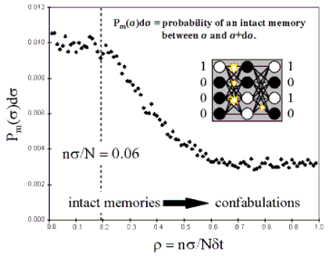

## Table of Contents

## What is confabulation in the context of machine learning?

Confabulation in machine learning refers to when a model generates information that sounds plausible but is actually incorrect or made up. This often happens with large language models that are trained to predict the next word in a sequence. Because these models aim to generate coherent and fluent text, they might sometimes fill in gaps with invented details that seem to fit the context but are not based on any real data or facts.

For example, if you ask a language model about a historical event it hasn't been specifically trained on, it might provide a detailed but entirely fabricated account. This can be misleading because the generated text can appear convincing and authoritative. To mitigate confabulation, developers use techniques like fine-tuning models on more accurate datasets and implementing fact-checking mechanisms to verify the information the model produces.

## How does confabulation differ from hallucination in AI?

Confabulation and hallucination are similar ideas in AI, but they have small differences. Confabulation happens when an AI makes up information that sounds right but is not true. It's like when the AI tries to fill in the blanks with what it thinks should be there, but it gets it wrong. This often happens because the AI wants to keep talking and make sense, even if it doesn't know the real answer.

Hallucination in AI is a bit broader. It's when the AI creates things that aren't real at all, like images or text that don't match any real-world data. Hallucinations can be more obvious because they might not even try to fit into the context. Both confabulation and hallucination can be confusing, but confabulation tries to sound more believable by fitting into the conversation, while hallucinations might be more out of place.

In simple terms, confabulation is like telling a story with made-up details to sound right, while hallucination is like seeing things that aren't there at all. Both can happen in AI, and they show how AI can sometimes get things wrong when trying to be helpful or creative.

## What are the common causes of confabulation in machine learning models?

Confabulation in [machine learning](/wiki/machine-learning) models often happens because these models are designed to predict the next piece of information, like a word or a sentence. They learn from huge amounts of data and try to guess what comes next based on patterns they've seen before. Sometimes, when the model isn't sure what the right answer is, it will make up something that sounds right based on those patterns. This can lead to the model giving wrong information that seems believable.

Another reason for confabulation is that models are trained to keep the conversation going smoothly. They aim to be helpful and provide answers, even if they don't have the exact information needed. So, they might fill in gaps with made-up details to keep the flow of the conversation. This happens a lot in language models that are good at sounding fluent but might not always check if what they're saying is true.

## Can you explain a simple example of confabulation in a neural network?

Imagine you're asking a language model about a made-up historical event called "The Great Pumpkin Festival." The model, trying to be helpful, might start talking about how "The Great Pumpkin Festival" was celebrated every year in a small town in the 1800s, with people gathering to carve pumpkins and share stories. This sounds like it could be true, but it's all made up by the model. The model didn't find this event in its training data; it just guessed what a festival like this might be like based on other things it knows about history and celebrations.

This happens because the model is trained to predict the next word or phrase in a sentence. It looks at the patterns in the text it was trained on and tries to fill in the blanks with what seems to fit best. If the model doesn't have specific information about "The Great Pumpkin Festival," it will use general knowledge about festivals and history to make up a story that sounds believable. This is confabulation – the model is confidently providing details that are not based on any real data, just what it thinks should be there to make the story sound right.

## What are the potential impacts of confabulation on AI system performance?

Confabulation can make AI systems less trustworthy. When an AI makes up information that sounds right but is actually wrong, people might start doubting everything the AI says. This can be a big problem in areas like healthcare or finance, where getting the right information is really important. If an AI system gives out wrong information because of confabulation, it could lead to bad decisions or even harm.

Also, confabulation can make it harder for AI to learn and improve over time. If an AI keeps making up details and using those made-up details to learn, it might start believing its own stories. This can create a loop where the AI gets more and more confused about what's real and what's not. Fixing this problem can take a lot of work, like retraining the AI with better data or adding checks to make sure the information it gives is correct.

## How can confabulation be detected in machine learning models?

Detecting confabulation in machine learning models involves checking if the information the model gives is correct. One way to do this is by comparing what the model says to known facts or databases. For example, if the model talks about a historical event, you can check history [books](/wiki/algo-trading-books) or online sources to see if what the model said is true. If the model often gives information that doesn't match these sources, it might be confabulating.

Another way to detect confabulation is by using other AI models to check the first model's answers. These other models can be trained to spot when something sounds right but is actually wrong. By having these models work together, you can catch confabulations more easily. It's like having a friend who knows a lot and can tell you when something you say doesn't sound right. This method helps make sure the information from the main model is more trustworthy.

## What techniques are used to mitigate confabulation in AI?

To reduce confabulation in AI, one common technique is to use more and better training data. By giving the AI lots of accurate information, it can learn what's true and what's not. This helps the AI give correct answers instead of making things up. Another way is to use fact-checking systems. These systems check the AI's answers against real facts from databases or the internet. If the AI says something that doesn't match the facts, the system can correct it or tell the AI to try again.

Another technique is to train AI models to be more unsure when they don't know something. Instead of making up an answer, the AI can say it's not sure or ask for more information. This can be done by changing how the AI is taught to respond, making it value honesty over always having an answer. Also, using other AI models to check the main model's work can help. These other models can spot when the main model is making things up and stop it from giving wrong information.

## How does confabulation affect the reliability of AI in critical applications?

Confabulation can seriously hurt how much we can trust AI in important jobs. In places like hospitals or banks, where getting things right is super important, AI making up information can be dangerous. If a doctor uses AI to help diagnose a patient and the AI makes up symptoms or treatments, it could lead to the wrong treatment and harm the patient. The same goes for banks where AI might make up numbers or facts about a customer's account, leading to wrong decisions about loans or investments.

To fix this, people working on AI try to make sure it uses good, true information to learn from. They also add checks to make sure what the AI says matches real facts. By doing this, they can lower the chances of the AI making things up and increase how much we can trust it in important jobs. But it's a tricky problem, and they have to keep working on it to make sure the AI stays reliable and safe to use.

## What role does training data quality play in reducing confabulation?

Training data quality is really important for reducing confabulation in AI. When AI learns from good, true information, it's less likely to make up stuff. If the data has a lot of wrong or made-up information, the AI might learn to do the same thing. So, using clean and correct data helps the AI know what's real and what's not, making its answers more trustworthy.

To make sure the training data is good, people check it carefully before using it to train the AI. They take out any wrong information and add more facts to help the AI learn better. By doing this, they can lower the chances of the AI making up things and help it give correct answers. This way, the AI becomes more reliable and safer to use in important jobs.

## Are there specific machine learning algorithms more prone to confabulation?

Some machine learning algorithms are more likely to confabulate than others. For example, large language models like those based on transformer architectures, such as BERT or GPT, are more prone to confabulation. These models are designed to predict the next word or phrase in a sequence, and they do this by learning patterns from huge amounts of text data. If they don't have specific information about a topic, they might make up details that sound right but are actually wrong.

On the other hand, algorithms like decision trees or support vector machines, which are often used for classification tasks, are less likely to confabulate. These models make decisions based on clear rules or boundaries learned from the data. They don't generate new information in the same way language models do, so they are less likely to make things up. However, any model can confabulate if it's trained on poor quality data or if it's not designed to handle uncertainty well.

## How do advanced models like transformers handle or exhibit confabulation?

Advanced models like transformers, which are used in large language models such as BERT and GPT, are more likely to confabulate because they are designed to predict the next word or phrase in a sequence. They learn from huge amounts of text data and try to guess what comes next based on patterns they've seen before. If they don't have specific information about a topic, they might make up details that sound right but are actually wrong. This happens because transformers are good at creating fluent and coherent text, even if they don't know the exact answer. They aim to keep the conversation going smoothly, so they might fill in gaps with made-up details to make the story sound believable.

To reduce confabulation in transformers, developers use better training data and add fact-checking systems. By giving the model lots of accurate information, it can learn what's true and what's not, helping it give correct answers instead of making things up. Fact-checking systems check the model's answers against real facts from databases or the internet. If the model says something that doesn't match the facts, the system can correct it or tell the model to try again. This helps make the model more reliable and trustworthy, especially in important jobs where getting things right is crucial.

## What are the latest research developments aimed at understanding and reducing confabulation in machine learning?

Recent research in machine learning has been focusing on understanding and reducing confabulation, especially in large language models. One key approach is improving the training data quality. Researchers are working on better ways to clean and verify the data used to train these models. They're also developing methods to teach models to recognize when they don't know something and to respond with uncertainty instead of making up information. This can be done by adjusting the model's training to reward honesty and penalize confabulation. Another technique involves using multiple models to cross-check each other's outputs, which helps catch and correct made-up details.

Another area of research is developing new algorithms and techniques to detect confabulation. For example, some studies are looking into ways to measure the confidence of a model's output. If a model's confidence is low, it might be more likely to be confabulating. Researchers are also exploring the use of external knowledge bases and fact-checking systems to verify the information generated by AI models. By integrating these systems, models can be prompted to double-check their answers against known facts, reducing the chance of confabulation. These efforts aim to make AI more reliable and trustworthy, especially in critical applications where accuracy is essential.