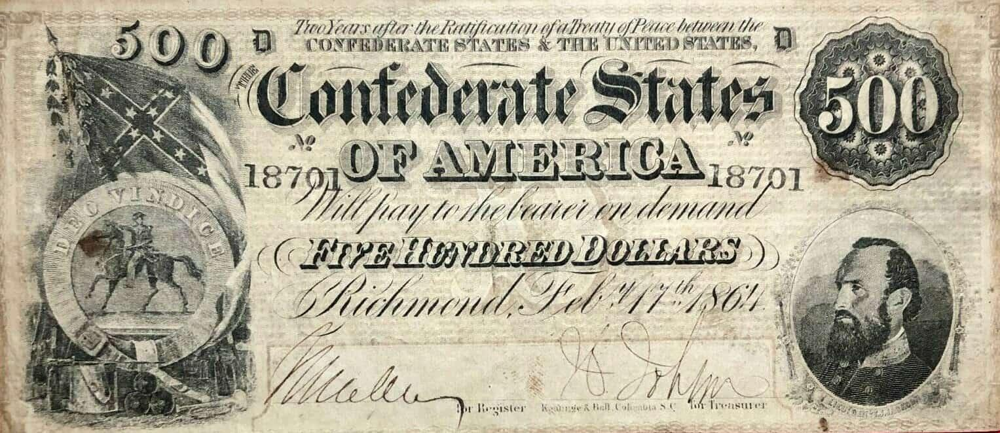

The Confederate dollar, also known as the Confederate States Dollar (CSD), was the official currency used by the Confederate States of America during the Civil War, spanning from 1861 to 1865. This currency emerged from a time of considerable upheaval and serves as a pivotal example of the complexities involved in wartime economics and the consequences of unbacked monetary systems.

In this article, we will examine the history of the CSD, exploring the economic and political conditions that led to its introduction and eventual downfall. The Confederate dollar's short existence and its ultimate devaluation provide valuable insights into fiscal mismanagement during war, illuminating the stark challenges faced by the Confederate government as they struggled with inflation and currency devaluation in the lack of a gold or silver standard.



Moreover, the influence of historical currencies like the Confederate dollar extends into modern financial technologies, notably algorithmic trading. In contemporary financial markets, understanding the implications of past monetary systems, including their failures, aids in developing algorithms designed to cope with economic volatility and manage risks effectively. Algorithmic trading systems utilize vast datasets to forecast market behavior, and historical currencies offer crucial lessons for improving prediction models and financial resilience.

Additionally, the Confederate dollar holds considerable collectible value today, capturing the interest of historians and collectors alike. The notes and coins from this era provide tangible connections to a significant historical period, offering insights into the Confederate states' cultural and socio-economic aspects during the Civil War. For collectors, Confederate currency not only represents monetary worth but also stands as a testament to American history, encapsulating the broader narrative of conflict and its financial repercussions.

By understanding the Confederate dollar, we gain a deeper comprehension of the intricate balance between fiscal policy and economic stability both in the past and in modern applications, enhancing our approach to contemporary financial systems.

## Table of Contents

## What Was the Confederate Dollar (CSD)?

The Confederate dollar (CSD) was introduced in 1861 as the official currency of the Confederate States of America, a coalition of eleven Southern states that seceded from the United States at the onset of the American Civil War. This currency was structured as a promissory note, pledging payment six months following the war, contingent upon a Confederate victory. Lacking backing by gold or silver, the CSD was fundamentally speculative, relying on the hopeful anticipation of a successful outcome for the Confederacy.

Initially, these notes were accepted and circulated within the Southern states, facilitating trade and transactions during the war. However, as the war progressed and the prospects for a Confederate victory dimmed, the value of these notes rapidly diminished. The absence of tangible asset backing exacerbated the devaluation, which resulted from overproduction and increasing public skepticism about the Confederacy's ability to prevail.

The decline of the Confederate dollar reflects the precarious nature of the Confederate economy during the Civil War. By the end of the conflict, the currency had lost its worth entirely, reflective of the Confederacy's dissolution and ultimate defeat. This outcome underscores the significant risks associated with issuing unbacked currency, particularly amidst the instability and uncertainty of wartime conditions.

## Understanding the Fall of the Confederate Dollar

The Confederate dollar's decline primarily stemmed from unchecked inflation driven by the extensive issuance of currency not supported by tangible assets. At the onset of the Civil War, the Confederate government anticipated a swift victory and, in its optimism, resorted heavily to printing money as a means of financing the war effort. This decision, however, inadvertently initiated a cycle of inflation and devaluation. Lacking the backing of gold or silver reserves, the Confederate dollar was essentially a speculative instrument whose value relied on the South's military success.

This economic model severely underestimated the protracted nature of conflict and the economic complexities at play. As the war dragged on, the Southern states found themselves in dire need of funds, leading to continuous increases in the money supply, which significantly devalued the currency. The supply of paper money escalated without a corresponding increase in goods and services, precipitating hyperinflation. 

Complicating matters was the issue of counterfeiting, which was rampant throughout the Confederate states. The Union engaged in deliberate efforts to destabilize the Confederate economy by flooding it with counterfeit currency. Such operations exacerbated public mistrust and further eroded the value of Confederate notes. As confidence diminished, even legitimate notes were viewed with skepticism, undermining their role as a medium of exchange.

By the conclusion of the Civil War, the Confederate dollar had become virtually worthless. Its demise not only strained civilian life, forcing many into poverty, but also devastated the Southern economy, which relied heavily on its now-defunct currency. Prices for goods skyrocketed, and bartering became a common necessity.

The fall of the Confederate dollar imparts crucial lessons on the importance of sound fiscal policy and the requirement for proper backing of a nation's currency. The Confederate experience underscores the perils of reliance on unbacked fiat money during times of uncertainty and the potential economic instability caused by an unchecked increase in money supply. The Confederate dollar's story remains a stark reminder of the critical need for economic prudence and foresight in monetary policies.

## The Design and Production of Confederate Notes

Confederate currency, issued during the American Civil War, featured a distinctive design characterized by a range of images that served both artistic and propagandistic purposes. The designs primarily depicted scenes and figures representative of the Confederate States of America's ideals and social structure. Common motifs included illustrations of slaves, naval vessels, and political and military leaders of the Confederacy. These images were intentionally chosen to symbolize Southern nationalism and to galvanize public sentiment among the Confederate populace.

The production of these notes was significantly impacted by the limited resources available to the Confederacy. Unlike the Union, the Confederacy lacked a robust industrial infrastructure, which resulted in a wide variation in the quality of banknote printing. Many of the notes were produced by local printers due to the absence of a centralized system for currency production. This decentralized approach often meant that the notes were susceptible to wear, counterfeiting, and inconsistencies in design and quality.

The denominations of Confederate currency ranged broadly from 50 cents up to $1,000. This wide range was intended to facilitate everyday transactions as well as larger commercial exchanges. However, the uneven quality of production and the rudimentary security features of the notes contributed to pervasive counterfeiting. Counterfeit currency was a major issue throughout the war, as the inferior quality of the genuine notes made them easy to replicate. The Union also actively engaged in the production of counterfeit Confederate currency to destabilize the Southern economy further.

The imagery and design choices on Confederate notes offer insights into the cultural and social priorities of the Confederacy during the civil war. The depiction of slaves, for example, highlights the Confederacy’s commitment to the institution of slavery and its central role in the Southern economy and society. Naval ships and leaders underscored the Confederate states’ aspirations for legitimacy, military prowess, and independence from the Union. As such, these notes are not only financial instruments but also reflect the values and priorities of the Confederacy during this tumultuous period in American history.

## Modern Implications and the Role of Currency in Algorithmic Trading

While the Confederate dollar (CSD) is a historical artifact, its existence and eventual demise offer key lessons for modern finance, particularly in the specialized field of [algorithmic trading](/wiki/algorithmic-trading). Understanding the economic conditions that led to the CSD's rapid devaluation provides crucial insights in developing resilient trading systems in volatile markets.

Algorithmic trading, which automates trading decisions using pre-set rules and algorithms, relies heavily on historical data to predict future market behaviors. Historical currency trends, like those of the CSD, are integral to building models that anticipate economic fluctuations. The eventual collapse of the Confederate dollar, driven by unbacked currency issuance and rampant inflation, highlights the dangers of speculative financial practices without solid grounding in tangible assets. This serves as a valuable case study for algorithm developers working to create models that can withstand similar economic challenges.

Moreover, the Confederate economy's overreliance on speculative financial actions, such as excessive currency printing without backing, can inform risk management strategies today. Developers of algorithmic trading systems can implement simulations that incorporate scenarios similar to the Confederate dollar's inflationary spiral to evaluate how modern financial instruments might perform under stress. An example of such a simulation in Python might use historical price data to model a devaluation event:

```python
import numpy as np
import matplotlib.pyplot as plt

# Simulate a historical price time series with devaluation event
np.random.seed(0)
years = np.arange(1861, 1866, 0.1)
initial_value = 100
prices = initial_value * np.exp(-0.1 * (years - 1861))

# Introduce a devaluation event
prices += 50 * np.exp(-((years - 1864)**2) / 0.02)

plt.plot(years, prices, label='Simulated CSD Value')
plt.title('Simulated Devaluation of Confederate Dollar')
plt.xlabel('Year')
plt.ylabel('CSD Value')
plt.legend()
plt.show()
```

This example models a declining currency value punctuated by an abrupt devaluation, paralleling the Confederate dollar's history.

Furthermore, examining the Confederacy's financial policies offers critical lessons on the importance of responsible economic frameworks. Speculative financial models, detached from asset-backed standards, are fraught with risk, as evidenced by the Confederate experience. This cautionary tale underscores the importance of integrating historical lessons within modern algorithmic models to prevent similar pitfalls.

Exploring historical currencies through the lens of algorithmic trading also reflects the broader evolution of financial systems and technological progressions. By studying past economic events, traders can better understand the limitations and strengths of contemporary financial technologies, potentially leading to innovations that bolster market stability. As the financial world continues to advance, integrating historical precedents into algorithmic frameworks aims to enhance economic sustainability and minimize risks in the pursuit of financial growth.

## Collectibility and Legacy of the Confederate Dollar

Confederate currency, both notes and coins, is regarded today as valuable collectible items rather than legal tender. This currency holds significant appeal for collectors, historians, and Civil War enthusiasts due to its rarity and historical significance. The Confederate dollar, originally issued during the American Civil War, serves as an artifact that provides a tangible connection to this tumultuous period in U.S. history.

The rarity of surviving Confederate notes makes them highly sought after in auctions and dealer markets. The condition and rarity of these notes play a crucial role in determining their current value, with some fetching thousands of dollars. The shortages and destruction during the post-war period contributed to the scarcity of these pieces, enhancing their allure in the collectibles market.

Despite lacking monetary value since the fall of the Confederacy, these artifacts offer unique insights into a specific era, documenting socio-economic conditions, artistic expressions, and propaganda efforts. For collectors, the Confederate currency represents not just financial worth but also a piece of American heritage, encapsulating memories from a time that significantly shaped the nation's history.

This currency allows historians to study the societal values and economic challenges of the Confederate states. The imagery and motifs on the notes reflect cultural narratives and political sentiments of the era, providing context and understanding of the Confederate states' ideologies and aspirations.

In modern times, the Confederate currency's legacy persists as it bridges a historical narrative and remains a testament to the struggles and ambitions of a nation divided. Collectors and historians continue to seek these artifacts, not only for their monetary value but for the profound historical narrative they encompass, offering a window into the past that continues to inform and engage the present.

## Conclusion

The Confederate dollar, although it existed only briefly, serves as an essential case study of the repercussions that arise from the issuance of unbacked currency during times of political and economic instability. The failure of the Confederate dollar underscores the critical importance of sound fiscal policy and the necessity of backing currency by tangible assets to maintain its value and trust among its users.

The historical context of the Confederate dollar intertwines with the broader narrative of the Civil War, providing insights into the economic strategies employed by the Confederacy and their ultimate downfall. The lessons learned from this period illuminate the challenges of maintaining economic resilience in the absence of proper monetary support and highlight the potential pitfalls of speculative financial models.

Today, while the Confederate dollar is no longer a functional currency, it remains significant in both historical study and as a collectible artifact. The surviving pieces of Confederate currency function as bridges between the past and present, offering valuable insights into a tumultuous era. This historical perspective is not only crucial for researchers and historians but also provides a nuanced understanding of economic vulnerabilities in current financial systems.

In contemporary times, with the advent of advanced technologies such as algorithmic trading, historical instances like the Confederate dollar serve as cautionary tales. They remind us of the importance of robust monetary policies and risk management practices. By learning from past mistakes, modern economic systems aim to enhance stability and sustainability, utilizing historical datasets to refine predictive models and mitigate financial risks. Such understanding helps ensure that economic practices are informed by history, fostering a more resilient financial future.

## References & Further Reading

[1]: Davis, William C. (1996). ["A Government of Our Own: The Making of the Confederacy."](https://www.amazon.com/Government-Our-Own-Making-Confederacy/dp/0807121770) Louisiana State University Press.

[2]: Schweninger, Loren. (2008). ["Banking and Finance in the Confederacy."](https://en.wikipedia.org/wiki/Loren_Schweninger) Journal of American History.

[3]: Bowers, Q. David (2008). ["A Guide Book of Southern States Currency: The Complete Guide to Currency, Memorabilia, and Historical References from the Civil War Era."](https://en.wikipedia.org/wiki/Coin_cleaning) Whitman Publishing.

[4]: Taylor, John. (1950). ["Confederate Finance."](https://en.wikipedia.org/wiki/Confederate_war_finance) Duke University Press.

[5]: ["The Confederate States of America: What Might Have Been"](https://archive.org/details/confederatestate0000rans) by Roger L. Ransom

[6]: Buchanan, Thomas C. (2007). ["The Making of a Confederate: Walter Lenoir's Civil War"](https://archive.org/details/makingofconfeder0000barn) Oxford University Press.

[7]: Schwab, John Christopher. (1901). ["The Confederate States of America, 1861-1865: A Financial and Industrial History of the South during the Civil War."](https://archive.org/details/confederatestate00schw) Charles Scribner's Sons.