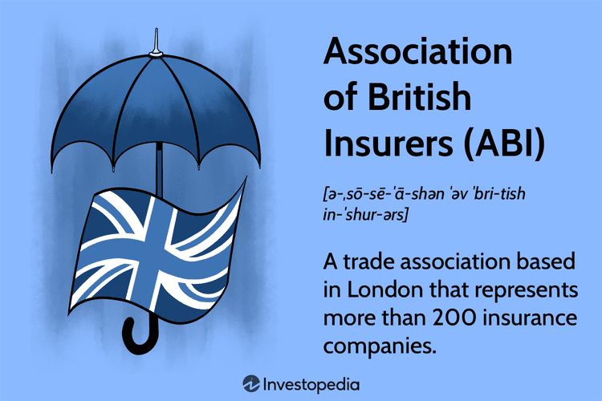

## Table of Contents

## What is the Confederation of British Industry (CBI)?

The Confederation of British Industry, or CBI, is a group in the UK that helps businesses. It started in 1965 and works to make things better for companies in Britain. The CBI talks to the government about what businesses need and want. It also helps businesses work together and share ideas.

The CBI has many members, from big companies to small ones. They all join to have a stronger voice when talking to the government. The CBI does research and gives advice to its members on how to grow their businesses. It also holds events where business people can meet and learn from each other.

## When was the CBI founded?

The Confederation of British Industry, or CBI, was founded in 1965. It was created to help businesses in the UK work together and have a stronger voice.

The CBI talks to the government about what businesses need. It helps companies, big and small, share ideas and grow.

## What is the primary purpose of the CBI?

The main goal of the Confederation of British Industry (CBI) is to help businesses in the UK. It was started in 1965 to give companies a strong voice when talking to the government. The CBI works to make sure that the needs and wants of businesses are heard and considered by people in charge.

The CBI helps businesses of all sizes, from big companies to small ones. It does research and gives advice to its members on how to grow their businesses. The CBI also holds events where business people can meet, share ideas, and learn from each other. This helps create a strong community of businesses working together.

## Who can become a member of the CBI?

Any business in the UK can join the CBI. This includes big companies, small businesses, and even businesses that are just starting out. The CBI wants to help all kinds of businesses, no matter their size or what they do.

To become a member, a business needs to pay a fee. This fee helps the CBI do its work, like talking to the government and doing research. By joining, businesses can be part of a big group that works together to make things better for everyone.

## How does the CBI influence UK government policy?

The CBI talks to the UK government a lot to help make rules that are good for businesses. They meet with people in the government to share what businesses need and want. The CBI does research and gives this information to the government. This helps the government understand what businesses are going through and what they need to do better.

Because the CBI has many members, it has a strong voice. When the CBI talks to the government, it speaks for a lot of businesses all over the UK. This makes the government listen more because they know the CBI is speaking for many companies. By working together, the CBI helps make sure that the government makes rules that help businesses grow and do well.

## What sectors does the CBI represent?

The CBI represents businesses from many different sectors in the UK. This includes big sectors like manufacturing, finance, and technology. It also includes smaller sectors like retail, construction, and agriculture. No matter what kind of business it is, the CBI works to help all of them.

The CBI makes sure that businesses from all these sectors have a say in what happens in the UK. They talk to the government about what each sector needs. This helps make sure that the rules and policies made by the government are good for everyone, not just one type of business. By working together, the CBI helps all kinds of businesses grow and succeed.

## Can you describe the organizational structure of the CBI?

The CBI has a clear way of working to help businesses in the UK. At the top, there is a President and a Director-General. The President is usually a well-known business leader who helps guide the CBI. The Director-General runs the day-to-day work and talks to the government a lot. They work together to make sure the CBI is doing what it needs to do for its members.

Below the President and Director-General, there are different teams that focus on specific areas. These teams work on things like policy, research, and events. Each team has people who know a lot about their area and work hard to help businesses. The CBI also has regional offices around the UK. These offices help businesses in different parts of the country and make sure their needs are heard.

The CBI also has a big group of members who help decide what the CBI should do. Members can join different groups and committees that focus on specific sectors or issues. These groups meet regularly to talk about what's important and what the CBI should be working on. This way, the CBI makes sure it's always listening to what its members need and want.

## How does the CBI support its members?

The CBI helps its members in many ways. It talks to the government about what businesses need and wants to make sure the rules help companies grow. The CBI does research and gives this information to its members. This helps businesses understand what is happening in their industry and how they can do better. The CBI also gives advice on how to run a business, like how to manage money or find new customers.

The CBI also holds events where members can meet and learn from each other. These events are good for sharing ideas and making new friends in business. The CBI has groups and committees for different sectors and issues. Members can join these groups to talk about what's important to them and help decide what the CBI should do. This way, the CBI makes sure it is always listening to its members and helping them in the best way possible.

## What are some major campaigns or initiatives led by the CBI?

The CBI has led many big campaigns and initiatives to help businesses in the UK. One big campaign is about making the UK a great place for businesses to grow. The CBI talks to the government to make rules that help companies, like making it easier to start a business or hire people. They also work on making sure businesses can sell their products to other countries. This helps UK companies make more money and create more jobs.

Another important initiative is about helping businesses be more green. The CBI helps companies learn how to use less energy and make less waste. They talk to the government about rules that help businesses be more friendly to the environment. This is important because it helps the planet and also helps businesses save money and be ready for the future.

## How does the CBI engage with international business communities?

The CBI works with businesses from other countries to help UK companies do well around the world. They talk to other business groups and governments to make it easier for UK companies to sell their products in other countries. The CBI also helps UK businesses learn about what is happening in other countries. This way, UK companies can find new customers and grow their business.

The CBI also joins big groups like the International Chamber of Commerce and the Business and Industry Advisory Committee to the OECD. By being part of these groups, the CBI can help make rules that are good for businesses everywhere. They share ideas and work together to make the world a better place for companies to grow and succeed.

## What role does the CBI play in economic forecasting and analysis?

The CBI helps businesses by looking at what might happen in the economy. They do this by collecting information from their members and using it to make guesses about the future. This is called economic forecasting. The CBI asks businesses about things like how much they are selling, how many people they are hiring, and what they think will happen next. By putting all this information together, the CBI can tell businesses if the economy might get better or worse.

The CBI also does a lot of research and analysis. They look at numbers and facts to understand what is happening in different parts of the economy. This helps businesses make smart choices. For example, the CBI might study how much money people are spending or how many jobs are being created. They share this information with their members so that companies can plan for the future. By doing this, the CBI helps businesses be ready for what might happen next.

## How has the CBI's role evolved in response to Brexit and other global economic changes?

The CBI has changed a lot because of Brexit and other big changes in the world's economy. Before Brexit, the CBI helped UK businesses work with other countries in the European Union. But when the UK decided to leave the EU, the CBI had to help businesses understand the new rules and find new ways to sell their products. The CBI talked to the government a lot to make sure the new rules would help businesses. They also helped companies learn about new markets outside of Europe where they could sell their products.

Besides Brexit, the CBI has also had to deal with other big changes like the global health crisis and changes in technology. The CBI did a lot of research to help businesses understand what was happening and how they could keep going during tough times. They gave advice on how to use new technology and work from home. The CBI also helped businesses think about how to be more green, which is important for the future of the economy. By doing all these things, the CBI has kept helping UK businesses stay strong and grow, no matter what changes come their way.

## References & Further Reading

[1]: Clapham, B. (2016). ["The CBI: The Confederation of British Industry."](https://en.wikipedia.org/wiki/Confederation_of_British_Industry) Canadian Business History Association.

[2]: Aldridge, I. (2013). ["High-Frequency Trading: A Practical Guide to Algorithmic Strategies and Trading Systems."](https://www.amazon.com/High-Frequency-Trading-Practical-Algorithmic-Strategies/dp/1118343506) Wiley.

[3]: Hull, J. C. (2017). ["Options, Futures, and Other Derivatives."](https://www.pearson.com/en-us/subject-catalog/p/options-futures-and-other-derivatives/P200000005938/9780136939917) Pearson.

[4]: Cartea, Á., Jaimungal, S., & Penalva, J. (2015). ["Algorithmic and High-Frequency Trading."](https://assets.cambridge.org/97811070/91146/frontmatter/9781107091146_frontmatter.pdf) Cambridge University Press.

[5]: Hasbrouck, J., & Saar, G. (2013). ["Low-Latency Trading."](https://www.sciencedirect.com/science/article/abs/pii/S1386418113000165) Journal of Financial Markets, 16(4), 646-679. 

[6]: Narang, R. K. (2013). ["Inside the Black Box: A Simple Guide to Quantitative and High-Frequency Trading."](https://onlinelibrary.wiley.com/doi/book/10.1002/9781118662717) Wiley.

[7]: Gomber, P., Arndt, B., Lutat, M., & Uhle, T. (2011). ["High-Frequency Trading."](https://papers.ssrn.com/sol3/papers.cfm?abstract_id=1858626) Schmalenbach Business Review, 63(3), 270-288.