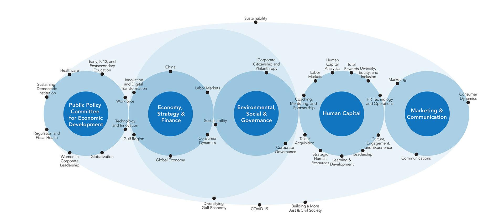

## Table of Contents

## What is The Conference Board?

The Conference Board is a non-profit organization that helps businesses around the world. It was started in 1916 and is based in New York City. The main goal of The Conference Board is to give businesses the information and tools they need to succeed. They do this by doing research, holding meetings, and creating reports on important business topics.

The Conference Board is known for its economic indicators, like the Consumer Confidence Index. This index measures how people feel about the economy and their financial future. Businesses use this information to make decisions. The Conference Board also helps companies with issues like leadership development, human resources, and corporate governance. They work with businesses of all sizes and in many different industries.

## When was The Conference Board founded?

The Conference Board was founded in 1916. It is a non-profit group that helps businesses all over the world. They are based in New York City.

Their main job is to give businesses the information and tools they need to do well. They do this by doing research, holding meetings, and making reports on important business topics.

## What are the main objectives of The Conference Board?

The Conference Board's main goal is to help businesses around the world do better. They do this by giving companies the information and tools they need to succeed. This includes doing research, holding meetings, and creating reports on important business topics. They focus on things like how the economy is doing and what people think about it, which helps businesses make smart choices.

Another big part of what The Conference Board does is helping companies with issues like leadership, human resources, and how they are run. They work with businesses of all sizes and in many different industries. By sharing knowledge and best practices, The Conference Board helps companies improve their operations and achieve their goals.

## Who are the typical members of The Conference Board?

The Conference Board has members from all over the world. These members are usually big companies and organizations. They come from different industries like business, finance, and technology. These members join The Conference Board to get help and information that can make their businesses better.

The members of The Conference Board are often leaders in their companies. They might be CEOs, managers, or people in charge of human resources. They use the research, reports, and meetings provided by The Conference Board to learn about the economy, how to lead their teams, and other important business topics. This helps them make good decisions for their companies.

## How does The Conference Board help businesses?

The Conference Board helps businesses by giving them important information and tools. They do research and make reports on things like the economy and what people think about it. This helps businesses understand what is happening in the world and make smart choices. For example, they have something called the Consumer Confidence Index, which tells businesses how people feel about their money and the future. This can help companies decide what to do next.

The Conference Board also helps companies with other important stuff like leadership and human resources. They hold meetings where business leaders can talk and learn from each other. This helps companies figure out how to run their business better and take care of their employees. The Conference Board works with businesses of all sizes and from many different industries, so everyone can get the help they need to do well.

## What types of research does The Conference Board conduct?

The Conference Board does a lot of different types of research to help businesses. They look at how the economy is doing and what people think about it. One of the big things they do is the Consumer Confidence Index. This tells businesses how people feel about their money and the future. It helps companies know if people are likely to spend more or save more. The Conference Board also studies things like how much businesses are selling, how many jobs there are, and how fast the economy is growing.

Besides looking at the economy, The Conference Board also does research on how businesses work inside. They study things like how to lead a company, how to manage people, and how to make a company run better. This kind of research helps businesses figure out how to make their employees happier and more productive. It also helps them learn how to make their company more successful and fair. By sharing this research, The Conference Board helps businesses all over the world do better.

## What are some key publications or reports produced by The Conference Board?

The Conference Board makes many important reports that help businesses. One of the biggest reports they make is the Consumer Confidence Index. This report tells businesses how people feel about their money and the future. It helps companies know if people are likely to spend more or save more. Another important report is the Employment Trends Index, which looks at how the job market is doing. This helps businesses plan for hiring and understand how many jobs there might be.

The Conference Board also makes reports about how businesses are doing inside. They have the CEO Challenge report, which asks CEOs what their biggest problems are. This helps other businesses see what challenges they might face too. Another report is the Human Capital Analytics report, which looks at how companies can use data to make their employees happier and more productive. These reports help businesses all over the world learn and grow.

## How does The Conference Board measure economic indicators?

The Conference Board measures economic indicators by collecting data and doing surveys. One of the most famous indicators they use is the Consumer Confidence Index. They ask people how they feel about their money and the future. This helps businesses know if people are likely to spend more or save more. The Conference Board also looks at how much businesses are selling, how many jobs there are, and how fast the economy is growing. They use this information to make reports that help businesses understand what is happening in the economy.

Another important economic indicator they measure is the Employment Trends Index. This index looks at how the job market is doing. The Conference Board collects data on things like how many people are working, how many jobs are available, and how many people are looking for work. This helps businesses plan for hiring and understand how many jobs there might be. By sharing these economic indicators, The Conference Board helps businesses make smart decisions based on what is happening in the economy.

## What is the role of The Conference Board in global business?

The Conference Board plays a big role in helping businesses all over the world. They do this by giving companies the information and tools they need to do well. The Conference Board does a lot of research and makes reports about things like the economy and what people think about it. For example, they have the Consumer Confidence Index, which tells businesses if people feel good or bad about their money and the future. This helps companies know if people are likely to spend more or save more. The Conference Board also looks at how businesses are doing inside, like how to lead a company and how to make employees happier and more productive.

The Conference Board helps businesses from many different countries and industries. They hold meetings where business leaders can talk and learn from each other. This helps companies figure out how to run their business better and take care of their employees. The Conference Board also makes reports like the Employment Trends Index, which tells businesses how the job market is doing. This helps companies plan for hiring and understand how many jobs there might be. By sharing all this information, The Conference Board helps businesses all over the world make smart decisions and do better.

## How does The Conference Board facilitate networking and collaboration among its members?

The Conference Board helps its members connect and work together by organizing meetings and events. These meetings bring together business leaders from different countries and industries. At these events, members can share ideas, talk about their challenges, and learn from each other. This helps them find new ways to solve problems and improve their businesses. The Conference Board makes sure these meetings are helpful by choosing topics that are important to many members and by inviting experts to speak.

The Conference Board also uses online tools to help members connect. They have a website where members can join groups based on their interests or the industry they work in. In these groups, members can ask questions, share information, and start discussions. This makes it easy for members to work together even if they are not at the same meeting or event. By using these online tools, The Conference Board helps members build relationships and work together to make their businesses better.

## What are the different types of membership available at The Conference Board?

The Conference Board offers different types of memberships to fit the needs of different businesses. They have memberships for big companies, small businesses, and even for people who work in certain jobs like human resources or finance. Each type of membership gives you access to different tools and information. For example, a big company might get to see special reports and join meetings that are only for big companies. A small business might get help with things like how to grow or manage their team.

Members can also choose to join groups that focus on specific topics or industries. This means you can be part of a group that talks about things like leadership, technology, or how to be more eco-friendly. These groups help members connect with others who have similar interests or challenges. By joining The Conference Board, businesses can get the information and support they need to do well, no matter what type of membership they choose.

## How can businesses leverage The Conference Board's data and insights for strategic planning?

Businesses can use The Conference Board's data and insights to make smart plans for the future. The Conference Board does a lot of research and makes reports about things like the economy and what people think about it. For example, they have the Consumer Confidence Index, which tells businesses if people feel good or bad about their money and the future. This helps companies know if people are likely to spend more or save more. By looking at this data, businesses can decide when to launch new products, how much to invest, and how to adjust their prices.

The Conference Board also helps businesses with things like leadership and human resources. They make reports like the Human Capital Analytics report, which looks at how companies can use data to make their employees happier and more productive. Businesses can use this information to plan how to train their employees, how to keep them motivated, and how to make their company a better place to work. By using The Conference Board's insights, businesses can make better decisions and create plans that help them grow and succeed.

## What are Business Cycle Indicators (BCI) and how do we understand them?

The Conference Board's Business Cycle Indicators (BCI) offer essential insights into economic trends, providing businesses with tools to forecast and adapt to changing economic conditions. BCIs are classified into three categories: leading, coincident, and lagging indicators, each serving distinct predictive and analytical purposes.

### Leading Indicators

Leading indicators are crucial for predicting future economic activity. These indicators typically change before the economy as a whole starts to follow a particular trend. Key components often include measures such as stock market returns, business inventories, and new business orders. For instance, an increase in new manufacturing orders might suggest an upcoming rise in production and economic activity. 

**Formula for Index of Leading Indicators (Sample):**

$$

\text{Composite Index} = \sum_{i=1}^{n} (w_i \cdot I_i) 
$$

Where:
- $w_i$ = weight for each component indicator
- $I_i$ = individual indicator index value
- $n$ = total number of indicators

These elements collectively provide a forecast of future economic performance, allowing businesses to adjust strategies proactively.

### Coincident Indicators

Coincident indicators reflect the current state of the economy, offering a real-time snapshot of economic activity. Examples include metrics like employment numbers, real GDP, and industrial production. These indicators are invaluable for confirming the phases of economic cycles. For instance, consistent high employment numbers and rising industrial production typically confirm an ongoing expansion phase in the economy.

### Lagging Indicators

Lagging indicators provide confirmation of trends and changes after the economy has begun to follow a particular path. They help verify long-term trends by showing results after economic shifts have occurred. Common lagging indicators include unemployment rates, corporate profits, and labor cost per unit of output. Though they do not predict future trends, they are instrumental in confirming past economic performance and trends. 

Understanding the interplay between these indicators enables businesses to gain a comprehensive picture of economic cycles. By analyzing leading indicators, decision-makers can predict economic shifts, while coincident and lagging indicators affirm these changes, facilitating informed and timely strategic adjustments. Businesses that adeptly interpret and leverage BCIs can achieve more resilient and adaptive economic planning strategies.

## References & Further Reading

[1]: Coffey, N. (2019). ["A Guide to Business Cycle Indicators."](https://www.amazon.com/Private-Equity-Playbook-Managements-Working/dp/B0DCGBZXCF) ResearchGate.

[2]: Lopez de Prado, M. (2018). ["Advances in Financial Machine Learning"](https://www.amazon.com/Advances-Financial-Machine-Learning-Marcos/dp/1119482089) John Wiley & Sons.

[3]: Shleifer, A., & Vishny, R. W. (1997). ["The Limits of Arbitrage."](https://onlinelibrary.wiley.com/doi/full/10.1111/j.1540-6261.1997.tb03807.x) The Journal of Finance, 52(1), 35-55.

[4]: Aronson, D. (2006). ["Evidence-Based Technical Analysis: Applying the Scientific Method and Statistical Inference to Trading Signals"](https://www.amazon.com/Evidence-Based-Technical-Analysis-Scientific-Statistical/dp/0470008741) John Wiley & Sons.

[5]: Chan, E. (2009). ["Quantitative Trading: How to Build Your Own Algorithmic Trading Business"](https://github.com/ftvision/quant_trading_echan_book) John Wiley & Sons.