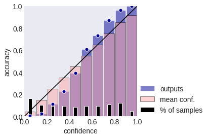

## Table of Contents

## What is confidence calibration in machine learning?

Confidence calibration in machine learning is about making sure a model's predictions are trustworthy. When a model says it's 90% sure about something, we want it to be right about 90% of the time. Sometimes, models can be overconfident or underconfident. Overconfident models might say they're 90% sure but only be right 70% of the time. Underconfident models might say they're 60% sure but actually be right 90% of the time. Calibration helps fix these issues so we can trust the model's confidence levels.

To calibrate a model, we often use a separate dataset to check and adjust the model's confidence. One common method is called Platt scaling, where we fit a logistic regression model to the model's output to better align the predicted probabilities with the actual outcomes. Another method is isotonic regression, which can handle more complex adjustments. By using these techniques, we can make the model's confidence more reliable, which is crucial for applications where trust in the model's predictions is important, like in medical diagnoses or autonomous driving.

## Why is confidence calibration important for machine learning models?

Confidence calibration is important for machine learning models because it makes sure the model's predictions are reliable. When a model tells you it's 90% sure about something, you want it to be right about 90% of the time. If the model is overconfident or underconfident, it can lead to bad decisions. For example, if a medical diagnosis model is overconfident, doctors might trust it too much and miss important details. On the other hand, if it's underconfident, they might not trust it enough and ignore useful information.

In real-world applications, having a well-calibrated model is crucial. For instance, in autonomous driving, if a model says it's 95% sure a road is clear but it's wrong more often than that, it could lead to accidents. Calibration helps align the model's confidence with its actual performance, making it safer and more useful. By using techniques like Platt scaling or isotonic regression, we can adjust the model's output to better match reality, ensuring that when the model gives a confidence score, it's something we can trust and act on.

## How does confidence calibration affect model performance?

Confidence calibration doesn't directly improve how well a model predicts things, but it makes the model's confidence scores more trustworthy. Imagine a model that's good at guessing if it will rain, but it always says it's very sure, even when it's wrong a lot. After calibration, the model might still predict rain at the same rate, but now its confidence matches how often it's actually right. This means when the model says it's 80% sure it will rain, it really will rain about 80% of the time.

This can be really important in real life. For example, in a hospital, if a model helps doctors decide if a patient needs more tests, it's crucial that the model's confidence is accurate. If the model says it's 90% sure a test is needed, and it's right about 90% of the time, doctors can trust it more. This doesn't make the model better at deciding if a test is needed, but it makes the confidence numbers more useful and reliable.

## What are the common methods used for calibrating model confidence?

One common method for calibrating model confidence is Platt scaling. This method uses a logistic regression model to adjust the model's output so that the confidence scores better match the actual outcomes. Imagine you have a model that predicts if it will rain. After training, you use another set of data to see how often it was right when it said it was 80% sure. Platt scaling helps adjust those 80% scores so that they really mean it will rain 80% of the time. The formula for Platt scaling is $$ p(y=1|x) = \sigma(A \cdot f(x) + B) $$, where $$ \sigma $$ is the sigmoid function, $$ f(x) $$ is the model's output, and $$ A $$ and $$ B $$ are parameters learned from the calibration data.

Another method is isotonic regression. This method is a bit more flexible than Platt scaling because it can handle more complicated adjustments. Instead of fitting a simple curve like in Platt scaling, isotonic regression finds a step-like function that makes the confidence scores match the actual outcomes as closely as possible. This can be really helpful if the relationship between the model's output and the actual outcomes is not straightforward. Both methods need a separate set of data to work, which is used to fine-tune the model's confidence scores without changing how the model makes its predictions.

These calibration methods are important because they help make the model's confidence scores more reliable. When a model says it's 90% sure about something, you want it to be right about 90% of the time. Calibration helps make sure that's the case, which is crucial for applications where trust in the model's predictions is important, like in healthcare or self-driving cars.

## Can you explain the difference between well-calibrated and miscalibrated models?

A well-calibrated model is one where the confidence it gives matches how often it's right. For example, if a well-calibrated model says it's 80% sure about something, it should be correct about 80% of the time. This makes the model's confidence scores trustworthy. Imagine a weather model that's well-calibrated. When it says there's an 80% chance of rain, it really does rain about 80% of the time. This helps people plan their day better because they can trust the model's predictions.

On the other hand, a miscalibrated model has confidence scores that don't match how often it's right. There are two types of miscalibration: overconfidence and underconfidence. An overconfident model might say it's 90% sure, but it's only right 70% of the time. An underconfident model might say it's 60% sure, but it's actually right 90% of the time. For instance, if a miscalibrated medical diagnosis model says it's 95% sure a patient has a certain condition, but it's wrong more often than that, doctors might make wrong decisions based on that overconfidence. Calibration methods like Platt scaling or isotonic regression help fix these issues by adjusting the model's confidence scores to better match reality.

## What is the role of calibration in classification tasks?

In classification tasks, calibration helps make sure the model's confidence scores are reliable. When a model predicts a class, it also gives a confidence score, like saying it's 80% sure the image is a cat. Calibration makes sure that when the model says it's 80% sure, it's right about 80% of the time. This is important because if people use the model's predictions to make decisions, they need to trust the confidence scores. For example, in a hospital, if a model helps doctors decide if a patient needs more tests, it's crucial that the model's confidence is accurate. If the model says it's 90% sure a test is needed, and it's right about 90% of the time, doctors can trust it more.

To calibrate a model, we often use methods like Platt scaling or isotonic regression. Platt scaling uses a logistic regression model to adjust the model's output so that the confidence scores better match the actual outcomes. The formula for Platt scaling is $$ p(y=1|x) = \sigma(A \cdot f(x) + B) $$, where $$ \sigma $$ is the sigmoid function, $$ f(x) $$ is the model's output, and $$ A $$ and $$ B $$ are parameters learned from the calibration data. Isotonic regression is a bit more flexible and can handle more complicated adjustments by finding a step-like function that makes the confidence scores match the actual outcomes as closely as possible. Both methods need a separate set of data to work, which is used to fine-tune the model's confidence scores without changing how the model makes its predictions.

## How can one evaluate the calibration of a model?

To evaluate the calibration of a model, you can use a calibration plot. This plot compares the model's predicted probabilities with the actual outcomes. Imagine you have a model that predicts if it will rain. You gather a bunch of predictions and see how often it actually rained when the model said it was 80% sure, 70% sure, and so on. If the model is well-calibrated, the points on the plot should line up closely with a perfect calibration line, which is a diagonal line from the bottom left to the top right of the plot. If the points are far from this line, the model might be overconfident or underconfident.

Another way to evaluate calibration is by using metrics like the Brier score or Expected Calibration Error (ECE). The Brier score measures the mean squared difference between the predicted probabilities and the actual outcomes. A lower Brier score means better calibration. The formula for the Brier score is $$ \text{Brier Score} = \frac{1}{N} \sum_{i=1}^{N} (f_i - o_i)^2 $$, where $$ f_i $$ is the predicted probability and $$ o_i $$ is the actual outcome (0 or 1). The Expected Calibration Error (ECE) splits the predictions into bins and calculates the average difference between the confidence and accuracy in each bin. A lower ECE means the model is better calibrated. These metrics help you see how reliable the model's confidence scores are.

## What are some popular calibration techniques like Platt scaling and isotonic regression?

Platt scaling is a popular way to calibrate a model's confidence. It works by fitting a logistic regression model to the model's output. Imagine your model says it's 80% sure about something. Platt scaling helps adjust that 80% so it really means the model is right 80% of the time. The formula for Platt scaling is $$ p(y=1|x) = \sigma(A \cdot f(x) + B) $$, where $$ \sigma $$ is the sigmoid function, $$ f(x) $$ is the model's output, and $$ A $$ and $$ B $$ are numbers we learn from a special set of data. This method is simple but works well for many models.

Isotonic regression is another way to calibrate a model, and it's a bit more flexible than Platt scaling. Instead of using a simple curve like in Platt scaling, isotonic regression makes a step-like function to adjust the model's confidence scores. This can be really helpful if the relationship between the model's output and the actual outcomes is complicated. Isotonic regression looks at a special set of data to figure out how to make the model's confidence scores match reality better. Both methods need this extra set of data to work, but they help make sure the model's confidence scores are something you can trust.

## How does temperature scaling work in the context of neural networks?

Temperature scaling is a simple way to make a [neural network](/wiki/neural-network)'s confidence scores more accurate. Imagine your neural network says it's 90% sure about something, but it's only right 70% of the time. Temperature scaling helps fix this by changing the model's confidence scores so they match how often the model is actually right. It does this by adding a new number called the temperature, which you can think of as a dial that you turn to adjust the model's confidence. When you set the temperature to a higher number, the model becomes less sure about its predictions, and when you set it to a lower number, the model becomes more sure.

The formula for temperature scaling is pretty simple: $$ p(y|x) = \sigma(f(x)/T) $$, where $$ \sigma $$ is the softmax function, $$ f(x) $$ is the model's output, and $$ T $$ is the temperature. The temperature is usually a number bigger than zero. To find the best temperature, you use a special set of data that the model hasn't seen before. You try different temperatures and see which one makes the model's confidence scores match the actual outcomes the best. Once you find the best temperature, you use it to adjust the model's confidence scores, making them more reliable and trustworthy.

## What challenges are encountered when trying to calibrate deep learning models?

Calibrating [deep learning](/wiki/deep-learning) models can be tricky because these models often have a lot of layers and parameters, making them very complex. Sometimes, deep learning models can be overconfident, especially when they are very good at recognizing patterns in the training data but not as good with new, unseen data. This means that even if a model says it's 90% sure about something, it might only be right 70% of the time. To fix this, you need a special set of data that the model hasn't seen before, which can be hard to get, especially if you're working with rare events or very specific types of data.

Another challenge is that calibration methods like Platt scaling or isotonic regression might not work as well with deep learning models. Platt scaling, for example, uses a simple formula $$ p(y=1|x) = \sigma(A \cdot f(x) + B) $$ to adjust the model's confidence, but deep learning models might need something more complicated. Isotonic regression can be more flexible, but it can also make the model's predictions less smooth and harder to understand. Plus, figuring out the best way to calibrate a deep learning model can take a lot of time and effort, as you might need to try different methods and see which one works best for your specific model and data.

## How can confidence calibration be applied in real-world scenarios like medical diagnosis?

In medical diagnosis, confidence calibration is really important because doctors need to trust the model's predictions. Imagine a model that helps doctors decide if a patient needs more tests. If the model says it's 90% sure a test is needed, it should be right about 90% of the time. This helps doctors make better decisions. If the model is overconfident and says it's 90% sure but is only right 70% of the time, doctors might order too many unnecessary tests or miss important ones. Calibration helps fix this by adjusting the model's confidence scores to match how often it's actually right.

To calibrate the model, doctors can use methods like Platt scaling or isotonic regression. Platt scaling uses a simple formula $$ p(y=1|x) = \sigma(A \cdot f(x) + B) $$ to adjust the model's output so the confidence scores are more accurate. Isotonic regression is a bit more flexible and can handle more complicated adjustments. Both methods need a special set of data that the model hasn't seen before to work. By using these techniques, the model's confidence becomes more reliable, helping doctors make better decisions and improve patient care.

## What are the latest research advancements in confidence calibration techniques?

Recent research in confidence calibration has focused on developing new methods that work better with complex models like deep neural networks. One exciting advancement is the use of Bayesian neural networks, which naturally give a sense of uncertainty with their predictions. Researchers have found that these networks can be better calibrated right from the start compared to regular neural networks. They do this by using a technique called Monte Carlo dropout, which helps the model give more reliable confidence scores. Another interesting approach is called Dirichlet calibration, which uses a special kind of distribution to adjust the model's confidence. This method can handle more complex data and give better results than older methods like Platt scaling or isotonic regression.

Another area of research is about making calibration easier and more automatic. Some researchers are working on methods that can calibrate a model without needing a special set of data. One such method is called adaptive calibration, which adjusts the model's confidence scores while it's learning. This can be really helpful because it means you don't need to spend extra time and effort on calibration after the model is trained. There's also research into using temperature scaling in a more flexible way. Instead of using one temperature for the whole model, researchers are trying different temperatures for different parts of the model. This can make the model's confidence scores even more accurate and trustworthy.

## References & Further Reading

[1]: Niculescu-Mizil, A., & Caruana, R. (2005). ["Predicting Good Probabilities with Supervised Learning."](https://www.cs.cornell.edu/~alexn/papers/calibration.icml05.crc.rev3.pdf) Proceedings of the 22nd International Conference on Machine Learning (ICML).

[2]: Guo, C., Pleiss, G., Sun, Y., & Weinberger, K. Q. (2017). ["On Calibration of Modern Neural Networks."](https://arxiv.org/abs/1706.04599) Proceedings of the 34th International Conference on Machine Learning (ICML).

[3]: Zadrozny, B., & Elkan, C. (2002). ["Transforming Classifier Scores into Accurate Multiclass Probability Estimates."](https://dl.acm.org/doi/10.1145/775047.775151) Proceedings of the Eighth ACM SIGKDD International Conference on Knowledge Discovery and Data Mining.

[4]: Platt, J. (1999). ["Probabilities for SV Machines."](https://www.researchgate.net/publication/233784966_Probabilities_for_SV_Machines) In Advances in Large Margin Classifiers (pp. 61-74). MIT Press.

[5]: Kull, M., Silva Filho, T. S., & Flach, P. (2017). ["Beta Calibration: a well-founded and easily implemented improvement on logistic calibration for binary classifiers."](https://proceedings.mlr.press/v54/kull17a.html) Artificial Intelligence.

[6]: Lakshminarayanan, B., Pritzel, A., & Blundell, C. (2017). ["Simple and Scalable Predictive Uncertainty Estimation using Deep Ensembles."](https://dl.acm.org/doi/10.5555/3295222.3295387) Advances in Neural Information Processing Systems 30.

[7]: Kumar, A., Liang, P. S., & Ma, T. (2019). ["Verified Uncertainty Calibration."](https://arxiv.org/abs/1909.10155) Proceedings of the 36th International Conference on Machine Learning (ICML).