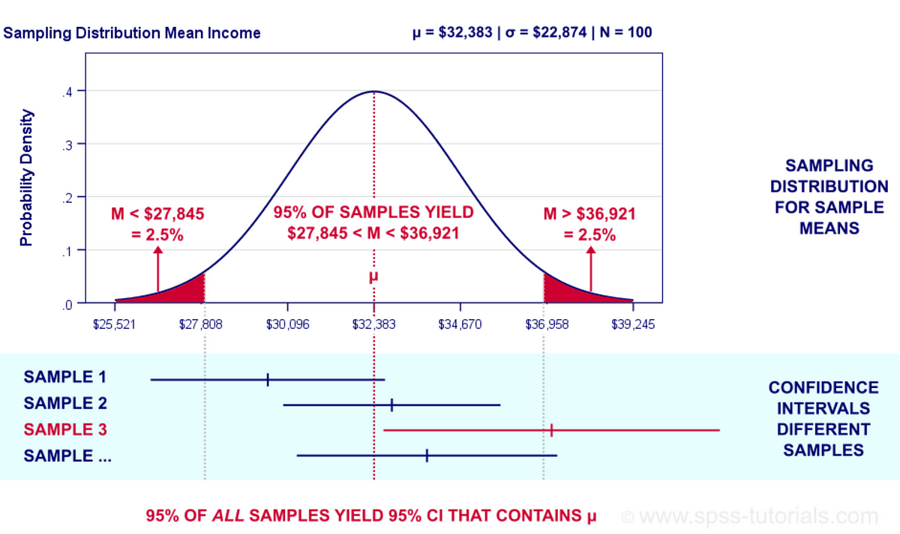

## Table of Contents

## What is a confidence estimator in machine learning?

A confidence estimator in machine learning is a tool that helps us understand how sure a model is about its predictions. Imagine you're trying to guess if it will rain tomorrow. A confidence estimator would tell you not just whether it will rain, but also how confident the model is in that prediction. This is important because it helps us trust the model more when it's very sure about its answers, and be cautious when it's not so sure.

In practice, a confidence estimator might give us a number between 0 and 1, where 1 means the model is completely sure and 0 means it's completely unsure. For example, if a model predicts that it will rain with a confidence of 0.8, it means the model is quite sure about its prediction. This number can be calculated using different methods, such as looking at how the model performs on similar data in the past, or by using techniques like bootstrapping or cross-validation to see how stable the predictions are.

## Why are confidence estimators important in machine learning models?

Confidence estimators are important in machine learning because they help us understand how much we can trust the model's predictions. When a model tells us something, like whether it will rain tomorrow or if an email is spam, knowing how sure the model is about its answer can make a big difference. For example, if a model predicts rain with high confidence, we might decide to carry an umbrella. But if the confidence is low, we might choose to take a chance and leave it at home.

Moreover, confidence estimators can help improve the model itself. By looking at cases where the model is often unsure, we can focus on those areas to collect more data or adjust the model to make it better. This can lead to more accurate predictions over time. In fields like healthcare or finance, where decisions can have big impacts, knowing the confidence level can be crucial for making safer and more informed choices.

## How does a confidence estimator like MACEst work?

MACEst, which stands for Model Agnostic Confidence Estimator, is a way to figure out how sure a [machine learning](/wiki/machine-learning) model is about its guesses. It does this by looking at how the model acts when it's given different versions of the same data. Imagine you're trying to guess if a picture has a dog in it. MACEst would show the picture to the model many times, but each time, it might change the picture a little bit, like making it brighter or darker. By seeing how the model's guesses change with these small changes, MACEst can tell if the model is really sure about seeing a dog or if it's just guessing.

The way MACEst works is by using something called conformal prediction. This means it uses the idea of "what if" to see how stable the model's answers are. If the model's guess stays the same even when the picture is a bit different, then MACEst thinks the model is pretty sure about its guess. But if the model's guess changes a lot with small changes, then MACEst knows the model isn't very confident. This helps us trust the model more when it's sure and be careful when it's not.

## What are the key components of the MACEst algorithm?

MACEst works by using a method called conformal prediction to figure out how sure a model is about its guesses. It does this by showing the model different versions of the same data and seeing how the model's guesses change. For example, if you're trying to guess if a picture has a dog in it, MACEst might show the model the same picture but with small changes, like making it brighter or darker. If the model's guess stays the same even with these changes, MACEst thinks the model is pretty sure about its guess. But if the model's guess changes a lot, then MACEst knows the model isn't very confident.

The key part of MACEst is how it uses these different versions of the data to make a confidence score. It looks at how often the model's guess stays the same when the data changes a little bit. If the guess stays the same a lot, the confidence score will be high, meaning the model is sure about its guess. If the guess changes a lot, the confidence score will be low, meaning the model isn't very sure. This helps us trust the model more when it's sure and be careful when it's not.

## Can you explain the difference between confidence estimation and uncertainty estimation?

Confidence estimation and uncertainty estimation both help us understand how sure a machine learning model is about its predictions, but they do it in slightly different ways. Confidence estimation tells us how sure the model is about a specific prediction. For example, if a model says it will rain tomorrow, a confidence estimator might say it's 80% sure. This means the model thinks there's an 80% chance it's right. Confidence estimators often give us a number between 0 and 1, where 1 means the model is completely sure, and 0 means it's completely unsure.

Uncertainty estimation, on the other hand, looks at how much the model doesn't know. It can be split into two types: aleatoric and epistemic uncertainty. Aleatoric uncertainty comes from the data itself, like if the weather data we're using to predict rain is noisy or incomplete. Epistemic uncertainty comes from the model not knowing enough about the world, like if it hasn't seen enough examples of rainy days to make a good prediction. While confidence estimation gives us a single number for how sure the model is, uncertainty estimation can give us a range of possible outcomes and how likely each one is.

## How do confidence estimators help in improving model reliability?

Confidence estimators help in improving model reliability by giving us a measure of how sure the model is about its predictions. When we know how confident the model is, we can trust its predictions more when the confidence is high and be cautious when it's low. For example, if a model predicts that a picture has a dog in it with a confidence of 90%, we can feel pretty sure about that prediction. But if the confidence is only 50%, we might want to check the picture ourselves before deciding. This helps us use the model's predictions more wisely and can make our decisions more reliable.

By using confidence estimators, we can also find parts of the model that need to be improved. If the model often has low confidence in certain types of predictions, we can focus on those areas to collect more data or adjust the model. This can lead to the model making better and more reliable predictions over time. For instance, if a model is unsure about predicting rain in certain weather conditions, we might gather more data about those conditions to help the model learn better. This way, confidence estimators not only help us trust the model more but also help us make the model more reliable by showing us where it needs to improve.

## What are some common metrics used to evaluate the performance of confidence estimators?

Confidence estimators are often evaluated using metrics that look at how well they can tell if a prediction is likely to be correct. One common metric is the Brier Score, which measures the accuracy of probabilistic predictions. It does this by comparing the predicted probabilities to the actual outcomes. A lower Brier Score means the confidence estimator is doing a better job at estimating the true likelihood of an event. Another metric is the Area Under the Receiver Operating Characteristic Curve (AUC-ROC), which shows how well the estimator can separate correct and incorrect predictions. A higher AUC-ROC value means the estimator is better at distinguishing between true positives and true negatives.

Another important metric is calibration, which checks if the confidence levels match the actual accuracy of the predictions. For example, if a model says it's 80% confident in its predictions, about 80% of those predictions should actually be correct. This can be measured using calibration plots or metrics like the Expected Calibration Error (ECE). ECE calculates the average difference between predicted confidence and actual accuracy. A lower ECE means the confidence estimator is well-calibrated, meaning its confidence levels are a good reflection of the true likelihood of its predictions being correct.

## How can confidence estimators be integrated into existing machine learning pipelines?

Integrating confidence estimators into existing machine learning pipelines can be done by adding a step after the model makes its predictions. This step involves using the confidence estimator to calculate how sure the model is about each prediction. For example, if you have a model that predicts whether an email is spam, you can use a confidence estimator like MACEst to show the model different versions of the same email and see how its predictions change. If the predictions stay the same, the confidence estimator will give a high confidence score, meaning the model is sure about its prediction. You can then add this confidence score to the output of your model, so users can see not just the prediction but also how sure the model is about it.

To make this integration smooth, you can write a function that takes the model's predictions and the data as inputs and returns the predictions with their confidence scores. This function can be easily added to your existing pipeline. For instance, if you're using Python, you might create a function like this:

```python
def add_confidence(model, data, confidence_estimator):
    predictions = model.predict(data)
    confidences = confidence_estimator.estimate_confidence(data, predictions)
    return list(zip(predictions, confidences))
```

This function takes the model's predictions and uses the confidence estimator to calculate the confidence scores. It then combines the predictions and confidence scores into a single output. By adding this function to your pipeline, you can enhance your model's reliability and give users more information to make better decisions.

## What are the challenges faced when implementing confidence estimators in real-world applications?

Implementing confidence estimators in real-world applications can be tricky because they need to work well with lots of different kinds of data and models. Sometimes, the data can be messy or incomplete, which can make it hard for confidence estimators to give accurate scores. For example, if you're trying to predict the weather, but your data about the temperature and humidity is not very reliable, the confidence estimator might not be able to tell you how sure the model is about its prediction. Also, different models might need different kinds of confidence estimators, and finding the right one can take a lot of time and effort.

Another challenge is that confidence estimators can slow down your model. If you're using a method like MACEst, it might need to show the model many different versions of the same data to figure out the confidence score. This can take a lot of time, especially if you're dealing with a lot of data. For example, if you're trying to predict if a picture has a dog in it, MACEst might need to show the model the same picture but with small changes, like making it brighter or darker. This can make the whole process slower, which might be a problem if you need quick predictions. Balancing the need for accurate confidence scores with the need for fast predictions can be a big challenge in real-world applications.

## How does MACEst compare to other confidence estimation techniques?

MACEst, which stands for Model Agnostic Confidence Estimator, is a method that works well with different types of machine learning models. Unlike some other confidence estimation techniques that might only work with specific kinds of models, MACEst can be used with any model. It does this by showing the model different versions of the same data and seeing how the model's predictions change. If the predictions stay the same, MACEst thinks the model is pretty sure about its guess. This makes MACEst very useful because it can help us understand how confident any model is about its predictions.

Other confidence estimation techniques might focus on different things. For example, Bayesian methods use probability to figure out how sure a model is about its predictions. These methods can be very accurate but can also be more complicated to use and might not work as well with all types of models. Another technique is called calibration, which checks if the confidence levels match the actual accuracy of the predictions. While calibration is important, it doesn't tell us how the model's predictions change with different data like MACEst does. Each method has its own strengths and weaknesses, so choosing the right one depends on what you need for your specific project.

## What are some advanced techniques used to enhance the performance of confidence estimators like MACEst?

One advanced technique to enhance the performance of confidence estimators like MACEst is to use more sophisticated ways to change the data. Instead of just making small changes like making a picture brighter or darker, you can use methods like [data augmentation](/wiki/data-augmentation) to create more varied versions of the data. For example, if you're trying to predict if a picture has a dog in it, you might rotate the picture, zoom in or out, or even add some noise to it. By showing the model these different versions, MACEst can get a better idea of how stable the model's predictions are, which can lead to more accurate confidence scores.

Another technique is to combine MACEst with other confidence estimation methods, like Bayesian approaches. Bayesian methods use probability to figure out how sure a model is about its predictions. By using both MACEst and Bayesian methods together, you can get a more complete picture of the model's confidence. For example, MACEst might show how the model's predictions change with different data, while Bayesian methods can tell you the probability of the model being right. This combination can help make the confidence scores even more reliable, which is important for making good decisions based on the model's predictions.

## Can you discuss any recent research developments or future directions in the field of confidence estimation in machine learning?

Recent research in confidence estimation has focused on making these estimators more accurate and useful for real-world applications. One interesting development is the use of [deep learning](/wiki/deep-learning) to create confidence estimators. Researchers are using neural networks to learn how to estimate confidence from data, which can be more flexible and powerful than traditional methods. For example, some studies have shown that deep learning models can learn to predict confidence scores that are well-calibrated, meaning the confidence levels match the actual accuracy of the predictions. This can be especially helpful in fields like healthcare, where knowing how sure a model is about its predictions can be crucial for making safe decisions.

Another area of future research is improving the speed of confidence estimators like MACEst. Since MACEst works by showing the model different versions of the same data, it can be slow, especially with large datasets. Researchers are looking into ways to make this process faster, like using parallel computing or more efficient algorithms. By making confidence estimation quicker, we can use these techniques in more real-time applications, like autonomous driving or real-time fraud detection. This could make machine learning models more reliable and useful in situations where quick decisions are needed.

## References & Further Reading

[1]: Vovk, V., Gammerman, A., & Shafer, G. (2005). ["Algorithmic Learning in a Random World."](https://link.springer.com/book/10.1007/978-3-031-06649-8) Springer.

[2]: Papadopoulos, H. (2008). ["Inductive Conformal Prediction: Theory and Application to Neural Networks."](https://cdn.intechopen.com/pdfs/5294/InTech-Inductive_conformal_prediction_theory_and_application_to_neural_networks.pdf) In: IFIP AI 2008: Artificial Intelligence: Methodology, Systems, and Applications.

[3]: Nguyen, A., Yosinski, J., & Clune, J. (2015). ["Deep Neural Networks are Easily Fooled: High Confidence Predictions for Unrecognizable Images."](https://arxiv.org/abs/1412.1897) PLOS ONE.

[4]: Guo, C., Pleiss, G., Sun, Y., & Weinberger, K. Q. (2017). ["On Calibration of Modern Neural Networks."](https://arxiv.org/abs/1706.04599) Proceedings of the 34th International Conference on Machine Learning. 

[5]: Lakshminarayanan, B., Pritzel, A., & Blundell, C. (2017). ["Simple and Scalable Predictive Uncertainty Estimation using Deep Ensembles."](https://dl.acm.org/doi/10.5555/3295222.3295387) Advances in Neural Information Processing Systems 30.