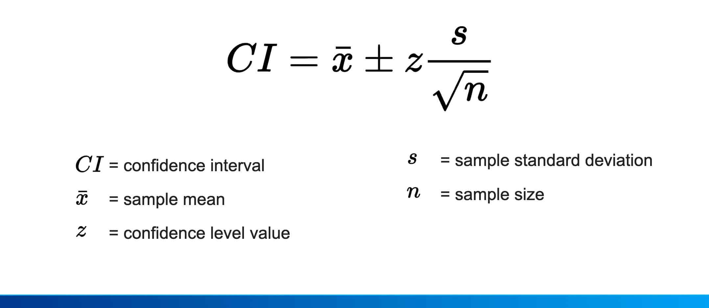

## Table of Contents

## What is a confidence interval?

A confidence interval is a range of values that helps us understand how certain we can be about an estimate. Imagine you want to know the average height of all students in a school, but it's too hard to measure everyone. So, you measure a smaller group and use that to guess the average for everyone. A confidence interval tells you that if you did this many times, your guess would include the true average a certain percentage of the time, like 95% of the time.

The percentage, or confidence level, is chosen by you. A common choice is 95%, but you could pick 90% or 99% too. The higher the confidence level, the wider the interval becomes because you want to be more sure that the true average is within your range. So, if your 95% confidence interval for the average height of students is between 5'4" and 5'6", it means that if you took many samples and calculated the interval each time, about 95 out of 100 of those intervals would contain the true average height of all students.

## Why are confidence intervals important in statistics?

Confidence intervals are important in statistics because they give us a way to understand how accurate our guesses about a population are. When we can't measure everyone in a group, we take a smaller sample and use it to make an estimate. The confidence interval tells us how sure we can be that our estimate is close to the true value for the whole group. It's like saying, "I'm pretty sure the real number is somewhere in this range."

They also help us make better decisions by showing us the uncertainty in our estimates. If the confidence interval is narrow, it means our estimate is pretty precise. But if it's wide, it tells us we need more information or a bigger sample to be more sure. This is really useful in fields like medicine, where knowing how effective a treatment might be can affect many people's lives. So, confidence intervals are a key tool for understanding and communicating the reliability of statistical findings.

## How do you calculate a confidence interval for a population mean?

To calculate a confidence interval for a population mean, you start by taking a sample from the population and finding the sample mean, which is the average of the numbers in your sample. You also need to know the standard deviation of your sample, which tells you how spread out the numbers are. Then, you choose your confidence level, like 95%, which tells you how sure you want to be that your interval includes the true population mean. 

Next, you need a special number called the critical value, which depends on your confidence level and whether you know the population standard deviation or not. If you know the population standard deviation, you use a Z-score from the standard normal distribution. If you don't, you use a t-score from the t-distribution, which also depends on your sample size. You multiply this critical value by the standard error of the mean, which is the sample standard deviation divided by the square root of the sample size. Finally, you add and subtract this result from your sample mean to get the lower and upper bounds of your confidence interval. 

For example, if your sample mean is 50, your sample standard deviation is 5, your sample size is 100, and you want a 95% confidence interval, you would use a Z-score of about 1.96. The standard error would be 5 divided by the square root of 100, which is 0.5. Multiplying the Z-score by the standard error gives you 0.98. So, your 95% confidence interval would be from 50 - 0.98 to 50 + 0.98, or 49.02 to 50.98. This means you're 95% confident that the true population mean is between 49.02 and 50.98.

## What is the difference between a confidence interval and a prediction interval?

A confidence interval and a prediction interval are both used to make estimates, but they tell us different things. A confidence interval is about the average of a whole group. Imagine you want to guess the average height of all students in a school. You measure some students and use that to make a guess about everyone. The confidence interval tells you a range where the true average height of all students is likely to be. If you did this many times, your guess would be right a certain percentage of the time, like 95% of the time.

On the other hand, a prediction interval is about guessing the value of a single new thing from the same group. Using the same example, if you want to guess the height of one new student who hasn't been measured yet, you use a prediction interval. This interval is usually wider than a confidence interval because it's harder to predict one specific value than an average. The prediction interval tells you a range where you think the height of this new student will fall, with a certain level of confidence, like 95%. 

So, the key difference is that a confidence interval is for the average of a group, while a prediction interval is for a single new case from that group. Both are important, but they answer different questions about uncertainty.

## How does sample size affect the width of a confidence interval?

Sample size plays a big role in how wide a confidence interval is. When you have a bigger sample, the confidence interval gets narrower. This happens because a larger sample gives you more information about the whole group, so your guess about the average becomes more precise. It's like if you asked more people for directions to a place; the more people you ask, the more sure you can be about the right way to go.

On the other hand, if you have a smaller sample, the confidence interval will be wider. This is because you have less information, so your guess about the average has more uncertainty. It's like trying to guess what everyone in a big school likes to eat, but you only asked a few people. Your guess might be off, so you need a wider range to be sure you include the right answer.

## What is the role of the standard deviation in calculating confidence intervals?

The standard deviation is really important when you're figuring out a confidence interval. It tells you how spread out the numbers in your sample are. If the numbers are all over the place, the standard deviation is big. If they're pretty close together, it's small. When you're calculating a confidence interval, you use the standard deviation to find out how much your guess about the average might be off. This helps you make a range that you think includes the true average.

The bigger the standard deviation, the wider your confidence interval will be. This is because a big standard deviation means your sample has a lot of variety, so your guess about the average has more uncertainty. You need a wider range to be sure you include the true average. On the other hand, if the standard deviation is small, your confidence interval will be narrower because your sample is more consistent, so your guess about the average is more precise.

## How do you interpret a confidence interval?

A confidence interval helps you understand how sure you can be about your guess of an average. Imagine you want to know the average height of all students in a school, but you can't measure everyone. So, you measure a smaller group and use that to guess the average for everyone. The confidence interval is a range of numbers that you think includes the true average. If you did this many times, your guess would include the true average a certain percentage of the time, like 95% of the time. This percentage is called the confidence level.

When you see a confidence interval, it tells you how precise your guess is. If the interval is narrow, it means your guess is pretty accurate. But if it's wide, it means there's more uncertainty and you might need more information or a bigger sample to be more sure. For example, if your 95% confidence interval for the average height of students is between 5'4" and 5'6", it means that if you took many samples and calculated the interval each time, about 95 out of 100 of those intervals would contain the true average height of all students.

## What is the relationship between confidence level and confidence interval?

The confidence level and the confidence interval are closely related. The confidence level is the percentage that tells you how sure you want to be that your interval includes the true average. If you choose a 95% confidence level, it means you want to be 95% sure that your interval includes the true average. The higher the confidence level you choose, the wider the confidence interval becomes. This is because you need a bigger range to be more sure that you've included the true average.

Think of it like this: if you're trying to guess the average height of all students in a school, a 95% confidence level means you want your guess to be right 95 times out of 100. To do that, you might have to make your guess a bit wider, like saying the average height is between 5'4" and 5'6". If you wanted to be even more sure, say 99% confident, your guess would have to be even wider, maybe between 5'3" and 5'7". So, the confidence level you choose directly affects how wide or narrow your confidence interval will be.

## How can you calculate a confidence interval for a proportion?

To calculate a confidence interval for a proportion, you start by taking a sample from the group you're interested in and finding the sample proportion. This is just the number of successes divided by the total number of people or things you sampled. For example, if you're looking at the proportion of students who like pizza and 70 out of 100 students say they do, your sample proportion is 0.70. Next, you choose your confidence level, like 95%, which tells you how sure you want to be that your interval includes the true proportion for the whole group. You also need a special number called the critical value, which depends on your confidence level. For a 95% confidence level, this number is about 1.96.

Then, you calculate the standard error of the proportion, which is the square root of the sample proportion times one minus the sample proportion, all divided by the sample size. In our pizza example, the standard error would be the square root of (0.70 * 0.30) / 100, which is about 0.046. You multiply this standard error by the critical value to get the margin of error. For a 95% confidence level, the margin of error would be 1.96 times 0.046, which is about 0.090. Finally, you add and subtract this margin of error from your sample proportion to get the lower and upper bounds of your confidence interval. So, the 95% confidence interval for the proportion of students who like pizza would be from 0.70 - 0.090 to 0.70 + 0.090, or 0.610 to 0.790. This means you're 95% confident that the true proportion of all students who like pizza is between 61% and 79%.

## What are common misconceptions about confidence intervals?

One common misconception about confidence intervals is that they tell you the probability that the true average or proportion is inside the interval. But that's not right. A confidence interval doesn't give you a probability for the true value. Instead, it tells you that if you did the same study many times, a certain percentage of those intervals would include the true value. For example, a 95% confidence interval means that if you did the study 100 times, about 95 of those intervals would include the true average or proportion.

Another misconception is that a wider confidence interval means your guess is wrong. That's not true either. A wider interval just means there's more uncertainty in your guess, often because you have a smaller sample or a bigger spread in your data. It doesn't mean your guess is wrong; it just means you need more information to be more sure. A narrow interval means your guess is more precise, but it doesn't guarantee it's right.

## How do you calculate confidence intervals for non-normal distributions?

When data doesn't follow a normal distribution, calculating confidence intervals can be a bit trickier, but there are ways to do it. One common method is to use something called bootstrapping. This means you take your sample data and pretend like it's the whole group. You then make lots of new samples by randomly [picking](/wiki/asset-class-picking) from your original data, with replacement. This means you can pick the same number more than once. For each new sample, you find the average or proportion you're interested in. Then, you use these averages or proportions to make a range that you think includes the true value. This range is your confidence interval.

Another way to handle non-normal data is to use a different kind of distribution that fits your data better. For example, if your data is really skewed, you might use something called the log-normal distribution. You can also use something called the non-parametric approach, which doesn't assume your data follows any specific distribution. In this method, you rank your data and use these ranks to find a confidence interval. These methods help you make a good guess about the true average or proportion, even when your data doesn't follow a normal bell-shaped curve.

## What advanced techniques exist for constructing confidence intervals in complex data scenarios?

When dealing with complex data scenarios, one advanced technique for constructing confidence intervals is using Bayesian methods. Instead of just using the data you have, Bayesian methods let you add in what you already know or believe about the situation. You start with a guess about what you think the true value might be, called a prior. Then, you update this guess with your new data to get a better estimate, called a posterior. From this posterior, you can find a range of values that you think includes the true value, which is your confidence interval. This method is really helpful when you have a lot of information or when your data is complicated and doesn't fit simple patterns.

Another technique is using simulation methods like the bootstrap or Monte Carlo methods. These methods are great for when your data is tricky and doesn't follow a normal pattern. With the bootstrap, you take your sample data and pretend it's the whole group. You make lots of new samples by randomly picking from your original data, and then you use these new samples to find a range of values that you think includes the true value. Monte Carlo methods work by creating many possible scenarios based on your data and then using these scenarios to build a confidence interval. Both of these methods help you understand the uncertainty in your data and make a good guess about the true value, even when things are complex.

## How do you calculate confidence intervals?

The calculation of confidence intervals is a crucial aspect of statistical analysis in [algorithmic trading](/wiki/algorithmic-trading). It relies on the standard deviation, sample mean, and the choice between the z or t-distribution, depending on the certainty of the population standard deviation. 

When the population standard deviation is known, a z-distribution is appropriate, leading to the calculation of a confidence interval using the formula:

$$
CI = \bar{x} \pm Z \times \left(\frac{\sigma}{\sqrt{n}}\right)
$$

where $\bar{x}$ is the sample mean, $Z$ is the z-value corresponding to the desired confidence level, $\sigma$ is the population standard deviation, and $n$ is the sample size.

Conversely, if the population standard deviation is unknown and must be estimated from the sample data, the t-distribution is used:

$$
CI = \bar{x} \pm t \times \left(\frac{s}{\sqrt{n}}\right)
$$

Here, $s$ represents the sample standard deviation and $t$ is the t-value based on the desired confidence level and degrees of freedom (usually $n-1$).

In algorithmic trading, these calculations are often implemented using Python libraries such as NumPy and pandas, which allow traders to process large datasets with efficiency. For example, calculating confidence intervals for estimated future portfolio returns can involve:

```python
import numpy as np
import scipy.stats as stats

# Sample data
returns = np.array([0.05, 0.03, 0.08, 0.02, 0.07])

# Sample mean and standard deviation
sample_mean = np.mean(returns)
sample_std = np.std(returns, ddof=1)
n = len(returns)

# Confidence level
confidence = 0.95
t_critical = stats.t.ppf((1 + confidence) / 2, df=n-1)

# Confidence interval
margin_of_error = t_critical * (sample_std / np.sqrt(n))
confidence_interval = (sample_mean - margin_of_error, sample_mean + margin_of_error)

print("Confidence Interval:", confidence_interval)
```

Utilizing statistical tools like confidence intervals enables traders to estimate the range within which future returns might fall or to analyze the performance of trading strategies, guiding informed decision-making in trading environments. These techniques help traders to better manage risk and refine their strategies for improved financial outcomes.

## References & Further Reading

[1]: Aronson, D. R. (2007). ["Evidence-Based Technical Analysis: Applying the Scientific Method and Statistical Inference to Trading Signals"](https://onlinelibrary.wiley.com/doi/book/10.1002/9781118268315). Wiley.

[2]: Jansen, S. (2018). ["Machine Learning for Algorithmic Trading"](https://github.com/stefan-jansen/machine-learning-for-trading). Packt Publishing.

[3]: Chan, E. P. (2008). ["Quantitative Trading: How to Build Your Own Algorithmic Trading Business"](https://github.com/ftvision/quant_trading_echan_book). Wiley. 

[4]: Lopez de Prado, M. (2018). ["Advances in Financial Machine Learning"](https://www.amazon.com/Advances-Financial-Machine-Learning-Marcos/dp/1119482089). Wiley.

[5]: Hull, J. C. (2018). ["Options, Futures, and Other Derivatives"](https://www.semanticscholar.org/paper/Options%2C-Futures%2C-and-Other-Derivatives-Hull/89bdee500c8623864fc9eb7a471546aa713acc44). Pearson. 

[6]: MathWorks. ["Statistics and Machine Learning Toolbox Documentation"](https://www.mathworks.com/help/stats/index.html?/access/helpdesk/help/toolbox/stats/cdf.html=).

[7]: NumPy Developers. ["NumPy User Guide"](https://numpy.org/doc/stable/user/). 

[8]: McKinney, W. (2017). ["Python for Data Analysis: Data Wrangling with Pandas, NumPy, and IPython"](https://wesmckinney.com/book/). O'Reilly Media.