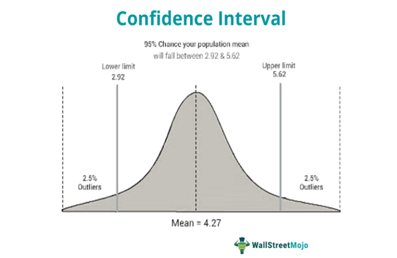

In algorithmic trading, statistical analysis is crucial for optimizing trading strategies. One key component of this analysis is the calculation of confidence intervals, which enable traders to evaluate the reliability of their predictions. Confidence intervals provide traders with a quantitative measure of uncertainty, helping them to understand the range within which the true value of an estimated parameter, such as future asset returns, is likely to lie. This statistical tool is essential in the dynamic environment of financial markets, where data is often subject to significant variability.

The concept of confidence intervals is deeply rooted in statistical inference, which seeks to draw conclusions about a population based on sample data. By employing confidence intervals, traders can assess the probability that their trading strategies will perform as expected under various market conditions. This understanding supports more informed decision-making and enhances risk management by allowing traders to quantify and account for uncertainty within their models.



The calculation and application of confidence intervals involve several mathematical principles and statistical techniques. These intervals are typically constructed using the known or estimated standard deviation of a dataset, the sample mean, and the critical value derived from the normal (z) or t-distribution, depending on whether the population standard deviation is known. The formula for a confidence interval is generally expressed as: 

$$
\text{CI} = \text{Point Estimate} \pm (\text{Critical Value} \times \text{Standard Error})
$$

In algorithmic trading, confidence intervals are applied to evaluate the effectiveness of trading algorithms and to fine-tune strategies for better performance. The use of software tools, particularly Python with libraries such as NumPy and pandas, allows traders to efficiently handle large datasets and perform complex calculations necessary for estimating confidence intervals.

By incorporating confidence intervals into their analytical toolkit, traders can build more robust and profitable trading strategies. Understanding these statistical concepts empowers them to make decisions that are not only statistically sound but also strategically advantageous in the competitive landscape of financial markets.

## Table of Contents

## Understanding Confidence Intervals

A confidence interval is a fundamental statistical concept utilized to estimate a range within which a true population parameter is expected to lie. When analyzing sample data from uncertain or volatile markets, confidence intervals provide a crucial framework for gauging the reliability of statistical estimates. These intervals are characterized by a confidence level, typically expressed as a percentage (e.g., 90%, 95%, or 99%), which denotes the probability that the interval constructed from sample data will encompass the true parameter value.

The confidence level is a measure of certainty. For instance, a 95% confidence interval suggests that if the same sampling procedure were repeated numerous times, approximately 95% of the resulting confidence intervals would contain the true population parameter. Choosing a higher confidence level, such as 99%, results in a wider interval but gives greater assurance that the interval includes the true parameter.

In the context of [algorithmic trading](/wiki/algorithmic-trading), the application of confidence intervals is vital due to the intrinsic variability and unpredictability of market data. Traders rely on these intervals to assess the statistical significance and reliability of their models and forecasts, ensuring that their strategies are based on sound quantitative analysis rather than chance.

The formula for a confidence interval typically takes the form:

$CI = \bar{x} \pm (Z \cdot \frac{\sigma}{\sqrt{n}})$

Here, $\bar{x}$ represents the sample mean, $Z$ is the z-value corresponding to the desired confidence level, $\sigma$ is the standard deviation, and $n$ is the sample size. When dealing with smaller samples or unknown population standard deviations, the t-distribution may be used instead of the z-distribution.

Confidence intervals are not only useful for deriving estimates but also play a crucial role in decision-making processes. By providing a quantified range of uncertainty, they help traders in refining their risk management strategies and adapting to market movements with greater statistical backing. Integrating these intervals into algorithmic trading strategies enhances their robustness and potential profitability, addressing the inherent uncertainties of financial markets.

## Calculating Confidence Intervals

The calculation of confidence intervals is a crucial aspect of statistical analysis in algorithmic trading. It relies on the standard deviation, sample mean, and the choice between the z or t-distribution, depending on the certainty of the population standard deviation. 

When the population standard deviation is known, a z-distribution is appropriate, leading to the calculation of a confidence interval using the formula:

$$
CI = \bar{x} \pm Z \times \left(\frac{\sigma}{\sqrt{n}}\right)
$$

where $\bar{x}$ is the sample mean, $Z$ is the z-value corresponding to the desired confidence level, $\sigma$ is the population standard deviation, and $n$ is the sample size.

Conversely, if the population standard deviation is unknown and must be estimated from the sample data, the t-distribution is used:

$$
CI = \bar{x} \pm t \times \left(\frac{s}{\sqrt{n}}\right)
$$

Here, $s$ represents the sample standard deviation and $t$ is the t-value based on the desired confidence level and degrees of freedom (usually $n-1$).

In algorithmic trading, these calculations are often implemented using Python libraries such as NumPy and pandas, which allow traders to process large datasets with efficiency. For example, calculating confidence intervals for estimated future portfolio returns can involve:

```python
import numpy as np
import scipy.stats as stats

# Sample data
returns = np.array([0.05, 0.03, 0.08, 0.02, 0.07])

# Sample mean and standard deviation
sample_mean = np.mean(returns)
sample_std = np.std(returns, ddof=1)
n = len(returns)

# Confidence level
confidence = 0.95
t_critical = stats.t.ppf((1 + confidence) / 2, df=n-1)

# Confidence interval
margin_of_error = t_critical * (sample_std / np.sqrt(n))
confidence_interval = (sample_mean - margin_of_error, sample_mean + margin_of_error)

print("Confidence Interval:", confidence_interval)
```

Utilizing statistical tools like confidence intervals enables traders to estimate the range within which future returns might fall or to analyze the performance of trading strategies, guiding informed decision-making in trading environments. These techniques help traders to better manage risk and refine their strategies for improved financial outcomes.

## Applications in Algorithmic Trading

Confidence intervals are crucial in the field of algorithmic trading, where they assist traders in estimating the future performance of trading algorithms, managing risks, and evaluating strategies. By providing a statistical range in which future returns are likely to fall, confidence intervals enable traders to perform detailed risk assessment and make necessary adjustments to their trading strategies.

One primary application of confidence intervals in algorithmic trading is through [backtesting](/wiki/backtesting). This process involves simulating how a trading strategy would have performed using historical data. Confidence intervals help evaluate the robustness and statistical validity of these strategies by offering a measure of the expected variation in returns. For example, a strategy might show a mean return of 10% with a 95% confidence interval of ±2%. This indicates that future returns are likely to fall between 8% and 12%, giving traders insight into the potential performance [volatility](/wiki/volatility-trading-strategies).

Moreover, performance metrics in algorithmic trading can be significantly improved by incorporating confidence intervals. Traditional performance metrics, such as the Sharpe ratio or alpha, provide point estimates of risk-adjusted returns. However, adding confidence intervals to these metrics acknowledges the uncertainty inherent in market data. For instance, if a strategy's Sharpe ratio is 1.2 with a 95% confidence interval of ±0.3, traders understand that the true Sharpe ratio lies between 0.9 and 1.5 with high probability. This additional layer of understanding aids traders in making more informed decisions.

Confidence intervals are also valuable in detecting anomalies or spotting outliers within trading data. Outliers can indicate unusual market conditions or errors in data collection. By identifying data points that fall outside the expected interval, traders can investigate further to determine whether an observed anomaly warrants a change in strategy or highlights an underlying issue in the data.

In practical application, confidence intervals can be calculated using Python libraries such as NumPy and SciPy. The following Python code snippet demonstrates how to compute a confidence interval for a sample mean:

```python
import numpy as np
import scipy.stats as stats

# Sample data
data = np.array([10.1, 10.5, 10.3, 9.8, 10.0, 10.2])
mean = np.mean(data)
std_err = stats.sem(data) # Standard error of the mean
confidence_level = 0.95
h = std_err * stats.t.ppf((1 + confidence_level) / 2, len(data) - 1)

confidence_interval = (mean - h, mean + h)
print(f"95% confidence interval: {confidence_interval}")
```

In this code, `stats.sem()` calculates the standard error of the data, and `stats.t.ppf()` finds the t-critical value for the specified confidence level. The resulting confidence interval provides a probabilistic range for the true mean of the sample, illustrating how to apply statistical tools in real-world algorithmic trading scenarios.

Confidence intervals thus provide invaluable insights and enhance the decision-making process in algorithmic trading. Whether used in backtesting, performance evaluation, or anomaly detection, they contribute to creating robust and adaptable trading systems.

## Case Studies and Examples

In the evaluation of algorithmic trading strategies, confidence intervals serve as a critical analytical tool for understanding variability and assessing the statistical significance of comparative performance. Let's consider a scenario where a trader develops a new trading strategy and performs backtesting to evaluate its historical returns. By computing the confidence intervals of these returns, the trader can better grasp the variability of potential outcomes. This statistical range provides insights into the likelihood of different return scenarios, aiding in risk management and strategy refinement.

An illustrative example is the comparison of two distinct trading strategies. By analyzing the confidence intervals for the performance metrics of each strategy, traders can determine if observed differences in performance are statistically significant or merely due to random variation. This comparison is crucial for making informed decisions about the adoption or modification of trading strategies. For instance, if overlapping confidence intervals are observed, it may indicate no significant difference in strategy performance, prompting further investigation or development.

Real-world applications frequently involve the calculation of risk metrics such as Value at Risk (VaR). Confidence intervals applied in this context quantify the uncertainty around estimated potential losses within a given confidence level, providing traders with essential insights for risk management. A trader might use a 95% confidence interval to project the maximum expected loss over a specified period, contributing to the overall risk assessment framework.

Practical implementation of confidence intervals in algorithmic trading often utilizes programming languages such as Python. The following Python code snippet demonstrates calculating a confidence interval for an average return using sample data:

```python
import numpy as np
import scipy.stats as stats

# Sample data: daily returns of a trading strategy
returns = np.array([0.02, 0.01, -0.01, 0.03, 0.04])

# Calculate mean and standard error of the mean
mean_return = np.mean(returns)
std_error = stats.sem(returns)

# Define confidence level (e.g., 95%)
confidence_level = 0.95
degrees_freedom = len(returns) - 1
critical_value = stats.t.ppf((1 + confidence_level) / 2, degrees_freedom)

# Calculate confidence interval
margin_of_error = critical_value * std_error
confidence_interval = (mean_return - margin_of_error, mean_return + margin_of_error)

print(f"95% Confidence Interval for the mean return: {confidence_interval}")
```

This code takes a list of returns, computes the mean and standard error, and subsequently determines the 95% confidence interval for the mean return. Such practical applications within trading platforms underscore the utility of confidence intervals in informed decision-making processes, emphasizing their importance in the enhancement and validation of trading strategies.

Overall, case studies and examples in the use of confidence intervals highlight their significant role in fine-tuning trading algorithms, evaluating risk, and ensuring statistical robustness in algorithmic trading. By providing a structured method to assess the reliability of predictions and quantify uncertainty, confidence intervals are an indispensable component of modern trading analytics.

## Challenges and Limitations

While confidence intervals are powerful statistical tools in algorithmic trading, their effectiveness depends on certain assumptions that must be carefully considered. A key presumption is the normality of data. Confidence intervals are typically calculated based on the assumption that the data follows a normal distribution. However, financial data often deviates from this assumption due to its dynamic and volatile nature. Non-normality can lead to inaccurate interval estimates, potentially resulting in misguided trading decisions if alternative statistical methods are not employed.

Another critical assumption is the independence of data points. This is challenging in the financial domain, where data points can be autocorrelated, particularly in high-frequency trading scenarios. Ignoring this dependency can compromise the reliability of confidence intervals, suggesting a need for models that better account for such data structures.

Computational complexity also poses a challenge. In high-frequency trading environments, the need for rapid data processing requires efficient algorithms that can calculate confidence intervals in real-time. This demands significant computational resources and optimized code.

Moreover, over-reliance on confidence intervals without considering the broader market context and potential economic shifts may lead to suboptimal trading strategies. Market conditions can change rapidly due to economic events, policy changes, or investor sentiment shifts, which may not be fully captured by historical data alone.

To ensure the effective use of confidence intervals, traders must prioritize data quality and a thorough understanding of the statistical models employed. This involves regularly verifying the underlying assumptions of normality and independence and adapting models to fit specific data characteristics. Robust validation processes and continuous learning are essential to maximize the potential of confidence intervals in enhancing trading strategies.

## Conclusion

Confidence intervals are essential tools in algorithmic trading, providing a robust statistical framework for the evaluation and improvement of trading strategies. They allow traders to rigorously estimate the potential distribution of returns and better comprehend the inherent uncertainty of their predictions. This capability is crucial in making informed and data-driven trading decisions.

The utilization of confidence intervals benefits traders by offering a structured approach to assess the variability and reliability of their trading models. However, it is important for traders to remain cognizant of the limitations and assumptions inherent in confidence intervals. These include assumptions about data normality and independence, among others. Ensuring these conditions are met is vital for generating accurate and meaningful results.

Trading systems become more reliable and potentially more profitable when confidence intervals are used in conjunction with other analytical techniques. For example, integrating confidence intervals with backtesting procedures can reveal the statistical significance of a trading strategy's performance, thus allowing traders to make more confident adjustments and enhancements.

Moreover, the landscape of algorithmic trading demands continuous education and practical application of statistical concepts like confidence intervals. By mastering these tools and continuously adapting to new methods and data, traders can secure a competitive edge. The persistent exploration and implementation of statistical measures serve to refine trading systems, ultimately leading to enhanced decision-making and increased profitability.

## References & Further Reading

[1]: Aronson, D. R. (2007). ["Evidence-Based Technical Analysis: Applying the Scientific Method and Statistical Inference to Trading Signals"](https://onlinelibrary.wiley.com/doi/book/10.1002/9781118268315). Wiley.

[2]: Jansen, S. (2018). ["Machine Learning for Algorithmic Trading"](https://github.com/stefan-jansen/machine-learning-for-trading). Packt Publishing.

[3]: Chan, E. P. (2008). ["Quantitative Trading: How to Build Your Own Algorithmic Trading Business"](https://github.com/ftvision/quant_trading_echan_book). Wiley. 

[4]: Lopez de Prado, M. (2018). ["Advances in Financial Machine Learning"](https://www.amazon.com/Advances-Financial-Machine-Learning-Marcos/dp/1119482089). Wiley.

[5]: Hull, J. C. (2018). ["Options, Futures, and Other Derivatives"](https://www.semanticscholar.org/paper/Options%2C-Futures%2C-and-Other-Derivatives-Hull/89bdee500c8623864fc9eb7a471546aa713acc44). Pearson. 

[6]: MathWorks. ["Statistics and Machine Learning Toolbox Documentation"](https://www.mathworks.com/help/stats/index.html?/access/helpdesk/help/toolbox/stats/cdf.html=).

[7]: NumPy Developers. ["NumPy User Guide"](https://numpy.org/doc/stable/user/). 

[8]: McKinney, W. (2017). ["Python for Data Analysis: Data Wrangling with Pandas, NumPy, and IPython"](https://wesmckinney.com/book/). O'Reilly Media.