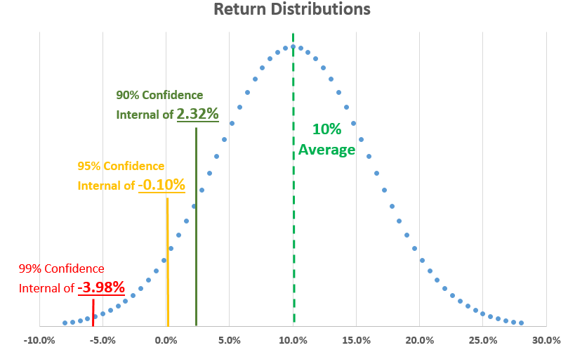

## Table of Contents

## What is Value at Risk (VaR)?

Value at Risk, often shortened to VaR, is a way to measure how much money you could lose from an investment over a certain period of time. It tells you the maximum amount you might lose, with a certain level of confidence, usually 95% or 99%. For example, if you have a $100,000 investment and the VaR is $5,000 at a 95% confidence level over one day, it means there's a 5% chance you could lose more than $5,000 in a single day.

VaR is used by banks, investment firms, and other financial institutions to manage risk. It helps them understand the potential losses they might face and make better decisions about their investments. However, VaR isn't perfect. It doesn't tell you how much you could lose beyond the VaR amount, and it depends a lot on the historical data used to calculate it. So, while it's a useful tool, it should be used along with other risk management methods.

## What is a confidence level in the context of VaR?

In the context of Value at Risk (VaR), the confidence level is like a percentage that tells you how sure you can be about the maximum loss you might face. For example, if you have a 95% confidence level, it means that 95 times out of 100, your losses won't be more than the VaR amount. This helps investors and banks feel more secure about their investments because they know there's a high chance their losses will stay within a certain limit.

However, the confidence level also means there's a small chance, like 5% in the 95% confidence example, that you could lose more than the VaR amount. This is called the "tail risk." So, while a high confidence level gives you more assurance, it's important to remember that there's still a chance for bigger losses. That's why people often use other risk measures along with VaR to get a fuller picture of their potential risks.

## What is a confidence interval in the context of VaR?

In the context of Value at Risk (VaR), a confidence interval is a range that tells you how much money you might lose, and how sure you can be about that number. For example, if your VaR is $5,000 at a 95% confidence level over one day, it means there's a 95% chance that your losses won't be more than $5,000 in a single day. This range helps you understand the risk you're taking with your investment.

However, the confidence interval also means there's a small chance, like 5% in this case, that you could lose more than the VaR amount. This is called the "tail risk." So, while the confidence interval gives you a good idea of what might happen most of the time, it's important to remember that there's still a chance for bigger losses. That's why it's a good idea to use other risk measures along with VaR to get a fuller picture of your potential risks.

## How is the confidence level used in calculating VaR?

The confidence level is a key part of calculating Value at Risk (VaR). It tells you how sure you can be about the maximum loss you might face. For example, if you set a 95% confidence level, it means that 95 times out of 100, your losses won't be more than the VaR amount. This helps investors and banks feel more secure because they know there's a high chance their losses will stay within a certain limit.

To calculate VaR, you use historical data or statistical models to figure out the potential losses. The confidence level comes into play when you decide how much risk you're willing to take. If you choose a 95% confidence level, you're saying you're okay with a 5% chance of losing more than the VaR amount. A higher confidence level, like 99%, means you're even more sure about staying within the VaR limit, but it also means your VaR amount will be higher because you're accounting for more extreme scenarios.

## How is the confidence interval determined in VaR?

The confidence interval in Value at Risk (VaR) is determined by figuring out how much money you might lose and how sure you can be about that number. For example, if you set a 95% confidence level, it means there's a 95% chance your losses won't be more than the VaR amount. This is done using historical data or statistical models to look at how your investment has performed in the past and what might happen in the future.

To find the confidence interval, you first choose your confidence level, like 95% or 99%. Then, you use a method like the historical simulation, variance-covariance, or Monte Carlo simulation to calculate the potential losses. The confidence interval tells you that, most of the time, your losses will stay within this range, but there's still a small chance you could lose more than the VaR amount. This helps investors and banks understand and manage their risks better.

## What is the relationship between confidence level and confidence interval in VaR?

The confidence level and confidence interval in Value at Risk (VaR) are closely related. The confidence level is a percentage that tells you how sure you can be about the maximum amount you might lose. For example, a 95% confidence level means there's a 95% chance your losses won't be more than the VaR amount. This level helps you decide how much risk you're willing to take. If you choose a higher confidence level, like 99%, you're saying you want to be even more sure about staying within the VaR limit, but this also means your VaR amount will be higher because you're accounting for more extreme scenarios.

The confidence interval, on the other hand, is the range of potential losses you might face at your chosen confidence level. Using the example of a 95% confidence level, the confidence interval tells you that 95 times out of 100, your losses will stay within this range. So, if your VaR is $5,000 at a 95% confidence level over one day, there's a 95% chance you won't lose more than $5,000 in a single day. The confidence interval helps investors and banks understand the risk they're taking and plan accordingly, knowing there's still a small chance, like 5% in this case, of losing more than the VaR amount.

## Can you explain the impact of changing the confidence level on VaR?

Changing the confidence level in Value at Risk (VaR) has a big impact on how much money you think you might lose. If you pick a higher confidence level, like going from 95% to 99%, you're saying you want to be even more sure about staying within the VaR limit. This means you're okay with a smaller chance of losing more than the VaR amount. But, because you're looking at more extreme scenarios, your VaR amount will go up. So, if your VaR was $5,000 at a 95% confidence level, it might jump to $7,000 or more at a 99% confidence level.

On the other hand, if you lower the confidence level, like going from 95% to 90%, you're saying you're okay with a bigger chance of losing more than the VaR amount. This means you're looking at less extreme scenarios, so your VaR amount will go down. For example, if your VaR was $5,000 at a 95% confidence level, it might drop to $4,000 at a 90% confidence level. This shows how the confidence level you choose can change how much risk you're willing to take and how much you think you might lose.

## How does the width of the confidence interval affect the interpretation of VaR?

The width of the confidence interval in Value at Risk (VaR) tells you how much money you might lose and how sure you can be about that number. If the confidence interval is wide, it means there's a bigger range of possible losses. This can make you feel less sure about your investment because there's more uncertainty. For example, if your VaR is $5,000 at a 95% confidence level, a wide interval might mean your losses could be anywhere from $1,000 to $10,000. This wide range makes it harder to plan and manage your risk because you're not sure how much you might lose.

On the other hand, if the confidence interval is narrow, it means there's a smaller range of possible losses. This can make you feel more confident about your investment because there's less uncertainty. For example, if your VaR is still $5,000 at a 95% confidence level, but the interval is narrow, your losses might be between $4,000 and $6,000. This smaller range helps you plan better and feel more secure about your potential losses. So, the width of the confidence interval can really change how you think about and use VaR to manage your risk.

## What are common confidence levels used in VaR calculations?

In Value at Risk (VaR) calculations, the most common confidence levels used are 95% and 99%. These levels help investors and banks understand how much money they might lose and how sure they can be about those numbers. A 95% confidence level means there's a 95% chance that losses won't be more than the VaR amount, while a 99% confidence level means there's an even higher chance of staying within the VaR limit. Choosing between these levels depends on how much risk someone is willing to take.

Using a 95% confidence level is popular because it's a good balance between being sure about the losses and not making the VaR amount too high. It means there's a 5% chance of losing more than the VaR amount, which many people find acceptable. On the other hand, a 99% confidence level is used when people want to be even more sure about their potential losses. This makes the VaR amount higher because it accounts for more extreme scenarios, but it also means there's only a 1% chance of losing more than the VaR amount.

## How do different statistical methods affect the confidence interval in VaR?

Different statistical methods can change the confidence interval in Value at Risk (VaR) calculations. The historical simulation method looks at past data to figure out how much you might lose. If your past data shows big ups and downs, your confidence interval might be wider because there's more uncertainty about what might happen. On the other hand, the variance-covariance method uses math formulas to guess future losses based on how much your investment moves around. This method might give you a narrower confidence interval if your investment doesn't change much, but it can be less accurate if the future is different from the past.

The Monte Carlo simulation method is another way to calculate VaR. It runs lots of different scenarios to see what might happen, which can give you a more detailed picture of possible losses. This method might show a wider confidence interval if it finds many different outcomes, helping you understand the full range of risks. Each method has its own way of figuring out the confidence interval, so the one you choose can really change how you think about and manage your investment risks.

## What are the implications of choosing a high versus a low confidence level in VaR?

Choosing a high confidence level in Value at Risk (VaR), like 99%, means you want to be very sure about the maximum amount you might lose. It's like saying you're okay with only a tiny chance, like 1%, of losing more than the VaR amount. But, because you're looking at more extreme scenarios, your VaR amount will be higher. For example, if your VaR was $5,000 at a 95% confidence level, it might jump to $7,000 or more at a 99% confidence level. This can make you feel safer because there's less chance of big losses, but it also means you need to set aside more money to cover those potential losses.

On the other hand, choosing a low confidence level, like 90%, means you're okay with a bigger chance of losing more than the VaR amount. It's like saying you're fine with a 10% chance of bigger losses. Because you're looking at less extreme scenarios, your VaR amount will be lower. For example, if your VaR was $5,000 at a 95% confidence level, it might drop to $4,000 at a 90% confidence level. This can make your investment seem less risky because you don't need to set aside as much money, but it also means there's a bigger chance you could lose more than you planned. So, the confidence level you choose really changes how much risk you're willing to take and how much money you think you might lose.

## How can one validate the accuracy of the confidence interval in VaR models?

To check if the confidence interval in a Value at Risk (VaR) model is accurate, you can use a method called [backtesting](/wiki/backtesting). Backtesting means you look at what the VaR model said you might lose in the past and compare it to what actually happened. If the model said there was a 95% chance you wouldn't lose more than a certain amount, you'd expect that to be true 95 times out of 100. If it's not, then the model might not be working right. You can do this by keeping track of how often your actual losses were more than the VaR amount and seeing if it matches the confidence level you chose.

Another way to validate the accuracy of the confidence interval is by using stress testing. Stress testing means you look at what might happen if things go really bad, like a big drop in the market. You can see if your VaR model still gives you a good idea of your potential losses even in these tough times. If the model holds up well during these stress tests, it's a good sign that the confidence interval is accurate. Both backtesting and stress testing help you make sure your VaR model is reliable and that you can trust the confidence interval it gives you.

## What is Value at Risk (VaR) and why is it a key risk metric?

Value at Risk (VaR) is a critical statistical measure used by traders and financial analysts to assess the risk of loss in a portfolio. It quantifies the potential maximum loss over a specified time frame, within a given confidence level. For instance, a one-day VaR at a 95% confidence level might suggest that there is a 5% probability that the portfolio will drop in value by more than a specified amount in one trading day.

### Calculation and Interpretation of VaR

VaR can be computed using several methods, each bringing its own assumptions and computational complexity:

1. **Historical Method**: This approach involves using historical market data to simulate potential losses. The historical method does not make assumptions about the returns' distribution but instead looks at past performance to estimate future risk. By arranging historical returns in ascending order, the VaR is determined by selecting the return corresponding to the desired confidence level. While easy to implement, this method assumes that historical patterns will repeat, which may not always be accurate.

2. **Variance-Covariance Method**: This technique assumes that asset returns are normally distributed, allowing analysts to use statistical measures like the mean and standard deviation. The formula for VaR using this method is:
$$
   \text{VaR} = Z \times \sigma \times \sqrt{t}

$$

   Here, $Z$ represents the z-score corresponding to the confidence level, $\sigma$ is the standard deviation of the portfolio's returns, and $t$ is the time horizon. Although computationally efficient, the assumption of normal distribution may not hold true in all market conditions, potentially underestimating risk during periods of market stress.

3. **Monte Carlo Simulation**: This method involves creating a large number of random scenarios for future asset prices and then computing the potential portfolio values for each scenario. The VaR is estimated from the distribution of simulated portfolio losses, offering flexibility in handling non-linear instruments and accommodating various return distributions. However, Monte Carlo simulations are computationally intensive and require robust computational resources.

### Advantages and Limitations

- **Historical Method**: Its primary advantage is simplicity and the absence of assumptions about return distribution. However, its major limitation is its reliance on historical data, which may not predict future market behavior accurately.

- **Variance-Covariance Method**: This method is computationally easy and scales well with portfolio size, making it suitable for real-time risk monitoring. Yet, it's often criticized for its reliance on the assumption of normal distribution, which can lead to inaccuracies in estimating extreme risks.

- **Monte Carlo Simulation**: Offers the greatest flexibility and is adaptable to complex portfolios. Despite its accuracy, it demands significant computational power and time, which can be a drawback for time-sensitive trading decisions.

Selecting the appropriate VaR calculation method depends on the portfolio's complexity, the desired confidence level, available historical data, and computational resources. Integrating VaR effectively into risk management processes allows traders to anticipate and mitigate potential losses, thereby enhancing decision-making and safeguarding investments in volatile markets.

## References & Further Reading

[1]: Jorion, P. (2007). ["Value at Risk: The New Benchmark for Managing Financial Risk."](https://link.springer.com/article/10.1007/s11408-007-0057-3) McGraw-Hill. 

[2]: Tsay, R. S. (2010). ["Analysis of Financial Time Series."](https://onlinelibrary.wiley.com/doi/book/10.1002/9780470644560) Wiley.

[3]: Glasserman, P. (2003). ["Monte Carlo Methods in Financial Engineering."](https://link.springer.com/book/10.1007/978-0-387-21617-1) Springer.

[4]: Hull, J. C. (2015). ["Risk Management and Financial Institutions."](https://archive.org/download/quant_books/Risk%20Management%20_%20Financial%20Institutions%20-%20J.%20C.%20Hull.pdf) Wiley. 

[5]: Taleb, N. N. (2007). ["The Black Swan: The Impact of the Highly Improbable."](https://archive.org/details/10.1.1.695.4305) Random House.