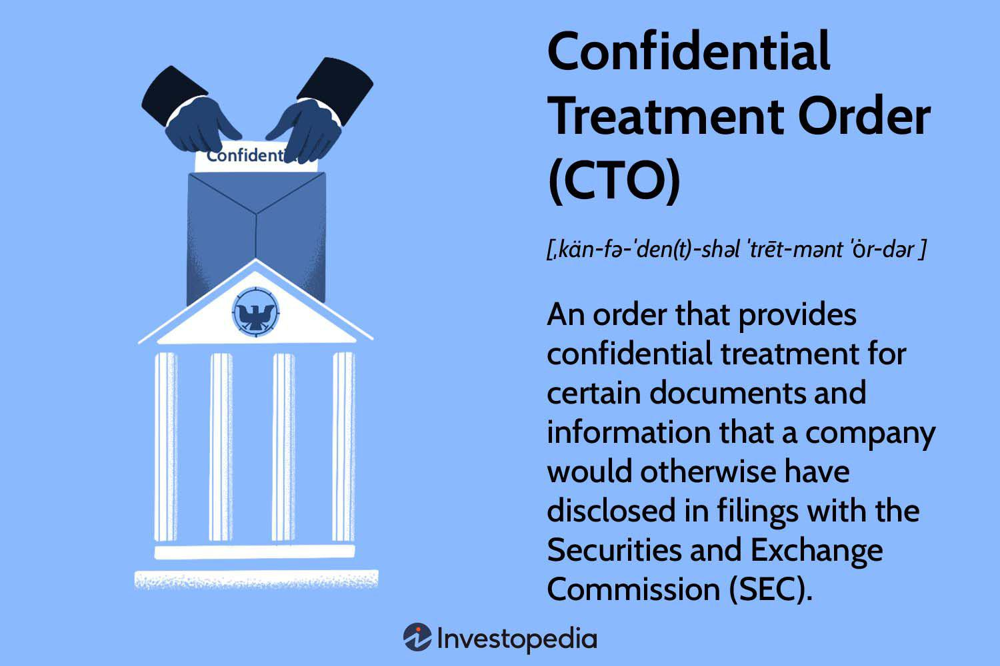

## Table of Contents

## What is a Confidential Treatment Order (CTO)?

A Confidential Treatment Order (CTO) is a legal document that a company can request from the U.S. Securities and Exchange Commission (SEC). It allows the company to keep certain information private and not share it with the public. This is often used when a company needs to file important documents but wants to keep some sensitive details confidential, like trade secrets or financial details that could harm the company if they were made public.

Companies usually ask for a CTO when they are filing documents like merger agreements or contracts. They highlight the parts they want to keep secret and explain why it's important to keep those parts confidential. If the SEC agrees, they will issue the CTO, and the company can then file the document with the sensitive information blacked out or removed. This helps the company protect its business while still following the rules about what information needs to be shared with the public.

## Why might a company request a CTO?

A company might ask for a Confidential Treatment Order (CTO) because it wants to keep some important information secret. This information could be about special recipes, new inventions, or secret plans that help the company stay ahead of others. If this information got out, it could hurt the company's business. For example, if a company is working on a new product and someone else finds out about it before it's ready, they might copy the idea or start selling a similar product first.

Another reason a company might request a CTO is to protect sensitive financial details. Sometimes, when a company is making big deals or mergers, it has to share a lot of information with the public. But if some of this information, like how much money the company is spending or [earning](/wiki/earning-announcement), became public too soon, it could affect the company's stock price or give competitors an advantage. By getting a CTO, the company can keep these details private and avoid any problems that might come from sharing them too early.

## What types of information are typically covered by a CTO?

A Confidential Treatment Order (CTO) usually covers information that a company wants to keep secret to protect its business. This can include trade secrets, like special recipes or formulas that make their products unique. It can also cover details about new inventions or technology that the company is working on. If other companies found out about these secrets, they might copy them or use them to compete against the original company.

Another type of information often covered by a CTO is financial details. When a company is making big deals, like mergers or acquisitions, it has to share a lot of information. But some of this information, like how much money the company is spending or earning, could be harmful if it became public too soon. It might affect the company's stock price or give competitors an advantage. By getting a CTO, the company can keep these financial details private until the right time.

In some cases, a CTO might also cover information about business strategies or plans. This could include details about future products, marketing plans, or expansion strategies. If competitors knew about these plans in advance, they could try to beat the company to the market or use the information to their advantage. Keeping these strategies confidential helps the company maintain a competitive edge.

## How does one apply for a Confidential Treatment Order?

To apply for a Confidential Treatment Order (CTO), a company needs to send a request to the U.S. Securities and Exchange Commission (SEC). They should include the document they want to file, like a contract or agreement, and clearly mark the parts they want to keep secret. The company also needs to explain why it's important to keep this information private and how it could hurt the business if it became public. This explanation should be detailed and convincing so the SEC understands the need for confidentiality.

Once the company sends the request, the SEC will review it. They will look at the information the company wants to keep secret and decide if it's really necessary to protect it. If the SEC agrees, they will issue the CTO, and the company can then file the document with the sensitive parts blacked out or removed. If the SEC doesn't agree, they might ask for more information or suggest changes. The whole process can take some time, so companies need to plan ahead and be patient while waiting for the SEC's decision.

## What are the eligibility criteria for obtaining a CTO?

To get a Confidential Treatment Order (CTO), a company needs to show that the information they want to keep secret is really important and could hurt their business if it got out. This information usually includes things like special recipes, new inventions, or financial details about big deals. The company has to explain clearly why keeping this information private is necessary and how it could be harmful if it became public. The explanation needs to be strong and convincing so the SEC understands why the company needs the CTO.

The SEC will review the company's request and look at the information they want to keep secret. They will decide if the company's reasons are good enough to grant the CTO. If the SEC agrees, the company can file the document with the sensitive parts blacked out or removed. But if the SEC doesn't agree, they might ask for more information or suggest changes. The company needs to be ready to provide more details or work with the SEC to meet the requirements for getting a CTO.

## What is the process for reviewing and approving a CTO application?

When a company wants a Confidential Treatment Order (CTO), they send their request to the SEC. They include the document they want to file, like a contract, and mark the parts they want to keep secret. The company also writes a clear explanation of why it's important to keep this information private and how it could hurt their business if it got out. This explanation needs to be strong so the SEC understands why the company needs the CTO.

The SEC then reviews the company's request. They look at the information the company wants to keep secret and decide if the reasons given are good enough. If the SEC agrees, they will issue the CTO, and the company can file the document with the sensitive parts blacked out or removed. If the SEC doesn't agree, they might ask for more information or suggest changes. The whole process can take some time, so companies need to be patient and ready to work with the SEC to meet the requirements for getting a CTO.

## How long does a Confidential Treatment Order last?

A Confidential Treatment Order (CTO) usually lasts for three years from the date it is granted by the SEC. This means the company can keep the information secret for that time. If the company needs to keep the information secret longer, they can ask the SEC for an extension before the three years are up.

Sometimes, the SEC might agree to extend the CTO if the company can show that the information is still sensitive and could hurt their business if it got out. But the company needs to ask for this extension and explain why it's still important to keep the information private. If the SEC doesn't agree to extend the CTO, the company will have to make the information public after the three years are over.

## Can a CTO be extended or modified, and if so, how?

Yes, a Confidential Treatment Order (CTO) can be extended or modified. If a company still needs to keep the information secret after the three years are up, they can ask the SEC for an extension. They need to explain why the information is still sensitive and could hurt their business if it got out. The SEC will review this request and decide if they will agree to extend the CTO.

If a company wants to change the CTO, they can also ask the SEC to modify it. This might be needed if the company wants to keep different parts of the document secret or if the situation has changed. The company will need to provide a clear explanation for why the modification is necessary. The SEC will look at the request and decide if they will allow the changes.

## What are the potential consequences of breaching a CTO?

If a company breaks a Confidential Treatment Order (CTO), they could face serious problems. The SEC might take legal action against the company. This could mean fines or other punishments. The company could also lose the trust of its customers and partners, which could hurt its business a lot.

Breaking a CTO could also help the company's competitors. If secret information gets out, other companies might use it to make similar products or steal business ideas. This could make it hard for the company to stay ahead in the market. It's important for companies to follow the rules of a CTO to protect their business and avoid these problems.

## How does a CTO interact with other legal obligations like FOIA?

A Confidential Treatment Order (CTO) from the SEC helps a company keep certain information secret. But there are other laws like the Freedom of Information Act (FOIA) that let people ask for information from the government. If someone asks for information under FOIA that is covered by a CTO, the government has to decide if the CTO's need for secrecy is more important than the public's right to know.

Usually, the government will look at the CTO and see if the reasons for keeping the information secret are strong enough. If they think the CTO's reasons are good, they might not release the information even if someone asks for it under FOIA. But if they decide the public's right to know is more important, they might release the information anyway. So, a CTO can help keep information private, but it has to work alongside other laws like FOIA.

## What are the differences between a CTO and other forms of confidentiality agreements?

A Confidential Treatment Order (CTO) is a special kind of confidentiality agreement that a company gets from the SEC. It lets the company keep certain information secret when they have to file documents with the government. Other types of confidentiality agreements, like non-disclosure agreements (NDAs), are between two companies or people. They agree to keep certain information private, but they don't involve the government.

The main difference is that a CTO is a legal order from the SEC, so it has the government's backing. If someone breaks a CTO, the SEC can take legal action against them. With other confidentiality agreements, like NDAs, the people or companies involved might have to go to court themselves to enforce the agreement. Also, a CTO usually lasts for three years and can be extended, while other agreements might last for a different amount of time depending on what the people or companies agree to.

## What are the best practices for managing documents under a CTO?

When managing documents under a Confidential Treatment Order (CTO), it's important to keep them safe and private. Only people who really need to see the documents should be allowed to look at them. This means setting up strong security measures, like password-protected files and secure storage. It's also a good idea to keep track of who is looking at the documents and when, so you can make sure no one is sharing the information they shouldn't.

Another important practice is to train everyone who works with these documents about the rules of the CTO. They need to understand why the information is secret and what could happen if it gets out. Regular reminders and updates can help keep everyone on the same page. If the CTO is going to expire soon, start planning early to ask the SEC for an extension if you still need to keep the information secret. By following these steps, you can make sure the documents stay confidential and avoid any problems.

## References & Further Reading

[1]: ["Guide to the U.S. Securities and Exchange Commission"](https://www.sec.gov/rules-regulations/statutes-regulations/rules-regulations-securities-exchange-commission-major-securities-laws)) by Cornell Law School's Legal Information Institute

[2]: Cumming, D., Johan, S., & Li, D. (2011). ["Exchange Trading Rules and Stock Market Liquidity"](https://papers.ssrn.com/sol3/papers.cfm?abstract_id=1328553). Journal of Financial Economics, 99(3), 651-671.

[3]: ["Algorithmic Trading and DMA: An introduction to direct access trading strategies"](https://www.amazon.com/Algorithmic-Trading-DMA-introduction-strategies/dp/0956399207) by Barry Johnson

[4]: De Prado, M. L. (2018). ["Advances in Financial Machine Learning"](https://www.amazon.com/Advances-Financial-Machine-Learning-Marcos/dp/1119482089). Wiley.

[5]: ["SEC's Guide to Confidential Treatment Requests"](https://www.sec.gov/corpfin/guidance/confidential-treatment) by the U.S. Securities and Exchange Commission

[6]: J.P. Morgan. (2010). ["The Essentials of Machine Learning in Quantitative Finance"](https://www.jpmorgan.com/technology/applied-ai-and-ml/machine-learning)