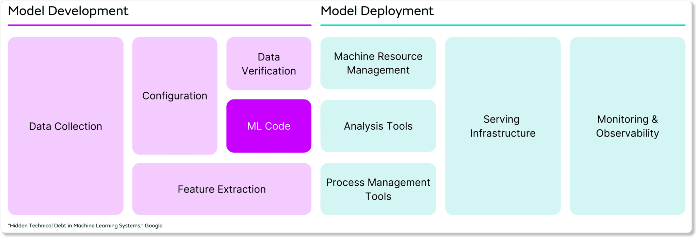

## Table of Contents

## What is configuration in the context of machine learning?

In the context of machine learning, configuration refers to the settings and parameters that control how a machine learning model is built, trained, and used. These settings can include things like the type of algorithm used, the learning rate, the number of layers in a neural network, and many other factors. The right configuration can make a big difference in how well a model performs, so it's important to choose these settings carefully.

Think of configuration like setting up a recipe for cooking. Just as you need to decide on the ingredients, the cooking time, and the temperature, in machine learning you need to decide on the right combination of settings to get the best results. Experimenting with different configurations can help you find the best way to train your model so it can make accurate predictions or decisions.

## Why is configuration important in machine learning models?

Configuration is important in machine learning models because it helps you control how the model learns and performs. Imagine you're trying to teach a dog new tricks. You need to decide how often to train the dog, what treats to use, and how long each training session should be. In machine learning, configuration settings like the learning rate, the number of layers in a neural network, or the type of algorithm used are like these training decisions. If you choose the right settings, your model can learn quickly and make good predictions. But if you pick the wrong settings, your model might not learn well or might take too long to train.

Choosing the right configuration is a bit like finding the perfect recipe for a cake. You might need to try different amounts of ingredients, different baking times, and different temperatures before you get it just right. In machine learning, you might need to experiment with different configurations to see which one works best for your data and your goals. This process, called hyperparameter tuning, can make a big difference in how well your model performs. By carefully adjusting the configuration, you can help your model learn more effectively and make better predictions.

## How does configuration affect the performance of a machine learning model?

Configuration plays a crucial role in determining how well a [machine learning](/wiki/machine-learning) model performs. Think of it like setting up a game. If you choose the right difficulty level and the right strategy, you can win easily. In machine learning, the configuration settings like the learning rate, the number of layers in a [neural network](/wiki/neural-network), or the type of algorithm used are like these game settings. If you set them correctly, your model can learn quickly and make accurate predictions. But if you choose the wrong settings, your model might struggle to learn or might take a long time to train.

Experimenting with different configurations is important because it helps you find the best way to train your model. It's like trying different recipes until you find the perfect one. By adjusting the configuration, you can see how different settings affect your model's performance. For example, changing the learning rate can make your model learn faster or slower, and changing the number of layers in a neural network can make it more or less complex. Finding the right configuration can make your model work better and give you more accurate results.

## What are some common configuration parameters in machine learning?

Some common configuration parameters in machine learning include the learning rate, the number of layers in a neural network, and the type of algorithm used. The learning rate controls how much the model changes with each step of training. If the learning rate is too high, the model might miss the best solution. If it's too low, the model might take too long to learn. The number of layers in a neural network affects how complex the model can be. More layers can help the model learn more complicated patterns, but they can also make training take longer. The type of algorithm, like decision trees, support vector machines, or neural networks, also matters a lot. Each type of algorithm is good for different kinds of problems.

Another important configuration parameter is the batch size, which decides how many examples the model looks at before updating its weights. A larger batch size can make training faster, but it might not always lead to the best results. The number of epochs, or how many times the model goes through the entire dataset, is also crucial. Too few epochs might not give the model enough time to learn, while too many epochs can lead to overfitting, where the model learns the training data too well and doesn't work as well on new data. Regularization parameters, like the strength of L1 or L2 regularization, help prevent overfitting by adding a penalty to the model's complexity. Choosing the right values for these parameters can make a big difference in how well your model performs.

## How do you determine the optimal configuration for a machine learning model?

Determining the optimal configuration for a machine learning model often involves a process called hyperparameter tuning. This is like trying different recipes until you find the one that tastes the best. You might start by choosing a few important parameters, like the learning rate or the number of layers in a neural network, and then experiment with different values for these parameters. You can use techniques like grid search, where you try every possible combination of values, or random search, where you try random combinations. Another popular method is using a tool called Bayesian optimization, which tries to find the best configuration more efficiently by learning from previous tries.

Once you have tried different configurations, you need to evaluate how well each one works. You do this by looking at how well the model performs on a separate set of data, called the validation set. The goal is to find the configuration that gives the best performance on this validation set. Sometimes, you might also use a technique called cross-validation, where you split your data into different parts and try the model on each part to get a more reliable estimate of how well it works. By carefully adjusting and testing different configurations, you can find the best settings for your model, helping it learn more effectively and make better predictions.

## What is hyperparameter tuning and how does it relate to configuration?

Hyperparameter tuning is like trying different recipes until you find the one that tastes the best. In machine learning, hyperparameters are settings that you choose before training your model, like the learning rate or the number of layers in a neural network. These are different from the model's parameters, which the model learns on its own during training. Hyperparameter tuning means trying out different values for these settings to see which ones make your model work the best. It's a bit like adjusting the knobs on a radio to get the clearest sound.

Hyperparameter tuning is closely related to configuration because it's all about finding the best configuration for your model. When you tune hyperparameters, you're changing the configuration of your model to see how different settings affect its performance. You might use methods like grid search, where you try every possible combination of values, or random search, where you try random combinations. Another method is Bayesian optimization, which tries to find the best configuration more efficiently by learning from previous tries. By carefully tuning the hyperparameters, you can find the best configuration that helps your model learn more effectively and make better predictions.

## Can you explain the difference between model parameters and configuration settings?

Model parameters and configuration settings are two different things in machine learning. Model parameters are the values that the model learns on its own during training. For example, in a neural network, the weights and biases of the neurons are model parameters. These values are adjusted by the model as it tries to make better predictions based on the data it sees. On the other hand, configuration settings, or hyperparameters, are the settings that you choose before you start training the model. These include things like the learning rate, the number of layers in a neural network, and the type of algorithm you use.

Think of it like baking a cake. The model parameters are like the ingredients in the cake, such as the flour and sugar, which the recipe tells you to mix together in a certain way. The configuration settings are like the choices you make about how to bake the cake, such as the oven temperature and the baking time. You can't change the ingredients once you've mixed them, but you can adjust the oven temperature or the baking time to see how it affects the cake. In machine learning, you can't change the model parameters directly, but you can experiment with different configuration settings to find the best way to train your model.

## How does the choice of configuration impact model training time?

The choice of configuration can really change how long it takes to train a machine learning model. Think of it like setting up a game. If you choose a high difficulty level, it might take longer to finish the game. In machine learning, if you set the learning rate too low, the model might take a lot of time to learn because it's making very small changes with each step. On the other hand, if you choose a larger batch size, the model might train faster because it's looking at more examples at once before updating its weights. But if the batch size is too large, it might not learn as well, which could mean you need to train it for longer to get good results.

Another important configuration setting that affects training time is the number of layers in a neural network. More layers can make the model more complex, which means it might take longer to train. For example, if you have a neural network with many layers, each layer has to process the data before passing it to the next one, and that takes time. Also, the number of epochs, or how many times the model goes through the entire dataset, can make a big difference. If you set too many epochs, the model might take longer to train, but it could also learn better. So, finding the right configuration is like finding the perfect balance to make sure the model trains quickly but still learns well.

## What tools or frameworks are commonly used for managing configurations in machine learning?

Many tools and frameworks help manage configurations in machine learning. One popular tool is MLflow, which lets you track experiments, manage models, and keep track of different configurations. It's like a notebook where you write down all the different recipes you try, so you can see which one works best. Another common framework is TensorFlow, which has a feature called TensorFlow Extended (TFX) that helps you manage configurations and other parts of the machine learning pipeline. It's like having a special kitchen tool that helps you cook more efficiently.

Another useful tool is Hyperopt, which is great for hyperparameter tuning. It's like a smart assistant that tries different settings to find the best ones for your model. You can also use libraries like Scikit-learn, which has tools for grid search and random search to help you find the best configuration. These tools make it easier to try different settings and see how they affect your model's performance, helping you find the best way to train your model without having to do everything by hand.

## How can configuration management help in reproducibility of machine learning experiments?

Configuration management is like keeping a detailed recipe book for your machine learning experiments. It helps you write down all the settings and parameters you use, so you can repeat the same experiment later and get the same results. This is important because it lets other people check your work and see if they get the same outcomes. If you don't keep track of your configurations, it's like trying to bake a cake without knowing the exact amounts of ingredients or the oven temperature you used last time. You might end up with a different cake each time, and it's hard to figure out why.

By using tools like MLflow or TensorFlow, you can save all your configuration settings in one place. This makes it easy to go back and see exactly what you did, so you can reproduce your experiments. It's like having a special notebook where you write down every detail of your recipe, so you can follow it exactly the next time you want to bake. This way, you can be sure that your results are reliable and that others can trust your work.

## What are the challenges faced when scaling configuration management in large machine learning projects?

When working on big machine learning projects, keeping track of all the different settings and configurations can get really tricky. Imagine you're organizing a huge party with lots of different dishes to cook. You need to remember all the recipes, the ingredients, and the cooking times for each dish. In machine learning, as the project grows, you might have many different models and experiments, each with its own set of configurations. If you don't manage these well, it's easy to lose track of what settings you used for which model, making it hard to repeat your experiments or share your work with others.

Another challenge is making sure that everyone on the team is using the same configurations. It's like trying to bake the same cake in different kitchens. If one person uses a different oven temperature or forgets an ingredient, the cake won't turn out the same. In large projects, team members might be working on different parts of the model at the same time, and if they use different settings, it can lead to confusion and inconsistent results. Using tools like MLflow or TensorFlow can help, but setting them up and making sure everyone uses them correctly can be a big job.

## How do advanced techniques like AutoML influence configuration strategies in machine learning?

Advanced techniques like AutoML, or Automated Machine Learning, change the way we handle configurations in machine learning. AutoML is like having a smart chef in your kitchen who can try different recipes for you and pick the best one. Instead of manually trying different configurations, AutoML uses algorithms to automatically search for the best settings for your model. This means you don't have to spend as much time tweaking the learning rate, the number of layers in a neural network, or other hyperparameters. AutoML can save a lot of time and effort, making it easier to find good configurations without having to be an expert in every detail.

However, AutoML doesn't make configuration management completely automatic. You still need to keep track of the configurations that AutoML tries, so you can understand and reproduce the results. It's like the smart chef might find the best recipe, but you still need to write it down so you can make the dish again. Tools like MLflow can help by logging all the configurations AutoML uses, making it easier to manage and review them. So while AutoML can make finding the best configurations easier, good configuration management practices are still important for keeping your machine learning projects organized and reproducible.

## References & Further Reading

[1]: Bergstra, J., & Bengio, Y. (2012). ["Random Search for Hyper-Parameter Optimization."](https://dl.acm.org/doi/10.5555/2188385.2188395) Journal of Machine Learning Research, 13: 281-305.

[2]: Snoek, J., Larochelle, H., & Adams, R. P. (2012). ["Practical Bayesian Optimization of Machine Learning Algorithms."](https://arxiv.org/abs/1206.2944) Advances in Neural Information Processing Systems 25.

[3]: Feurer, M., Klein, A., Eggensperger, K., Springenberg, J. T., Blum, M., & Hutter, F. (2015). ["Efficient and Robust Automated Machine Learning."](https://proceedings.neurips.cc/paper/2015/file/11d0e6287202fced83f79975ec59a3a6-Paper.pdf) Advances in Neural Information Processing Systems 28.

[4]: ["Hyperparameter Optimization with Hyperopt"](https://medium.com/@icaro_vazquez/neural-network-hyperparameter-optimization-with-hyperopt-f3e0cb4346c8) by James Bergstra, Dan Yamins, and David Cox.

[5]: Thorsten, J., Frank, H., & Holger, H. (2018). ["Automated Machine Learning: Methods, Systems, Challenges."](https://link.springer.com/book/10.1007/978-3-030-05318-5) Springer.

[6]: Keras Team. ["Keras Tuner Documentation"](https://keras.io/keras_tuner/), Keras: The Python Deep Learning Library.

[7]: Zaharia, M., Chen, A., & Ghodsi, A. (2018). ["Accelerating the Machine Learning Lifecycle with MLflow."](https://people.eecs.berkeley.edu/~matei/papers/2018/ieee_mlflow.pdf) Databricks Blog.