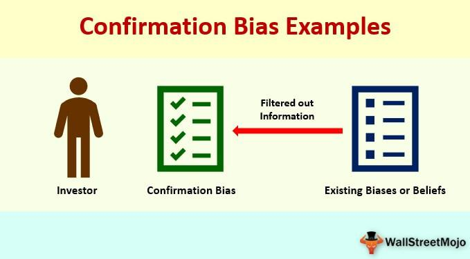

The integration of cognitive psychology with financial markets has significantly advanced our understanding of investment behavior, revealing the intricate ways in which human psychology influences trading decisions. Cognitive biases, such as confirmation bias, are particularly influential in shaping trading behaviors by causing systematic deviations from rational decision-making.

Algorithmic trading, which is designed to operate based on objective criteria and data-driven decision processes, is not entirely immune to the biases that afflict human traders. This is because algorithms are programmed by humans, who can unconsciously embed their cognitive biases in the algorithms they develop. Confirmation bias, the tendency to seek, interpret, and remember information that confirms one's existing beliefs, can manifest in the very fabric of these trading algorithms.



The exploration of cognitive biases, specifically confirmation bias, at the intersection of psychology and algorithmic trading is vital for comprehending how these mental shortcuts can influence trading outcomes. When confirmation bias affects human traders, it can lead to an overemphasis on data or signals that confirm preconceived notions while critical contrary information is overlooked. Similarly, in algorithmic trading, confirmation bias can occur when data sets are selectively chosen or when back-testing results are interpreted in a manner that favors established strategies without adequately considering contradictory signals.

By examining these biases within the context of algorithmic trading, this article underscores the profound impact that cognitive psychology can have on trading efficacy. Recognizing and addressing confirmation bias and other cognitive biases in both personal trading decisions and algorithmic development can enhance the rationality and objectivity of trading strategies, leading to improved investment outcomes.

## Table of Contents

## Understanding Cognitive Biases and Their Relevance in Algo Trading

Cognitive biases are systematic patterns of deviation from norm or rationality in judgment. They arise because the brain is tasked with processing a vast amount of information quickly, leading to shortcuts, known as heuristics, that simplify decision-making. However, these heuristic shortcuts can introduce significant errors in judgment, particularly in complex environments like financial markets. In algorithmic trading, these biases can inadvertently creep into the creation and optimization of trading models.

Programmers, being only human, [carry](/wiki/carry-trading) their own set of cognitive biases which can affect the algorithms they design. The biases that are particularly relevant in trading environments include confirmation bias, overconfidence bias, and anchoring bias. Confirmation bias occurs when individuals focus on information that confirms their existing beliefs, ignoring or downplaying evidence that contradicts them. In algorithmic trading, this might manifest when developers choose datasets or interpret results in a way that aligns with their preconceptions, potentially skewing the performance of the algorithm.

Overconfidence bias is another prevalent cognitive bias in trading. It refers to the tendency of individuals to overestimate their knowledge or predictive abilities. This can lead traders to underestimate risks or over-leverage their positions, expecting outcomes that are statistically improbable. In [algorithmic trading](/wiki/algorithmic-trading), this may result in models that are overly aggressive or not sufficiently stress-tested against unlikely market conditions.

Anchoring bias involves the human tendency to rely heavily on the first piece of information encountered (the "anchor") when making decisions. In the financial context, traders might base their judgments excessively on the initial market data or conditions, failing to adjust adequately as new information becomes available. For algorithmic trading systems, anchoring can influence how initial data values or parameters are set, potentially affecting the algorithm's adaptability to market fluctuations.

In summary, while algorithms are designed to be objective and data-driven, they are inherently influenced by the biases of their human creators. Being aware of these biases is crucial for developers to minimize their impact. Strategies such as employing diversified perspectives, rigorously testing and validating models, and continuously updating algorithms with new data can help ensure that these cognitive biases are mitigated, fostering more robust and effective trading systems.

## Confirmation Bias in Psychology and Its Impact on Trading

Confirmation bias occurs when individuals favor information that aligns with their pre-existing beliefs, while disregarding evidence that contradicts those beliefs. This cognitive bias disrupts objective decision-making processes, particularly within trading. In financial markets, traders exhibiting confirmation bias are prone to skewed analysis and suboptimal investment decisions. For instance, a trader might focus only on positive outcomes or supportive news articles that reinforce their market position, while ignoring dissenting data that could suggest a reevaluation of their strategy.

The impact of confirmation bias in trading is manifold. At its core, it can lead traders to hold onto losing positions longer than prudent, due to their selective attention to confirming evidence that the market will turn favorable. Similarly, confirmation bias can result in overconfidence, as traders repeatedly reinforce their own predictions without sufficient consideration of alternative perspectives or data.

This bias is not only a psychological phenomenon but also a statistical one, as relying solely on supportive evidence can lead to non-random sampling choices, ultimately affecting the robustness of trading strategies. When designing or evaluating trading strategies, it is crucial to remain vigilant against such cognitive pitfalls. Ensuring comprehensive data analysis that actively seeks disconfirming evidence can mitigate the risk of confirmation bias and lead to more informed and balanced trading decisions.

## Confirmation Bias in Algorithmic Trading

Algorithmic trading, which leverages sophisticated algorithms to execute trades at speeds and frequencies beyond human capability, aims to eliminate the emotional and cognitive errors inherent in manual trading. However, despite its objective nature, the development and operation of these algorithms can be significantly influenced by the cognitive bias of their human creators, notably confirmation bias.

Confirmation bias in algorithmic trading arises during the selection and interpretation of data sets used for model training and back-testing. Traders and developers often unintentionally favor data that underscores their existing trading hypotheses, thereby embedding their biases into the algorithm. For example, when conducting back-tests, developers may selectively highlight results that validate their strategies while disregarding contradictory data points. This selective analysis can lead to overfitting, where a model performs exceptionally well on historical data but poorly in live trading due to its lack of generalization to new data.

Consider a scenario where a trader believes that a certain technical indicator, such as the moving average convergence divergence (MACD), is consistently predictive of future price movements. The algorithm, influenced by the trader's bias, might be excessively tuned to signals from this indicator, dismissing other critical inputs or signals that suggest contrary moves. This can result in substantial financial losses when market conditions deviate from those represented in the biased data set.

The challenge stems primarily from the iterative development cycles where feedback loops reinforce preconceived notions. Algorithm developers tend to rely heavily on past performance data, which can create a false sense of confidence in the robustness of a trading strategy. Confirmation bias solidifies when a model is repeatedly fine-tuned to align with favorable past outcomes, neglecting broader market dynamics or unexpected outliers.

The potential consequences of confirmation bias in algorithmic trading are severe, including reduced profitability, increased risk exposure, and diminished strategy adaptability. Algorithms influenced by confirmation bias are less capable of adapting to new or unexpected market conditions, rendering them vulnerable during volatile periods.

To illustrate, Python can be employed to detect overfitting in an algorithm caused by confirmation bias. Below is a simple example using Python to apply cross-validation, which can identify bias by evaluating the model’s performance across different data subsets:

```python
from sklearn.model_selection import cross_val_score
from sklearn.ensemble import RandomForestClassifier
import numpy as np

# Assuming X, y are features and target labels for a trading strategy
model = RandomForestClassifier()
scores = cross_val_score(model, X, y, cv=5)

# Calculating mean and standard deviation of cross-validation scores
mean_score = np.mean(scores)
std_dev = np.std(scores)

print(f"Mean accuracy: {mean_score:.2f}, Standard Deviation: {std_dev:.2f}")

# High standard deviation may indicate overfitting influenced by biased data selection
```

In summary, while algorithmic trading minimizes direct human error, it remains susceptible to the biases of those who design these systems. Confirmation bias, in particular, can severely impair an algorithm's effectiveness by limiting its ability to respond objectively to various market scenarios. Acknowledging and addressing these biases through comprehensive testing and continuous strategy evaluation is crucial for enhancing trading outcomes.

## Strategies to Mitigate Cognitive Biases in Trading

Mitigating cognitive biases in trading begins with an acute awareness of their presence. Recognizing these biases allows traders to take proactive steps in addressing their influence on decision-making. Key strategies include diversifying perspectives, seeking contrary advice, and employing rules-based trading strategies.

Diversifying perspectives involves exploring multiple viewpoints to counteract personal biases. This can be achieved by consulting with a diverse group of analysts or employing [machine learning](/wiki/machine-learning) models capable of offering neutral recommendations based on varied data sets. By embracing diverse sources of information, traders can develop a more balanced view that reduces the influence of their own cognitive biases.

Seeking contrary advice is another effective strategy. By actively engaging with opinions or analyses that challenge one's initial assumptions, traders can uncover potential blind spots in their reasoning. This practice helps in refining decision-making processes and promotes a more thorough evaluation of available information.

Implementing rules-based trading strategies can significantly minimize the impact of biases. These strategies rely on predefined criteria for making trading decisions, reducing the influence of subjective judgments. For example, a moving average crossover strategy, where a buy or sell signal is triggered when a short-term moving average crosses a long-term moving average, leverages systematic rules to guide decisions:

```python
def moving_average_crossover(prices, short_window=40, long_window=100):
    signals = pd.DataFrame(index=prices.index)
    signals['price'] = prices
    signals['short_mavg'] = prices.rolling(window=short_window, min_periods=1).mean()
    signals['long_mavg'] = prices.rolling(window=long_window, min_periods=1).mean()
    signals['signal'] = 0.0
    signals['signal'][short_window:] = np.where(signals['short_mavg'][short_window:] > signals['long_mavg'][short_window:], 1.0, 0.0)
    signals['positions'] = signals['signal'].diff()
    return signals
```

Regular evaluation and objective analysis are crucial for identifying and correcting biased decision-making. By periodically reviewing trading strategies and outcomes, traders can assess whether biases have influenced their decisions and make necessary adjustments. Continuous learning and reassessment further reinforce this process, encouraging the incorporation of comprehensive data analysis into trading strategies rather than relying on intuition.

In conclusion, while cognitive biases are an intrinsic part of human decision-making, traders equipped with awareness and strategies to mitigate these biases can make more rational and objective investment decisions. Engaging consistently in learning, reassessment, and strategy refinement ultimately leads to improved trading performance and better financial outcomes.

## Conclusion

The interplay between cognitive psychology and trading underscores the profound impact that cognitive biases have on financial decision-making. Confirmation bias, in particular, can significantly skew trading strategies, leading to suboptimal outcomes. In algorithmic trading, this bias can manifest during the development phase when traders select supportive datasets or interpret back-testing results in a way that validates preconceived notions, while dismissing conflicting data that could offer critical insights. 

Awareness and proactive mitigation of confirmation bias are crucial for enhancing algorithmic trading performance. By acknowledging the presence of such biases, traders and developers can take deliberate steps to foster objective analysis and decision-making. This might involve instituting rigorous rules-based strategies that prioritize data integrity over subjective judgment, and employing diverse perspectives to challenge existing assumptions. For example, employing statistical techniques such as hypothesis testing or Bayesian inference can help differentiate between meaningful patterns and coincidental anomalies in trading data.

Traders must prioritize continuous education and the reassessment of their cognitive biases. Through ongoing learning and exposure to differing viewpoints within the financial market, traders can develop strategies that are resilient to biased thinking. Engaging in structured processes that incorporate empirical data evaluation and diverse analytical frameworks will enhance decision-making processes. 

By embedding a structured approach to bias mitigation in trading algorithms and human decision-making, traders can better navigate the complexities of financial markets, ultimately improving investment performance. This ongoing quest for objectivity not only safeguards against the pitfalls of cognitive biases but also fosters a more disciplined and effective trading strategy.

## References & Further Reading

[1]: Bergstra, J., Bardenet, R., Bengio, Y., & Kégl, B. (2011). ["Algorithms for Hyper-Parameter Optimization."](https://papers.nips.cc/paper/4443-algorithms-for-hyper-parameter-optimization) Advances in Neural Information Processing Systems 24.

[2]: ["Advances in Financial Machine Learning"](https://www.amazon.com/Advances-Financial-Machine-Learning-Marcos/dp/1119482089) by Marcos Lopez de Prado

[3]: ["Evidence-Based Technical Analysis: Applying the Scientific Method and Statistical Inference to Trading Signals"](https://www.amazon.com/Evidence-Based-Technical-Analysis-Scientific-Statistical/dp/0470008741) by David Aronson

[4]: ["Machine Learning for Algorithmic Trading"](https://github.com/stefan-jansen/machine-learning-for-trading) by Stefan Jansen

[5]: ["Quantitative Trading: How to Build Your Own Algorithmic Trading Business"](https://github.com/LucindaYa/quant-resources/blob/master/Quantitative%20Trading%20How%20to%20Build%20Your%20Own%20Algorithmic%20Trading%20Business.pdf) by Ernest P. Chan