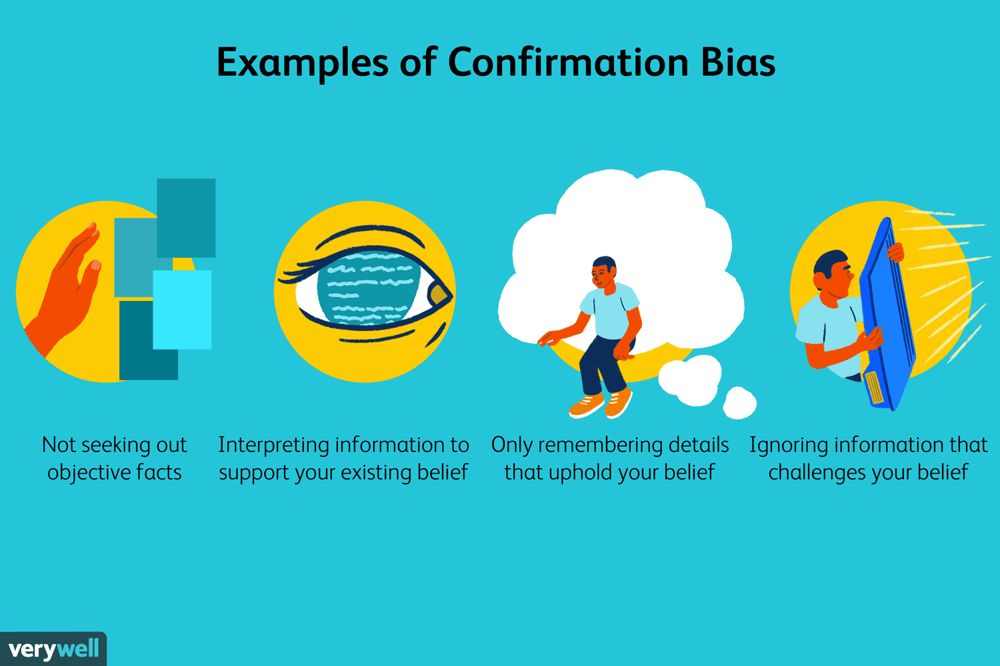

## Table of Contents

## What is confirmation bias?

Confirmation bias is when people tend to look for and believe information that agrees with what they already think. Imagine you think a certain type of food is bad for you. You might pay more attention to news stories or studies that say this food is bad and ignore ones that say it's okay. This makes your belief stronger, even if it's not completely true.

This happens because our brains like to be right and feel comfortable. It's easier to stick with what we know than to change our minds. Confirmation bias can affect many parts of our lives, like the news we watch, the friends we hang out with, and the decisions we make. Being aware of it can help us try to see things from different angles and make better choices.

## How does confirmation bias affect our daily decisions?

Confirmation bias can really change the way we make choices every day. Let's say you're trying to decide if you should buy a new phone. If you already think one brand is the best, you'll probably look for reviews and information that say good things about that brand. You might ignore or not even see the bad reviews or the good things about other brands. This can make you feel more sure about your choice, but it might not be the best one because you didn't look at all the information.

This kind of bias also shows up in how we see other people and make friends. If you believe that people from a certain group are all the same, you might only notice the actions that fit your belief. For example, if you think all teenagers are lazy, you'll pay more attention to the times they don't do their chores and ignore when they do. This can make it hard to see people fairly and can affect who you choose to spend time with or trust. Being aware of confirmation bias can help us try to be more open and fair in our daily decisions.

## What are the different types of confirmation bias?

There are a few main types of confirmation bias. One type is called selective exposure. This happens when we choose to look at information that agrees with what we already think and ignore other information. For example, if you believe that a certain diet is healthy, you might only read articles that support that diet and skip over ones that say it's not so good.

Another type is called selective perception. This is when we see the same information as everyone else, but we interpret it in a way that fits our beliefs. If you think your boss is unfair, you might see their actions as unfair even if they are trying to be fair. The last type is called selective memory. This is when we remember things that fit our beliefs better than things that don't. For example, if you think you're bad at math, you might remember the times you got a math problem wrong and forget the times you got it right.

## Can you provide examples of confirmation bias in everyday life?

Confirmation bias can show up when you're deciding what news to watch. If you believe that one political party is always right, you might only watch news channels that support that party. You'll hear a lot of stories that agree with what you think, and you might not even know about the other side's point of view. This can make you feel more sure about your beliefs, but it might not give you the whole picture.

It also happens when you're trying to make friends. Let's say you think people who like the same music as you are the best kind of friends. You might only talk to people who like that music and ignore others. If someone who likes different music does something nice, you might not notice or remember it as much as if someone who likes your music did the same thing. This can make your group of friends smaller and less diverse.

## How does confirmation bias influence our perception of news and media?

Confirmation bias can really change how we see the news and media. If you already have a strong belief about something, like politics or health, you might only watch or read news that agrees with what you think. For example, if you believe one political party is always right, you'll choose to watch news channels that support that party. You'll hear a lot of stories that fit your beliefs and might not even know about the other side's point of view. This can make you feel more sure about your beliefs, but it might not give you the whole picture of what's going on.

This kind of bias also affects how we trust the media. If you see a news story that goes against what you believe, you might think it's not true or that the media is lying. For example, if you think a certain diet is healthy and you see a report saying it's not, you might ignore that report or think it's wrong. This can make it hard to trust news sources that don't agree with you, even if they are telling the truth. Being aware of confirmation bias can help you try to look at different news sources and get a fuller picture of the world.

## What role does confirmation bias play in scientific research?

Confirmation bias can really affect scientific research. Scientists might start with an idea they believe in and then only look for information that supports that idea. For example, if a scientist thinks a new medicine works well, they might pay more attention to the patients who get better and ignore the ones who don't. This can make the research seem like it proves their idea, even if it doesn't really.

This bias can also show up when scientists are deciding what to study next. They might choose to do more research on topics they already believe in, instead of looking into new ideas. This can make science less open to new discoveries because everyone is just studying the same things over and over. Being aware of confirmation bias can help scientists try to be more fair and look at all the evidence, not just the parts that fit their beliefs.

## How can confirmation bias impact legal decisions and jury verdicts?

Confirmation bias can really affect legal decisions and jury verdicts. When people on a jury already have strong beliefs about a case, they might only pay attention to the evidence that fits those beliefs. For example, if a juror thinks the defendant is guilty, they might focus on the evidence that makes the defendant look bad and ignore the evidence that might show they're innocent. This can lead to a verdict that isn't fair because the jury didn't look at all the evidence in a balanced way.

Judges and lawyers can also be affected by confirmation bias. A judge might have a certain view about a type of crime or a certain group of people and let that view affect their decisions. For example, if a judge believes that people who commit a certain crime are always guilty, they might be harsher in their rulings. Lawyers might also focus on building a case that fits their own beliefs, which can lead them to ignore important evidence that doesn't fit their narrative. Being aware of confirmation bias can help everyone in the legal system try to be more fair and look at all the evidence carefully.

## What psychological mechanisms contribute to confirmation bias?

Confirmation bias happens because of how our brains work. One reason is that we like to feel right and comfortable. When we see information that matches what we already think, it makes us feel good. So, our brains naturally look for that kind of information. It's easier to stick with what we know than to change our minds, so we often ignore information that doesn't fit our beliefs.

Another reason is how our memory works. We tend to remember things that agree with what we think and forget things that don't. This is called selective memory. If you believe something strongly, you'll remember the times when you were right and forget the times you were wrong. This makes our beliefs even stronger over time, even if they're not completely true.

## How can individuals recognize and mitigate their own confirmation bias?

Recognizing confirmation bias starts with being aware of your own beliefs and how they might affect the way you see things. Pay attention to the information you look for and the news you watch. If you find that you only look at things that agree with what you think, that's a sign of confirmation bias. Try to notice when you ignore or dismiss information that doesn't fit your beliefs. Asking yourself why you believe something and if you've looked at all the evidence can help you spot when confirmation bias is at work.

To mitigate confirmation bias, you can try to look at information from different points of view. This means reading news from different sources, talking to people who think differently than you, and really listening to what they say. When you come across information that challenges your beliefs, take the time to think about it instead of ignoring it. It can also help to talk to someone you trust about your beliefs and ask them to point out when you might be ignoring important information. By actively trying to see things from different angles, you can make more balanced decisions and have a fuller understanding of the world.

## What are the societal impacts of widespread confirmation bias?

When a lot of people have confirmation bias, it can make society more divided. People might only talk to others who think like them and ignore different ideas. This can lead to groups of people who never talk to each other and don't understand each other's points of view. It can make it hard to solve big problems because everyone is stuck in their own beliefs. For example, if people only believe news that agrees with what they think, they might not trust other news sources, even if those sources are telling the truth. This can make it harder for everyone to agree on what's true and what's not.

Confirmation bias can also affect how laws and policies are made. If leaders and voters only look at information that fits their beliefs, they might make decisions that aren't fair or good for everyone. For example, if people believe that a certain group is always bad, they might support laws that hurt that group, even if those laws are not fair. This can lead to more inequality and make it harder for society to work together and improve. Being aware of confirmation bias can help everyone try to look at different points of view and make better choices for the whole society.

## How do different cultures exhibit confirmation bias, and does it vary?

Different cultures show confirmation bias in ways that are similar but can also be different because of their unique beliefs and values. In many cultures, people tend to stick with what they already believe and look for information that agrees with those beliefs. For example, in a culture where family is very important, people might only pay attention to stories that show family in a good light and ignore stories that show problems within families. This can make their belief in the importance of family even stronger.

But the way confirmation bias shows up can change from one culture to another. In some cultures, there might be a strong belief in traditional ways of doing things, so people might ignore new ideas or technologies that don't fit with those traditions. In other cultures, where questioning and debate are valued, people might still have confirmation bias, but they might be more open to looking at different points of view. Understanding these differences can help us see how confirmation bias works in different parts of the world and how it affects people's lives in different ways.

## What advanced strategies can organizations implement to reduce confirmation bias in decision-making processes?

Organizations can reduce confirmation bias by making sure they have a diverse group of people making decisions. When people from different backgrounds and with different views work together, they can help each other see things from different angles. This can stop the group from only looking at information that agrees with what they already think. Leaders can also set up rules for decision-making that make everyone look at all the evidence, not just the parts that fit their beliefs. For example, they can use a checklist that asks everyone to think about different points of view and to look for information that might challenge their ideas.

Another strategy is to use data and facts to guide decisions instead of just relying on what people believe. Organizations can set up systems to collect and analyze data in a fair way, so everyone can see the same information. They can also bring in outside experts who don't have a stake in the decision to give their opinions. This can help the organization see the whole picture and make choices based on what's true, not just what they want to believe. By using these strategies, organizations can make better decisions and avoid the problems that come from confirmation bias.

## References & Further Reading

[1]: Bergstra, J., Bardenet, R., Bengio, Y., & Kégl, B. (2011). ["Algorithms for Hyper-Parameter Optimization."](https://papers.nips.cc/paper/4443-algorithms-for-hyper-parameter-optimization) Advances in Neural Information Processing Systems 24.

[2]: ["Advances in Financial Machine Learning"](https://www.amazon.com/Advances-Financial-Machine-Learning-Marcos/dp/1119482089) by Marcos Lopez de Prado

[3]: ["Evidence-Based Technical Analysis: Applying the Scientific Method and Statistical Inference to Trading Signals"](https://www.amazon.com/Evidence-Based-Technical-Analysis-Scientific-Statistical/dp/0470008741) by David Aronson

[4]: ["Machine Learning for Algorithmic Trading"](https://github.com/stefan-jansen/machine-learning-for-trading) by Stefan Jansen

[5]: ["Quantitative Trading: How to Build Your Own Algorithmic Trading Business"](https://github.com/LucindaYa/quant-resources/blob/master/Quantitative%20Trading%20How%20to%20Build%20Your%20Own%20Algorithmic%20Trading%20Business.pdf) by Ernest P. Chan