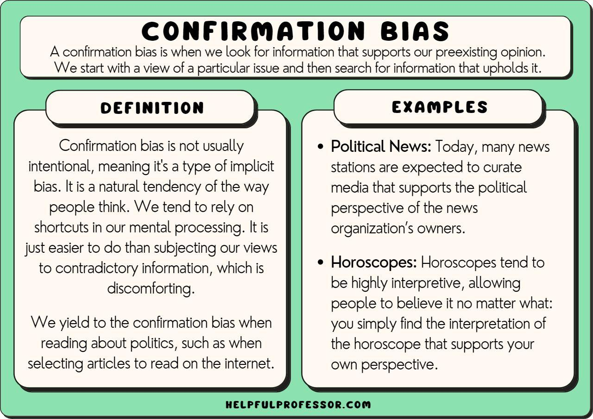

## Table of Contents

## What is confirmation in the context of psychology and social sciences?

Confirmation in psychology and social sciences refers to the process where people look for or pay more attention to information that supports their existing beliefs or ideas. This is known as confirmation bias. For example, if someone believes that a certain political party is always right, they might only read news from sources that support that party. This can make their belief stronger, even if it is not completely true.

Confirmation bias can affect how people make decisions and understand the world around them. It can lead to mistakes because people might ignore important information that does not fit with what they already think. Scientists and researchers need to be careful about confirmation bias when they do studies, so they can make sure their results are fair and accurate. By being aware of this bias, people can try to look at all sides of an issue and make better choices.

## How does confirmation bias affect decision-making processes?

Confirmation bias can make decision-making less fair and accurate. When people have this bias, they tend to look for information that agrees with what they already think. They might ignore or not even notice information that goes against their beliefs. This can lead to bad decisions because they are not considering all the facts. For example, if someone is choosing a new phone, they might only read reviews that praise the brand they like and ignore any negative feedback, leading them to buy a phone that might not be the best choice for them.

This bias can also make people feel more sure about their decisions, even if those decisions are not based on all the available information. In a work setting, a manager might only listen to team members who support their project ideas and ignore others who have different opinions. This can lead to projects that do not work well because the manager did not consider all the possible problems. By understanding and trying to avoid confirmation bias, people can make better decisions by looking at all the information and being open to different viewpoints.

## What are the psychological mechanisms behind confirmation?

Confirmation bias happens because of how our brains work. When we see or hear something new, our brains quickly try to match it with what we already know or believe. If the new information fits with our beliefs, it feels good and we remember it better. This is because our brains like to feel right and avoid feeling wrong. So, we pay more attention to things that agree with us and we might not even notice things that don't.

Another reason for confirmation bias is that it helps us feel sure and safe. When we only look at information that matches what we think, it makes our world seem simpler and easier to understand. This can make us feel more confident in our decisions, even if they are not the best ones. Our brains do this to save energy and keep us from feeling confused or unsure. But, this can lead to mistakes if we don't try to see the whole picture.

## Can you explain the concept of confirmation with a simple everyday example?

Imagine you're trying to decide if it's going to rain today. You believe it's going to rain because the sky looks cloudy. So, you start looking for signs that it will rain. You check the weather app on your phone and see that it says there's a chance of rain. You also remember hearing on the radio this morning that it might rain. All these things make you feel more sure that it's going to rain, and you decide to take an umbrella with you.

But, you didn't notice that the weather app also said the chance of rain was only 20%. You also didn't pay attention to the fact that the clouds were moving quickly, which sometimes means the weather will clear up. Because you were only looking for information that agreed with your belief that it would rain, you might have missed out on other important information. This is confirmation bias at work, making you focus on what you already think and possibly leading you to make a decision based on incomplete information.

## How does confirmation relate to cognitive dissonance?

Confirmation and cognitive dissonance are connected in how they affect our thinking. Confirmation bias is when we look for information that agrees with what we already believe. Cognitive dissonance happens when we have two ideas or beliefs that don't match, and it makes us feel uncomfortable. When we feel this discomfort, we might use confirmation bias to find information that helps us feel better by supporting our existing beliefs.

For example, imagine you think eating junk food is bad for you, but you really enjoy eating it. This can cause cognitive dissonance because your actions (eating junk food) don't match your belief (junk food is bad). To feel better, you might start looking for articles or stories that say junk food isn't so bad or that it's okay to eat it sometimes. This is confirmation bias at work, helping you reduce the discomfort of cognitive dissonance by finding information that supports what you want to believe.

## What role does confirmation play in scientific research and hypothesis testing?

In scientific research, confirmation is important but can also cause problems. Scientists make guesses called hypotheses and then test them with experiments or studies. They look for evidence that supports their guesses. But if they only pay attention to information that agrees with their hypotheses, they might miss important facts that show their guesses are wrong. This is called confirmation bias. Scientists need to be careful to look at all the information, not just what they expect to see, to make sure their research is fair and correct.

To avoid confirmation bias, scientists use methods like double-blind studies, where neither the researchers nor the participants know who is getting what treatment. This helps keep the research honest. They also share their work with other scientists who can check it and point out any mistakes. By being open to different results and looking at all the evidence, scientists can reduce the impact of confirmation bias and make their research more reliable.

## How can confirmation bias be identified and measured in experimental settings?

In experimental settings, confirmation bias can be identified by looking at how researchers gather and interpret data. If a researcher only focuses on data that supports their hypothesis and ignores data that does not, this might show confirmation bias. For example, if a scientist studying a new medicine only reports the positive outcomes and leaves out the negative ones, this could be a sign of confirmation bias. To catch this, other scientists can review the research to see if all the data was considered fairly.

Measuring confirmation bias can be tricky, but researchers use special methods to do it. One way is to use a test where people are given information and then asked to make a decision. The test can be set up so that some information supports a certain belief and other information does not. By seeing how much people pay attention to the supporting information compared to the non-supporting information, researchers can measure how strong the confirmation bias is. Another way is to ask people to predict the results of a study and then compare their predictions to the actual results. If their predictions are far off from the real results, it might show that they were influenced by confirmation bias.

## What are some strategies to mitigate the effects of confirmation bias in personal and professional life?

To lessen the effects of confirmation bias in your personal life, you can start by trying to see things from different points of view. When you have a strong belief about something, take a moment to think about why someone else might see it differently. You can also make a habit of looking for information that goes against what you believe. For example, if you think a certain type of food is healthy, read articles that argue it might not be as good for you. By doing this, you'll get a fuller picture and make better choices.

In your professional life, it's important to create an environment where different opinions are welcomed. Encourage team members to share their thoughts, even if they disagree with you. This can help you see problems from all sides and make more informed decisions. Another good strategy is to have someone else review your work or decisions. They might spot things you missed because they don't have the same biases as you. By being open to feedback and looking at all the information, you can reduce the impact of confirmation bias at work.

## How do different cultures perceive and handle confirmation bias?

Different cultures might see and deal with confirmation bias in their own ways. In some cultures, people might value harmony and agreement more than in others. This could mean they are more likely to look for information that everyone agrees with, which can make confirmation bias stronger. For example, in cultures where respect for elders is very important, people might be more likely to accept the beliefs of older generations without questioning them, leading to a kind of confirmation bias where they only see information that supports what they've been taught.

On the other hand, cultures that value open discussion and questioning might be better at noticing and dealing with confirmation bias. In these places, people might be encouraged to think critically and look at different points of view. This can help them see when they are only paying attention to information that agrees with what they already think. For instance, in cultures with a strong tradition of debate and argument, people might be more likely to challenge their own beliefs and look for evidence that goes against them, which can help reduce the effects of confirmation bias.

## What are the ethical implications of confirmation bias in fields like journalism and law?

In journalism, confirmation bias can lead to stories that are not fair or complete. If a journalist only looks for information that fits their own views, they might miss important facts that tell a different side of the story. This can make their reporting biased and can mislead people who read or watch the news. It's important for journalists to check all the facts and talk to people with different opinions so they can give a full and honest picture of what's happening. If they don't, they might hurt their credibility and the public's trust in the news.

In the field of law, confirmation bias can have serious effects on court cases. Lawyers and judges might focus only on evidence that supports their side of the argument and ignore evidence that doesn't. This can lead to unfair decisions where the truth is not fully considered. It's crucial for everyone in the legal system to look at all the evidence carefully and be open to different interpretations. If they don't, innocent people might be punished, or guilty people might go free, which is not fair and can harm the justice system's reputation.

## How has the understanding of confirmation evolved in psychological theory over the last century?

Over the last century, the understanding of confirmation bias in psychological theory has grown a lot. At first, psychologists didn't know much about it. They thought people made choices based on all the facts they had. But in the 1960s, a scientist named Peter Wason did a study that showed people often look for information that agrees with what they already think. This was a big step in understanding confirmation bias. Since then, more and more research has been done to learn how this bias affects how we think and make choices.

Today, psychologists know a lot more about confirmation bias. They've found that it's not just about looking for information that agrees with us. It's also about how we remember and use information. People tend to remember things that fit with their beliefs better than things that don't. This can make our beliefs even stronger over time. Psychologists now study how to help people notice and reduce confirmation bias, so they can make better decisions. This understanding has changed how we think about thinking and has helped many fields, like science and law, try to be fairer and more accurate.

## What advanced techniques or technologies are being developed to counteract confirmation bias in complex decision-making systems?

To help fight confirmation bias in complex decision-making systems, scientists and engineers are working on new techniques and technologies. One approach is using [artificial intelligence](/wiki/ai-artificial-intelligence) (AI) and [machine learning](/wiki/machine-learning). These systems can look at a lot of data very quickly and find patterns that people might miss. They can also be set up to look for information that goes against what people already believe. This helps to make sure all the facts are considered, not just the ones that fit with what someone thinks.

Another technique is using decision support systems. These are computer programs that help people make choices by showing them all the information they need. They can be designed to show different points of view and make sure that people don't just see what they want to see. By using these systems, people can make better decisions because they are looking at all the facts, not just the ones that agree with them.

## References & Further Reading

[1]: Bergstra, J., Bardenet, R., Bengio, Y., & Kégl, B. (2011). ["Algorithms for Hyper-Parameter Optimization."](https://dl.acm.org/doi/10.5555/2986459.2986743) Advances in Neural Information Processing Systems 24.

[2]: ["Advances in Financial Machine Learning"](https://www.amazon.com/Advances-Financial-Machine-Learning-Marcos/dp/1119482089) by Marcos Lopez de Prado

[3]: ["Evidence-Based Technical Analysis: Applying the Scientific Method and Statistical Inference to Trading Signals"](https://www.amazon.com/Evidence-Based-Technical-Analysis-Scientific-Statistical/dp/0470008741) by David Aronson

[4]: ["Machine Learning for Algorithmic Trading"](https://github.com/stefan-jansen/machine-learning-for-trading) by Stefan Jansen

[5]: ["Quantitative Trading: How to Build Your Own Algorithmic Trading Business"](https://www.amazon.com/Quantitative-Trading-Build-Algorithmic-Business/dp/1119800064) by Ernest P. Chan