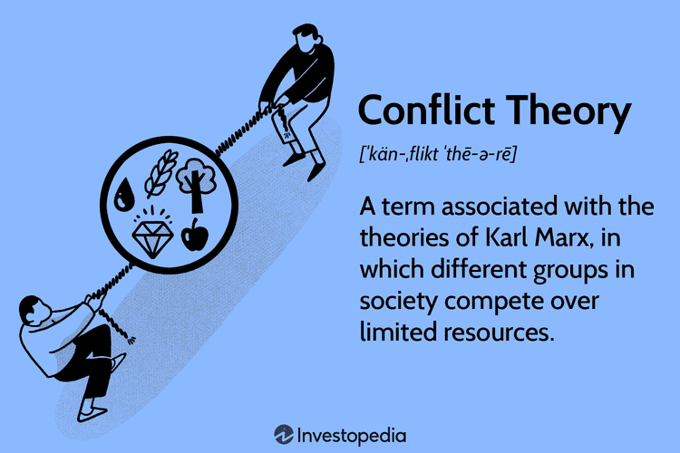

The intersection of sociology, specifically Karl Marx's conflict theory, and the domain of algorithmic trading presents a captivating framework for analyzing modern financial markets. Understanding this convergence is essential for comprehending the complexities of current market dynamics, where technology and socio-economic factors are intricately linked.

Karl Marx's conflict theory postulates that society functions as a battleground of competing classes, primarily the bourgeoisie and the proletariat, vying for limited resources and power. This theory has been instrumental in examining power dynamics, inequality, and the struggle for dominance within various societal contexts. In the sphere of financial markets, these concepts take on new dimensions, reflected in the technical landscape of algorithmic trading—an area where sophisticated algorithms are developed to capitalize on market opportunities.



Algorithmic trading, characterized by the use of computer algorithms to execute trades at high speed and frequency, has transformed the decision-making processes in financial markets. These algorithms can be seen as the modern 'actors' in a market where resources, represented by financial gains, are contested. The deployment of these algorithms illustrates a parallel to the societal power struggles depicted by Marx, as institutional investors and financial entities wield significant influence over market trends and retail traders.

Examining this intersection provides insights into how socio-economic theories such as conflict theory can shed light on the behavioral patterns observed in algorithmic trading. By analyzing the dynamics of social conflicts and their manifestations in trading strategies, we can appreciate the broader implications of economic theories in finance. This exploration not only enhances our understanding of market functions but also extends to the socio-economic impacts these activities imprint on different societal classes.

This article will explore the essential aspects of Marx's conflict theory and its metaphorical application in algorithmic trading. We will investigate how algorithms govern resource competition and influence market dynamics, alongside case studies that demonstrate the practical implications of conflict theory in financial contexts. Critiques and counterarguments will be addressed, alongside suggestions for further research into the sociological dimensions of finance. Such an exploration aims to leave readers with a nuanced perspective on the evolution of financial markets as part of broader societal structures.

## Table of Contents

## Karl Marx's Conflict Theory: A Brief Overview

Karl Marx's conflict theory is a fundamental framework within sociology and critical theory, offering a lens to view society through the dynamics of power and economic competition. At its core, conflict theory postulates that societal structures are inherently unequal, systematically benefiting the ruling class, or bourgeoisie, while subjugating the working class, or proletariat. This theory is grounded in the notion of class struggle, where Marx envisaged a society perpetually torn apart by conflicts over limited resources.

Class struggle is central to Marx's perspective, characterizing society as a battlefield where each class advances its interests at the expense of others. The bourgeoisie, who control the means of production, perpetuate their dominance by exploiting the labor of the proletariat, who own only their labor. This exploitation manifests in the form of wage labor, where workers are paid less than the value they produce, a concept Marx termed surplus value. Essentially, the bourgeoisie accumulates capital by extracting surplus value from the proletariat, reinforcing existing power dynamics and societal inequalities.

Over the years, Marx's theory has had a profound influence on various social and economic paradigms. It has been instrumental in shaping political ideologies, particularly communism and socialism, which advocate for a classless society in which resources are equitably distributed. Beyond politics, conflict theory has permeated numerous academic disciplines, informing critiques of capitalism and analyses of power relations in diverse contexts such as education, healthcare, and law.

Despite its transformative impact, conflict theory has not escaped criticism and reinterpretation. Notably, sociologist Max Weber offered a nuanced critique and expansion of Marx's ideas. While agreeing that economic factors were significant, Weber posited that social stratification is also influenced by other dimensions such as status (prestige) and party (political power). Weber's multidimensional approach suggests that economic class alone is insufficient to fully explain societal inequalities, acknowledging the roles of culture and political institutions in shaping social hierarchies. 

Furthermore, modern interpretations of conflict theory have evolved to include various forms of oppression beyond class, incorporating analyses of race, gender, and other axes of identity. These adaptations reflect a broader understanding of power dynamics and highlight the complexity of interactions between different societal groups.

Marx's conflict theory remains a critical tool for understanding inequalities in society. It challenges us to scrutinize the structures that underpin economic systems and encourages a deeper examination of the forces that drive socio-economic disparities. The theoretical legacy of Marx, complemented by subsequent contributions and critiques, continues to provide valuable insights into the persistent struggles that characterize human societies.

## Understanding the Intersection with Algo Trading

Karl Marx's conflict theory, primarily centered on class struggle, offers a unique lens through which to view the operations of [algorithmic trading](/wiki/algorithmic-trading) in contemporary financial markets. At its core, conflict theory posits that society is in a state of perpetual conflict due to competition for limited resources, a concept that can be metaphorically extended to algorithmic trading, where algorithms are the entities competing for financial gains.

Algorithmic trading relies heavily on mathematical models and sophisticated algorithms to make decisions about buying and selling assets at speeds and frequencies that are impossible for human traders. In this system, algorithms can be seen as [agents](/wiki/agents) that compete for resources—capital and profitable trades—in the financial markets. Much like Marx's description of class systems, where the bourgeoisie holds power over the proletariat, certain algorithms and trading firms hold significant advantages over smaller entities. This disparity is often attributed to access to technology, market data, and capital—resources that grant them power and control over market outcomes.

Power dynamics within financial institutions are pivotal in shaping market strategies. Large financial entities can afford to invest in high-frequency trading ([HFT](/wiki/high-frequency-trading-strategies)) infrastructure, allowing them to execute orders faster than others. This can be compared to Marx's view of the bourgeoisie's control over production means, where in algorithmic trading, control is exerted over the "means of execution." The algorithms utilized by these firms not only govern the pace of trades but also influence market prices and [liquidity](/wiki/liquidity-risk-premium), often leading to a concentration of power among a few dominant players.

Moreover, the stakeholders in algorithmic trading can be likened to Marx's socio-economic classes. Large investment banks and hedge funds could be seen as the new-age bourgeoisie, wielding significant influence over market trends and dynamics. Conversely, smaller individual investors, without access to advanced technologies or large pools of capital, represent the proletariat. They often find themselves at a disadvantage, akin to the working-class individuals in Marx's theory who lack control over resources and decision-making processes.

This dynamic can perpetuate financial inequality, where profitable opportunities in the market are disproportionately captured by those with superior technological infrastructure and capital, mirroring the societal inequalities emphasized in conflict theory. As these powerful algorithms execute trades efficiently and rapidly, they further consolidate resources and influence within a small subset of market players, raising critical questions about fairness and accessibility in financial markets.

Understanding these intersections not only highlights the echoes of Marxist theory in modern financial systems but also encourages ongoing discourse on the implications of such dynamics. As financial technologies continue to evolve, the conversation about the ethical and economic ramifications of algorithmic trading remains crucial in contemplating the future structure of global financial markets.

## Case Studies and Real-World Examples

Examining specific instances where insights from Karl Marx's conflict theory manifest in financial markets reveals underlying power dynamics and resource struggles. The 2008 financial crisis serves as a poignant example where conflict theory perspectives can be applied. The crisis highlighted the inherent disparities within the financial system, where major financial institutions, akin to the bourgeoisie, wielded significant influence and resources, often at the expense of ordinary citizens, symbolized as the proletariat.

A conflict theory analysis of the 2008 crisis would focus on how these financial institutions engaged in risky subprime mortgage lending, driven by the pursuit of profit and power, without sufficient regard for societal repercussions. This resulted in significant wealth accumulation for the institutional elite while leading to widespread economic hardship for lower and middle-income individuals. The crisis exacerbated the socio-economic divide, aligning with Marx’s notion of class struggle rooted in resource allocation.

In the context of algorithmic trading, strategies can also be seen through the lens of domination and power dynamics central to conflict theory. High-frequency trading (HFT) represents a quintessential example where advanced algorithms dominate market transactions. These algorithms execute trades at speeds and volumes that are inaccessible to average traders, ensuring a competitive advantage for financial institutions equipped with such technology. This scenario mirrors the exploitation and asymmetry of resources depicted in conflict theory. For instance, the use of proprietary algorithms allows these institutions to leverage market conditions and exert considerable influence over prices and liquidity, marginalizing smaller players.

```python
# Example: Simulating a basic high-frequency trading strategy
import numpy as np

# Parameters for simulation
price_changes = np.random.normal(0, 1, 1000)  # Simulated price changes
initial_price = 100
prices = initial_price + np.cumsum(price_changes)

# Simple HFT strategy: buy on price dips, sell on price peaks
positions = np.where(prices < np.roll(prices, 1), 1, 0)  # Buy if price lower than previous
profits = np.diff(prices) * positions[:-1]  # Calculate profit

print("Simulated HFT profits:", np.sum(profits))
```

The broader socio-economic impacts of these events often exacerbate inequalities. The economic fallout from the 2008 crisis, for example, had a disproportionately adverse effect on lower-income households. Many lost homes, jobs, and savings, amplifying their economic vulnerability. Meanwhile, financial institutions responsible for precipitating the crisis often received government bailouts, a move perceived as reinforcing power imbalances. Similarly, algorithmic trading strategies have been criticized for potentially destabilizing markets, as evidenced by incidents like the 2010 Flash Crash. These events can trigger broader market [volatility](/wiki/volatility-trading-strategies), affecting investors across socio-economic strata and undermining market confidence.

In conclusion, the juxtaposition of conflict theory with financial market dynamics, particularly during crises and through the lens of algorithmic trading, provides a valuable framework for understanding the persistent and evolving nature of socio-economic disparities. This analysis highlights the need for continuous scrutiny and regulatory oversight to mitigate power imbalances and foster a more equitable financial system.

## Critiques and Counterarguments

Applying Karl Marx's conflict theory to algorithmic trading invites a range of critiques and counterarguments that question the validity and comprehensiveness of such an approach. One core critique is the limitation of interpreting financial markets exclusively through the conflict lens. Karl Marx's conflict theory posits that societal structures are predominantly shaped by conflicts over resources and power dynamics between dominant and subordinate groups. However, financial markets are complex systems influenced by a multitude of factors, including technological advancements, regulatory frameworks, and global economic conditions. Reducing the analysis of these markets to a binary class struggle, akin to the bourgeoisie and proletariat dichotomy, risks oversimplification and overlooks the multifaceted nature of modern financial dynamics.

An alternative perspective comes from other sociological theories that emphasize different dynamics in financial markets. For instance, symbolic interactionism focuses on the individual actions and interactions of market participants, illuminating the subjective meanings and decisions that can drive market trends. This approach highlights the importance of understanding market behavior from the ground level, where individual decisions collectively shape broader market movements. Another notable framework is structural functionalism, which views financial markets as systems working to maintain societal equilibrium. This theory underscores the essential role that financial markets play in allocating resources efficiently across the economy, potentially offering a more balanced understanding than a conflict-centered perspective.

Economic theories also provide alternative lenses through which to view algorithmic trading. Efficient Market Hypothesis (EMH), for example, argues that financial markets are information-efficient, suggesting that asset prices reflect all available information. From this perspective, algorithmic trading contributes to market efficiency by quickly incorporating new data into trading decisions, reducing the chances for systemic imbalances due to information asymmetry. Furthermore, behavioral economics introduces the cognitive biases and emotional factors influencing market participants, thereby complementing algorithmic approaches that aim to mitigate human error.

Counterarguments to the conflict theory application further support the perceived benefits of algorithmic trading, particularly its democratization potential. Proponents argue that algorithmic trading provides broader access to financial markets, enabling retail investors to engage in strategies previously reserved for institutional traders. Algorithmic trading tools can offer sophisticated analysis and decision-making capabilities, which, when made accessible, empower a wider audience to participate in the financial ecosystem. Consequently, this broader participation can lead to more diverse market perspectives and innovations, counteracting the notion of an oppressive power structure governing market activities.

In summary, while conflict theory offers a compelling narrative regarding power dynamics and resource allocation, its application to algorithmic trading encounters significant critiques. These include the limitations of a conflict-focused lens and the merit of incorporating alternative sociological and economic theories. Additionally, embracing the democratization potential of algorithmic trading presents a counterargument to the conflict-centric critique, suggesting that these technologies can contribute positively to the financial market landscape.

## Conclusion

The intersection of Karl Marx's conflict theory and algorithmic trading offers profound insights into modern financial markets. By applying conflict theory, we gain a lens to scrutinize the power dynamics, resource allocation, and inequality intrinsic to algorithmic trading environments. This perspective underlines how algorithms reflect and potentially exacerbate existing societal inequalities reflected in financial practices.

Algorithmic trading, with its reliance on complex mathematical models and high-speed data processing, often mirrors Marx's depiction of class struggles, where sophisticated algorithms become accessible primarily to dominant financial institutions—akin to the bourgeoisie—and not to smaller, independent traders or individuals—similar to the proletariat. This potentially amplifies the divide between large institutions and smaller market participants, reflecting broader societal inequalities.

Understanding these dynamics underscores the necessity of continuous examination of how advanced technologies influence economic equality and power structures. The strategies employed by large institutions in algorithmic trading, driven by profit-maximization imperatives, can have broader socio-economic implications, leading to market volatility and financial crises that primarily affect lower socio-economic classes. The 2008 financial crisis is a testament to such impacts, where algorithm-driven decisions played a significant role, highlighting the importance of monitoring these technologies within a regulatory framework to ensure fair market practices.

Future research should consider how the integration of sociological constructs like conflict theory can provide a comprehensive understanding of financial markets. It is crucial to explore whether algorithmic trading can be democratized, allowing more equitable access to technological resources and reducing disparities in financial power. Additionally, larger interdisciplinary studies involving sociology, economics, and computer science can enrich our understanding of market dynamics and foster the development of equitable financial technologies.

In conclusion, the ongoing evolution of financial markets underscores the necessity of viewing them through a sociological lens to understand their role in societal structures. The integration of conflict theory offers a compelling narrative that not only critiques existing disparities but also paves the way for more inclusive financial practices. Readers are encouraged to reflect on these insights and consider the broader societal implications of algorithmic trading as it continues to shape economic landscapes.

## References & Further Reading

[1]: Marx, Karl, and Friedrich Engels. ["The Communist Manifesto."](https://www.britannica.com/topic/The-Communist-Manifesto) 1848.

[2]: Marx, Karl. ["Capital: Critique of Political Economy, Vol. 1."](https://www.marxists.org/archive/marx/works/download/pdf/Capital-Volume-I.pdf) 1867.

[3]: Weber, Max. ["Economy and Society: An Outline of Interpretive Sociology."](https://books.google.com/books/about/Economy_and_Society.html?id=MILOksrhgrYC) University of California Press, 1978.

[4]: Pardo-Guerra, Juan Pablo. ["Automating Finance: Infrastructures, Engineers, and the Making of Electronic Markets."](https://www.amazon.com/Automating-Finance-Infrastructures-Engineers-Electronic/dp/1108496423) Princeton University Press, 2020.

[5]: Iosifidis, Jason, et al. ["Algorithmic trading and financial regulation: A global perspective."](https://link.springer.com/article/10.1007/s11245-019-09653-6) Journal of Financial Markets, 2017.

[6]: Patterson, Scott. ["Flash Boys: A Wall Street Revolt."](https://www.amazon.com/flash-boys-wall-street-revolt-ebook/dp/b00hvjb4vm) W. W. Norton & Company, 2014.