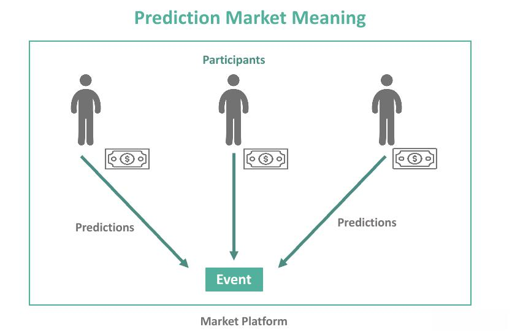

Algorithmic trading, often referred to as algo trading, is the use of computer algorithms to automate the process of trading financial securities. This method leverages mathematical models and complex formulas to make high-frequency trading decisions that are both rapid and efficient. The significance of algorithmic trading lies in its ability to execute trades at speeds and frequencies that are beyond the capacity of human traders. By automating trading strategies, it aims to enhance market efficiency, reduce transaction costs, and eliminate the emotional and psychological biases that can affect human decision-making.

In algo trading, statistical tools play a crucial role. They provide the foundation for building algorithms that can predict market movements, identify trading signals, and optimize strategies. Some commonly used statistical tools in algorithmic trading include time-series analysis, regression models, and machine learning algorithms. These tools analyze vast amounts of historical data to uncover patterns and relationships that inform trading decisions.



A key aspect of algorithmic trading is the estimation of uncertainty in algorithmic models. This is crucial because financial markets are inherently volatile and unpredictable. Uncertainty estimation helps in quantifying the confidence level of predictions made by trading algorithms. It allows traders to assess the risk associated with their trading strategies and to make more informed decisions. One popular approach to uncertainty estimation is the construction of prediction intervals, which provide a range within which future observations are expected to fall with a certain probability.

MAPIE (Model Agnostic Prediction Interval Estimation) is an innovative method for estimating prediction intervals, which is particularly relevant in the context of machine learning models. Unlike traditional methods that rely on specific model assumptions, MAPIE is designed to be agnostic of the model used. This flexibility makes it applicable to a wide range of models, enhancing the robustness of its predictions. MAPIE works by leveraging techniques such as conformal prediction and bootstrapping to assess the uncertainty in model predictions, providing valuable insights into the reliability of these predictions.

The purpose of this article is to explore MAPIE's principles, its implementation in algorithmic trading systems, and its advantages and limitations. Additionally, the article will examine the importance of prediction intervals in managing risk and improving trading strategy outcomes. By delving into the future prospects of MAPIE in the trading industry, we aim to highlight its transformative potential in advancing algorithmic trading strategies and promoting the adoption of uncertainty estimation practices among traders and financial analysts.

## Table of Contents

## Understanding MAPIE

MAPIE (Model Agnostic Prediction Interval Estimation) is a statistical tool designed to provide prediction intervals for machine learning models, making it an invaluable resource for quantifying uncertainty in predictions. Prediction intervals offer a range around predicted values where future observations are expected to fall, with a certain probability. They are pivotal in assessing the reliability of model predictions, particularly in fields requiring stringent risk management like finance.

### Definition and Basic Principles of MAPIE

MAPIE operates under the premise of model-agnosticism, meaning it can be applied across different [machine learning](/wiki/machine-learning) models without requiring specific structural adjustments. By decoupling prediction interval estimation from the model’s internal mechanisms, MAPIE makes it easier to apply these estimations broadly, regardless of the base algorithm's complexity. The method aims to offer a flexible, straightforward approach for augmenting models with uncertainty quantifiable outputs.

### How MAPIE Works: Estimating Prediction Intervals

MAPIE employs conformal prediction techniques to estimate prediction intervals. The method involves training a model on a subset of data to make predictions on a complementary subset. The residual errors between actual and predicted values are then used to compute a non-conformity measure. This measure is subsequently applied to derive prediction intervals that adapt dynamically based on the model behavior and data characteristics. The intervals are chosen to ensure that a preset proportion of future, unseen data points fall within the bounded range, thereby providing a statistical guarantee regarding prediction accuracy.

### Comparison with Traditional Prediction Interval Methods

Traditional methods for estimating prediction intervals often rely on assumptions pertinent to specific model architectures, like linearity in regression models. Such assumptions may not hold in complex, non-linear models, leading to inaccurate uncertainty estimates. In contrast, MAPIE's model-agnostic nature and reliance on conformal prediction circumvent these restrictions, allowing for more robust and applicable results across a variety of models without dependencies on model-specific distributional assumptions.

### Statistical Foundations Supporting MAPIE

The statistical robustness of MAPIE is tied to the conformal prediction framework, which ensures that the calculated intervals maintain nominal coverage probabilities. This means that if an interval is computed to cover 95% of future data points, it will do so in practice, conditional on the data distribution being stable between training and prediction phases. The symmetry and distribution-free properties of conformal prediction enhance its generalizability and reliability in diverse applications.

### Examples of Use Cases in the Financial Industry

In finance, where [algorithmic trading](/wiki/algorithmic-trading) strategies hinge on the accuracy and reliability of forecasts, MAPIE provides a means to quantify predictive uncertainty, contributing to more informed trading decisions. For instance, portfolio managers might use MAPIE to establish confidence bounds on expected asset returns, improving asset allocation decisions. Similarly, trading algorithms can integrate these intervals to adjust strategies dynamically in response to varying uncertainty levels, potentially enhancing risk-adjusted returns.

By coupling model predictions with quantified uncertainty, MAPIE enables traders and financial analysts to refine risk management practices and optimize strategies, making it a critical component in modern data-driven financial decision-making processes.

## Importance of Prediction Intervals in Algo Trading

Prediction intervals play a crucial role in algorithmic trading by providing a measure of uncertainty around forecasted values. Unlike point estimates, which can be misleadingly precise, prediction intervals give a range where the true value is likely to fall, thus enabling traders to assess not only the expected outcome but also the associated risks. This is particularly important in financial markets, where [volatility](/wiki/volatility-trading-strategies) and rapid changes present significant challenges to precise forecasting.

Managing risk and uncertainty is a primary concern for trading algorithms. Prediction intervals help traders quantify the uncertainty inherent in their models, allowing for more informed decision-making. By understanding the range of potential outcomes, traders can better manage their risk exposure. This is essential in scenarios where overconfidence in a model's predictions may lead to excessive risk-taking and potential financial loss.

In portfolio optimization and risk assessment, prediction intervals are employed to evaluate the potential variability of asset returns. This aids in constructing portfolios that are not only optimized for expected returns but also for their risk profiles. For example, by using prediction intervals, a trader can identify assets that, while having high expected returns, also exhibit high uncertainty, thus allowing for a more balanced approach to portfolio construction.

There are several case studies that demonstrate how the use of prediction intervals has led to improved trading strategy outcomes. For instance, employing prediction intervals in a mean-reversion strategy might enable a trader to set more adaptive entry and [exit](/wiki/exit-strategy) points, reducing losses during volatile periods. Similarly, in trend-following strategies, prediction intervals can help determine when to hold an asset longer versus when to take profits, enhancing the overall profitability of the strategy.

However, deploying prediction intervals in practice is not without its challenges. One major issue is the computational burden that comes with calculating these intervals, especially in real-time trading environments. This necessitates efficient algorithms and powerful computing resources, which can be costly. Moreover, the accuracy of prediction intervals depends heavily on the underlying model assumptions. If the model is misspecified, the intervals may not accurately capture the true uncertainty, leading to misguided trading decisions.

In sum, prediction intervals serve as a fundamental tool in algorithmic trading by offering a quantitative measure of uncertainty. Their integration into trading algorithms enhances risk management and decision-making processes, albeit with challenges related to computational demands and model accuracy. Emphasizing prediction intervals in trading strategies can lead to more robust and resilient financial models, potentially yielding improved trading performance.

## Integration of MAPIE in Algorithmic Trading Systems

Integrating MAPIE (Model Agnostic Prediction Interval Estimation) into an existing algorithmic trading system requires both a strategic approach and the right technological resources. This section outlines the steps needed for successful integration, discusses relevant tools and software, and offers guidance on best practices to ensure reliability and accuracy.

### Steps to Integrate MAPIE into an Existing Trading System

1. **Understand Current System Architecture**: Before integrating MAPIE, it is essential to thoroughly understand the architecture of the existing algorithmic trading system. This involves identifying the points where prediction intervals can enhance decision-making processes.

2. **Select Appropriate Machine Learning Models**: MAPIE is compatible with various machine learning models used in trading systems, such as linear regression, decision trees, and neural networks. Select models that align with trading objectives and have been historically validated within the system.

3. **Implement MAPIE for Prediction Intervals**: Incorporate MAPIE to estimate prediction intervals by using Python packages like `mapie`, which provides a straightforward implementation for various models. This involves fitting the model and calculating intervals:

   ```python
   from mapie.estimators import MapieRegressor
   from sklearn.linear_model import LinearRegression
   from sklearn.datasets import make_regression

   X, y = make_regression(n_samples=200, n_features=5, noise=0.1)
   model = LinearRegression()
   mapie = MapieRegressor(estimator=model, cv=5, method="naive")
   mapie.fit(X, y)
   intervals = mapie.predict(X, alpha=0.1)
   ```

4. **Integrate with Trading Strategies**: Use the prediction intervals to refine trading strategies, such as setting stop-loss thresholds or adjusting position sizes based on model uncertainty.

5. **Backtesting and Validation**: Conduct rigorous backtesting to validate the performance of MAPIE-integrated strategies. This ensures that prediction intervals contribute to improved performance metrics like Sharpe ratio or drawdown.

### Tools and Software Packages Available for Implementing MAPIE

The integration of MAPIE benefits from a range of software tools and packages:

- **Python Libraries**: Utilize Python libraries such as `scikit-learn` for machine learning models and `mapie` for prediction interval calculations.
- **Data Management Tools**: Software such as `pandas` and `numpy` supports data manipulation and numerical operations, which are vital for pre-processing input data for MAPIE.
- **Algorithmic Trading Platforms**: Platforms like QuantConnect or backtrader provide environments to test and deploy MAPIE-enhanced trading strategies.

### Programming Languages and Libraries Suitable for MAPIE Integration

MAPIE is predominantly implemented in Python, given its rich ecosystem of data science libraries. Libraries like `scikit-learn` form the foundation for model building, while packages like `mapie` specialize in prediction interval estimation. Additionally, libraries like `matplotlib` or `seaborn` can be used for visualizing prediction intervals.

### Real-world Examples and Results from Systems Using MAPIE

Although specific proprietary examples are scarce due to the sensitive nature of trading systems, MAPIE has been effectively utilized in financial applications involving risk management and asset allocation. By offering prediction intervals, traders gain insights into the uncertainty of price movements, leading to more informed decisions and effective risk mitigation strategies.

### Best Practices for Ensuring Reliability and Accuracy

- **Regularly Update Models**: As market conditions change, regularly update machine learning models to ensure MAPIE outputs remain relevant.
- **Consider Computational Efficiency**: Optimize MAPIE's computational performance, especially in high-frequency trading environments. Parallel processing and efficient data handling practices can help manage resource consumption.
- **Monitor Model Performance**: Continuously monitor model performance and adjust strategies as necessary to reflect dynamic financial environments.
- **Incorporate Robust Validation Techniques**: Employ cross-validation and out-of-sample testing to validate the robustness of MAPIE integrations.

Integrating MAPIE into algorithmic trading systems enhances decision-making by providing valuable insights into prediction uncertainty. By following these steps and leveraging appropriate tools, trading systems can achieve more nuanced and informed trading strategies.

## Advantages and Limitations of Using MAPIE

MAPIE (Model Agnostic Prediction Interval Estimation) offers several key advantages in predictive modeling, making it a valuable tool for algorithmic trading and other data-driven applications. One of the primary benefits of MAPIE is its model-agnostic nature, allowing it to be used with any machine learning model to provide reliable prediction intervals. This versatility simplifies the integration process as it doesn't require altering the underlying model architecture.

In comparison to traditional uncertainty estimation methods in machine learning, such as bootstrapping or Bayesian methods, MAPIE provides a straightforward and computationally efficient approach. Traditional methods often rely on multiple model runs or complex calculations, which can be time-consuming and resource-intensive. MAPIE, on the other hand, typically involves less computational overhead, making it more suitable for real-time applications such as algorithmic trading, where fast decision-making is crucial.

However, MAPIE is not without its limitations and potential biases. One limitation is that the accuracy of the prediction intervals can be influenced by the initial model's performance. If the base model is poorly calibrated, the prediction intervals estimated by MAPIE may also be inaccurate. Additionally, MAPIE may struggle with non-homogeneous data distributions or in cases where the model's assumptions about the input data do not hold true, leading to biased interval estimates.

The impact of MAPIE on computational resources is generally positive in scenarios requiring efficient uncertainty estimation. Since MAPIE does not necessitate extensive re-training or multiple runs of the model, it conserves both time and computational power. This efficiency is particularly important in high-frequency trading environments, where computational resources must be carefully managed to maintain system performance.

When considering financial industry applications, MAPIE's ability to provide prediction intervals can be instrumental in risk assessment and portfolio optimization tasks. By estimating the uncertainty associated with model predictions, traders and analysts can better manage risk and make informed decisions. However, practitioners must remain aware of MAPIE's limitations and ensure that its predictions are validated within the specific context of their application.

In conclusion, while MAPIE offers significant advantages as a machine learning uncertainty estimation method, its effectiveness is contingent on the base model's performance and the nature of the input data. Proper implementation and validation are crucial to maximizing its potential in financial applications such as algorithmic trading.

## Future Prospects of MAPIE in the Trading Industry

The future prospects of Model Agnostic Prediction Interval Estimation (MAPIE) in the trading industry are promising, particularly with the ongoing advancements in machine learning, the increasing availability of big data, and the integration of real-time analytics. These factors are set to enhance the precision and applicability of prediction intervals, which are central to managing uncertainty in algorithmic trading.

Emerging trends indicate that as machine learning models become more sophisticated, the potential for MAPIE to evolve and become more integral in trading strategies is significant. This evolution is driven by the need for models that can effectively quantify uncertainty, thus providing more reliable and adaptable prediction intervals. One possible direction for evolution is the integration of cutting-edge machine learning techniques such as [deep learning](/wiki/deep-learning) and ensemble learning, which can offer more nuanced insights and adapt better to complex financial markets.

The impact of big data and real-time analytics cannot be overstated. The ability to process and analyze vast amounts of data in real-time offers the potential to refine prediction intervals dynamically. This capability allows trading systems to react promptly to market changes, thereby minimizing risk. Real-time analytics, combined with MAPIE, could enable traders to assess with greater accuracy the uncertainty related to predictions, thus improving decision-making processes.

Partnerships and collaborations between financial institutions and technology companies are becoming increasingly vital. These collaborations foster innovation and the development of enhanced tools that can integrate MAPIE more effectively into trading systems. By leveraging the expertise of both sectors, these partnerships can lead to the creation of more robust predictive models and estimation techniques that are tailored to the unique demands of financial markets.

Opportunities for further research and development in the field of MAPIE are abundant. Key areas of focus include improving the efficiency of prediction interval estimation algorithms and reducing computational costs. Research efforts could also explore hybrid models that combine MAPIE with other statistical methods to improve predictive accuracy. Additionally, the exploration of MAPIE’s applicability across different asset classes and market conditions presents a fertile ground for academic and industry research.

In summary, the future of MAPIE in the trading industry is characterized by continuous development and integration with evolving technologies. As machine learning and data analytics advance, MAPIE has the potential to play an increasingly critical role in refining prediction intervals, ultimately enhancing the robustness and competitiveness of algorithmic trading strategies.

## Conclusion

In the concluding segment, we revisit the pivotal aspects explored throughout this article, emphasizing the significance of Model Agnostic Prediction Interval Estimation (MAPIE) in enhancing algorithmic trading strategies. The essence of MAPIE lies in its ability to provide robust prediction intervals that allow traders to better comprehend the uncertainty surrounding predictions made by machine learning models. This understanding is vital in crafting more resilient trading strategies that can adapt to the uncertainties that permeate financial markets.

The necessity of uncertainty estimation in trading cannot be overstated. As financial markets continually fluctuate, estimating prediction intervals helps traders quantify the risk associated with their predictions, thus facilitating more informed decision-making. MAPIE, by offering a model-agnostic approach, empowers traders to apply these techniques across various models without being constrained by the specificities of each algorithm.

Given the rapid evolution of trading technologies, it is crucial for traders and financial analysts to adopt tools like MAPIE to maintain a competitive edge. The adoption of MAPIE can enhance the efficiency and reliability of trading systems, leading to better risk management and strategy formulation. As traders embrace these advanced prediction interval techniques, they are more likely to achieve improved outcomes and reduced exposure to market volatility.

For those seeking to deepen their understanding of MAPIE, continued learning and exploration in the field are essential. Engaging with resources such as academic publications, online courses, and collaborative projects can provide further insights into the practical applications and theoretical advancements of MAPIE. As the landscape of algorithmic trading continues to evolve, staying informed about emerging trends and innovative methodologies will be key to leveraging the full potential of MAPIE in the financial industry.

In summary, MAPIE holds promise for advancing algorithmic trading strategies by offering valuable insights into prediction uncertainty, fostering more resilient decision-making processes. Its adoption is encouraged as a fundamental component of modern trading systems, contributing to the ongoing progress of financial modeling practices.

## References & Further Reading

[1]: Bergstra, J., Bardenet, R., Bengio, Y., & Kégl, B. (2011). ["Algorithms for Hyper-Parameter Optimization."](https://papers.nips.cc/paper/4443-algorithms-for-hyper-parameter-optimization) Advances in Neural Information Processing Systems 24.

[2]: ["Advances in Financial Machine Learning"](https://books.google.com/books/about/Advances_in_Financial_Machine_Learning.html?id=oU9KDwAAQBAJ) by Marcos Lopez de Prado

[3]: ["Evidence-Based Technical Analysis: Applying the Scientific Method and Statistical Inference to Trading Signals"](https://www.amazon.com/Evidence-Based-Technical-Analysis-Scientific-Statistical/dp/0470008741) by David Aronson

[4]: ["Machine Learning for Algorithmic Trading"](https://github.com/stefan-jansen/machine-learning-for-trading) by Stefan Jansen

[5]: ["Quantitative Trading: How to Build Your Own Algorithmic Trading Business"](https://books.google.com/books/about/Quantitative_Trading.html?id=j70yEAAAQBAJ) by Ernest P. Chan