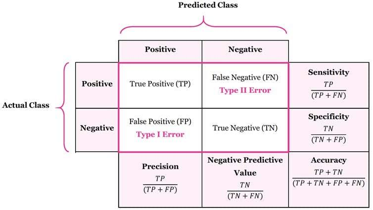

## Table of Contents

## What is a confusion matrix in machine learning?

A confusion matrix is a table used in machine learning to evaluate the performance of a classification model. It shows how well the model's predictions match the actual results by comparing them side by side. The matrix is set up so that one axis represents the predicted class labels and the other axis represents the actual class labels. Each cell in the matrix then shows the number of instances that fall into a specific combination of predicted and actual class.

For example, if you are using a model to predict whether an email is spam or not, the confusion matrix would have four cells: one for emails correctly predicted as spam (true positives), one for emails correctly predicted as not spam (true negatives), one for emails incorrectly predicted as spam (false positives), and one for emails incorrectly predicted as not spam (false negatives). By looking at these numbers, you can calculate useful metrics like accuracy, precision, recall, and F1 score, which help you understand how well your model is doing and where it might need improvement.

## How is a confusion matrix structured?

A confusion matrix is a square table that helps you see how well a classification model is working. It has rows and columns, where each row and each column stands for one of the classes your model is trying to predict. For example, if your model is trying to tell if an email is spam or not spam, the matrix will have two rows and two columns, one for each class. The rows show the actual classes, and the columns show the classes the model predicted.

Each cell in the matrix tells you how many times the model got it right or wrong for a certain combination of actual and predicted classes. For example, if you look at the cell where the "actual spam" row meets the "predicted spam" column, that number shows how many emails were correctly identified as spam. This is called a true positive. If you look at the cell where the "actual not spam" row meets the "predicted spam" column, that number shows how many emails were wrongly identified as spam. This is called a false positive. By looking at all the numbers in the matrix, you can see where your model is doing well and where it might need to improve.

Here's a simple example of what a confusion matrix might look like for a spam/not spam classifier:

```
          Predicted: Not Spam | Predicted: Spam
Actual: Not Spam |        90        |       10
Actual: Spam    |        5         |       95
```

In this example, the model correctly identified 90 not spam emails (true negatives) and 95 spam emails (true positives). It incorrectly labeled 10 not spam emails as spam (false positives) and 5 spam emails as not spam (false negatives).

## What are the key terms associated with a confusion matrix, such as true positives, false positives, etc.?

In a confusion matrix, there are four main terms that help us understand how well a model is doing: true positives, true negatives, false positives, and false negatives. True positives are the cases where the model correctly predicts the positive class. For example, if we're trying to detect spam emails, a true positive would be when the model correctly identifies an email as spam. True negatives are the cases where the model correctly predicts the negative class, like when it correctly identifies an email as not spam. 

False positives and false negatives are where the model makes mistakes. A false positive happens when the model incorrectly predicts the positive class. In our spam email example, a false positive would be when the model labels a not spam email as spam. A false negative is the opposite, where the model incorrectly predicts the negative class, like when it labels a spam email as not spam. These terms help us calculate useful metrics like accuracy, precision, recall, and F1 score to see how well our model is performing overall.

To illustrate these concepts, here's an example of a confusion matrix for a spam/not spam classifier:

```
          Predicted: Not Spam | Predicted: Spam
Actual: Not Spam |        90        |       10
Actual: Spam    |        5         |       95
```

In this matrix, the true positives (TP) are 95, true negatives (TN) are 90, false positives (FP) are 10, and false negatives (FN) are 5. From these numbers, we can calculate metrics like accuracy $$ \text{Accuracy} = \frac{TP + TN}{TP + TN + FP + FN} $$, which in this case would be $$ \frac{95 + 90}{95 + 90 + 10 + 5} = \frac{185}{200} = 0.925 $$ or 92.5%.

## How do you calculate accuracy using a confusion matrix?

Accuracy is a measure of how often a model gets things right. To calculate it using a confusion matrix, you add up all the times the model correctly guessed the class, which are the true positives and true negatives, and divide that by the total number of guesses the model made. This total number of guesses is the sum of all entries in the confusion matrix, which includes true positives, true negatives, false positives, and false negatives.

The formula for accuracy is pretty simple. It looks like this: $$ \text{Accuracy} = \frac{\text{True Positives} + \text{True Negatives}}{\text{True Positives} + \text{True Negatives} + \text{False Positives} + \text{False Negatives}} $$. For example, if your confusion matrix shows 95 true positives, 90 true negatives, 10 false positives, and 5 false negatives, the accuracy would be $$ \frac{95 + 90}{95 + 90 + 10 + 5} = \frac{185}{200} = 0.925 $$ or 92.5%. This means the model was correct 92.5% of the time.

## What is the difference between precision and recall, and how are they calculated from a confusion matrix?

Precision and recall are two important measures that tell us different things about how well a model is doing. Precision is about how many of the things the model said were positive actually were positive. It's like asking, "Out of all the times the model said something was spam, how many times was it right?" To calculate precision, you take the number of true positives and divide it by the total number of times the model predicted positive, which is the true positives plus the false positives. The formula for precision is $$ \text{Precision} = \frac{\text{True Positives}}{\text{True Positives} + \text{False Positives}} $$. For example, if a model had 95 true positives and 10 false positives, the precision would be $$ \frac{95}{95 + 10} = \frac{95}{105} \approx 0.905 $$ or about 90.5%.

Recall, on the other hand, is about how many of the actual positive things the model managed to find. It's like asking, "Out of all the emails that were actually spam, how many did the model correctly identify as spam?" To calculate recall, you take the number of true positives and divide it by the total number of actual positives, which is the true positives plus the false negatives. The formula for recall is $$ \text{Recall} = \frac{\text{True Positives}}{\text{True Positives} + \text{False Negatives}} $$. Using the same example as before, if a model had 95 true positives and 5 false negatives, the recall would be $$ \frac{95}{95 + 5} = \frac{95}{100} = 0.95 $$ or 95%. While precision focuses on the accuracy of positive predictions, recall focuses on the model's ability to find all the positive cases.

## How can a confusion matrix help in evaluating the performance of a classification model?

A confusion matrix helps evaluate a classification model by showing how well it predicts different classes. It does this by comparing the model's predictions to the actual results in a simple table. Each cell in the table shows the number of times the model got a prediction right or wrong for a specific combination of actual and predicted classes. By looking at the confusion matrix, you can see how often the model correctly identifies things (like true positives and true negatives) and how often it makes mistakes (like false positives and false negatives). This helps you understand the strengths and weaknesses of your model.

For example, if you are using a model to tell if an email is spam or not, the confusion matrix will show you how many emails the model correctly identified as spam (true positives) and how many it missed (false negatives). It will also show how many non-spam emails the model incorrectly labeled as spam (false positives) and how many it correctly identified as not spam (true negatives). By using the numbers in the confusion matrix, you can calculate important metrics like accuracy, precision, and recall. Accuracy tells you the overall correctness of the model with the formula $$ \text{Accuracy} = \frac{\text{True Positives} + \text{True Negatives}}{\text{True Positives} + \text{True Negatives} + \text{False Positives} + \text{False Negatives}} $$. Precision tells you how accurate the model is when it predicts something is positive, and recall tells you how well the model finds all the positive cases. These metrics help you see where the model might need improvement.

## What are some common metrics derived from a confusion matrix, like F1 score, and how are they useful?

From a confusion matrix, you can calculate several important metrics like accuracy, precision, recall, and the F1 score. Accuracy tells you how often the model gets things right overall. It's calculated with the formula $$ \text{Accuracy} = \frac{\text{True Positives} + \text{True Negatives}}{\text{True Positives} + \text{True Negatives} + \text{False Positives} + \text{False Negatives}} $$. Precision shows how accurate the model is when it says something is positive. It's calculated as $$ \text{Precision} = \frac{\text{True Positives}}{\text{True Positives} + \text{False Positives}} $$. Recall tells you how well the model finds all the positive cases, calculated as $$ \text{Recall} = \frac{\text{True Positives}}{\text{True Positives} + \text{False Negatives}} $$.

The F1 score is another useful metric that combines precision and recall into a single number. It's especially helpful when you want to balance the importance of precision and recall. The F1 score is calculated with the formula $$ \text{F1 Score} = 2 \times \frac{\text{Precision} \times \text{Recall}}{\text{Precision} + \text{Recall}} $$. This score is useful because it gives you a single number that reflects both how accurate the model is and how good it is at finding all the positive cases. By looking at these metrics, you can get a better understanding of your model's performance and see where it might need to be improved.

## How does class imbalance affect the interpretation of a confusion matrix?

Class imbalance happens when one class in your data has a lot more examples than another class. For example, if you're trying to predict if an email is spam or not, and most of your emails are not spam, you have a class imbalance. This can make it hard to read a confusion matrix right. If your model always guesses "not spam," it will seem like it's doing really well because it will get a lot of true negatives and a high accuracy score. But it will miss all the spam emails, which is a problem.

To deal with class imbalance, you can look at other metrics from the confusion matrix, like precision and recall. Precision tells you how many of the emails the model said were spam were actually spam. Recall tells you how many of the actual spam emails the model found. These metrics can give you a better idea of how well your model is doing, even when one class has a lot more examples. You can also use the F1 score, which is calculated as $$ \text{F1 Score} = 2 \times \frac{\text{Precision} \times \text{Recall}}{\text{Precision} + \text{Recall}} $$. This score balances precision and recall, so it's useful when classes are not balanced.

## Can you explain how to use a confusion matrix for multi-class classification problems?

In multi-class classification problems, a confusion matrix is still a useful tool but it gets a bit bigger because there are more classes to consider. Instead of just two rows and two columns like in a binary classification, the matrix will have as many rows and columns as there are classes. Each row represents the actual class of the instances, and each column represents the class that the model predicted. For example, if you're classifying animals into cats, dogs, and birds, your confusion matrix will have three rows and three columns. The cell where the "actual cat" row meets the "predicted cat" column will show how many times the model correctly identified a cat. The other cells will show where the model made mistakes, like labeling a dog as a cat or a bird as a dog.

Using a confusion matrix for multi-class classification, you can calculate different metrics to see how well your model is doing. For instance, you can figure out the accuracy of the model by adding up all the correct predictions (the diagonal cells of the matrix) and dividing by the total number of predictions. The formula for accuracy is $$ \text{Accuracy} = \frac{\text{Sum of Diagonal Cells}}{\text{Total Number of Predictions}} $$. You can also calculate precision and recall for each class. Precision for a class tells you how many of the instances the model labeled as that class were actually that class. Recall tells you how many of the instances that were actually that class the model correctly labeled. By looking at these metrics for each class, you can get a detailed view of where your model is doing well and where it might need improvement.

## What are some advanced techniques for analyzing confusion matrices, such as ROC curves?

One advanced technique for analyzing confusion matrices is the use of Receiver Operating Characteristic (ROC) curves. An ROC curve plots the true positive rate (also called recall) against the false positive rate at different classification thresholds. It helps you see how well your model can distinguish between classes. The true positive rate is calculated as $$ \text{True Positive Rate} = \frac{\text{True Positives}}{\text{True Positives} + \text{False Negatives}} $$, and the false positive rate is calculated as $$ \text{False Positive Rate} = \frac{\text{False Positives}}{\text{False Positives} + \text{True Negatives}} $$. The area under the ROC curve (AUC) is a single number that tells you how good your model is at telling classes apart. A higher AUC means your model is doing a better job.

Another technique is to use precision-recall curves, which are especially useful when you're dealing with imbalanced data. These curves plot precision against recall for different thresholds. Precision is calculated as $$ \text{Precision} = \frac{\text{True Positives}}{\text{True Positives} + \text{False Positives}} $$, and recall is the same as the true positive rate. By looking at the precision-recall curve, you can see how well your model can find all the positive cases while keeping the number of false positives low. The area under the precision-recall curve (AUPRC) gives you a summary of how well your model is doing, with a higher AUPRC meaning better performance. Both ROC and precision-recall curves help you understand your model's performance in more detail than just looking at the confusion matrix alone.

## How can you use a confusion matrix to identify specific areas where a model needs improvement?

A confusion matrix helps you see where your model is doing well and where it needs to work harder by showing you how often it gets things right or wrong for different classes. For example, if you are trying to tell if an email is spam or not, the matrix will show you how many times the model correctly said an email was spam (true positives) and how many times it missed a spam email (false negatives). It will also show you how many times the model wrongly said a normal email was spam (false positives) and how many times it correctly said a normal email was not spam (true negatives). By looking at these numbers, you can see if your model is making more mistakes in one area than another. If the model is missing a lot of spam emails (high false negatives), you might need to make it better at finding spam.

You can use the numbers from the confusion matrix to calculate things like accuracy, precision, and recall. Accuracy is how often the model gets things right overall, calculated as $$ \text{Accuracy} = \frac{\text{True Positives} + \text{True Negatives}}{\text{True Positives} + \text{True Negatives} + \text{False Positives} + \text{False Negatives}} $$. Precision tells you how accurate the model is when it says something is positive, calculated as $$ \text{Precision} = \frac{\text{True Positives}}{\text{True Positives} + \text{False Positives}} $$. Recall tells you how well the model finds all the positive cases, calculated as $$ \text{Recall} = \frac{\text{True Positives}}{\text{True Positives} + \text{False Negatives}} $$. If your model has low precision, it means it's calling too many things positive when they are not, so you might need to make it more careful. If it has low recall, it's missing a lot of the positive cases, so you might need to make it look harder for them. By looking at these metrics, you can figure out what to focus on to make your model better.

## What are the limitations of using a confusion matrix for model evaluation?

A confusion matrix is really helpful for understanding how well a model is doing, but it has some limits. One big problem is that it can be hard to read when your data has a lot more examples of one class than another, which we call class imbalance. If most of your data is one class, like if almost all your emails are not spam, a model that always guesses "not spam" might look like it's doing well because it gets a lot of guesses right. But it will miss all the spam emails, which is a big problem. The confusion matrix won't show this as clearly as other tools like precision-recall curves or ROC curves, which can handle class imbalance better.

Another limit is that a confusion matrix only shows you how the model did on the data you used to make it. It might not tell you how well the model will do with new data it hasn't seen before. Also, the confusion matrix doesn't give you a full picture of how good your model is because it doesn't show things like how confident the model is in its guesses or how much the guesses change when you change the data a little bit. For these reasons, while a confusion matrix is a good starting point, you should use other ways of checking your model too, like cross-validation and looking at other metrics, to get a better idea of how well it will work in the real world.