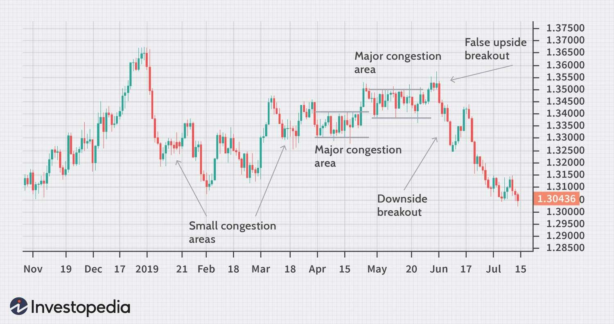

In the dynamic world of financial markets, congestion is a frequent phenomenon that traders, investors, and algorithmic systems often encounter. Congestion refers to periods when the market experiences a lack of clear directional movement, characterized by a balance between supply and demand that limits price fluctuations within a narrow range. This scenario poses challenges for market participants who rely on volatility to execute trading strategies effectively. 

This article explores congestion across both market trading and blockchain networks, examining the causes behind these occurrences, highlighting notable examples, and assessing their implications on algorithmic trading. Congestion in financial markets can stem from various factors, such as trader indecision, upcoming significant market announcements, or an equilibrium between buying and selling pressures. Similarly, in blockchain networks, congestion often results from a surge in transaction demand that exceeds the network's processing capacity, leading to increased fees and extended confirmation times.



By analyzing different scenarios of congestion, this article aims to provide a comprehensive understanding of how congestion affects market behavior and impacts trading strategies. It also discusses the adaptations trading systems and network technologies undergo to address and potentially leverage these periods of stagnation.

## Table of Contents

## Understanding Market Congestion

Market congestion occurs when the supply and demand forces for a particular trading asset reach a state of equilibrium, creating a limited range of price movement. This scenario manifests in financial markets when the price of an asset becomes confined within a narrow band as neither buyers nor sellers are dominant enough to shift the price decisively up or down. The result is a consolidation phase where prices oscillate within a defined range, typically reflecting a temporary indecision or lack of strong trend direction in the market.

This phenomenon is especially challenging for traders who rely on significant price movements for their trading strategies, such as trend following or breakout strategies. In a congested market, price volatility decreases, making meaningful price shifts less likely. Volatility, defined as the statistical measure of the dispersion of returns for a given security or market index, is crucial for traders seeking to capitalize on price swings. During congestion, the reduced volatility is often quantified using metrics like the Average True Range (ATR) or standard deviation of prices over a set period. 

In this context, market congestion is usually an indicator of underlying forces in equilibrium, with buyers and sellers each maintaining sufficient numbers to keep prices stable. This phase often precedes a breakout or a significant directional move, as it reflects periods of accumulation or distribution. Thus, observing congestion can provide insights into potential upcoming market movements. For example, Bollinger Bands, which expand and contract with volatility, can be used to identify congestion zones. When the bands tighten during low volatility, it signals potential congestion and possible upcoming volatility when the price breaks out of the narrow range.

Market participants can analyze these congestion periods to anticipate future price action. If a [breakout](/wiki/breakout-trading) occurs from the congestion zone, it may signal a new trend direction, with possible influence factors like fundamental news, economic data releases, or changes in market sentiment playing a role. Therefore, monitoring congestion and understanding its characteristics can allow traders to adjust their strategies accordingly, preparing to exploit the new trends expected to emerge once the congestion resolves.

## Causes of Market Congestion

Market congestion is a phenomenon often driven by various interrelated factors that can influence the supply-demand equilibrium of a trading asset. This section explores several primary causes that contribute to periods of market congestion.

1. **Indecision Among Traders**: One of the leading causes of market congestion is the indecision that prevails among traders. When market participants are uncertain about the future direction of price movement, a stalemate ensues between buyers and sellers. This indecision may be rooted in conflicting economic indicators, geopolitical events, or disparities in market sentiment. As a result, trading activity becomes confined within a narrow price range, causing congestion.

2. **Anticipation of Market Announcements**: Upcoming significant market announcements, such as central bank interest rate decisions, earnings reports, or geopolitical developments, can lead to market congestion. Traders often adopt a wait-and-see approach during these times, seeking to gauge the impact of these announcements on asset prices before committing to large positions. This anticipation results in reduced market volatility and trading volumes, manifesting as congestion until the information is digested by the market.

3. **Balance in Buying and Selling Pressures**: Market congestion may also arise from a balance between buying and selling pressures. When the forces of supply and demand are nearly equal, price movements tend to stabilize, lacking any strong directional impetus. This equilibrium state can occur naturally or be the result of strategic actions by large institutional players who target specific price levels for accumulation or distribution. 

Understanding these causes is crucial for traders who aim to navigate congestion periods effectively. By recognizing the underlying factors that contribute to congestion, traders can develop strategies that either exploit or circumvent periods of stagnation. For instance, traders may employ techniques such as trading within the established range, setting up breakout trades for when the congestion eventually resolves, or using technical indicators to anticipate potential shifts in market dynamics. These strategies enable traders to either capitalize on the predictable lull or position themselves advantageously for subsequent market movements.

## Examples of Market Congestion

Historical examples of market congestion provide valuable insights into understanding and navigating such phenomena. A quintessential instance of market congestion can be observed in the USD/CAD [forex](/wiki/forex-system) pair, particularly during periods characterized by sideways price movement. This occurs when the currency pair experiences a prolonged phase where prices oscillate within a narrow range, reflecting the equilibrium between supply and demand pressures. Traders often find these conditions challenging, as the lack of significant price shifts makes it difficult to execute profitable trading strategies that rely on [volatility](/wiki/volatility-trading-strategies).

Such sideways movements are typically marked by the resistance and support levels where buying interest converges at the lower boundary and selling interest emerges at the upper boundary. The repetition of this pattern leads to reduced volatility, inhibiting the potential for breakouts or substantial price trends. Identifying these patterns allows traders to adopt range-bound trading strategies or prepare for potential breakouts when congestion resolves.

In the context of [cryptocurrency](/wiki/cryptocurrency) markets, congestion takes on a different form with significant implications. A prime example is the congestion observed on blockchain networks, such as Bitcoin or Ethereum, where a surge in transaction demand can outstrip the network's capacity to process them efficiently. This often results in increased transaction fees and prolonged confirmation times, as network users compete to have their transactions prioritized.

Factors contributing to blockchain congestion include network limitations such as small block sizes, which determine the number of transactions that can be processed in a single block. During times of heightened demand, coupled with fixed block sizes and block times, the network becomes bottlenecked. This leads to a backlog of unconfirmed transactions, colloquially referred to as the "mempool," swelling until the network can process the excess transactions.

Illustratively, during the peak of the crypto bull market in late 2017, Bitcoin and Ethereum networks experienced notable congestion. Transaction fees soared, and confirmation times lengthened significantly as users rushed to move funds amidst rising market prices. Developers and network participants have since explored various solutions, such as implementing Segregated Witness (SegWit) on Bitcoin to increase effective block sizes, and the development of Ethereum 2.0 to reduce congestion through proof-of-stake and sharding mechanisms.

These examples underscore the varying nature of congestion across different financial markets, whether in forex or cryptocurrency environments. Identifying and understanding these congestion signals is essential for traders and market participants aiming to navigate through and potentially capitalize on these challenging periods.

## Blockchain Network Congestion

Blockchain network congestion is a critical issue that arises when the [volume](/wiki/volume-trading-strategy) of transaction requests exceeds the network's capacity to process them efficiently. This situation leads to delays in transaction confirmations and often results in increased transaction fees. Understanding the causes of blockchain congestion is crucial for both developers and users to optimize network performance and cost-effectiveness.

One primary cause of blockchain congestion is increased demand. When a significant number of users attempt to execute transactions simultaneously, the network may struggle to handle the volume, leading to congestion. This is particularly evident during times of market volatility or when a new and popular application or token emerges. In such scenarios, the network experiences an influx of transactions waiting to be processed, which slows down the overall transaction throughput.

Another contributing [factor](/wiki/factor-investing) to blockchain network congestion is the small size of blocks within certain blockchain architectures. For instance, Bitcoin's block size is limited to 1 MB, which restricts the number of transactions that can be processed in each block to approximately 2,000-3,000. This limitation can create bottlenecks during high-traffic periods, delaying transaction confirmations and pushing users to increase their fees to prioritize their transactions.

The implications of blockchain congestion are significant. As the network becomes congested, transaction fees tend to rise due to the bidding mechanism used to prioritize transactions. Users willing to pay higher fees often see their transactions confirmed more quickly than those who do not. This can disproportionately affect smaller transactions, rendering them economically unviable if the fees surpass the transaction amount.

Moreover, prolonged confirmation times can weaken the user experience, deterring new users and affecting the reliability of decentralized applications built on congested networks. To address these challenges, solutions such as increasing the block size or introducing Layer 2 protocols, like the Lightning Network for Bitcoin, are often proposed. These solutions aim to enhance the throughput capacity of the network, enabling it to process a higher number of transactions per second and reduce congestion.

In conclusion, understanding the dynamics of blockchain network congestion is vital for ensuring efficient and cost-effective transaction processing. As blockchain technology continues to evolve, developing innovative solutions to mitigate congestion will play a crucial role in its adoption and scalability.

## Trading Strategies During Congestion

Traders encountering market congestion can employ various strategies to manage and potentially profit from these periods of limited price movement. One common approach is trading within a defined range. During congestion, assets typically oscillate between established support and resistance levels. Traders can capitalize on these predictable boundaries by buying near support and selling near resistance. Utilizing technical indicators, such as Bollinger Bands, can further enhance the identification of these trading ranges, providing visual cues for trade execution.

Another strategy involves waiting for a breakout, which occurs when the asset's price moves decisively outside the established congestion range. Breakouts can signal the beginning of a new trend, and traders aiming to benefit from this movement often use indicators like the Relative Strength Index (RSI) to confirm breakout strength. Employing stop-loss orders can also be crucial to mitigate risks associated with false breakouts, wherein prices temporarily deviate from the range before reverting back.

Volume analysis serves as an invaluable tool during congestion periods. By scrutinizing trading volume, traders can discern the potential validity of a breakout. A high trading volume accompanying a breakout is often a sign of a sustainable trend, as it implies strong market interest and participation. Conversely, low volume may indicate a lack of commitment, increasing the likelihood of a false breakout.

Traders might also consider reducing position sizes during congested market conditions. Reduced positions can help manage risk by limiting exposure to potential adverse price movements. This cautious approach allows traders to stay engaged with the market while preserving capital during uncertain periods.

The use of options can offer additional strategies for navigating congestion. Options allow traders to gain exposure to assets with limited initial outlay and predefined risk. A common tactic is the implementation of a 'straddle' strategy, which involves buying both a call and a put option with the same strike price and expiration date. This approach profits from significant price movements in either direction, thus benefiting from eventual breakouts while managing risks during congestion.

These strategies emphasize the importance of adaptability and risk management when confronting market congestion. By employing a combination of range-bound trading, breakout strategies, volume analysis, reduced position sizing, and options trading, traders can navigate periods of congestion more effectively.

## The Impact of Congestion on Algorithmic Trading

Algorithmic trading systems are designed to exploit rapid market movements by executing trades based on pre-established criteria at high speed. However, when market congestion occurs—characterized by stagnant price movements and reduced volatility—these systems can be significantly impacted. Congestion can lead to a drop in profitability for algorithmic strategies that thrive on volatility and [liquidity](/wiki/liquidity-risk-premium), such as trend-following or [momentum](/wiki/momentum)-based strategies. To mitigate the adverse effects of congestion, algorithmic traders often turn to advanced techniques such as [machine learning](/wiki/machine-learning) to predict when breakouts or consolidations might occur.

Machine learning technologies offer a sophisticated approach to adapting [algorithmic trading](/wiki/algorithmic-trading) strategies during congestion. By leveraging historical data, machine learning models can be trained to recognize patterns indicative of potential breakouts or further consolidations. For example, supervised learning methods, such as decision trees and support vector machines, can classify market conditions and suggest strategic adjustments.

In practice, the application of machine learning in congested markets involves a few key steps:

1. **Data Collection and Preprocessing**: Gather comprehensive historical market data, including price, volume, and other relevant indicators. This data must be cleaned and normalized to ensure its suitability for machine learning processes.

2. **Feature Engineering**: Develop relevant features that could be reflective of congestion patterns. These might include price channel widths, average true range, moving averages, and other technical indicators. Advanced techniques such as principal component analysis (PCA) can be used to identify the most influential features and reduce dimensionality.

3. **Model Training and Testing**: Use a subset of the collected data to train machine learning models. Techniques such as cross-validation ensure that the model is robust and can generalize well to unseen data. The model’s performance can be evaluated based on its predictive accuracy and ability to minimize false signals.

4. **Implementation in Trading Algorithms**: The trained model can be integrated with algorithmic trading systems to dynamically adjust strategies according to predicted market conditions. For instance, during predicted breakout scenarios, a system could temporarily shift towards more aggressive trading tactics.

To illustrate, consider a Python implementation where a machine learning model is used to predict breakout scenarios:

```python
from sklearn.model_selection import train_test_split
from sklearn.ensemble import RandomForestClassifier
from sklearn.metrics import classification_report
import numpy as np

# Example data preparation
X = np.array(...)  # Feature matrix
y = np.array(...)  # Labels indicating breakout/consolidation

# Split data into training and test sets
X_train, X_test, y_train, y_test = train_test_split(X, y, test_size=0.2, random_state=42)

# Train a Random Forest model
model = RandomForestClassifier(n_estimators=100, random_state=42)
model.fit(X_train, y_train)

# Evaluate model performance
y_pred = model.predict(X_test)
print(classification_report(y_test, y_pred))

# Model can now be used to inform trading strategy adjustments
```

The effectiveness of machine learning models in predicting breakouts depends on the correctness of the underlying assumptions, quality of the data, and the model's complexity. While no model guarantees success in all scenarios, incorporating these adaptive techniques can provide a competitive edge in algorithmic trading, even in congested markets. Furthermore, continuous refinement of models and inclusion of real-time data ensures that algorithmic systems remain responsive and efficient. Through the integration of machine learning, algorithms can potentially bypass some of the operational restrictions imposed by market congestion and maintain profitability.

## Possible Solutions for Network Congestion

Blockchain network congestion is a critical challenge in today’s digital landscape. Several solutions have been proposed and increasingly implemented to address this issue, focusing on enhancing both the scalability and efficiency of networks.

Increasing block size is one immediate solution aimed at addressing congestion. By expanding the block size, a network can process more transactions per block, thus reducing the backlog of unconfirmed transactions and potentially lowering transaction fees. However, this approach can lead to increased storage and processing demands on network nodes, potentially centralizing the network as fewer participants can afford the necessary infrastructure.

Decreasing block time is another method to mitigate congestion. By reducing the time between blocks, the network can confirm transactions more frequently. This strategy aims at improving transaction throughput but could raise concerns about security, as shorter block times may lead to more frequent occurrences of orphaned blocks.

Layer 2 protocols are among the more innovative solutions for network congestion. These protocols operate off-chain, effectively taking the bulk of transactional activity off the primary blockchain layer. The Lightning Network for Bitcoin is a prominent example of a Layer 2 protocol, facilitating instant micropayments through a network of bidirectional payment channels. This significantly reduces congestion on the main blockchain by only settling netted transactions on-chain.

Sharding is a structural method of enhancing scalability by partitioning the blockchain into smaller, manageable pieces, known as shards. Each shard processes its transactions independently, thus increasing the amount of data processed per second. Ethereum's transition to Ethereum 2.0 includes a sharding implementation aimed at drastically increasing its scalability by distributing data storage and processing across multiple nodes.

Beyond these solutions, there is ongoing research into algorithms and technologies that propose more dynamic adjustments to network parameters based on real-time data. For example, adaptive block size mechanisms that adjust according to network load are being explored to automatically manage congestion without requiring hard forks or significant protocol changes.

Implementing these solutions involves trade-offs between scalability, security, and decentralization, making it essential for developers and stakeholders to consider the specific requirements and limitations of their blockchain networks. Each solution contributes uniquely to addressing congestion, forming a multifaceted approach to enhancing network performance and user experience in blockchain ecosystems.

## Conclusion

Understanding congestion in both market trading and blockchain networks is vital for traders and developers. Congestion represents a state where market activity or network transactions experience slowdowns due to competing demands that exceed current capacities, resulting in implications for strategy execution and operational efficiency. 

In financial markets, congestion manifests as periods of narrowed price movements, where the equilibrium between buying and selling pressures leads to reduced volatility. Recognizing these patterns allows traders to anticipate potential price breakouts or consolidations, enabling more informed decision-making. This knowledge is crucial for adjusting trading strategies, such as opting for range trading or preparing for potential breakouts.

On the blockchain front, network congestion occurs when transaction volumes surpass the processing capacity, leading to increased confirmation times and higher transaction fees. Developers and network operators must recognize congestion indicators to employ solutions aimed at boosting scalability. Innovations such as Layer 2 protocols, which handle transactions off-chain to reduce mainchain load, and sharding, which partitions blockchain data to improve processing efficiency, are emerging as significant countermeasures against congestion. These solutions not only alleviate immediate issues but pave the way for enhanced long-term network performance.

Both traders and developers must maintain an acute awareness of congestion's impact and opportunities. By doing so, they can adopt better practices to mitigate risks and leverage congested states for strategic advantage. In this competitive landscape, the ability to navigate congestion successfully can lead to improved operational outcomes and financial gains.

## References & Further Reading

[1]: Bergstra, J., Bardenet, R., Bengio, Y., & Kégl, B. (2011). ["Algorithms for Hyper-Parameter Optimization."](https://proceedings.neurips.cc/paper/2011/file/86e8f7ab32cfd12577bc2619bc635690-Paper.pdf) Advances in Neural Information Processing Systems 24.

[2]: ["Advances in Financial Machine Learning"](https://www.amazon.com/Advances-Financial-Machine-Learning-Marcos/dp/1119482089) by Marcos Lopez de Prado

[3]: ["Evidence-Based Technical Analysis: Applying the Scientific Method and Statistical Inference to Trading Signals"](https://www.amazon.com/Evidence-Based-Technical-Analysis-Scientific-Statistical/dp/0470008741) by David Aronson

[4]: ["Machine Learning for Algorithmic Trading"](https://github.com/PacktPublishing/Machine-Learning-for-Algorithmic-Trading-Second-Edition) by Stefan Jansen

[5]: ["Quantitative Trading: How to Build Your Own Algorithmic Trading Business"](https://books.google.com/books/about/Quantitative_Trading.html?id=j70yEAAAQBAJ) by Ernest P. Chan