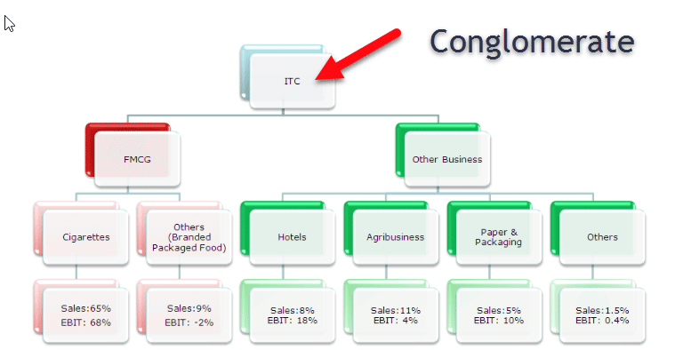

The corporate world has witnessed a multitude of growth strategies over the years, with the conglomerate boom standing out as a particularly notable phenomenon. Emerging prominently in the mid-20th century, the conglomerate boom involved the rapid expansion of large corporations acquiring diverse, unrelated businesses. This period was shaped by economic conditions such as low interest rates and favorable market environments that encouraged expansion through diversification. Legislative changes, such as the Celler-Kefauver Act, further propelled companies to diversify, seeking financial synergies and risk mitigation by entering disparate sectors.

This article will explore this intriguing era, examining the various business strategies that fueled corporate growth. Attention will be given to how conglomerates capitalized on financial synergies and market conditions during their rise and the lessons learned from their eventual fragmentation as economic and regulatory challenges emerged.

In addition to historical insights, we will consider contemporary corporate growth strategies. Modern businesses often pivot towards specialization, strategic partnerships, and alliances to enhance their growth trajectory. Central to these modern strategies is the role of technology, notably algorithmic trading, which has reshaped financial markets since the 1990s by introducing speed, efficiency, and precision in market operations.

By juxtaposing the historical patterns of the conglomerate boom with the advancements in algorithmic trading, this article offers a comprehensive understanding of corporate growth strategies. Through insights gleaned from past successes and present technological transformations, readers will gain an appreciation of the complex dynamics that continue to influence corporate decision-making and economic development in contemporary markets.

## Table of Contents

## Understanding the Conglomerate Boom

The conglomerate boom signifies a period characterized by the rapid expansion of large corporations through the acquisition of multiple unrelated business entities. This phenomenon primarily emerged during the 1960s, a decade marked by unique economic and legislative conditions. The economic landscape of the time was defined by low interest rates, which facilitated easier access to capital for large corporations. This financial environment encouraged companies to pursue growth via acquisitions, allowing them to diversify their holdings and mitigate potential risks associated with their core industries.

Legislative changes during this time, particularly following the enforcement of the Celler-Kefauver Act of 1950, played a crucial role in shaping this trend. The Act was introduced to strengthen the Clayton Antitrust Act and addressed anti-competitive practices by targeting mergers that might reduce market competition. This legal framework inadvertently pushed corporations to look beyond their traditional operational boundaries, encouraging them to invest in unrelated sectors. By acquiring businesses across different industries, these conglomerates aimed to reduce dependency on specific markets and enhance their financial stability through diverse revenue streams.

Furthermore, the favorable market conditions of the 1960s, marked by economic expansion and increasing consumer demand, provided fertile ground for these conglomerates to thrive. Companies were motivated by the prospect of financial synergies, wherein the combined effectiveness and efficiency of disparate businesses could potentially lead to greater profitability. Additionally, diversification allowed these corporations to tap into emerging markets and technologies, positioning them competitively against their peers.

In essence, the conglomerate boom was a calculated response to the economic opportunities and regulatory frameworks of the era. By leveraging low interest rates and capitalizing on legislative loopholes, corporations strategically expanded their influence across multiple industries, setting a precedent for future corporate growth models.

## The Rise and Fall of Conglomerates

During the 1960s and 1970s, conglomerates saw significant growth as they capitalized on financial synergies and favorable market conditions. This era was marked by an environment conducive to mergers and acquisitions, driven primarily by low interest rates and optimistic market sentiments. Conglomerates pursued a strategy of diversification, acquiring companies across varied and often unrelated industries. This allowed them to minimize risks associated with relying on a single sector and optimize their overall financial performance.

However, the conglomerate model faced challenges as the economic landscape shifted. The rise in interest rates made financing acquisitions more expensive and less attractive. Additionally, regulatory bodies began examining the expansive power of conglomerates more closely. Regulatory scrutiny aimed to address concerns about monopolistic practices and ensure competitive fairness in the market. The combined pressure of increased financial costs and heightened regulation led many conglomerates to reassess their business models.

A notable example of the conglomerate boom and its subsequent challenges is the LTV Corporation. Initially, LTV Corporation achieved remarkable success by acquiring diverse businesses, ranging from steel manufacturing to aerospace technology. This diversification was intended to shield the company from fluctuations in any single industry. However, as the economic environment changed, LTV faced difficulties in managing its varied portfolio effectively, compounded by regulatory complexities. These challenges ultimately contributed to LTV's financial struggles and restructuring.

The rise and fall of conglomerates during this period illustrate the complex dynamics of corporate growth strategies. While diversification offered notable advantages, external economic factors and regulatory oversight posed significant obstacles. This era serves as a historical case study on the limits of diversification and the importance of strategic focus in corporate growth.

## Business Strategies for Corporate Growth

The conglomerate model represents one of the diverse strategies employed by corporations seeking growth, primarily through diversification across various industries. This model allows a single corporate entity to manage different businesses, potentially reducing risk by spreading investments across unrelated sectors. However, it is not the sole strategy available for corporate expansion. Alternative strategies such as specialization, partnerships, and strategic alliances have gained prominence, each offering unique advantages.

Specialization involves companies focusing on their core competencies, thus refining expertise and enhancing efficiency in specific areas. This strategic approach is rooted in facilitating superior product quality and customer satisfaction. By honing their skills and resources in a particular niche, companies can create a competitive advantage, often leading to leadership in specialized markets. Such an approach also allows businesses to align their operations closely with market demands, optimizing production and innovation processes.

Partnerships and strategic alliances represent strategies where companies collaborate to achieve mutual goals. These partnerships can take various forms, such as joint ventures, co-marketing arrangements, or technology sharing agreements. Such collaborative efforts allow businesses to expand their reach and capabilities without the significant resource outlay required for mergers or acquisitions. Through partnerships, companies can enter new markets, leverage shared technology, and benefit from joint resources, fostering growth while minimizing costs.

In recent times, companies have shifted towards an increased focus on aligning with partners for non-core operations. This trend reflects a broader strategy to streamline operations by outsourcing specific functions that are not central to the company's main mission. By partnering with specialized firms for these non-core activities, businesses can reduce overhead and focus on innovative strategies and core operations, driving growth. This approach not only enhances operational efficiency but also allows companies to remain agile in a rapidly changing market environment.

In summary, while the conglomerate model remains a viable strategy for corporate growth, the evolving market dynamics encourage companies to explore and adopt varied approaches. By evaluating core competencies and leveraging strategic partnerships, businesses can navigate contemporary challenges and harness growth opportunities effectively. Understanding and deploying these diverse strategies can position companies more favorably in the competitive global marketplace.

## The Impact of Algorithmic Trading

Algorithmic trading, enabled by technological advancements, has profoundly transformed financial markets. Since its rise in the 1990s, [algorithmic trading](/wiki/algorithmic-trading) has become a crucial component of modern financial systems, offering traders enhanced capabilities for executing trades with remarkable speed, efficiency, and precision.

The popularity of algorithmic trading can be attributed to its ability to process vast amounts of market data in real-time, allowing traders to capitalize on market opportunities that were previously inaccessible through manual trading methods. By employing pre-programmed algorithms to analyze incoming data streams and execute trades automatically, traders can exploit even minor price fluctuations across different markets and financial instruments, something that is practically impossible for human traders due to time constraints and information processing limitations.

Historically, the adoption of algorithmic trading has significantly influenced market dynamics. It has led to increased market [liquidity](/wiki/liquidity-risk-premium), reduced transaction costs, and tighter bid-ask spreads, thereby enhancing market efficiency. However, the rise of algorithmic trading has also introduced new complexities and challenges. For instance, the infamous "Flash Crash" of 2010 demonstrated how algorithms interacting with each other could lead to significant market disruptions. As algorithmic trading strategies become more prevalent, regulators and market participants continue to explore mechanisms to prevent such occurrences while maintaining the benefits of this technology.

Algorithmic trading has also played a role in shaping corporate growth strategies. Companies, especially in the financial sector, have invested heavily in developing sophisticated trading algorithms and technology infrastructure, recognizing the competitive edge these tools offer. The use of algorithmic trading allows firms to optimize their trading strategies, manage risks better, and generate higher returns on investment. Firms can model complex market scenarios and use predictive analytics to make informed decisions, thereby aligning their strategies with dynamic market conditions.

On a broader scale, the impact of algorithmic trading extends to the global financial ecosystem. It has facilitated cross-border trading and contributed to the globalization of financial markets by enabling seamless transactions across different geographical locations and time zones.

In summary, algorithmic trading has revolutionized the execution of trades by leveraging speed and efficiency, reshaping both market practices and corporate strategies. Its continued evolution is likely to influence financial markets, making it an area of ongoing interest and innovation.

## Future Prospects and Implications

In today's fast-paced markets, the integration of technological advancements has become a necessity for maintaining a competitive edge. One area experiencing rapid evolution is algorithmic trading, which significantly impacts how corporations assess risk and allocate capital. As algorithms become more sophisticated, their ability to analyze vast amounts of data in real-time enhances both the precision and the speed of trading decisions.

Algorithmic trading employs complex mathematical models and algorithms to automate the buying and selling of financial securities. This automation mitigates human error and facilitates efficient trade execution. For instance, the use of predictive analytics enables traders to identify market trends and potential disruptions quickly. As [machine learning](/wiki/machine-learning) and [artificial intelligence](/wiki/ai-artificial-intelligence) technologies advance, these algorithms can learn from historical data to predict future occurrences with increased accuracy.

Corporations now need to consider the strategic incorporation of algorithmic trading as part of their financial operations. By leveraging algorithms, companies can optimize their investment portfolios and reduce exposure to market [volatility](/wiki/volatility-trading-strategies). Moreover, algorithmic trading can lead to substantial cost savings through reduced transaction costs and improved liquidity management.

To strategically plan for future growth, businesses must understand both historical market trends and contemporary technological innovations. The ability to synthesize these elements enables more informed decision-making. For example, historical data can provide insights into past market behavior, while modern technologies offer tools to predict and respond to future market movements. This dual approach allows corporations to navigate uncertainties with greater confidence and adaptability.

By prioritizing technological integration and fostering innovation, businesses can enhance their resilience in an ever-evolving market landscape. With algorithmic trading at the forefront of this transformation, the prospects for those who adeptly embrace these advancements are expansive, promising not only growth but also sustained competitive advantage in the years ahead.

## Conclusion

The conglomerate boom and the rise of algorithmic trading represent significant milestones in the evolution of corporate growth strategies. These phenomena underscore the complexities and dynamics involved in expanding business enterprises. Historically, the conglomerate boom illustrated a strategy where diversification across unrelated industries became a path to leverage financial synergies and mitigate risk. This approach offered valuable lessons in managing economic fluctuations and regulatory environments, providing a historical framework for understanding corporate growth.

On the other hand, algorithmic trading signifies the transformation brought by technological advancements in finance. Since the 1990s, it has radically altered the landscape by offering unparalleled speed and efficiency in trade execution, directly influencing how corporations manage investments and assess risks. Its development throughout the years has highlighted the necessity for businesses to adapt and innovate continually.

Both these historical and modern approaches offer critical insights into navigating today's complex economic landscapes. The conglomerate boom teaches the importance of diversification and financial acumen, while algorithmic trading emphasizes the power of technology and data-driven decision-making. The challenges faced across different eras, from regulatory pressures to technological integration, illustrate the importance of adaptability and strategic pivoting in ensuring long-term growth and stability.

Incorporating these lessons, businesses can better position themselves for future success by embracing innovation and leveraging technology. Thus, understanding these dynamics is crucial, allowing companies to construct robust strategies that are responsive to ongoing changes in the market. By effectively combining the historical tenets of corporate growth with the cutting-edge capabilities of modern technology, businesses can craft a resilient approach to expansion in an ever-evolving economic environment.

## References & Further Reading

[1]: Gaughan, P. A. (2015). ["Mergers, Acquisitions, and Corporate Restructurings."](https://onlinelibrary.wiley.com/doi/book/10.1002/9781119380771) John Wiley & Sons.

[2]: Chandler, A. D. (1990). ["Scale and Scope: The Dynamics of Industrial Capitalism."](https://www.jstor.org/stable/j.ctvjz80xq) Harvard University Press.

[3]: Nellis, J. G., & Parker, D. (2006). ["Principles of Business Economics."](https://books.google.com/books/about/Principles_of_Business_Economics.html?id=a8RFUZHfz2gC) Pearson Education.

[4]: Weitz, B. A., & Wensley, R. (Eds.). (2006). ["Handbook of Marketing."](https://uk.sagepub.com/en-gb/eur/handbook-of-marketing/book206066) SAGE Publications.

[5]: O’Hara, M. (1995). ["Market Microstructure Theory."](https://www.amazon.com/Market-Microstructure-Theory-Maureen-OHara/dp/0631207619) Wiley-Blackwell.

[6]: Seth, A., & Reitzig, M. (2003). "Corporate Acquisitions: The Effect of Misleading Financial Statements on the Formation and Growth of Conglomerates." Strategic Management Journal, 24(4), 367-389.