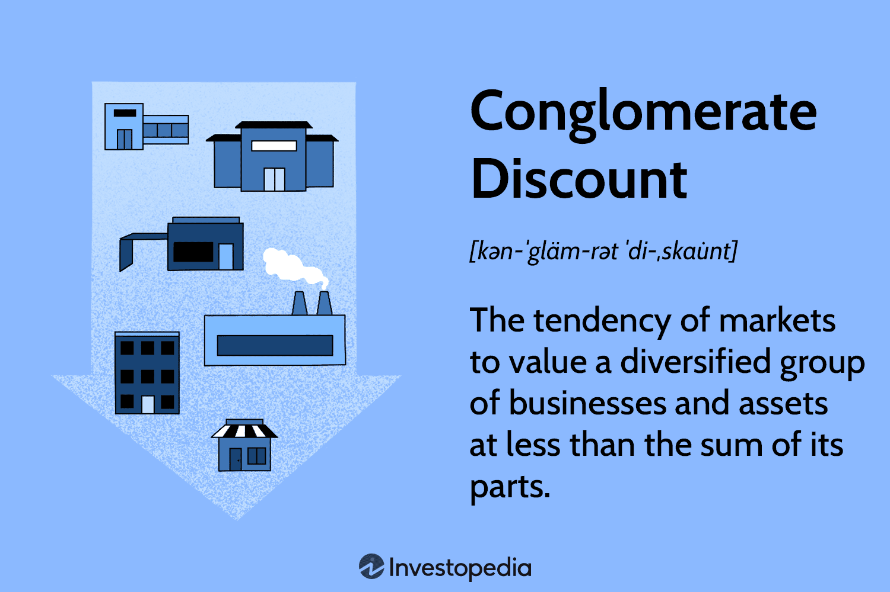

In today's complex business landscape, conglomerate structures offer unique advantages and challenges. The concept of the conglomerate discount highlights one such challenge, which is the undervaluation of these multifaceted entities. A conglomerate is typically a large corporation made up of different independent business units, allowing it to diversify risk by operating across various industries and markets. However, this diversification can also lead to complexities that make these entities appear less focused, which subsequently impacts their market valuation.

The conglomerate discount refers to the market practice where a conglomerate is valued at less than the sum of its individual parts. This happens largely due to perceived inefficiencies and management complexities, which may lead to skepticism among investors. As a result, these enterprises often struggle with presenting a cohesive business strategy, further complicating their valuation.



Concurrent with the challenges faced by conglomerates is the advent of automated trading algorithms that have revolutionized financial markets. These algorithms are designed to make trading decisions at speeds far beyond human capabilities. While they offer powerful tools for trading and market analysis, they also add layers of complexity to the financial analysis of conglomerates. The rapid shifts in market perceptions generated by algorithmic trading can significantly impact the valuation of conglomerates.

In this article, we explore the corporate disadvantages concerning business valuation. We aim to provide insights into the conglomerate discount phenomenon and the role of algorithmic trading in affecting valuations. This exploration will provide a deeper understanding of the intricate dynamics governing the financial positioning of conglomerates in today's market landscape.

## Table of Contents

## Understanding Conglomerates and Their Valuation

A conglomerate is a large corporation composed of distinct, independent business units that operate in various industries and markets. This business structure aims to diversify risks by spreading investments across multiple sectors, providing a buffer against economic downturns in any single industry. Conglomerates leverage their widespread operational reach to capitalize on economic opportunities and mitigate industry-specific risks.

However, valuing conglomerates presents unique challenges, primarily due to the phenomenon known as the "conglomerate discount." This term describes a market tendency to assign a lower valuation to a conglomerate compared to the sum of its parts, which are the individual business units if valued separately. The conglomerate discount stems from the perception that such corporations lack focus and operate with complex structures that can obfuscate the financial clarity needed by investors.

The concept of the conglomerate discount suggests that investors may view the management of diverse business units as less efficient due to potential misalignments in strategic goals, corporate culture, and operational processes. This perceived inefficiency can contribute to a reduced stock price relative to the theoretical combined valuation of the separate entities. Consequently, investors and analysts may approach conglomerates with skepticism, often questioning the synergy purportedly achieved by conglomerate structures.

To quantify the conglomerate discount, financial analysts frequently compare the market capitalization of a conglomerate to the aggregated valuations of its individual subsidiaries. Suppose the market value of a conglomerate is represented by $V_c$, and the sum of the estimated standalone values of its business units is $V_s = V_1 + V_2 + \ldots + V_n$. In that case, the conglomerate discount can be expressed mathematically as:

$$
\text{Conglomerate Discount (\%)} = \left(1 - \frac{V_c}{V_s}\right) \times 100
$$

This formula helps evaluate the extent of undervaluation or, conversely, the premium if the conglomerate is valued higher than its parts. Understanding this discount is crucial for investors seeking to identify potentially undervalued opportunities or for conglomerates planning strategies to enhance their market appeal.

## The Corporate Disadvantages of the Conglomerate Discount

Conglomerates frequently encounter several challenges related to the conglomerate discount, a phenomenon where the market tends to undervalue these entities compared to their individual components. A central issue contributing to this discount is the difficulty conglomerates face in presenting a coherent and focused business strategy. Due to their diverse and expansive operations across various industries, conglomerates often struggle to clearly communicate a unified strategic direction, leading to skepticism among investors. This skepticism is rooted in the perception that a conglomerate's wide range of business activities may lack synergy, resulting in inefficiencies and diluted focus on core operations.

Management challenges further complicate the situation. Conglomerates must coordinate and oversee multiple independent business units, each with its unique objectives and financial performance metrics. This management complexity can lead to increased overhead costs, affecting operational efficiency and, subsequently, the overall valuation of the conglomerate. High administrative expenses, as well as the costs associated with coordinating diverse business functions, can erode the financial advantages that a conglomerate might otherwise enjoy from its scale and diversification.

Examples from leading conglomerates like General Electric (GE) and Toshiba highlight these operational and valuation challenges. General Electric, once a paradigm of diversified success, faced substantial difficulties in maintaining clarity and focus across its various industrial segments. Attempts to manage such a vast portfolio led to internal inefficiencies and strategic misalignments, which contributed to a prolonged period of underperformance and subsequent corporate restructuring efforts. Similarly, Toshiba experienced disparate strategic priorities across its business units, exacerbating management complexities and leading to financial missteps, which in turn impacted investor confidence and the firm's market valuation.

These real-world cases demonstrate that while diversification offers potential risk management benefits, the associated management and strategic challenges can substantially impact a conglomerate's success in capital markets. Overcoming these hurdles requires not only refined organizational structures and sharp strategic focus but also effective communication with investors to manage perceptions and present a compelling narrative of value creation across diverse operational domains.

## Algorithmic Trading and Its Impact on Valuation

Algorithmic trading has become a formidable force in modern financial markets, leveraging complex mathematical models and vast datasets to execute trades at lightning speeds. These algorithms can analyze market conditions and make trading decisions that are executed in fractions of a second, far surpassing human capabilities. This rapid execution can lead to significant shifts in market dynamics, influencing the valuation of conglomerates in subtle yet profound ways.

For conglomerates, the implications of [algorithmic trading](/wiki/algorithmic-trading) are multifaceted. Primarily, the instantaneous nature of algorithm-driven trades can cause large fluctuations in stock prices based on perceived market signals rather than the intrinsic performance of the company. This [volatility](/wiki/volatility-trading-strategies) can obscure the true performance metrics of conglomerate subsidiaries, making it challenging for investors to accurately assess the value of individual business units.

Algorithm-driven market perceptions are often influenced by quantitative factors such as trading [volume](/wiki/volume-trading-strategy), [momentum](/wiki/momentum) indicators, and historical price patterns. Algorithms can be programmed to react to these signals, which can sometimes result in overreaction or underreaction to actual business developments within a conglomerate. Consequently, even minor market events or public disclosures can trigger significant trading activity, affecting stock prices irrespective of fundamental performance.

For conglomerates, whose diversified operations may already lead to market perception challenges, algorithmic trading can exacerbate the disparity between market value and actual worth. This disparity arises because algorithms are designed to capitalize on market inefficiencies and may not always account for the qualitative aspects of a conglomerate’s operations. For instance, an undisclosed or underappreciated innovation in one subsidiary may not be immediately reflected in stock valuation if algorithms fail to recognize its long-term potential amidst broader market data.

Furthermore, the advent of [machine learning](/wiki/machine-learning) and [artificial intelligence](/wiki/ai-artificial-intelligence) in algorithmic strategies introduces additional complexities. These advanced algorithms continuously adapt based on new data patterns, potentially creating feedback loops that intensify price movements. While such technology enhances market efficiency, it can also lead to scenarios where stock valuations are driven more by algorithmic interpretation of data than by the strategic direction of a conglomerate.

To illustrate, consider a scenario where a positive news release from a conglomerate's subsidiary is interpreted by algorithms as a transient market anomaly rather than a sustained improvement in business performance. The algorithms might respond by quickly adjusting the trading positions only for short-term gains, failing to capture the potential long-term value. This creates a temporary misalignment between market perception and the conglomerate’s true financial health.

In summary, while algorithmic trading offers substantial efficiencies and opportunities for profit, it poses significant challenges for conglomerates in terms of market valuation. Algorithms can obscure the financial realities of these multifaceted entities, impacting investor sentiment and driving valuation based on incomplete or skewed information. As such, understanding the role of algorithmic trading in shaping market views is crucial for conglomerates aiming to manage their market perception effectively.

## Strategies to Mitigate Conglomerate Discounts

To counter the conglomerate discount and mitigate potential undervaluation, conglomerates can employ various strategic measures. One effective approach is engaging in spin-offs or focused divestitures, which involves separating smaller business units from the parent conglomerate. Spin-offs create independent entities that can be more easily valued by the market, thereby unlocking shareholder value that might have been underappreciated within the larger conglomerate structure. For instance, when eBay spun off PayPal in 2015, it allowed PayPal to thrive as an independent company with a clear focus, ultimately enhancing both entities' market valuations.

Improving financial transparency and communication with investors also plays a crucial role in addressing undervaluation concerns. By providing detailed financial disclosures and insights into each business unit's operational metrics, conglomerates can help investors better understand the true value of their diverse operations. Clear communication strategies involve regular updates, earnings calls, and investor presentations, ensuring that stakeholders are informed about the company's strategic direction and performance.

Adopting focused growth strategies is another method to enhance valuations. Conglomerates can prioritize investment in the most promising sectors or business units, thereby driving growth and profitability. This strategic focus allows for more efficient allocation of resources and capital, enhancing overall performance and making the conglomerate more attractive to investors. 

Additionally, embracing algorithmic insights can offer significant advantages in understanding and reacting to market trends. Advanced data analytics and machine learning algorithms can provide conglomerates with real-time insights into market dynamics, consumer preferences, and competitor behavior. By leveraging these insights, conglomerates can optimize operations, anticipate shifts in demand, and make informed strategic decisions that align with investor expectations. Python, with libraries such as pandas and scikit-learn, can be used to develop models that analyze financial data and predict market trends:

```python
import pandas as pd
from sklearn.linear_model import LinearRegression

# Example: Predicting stock price trends using historical data
data = pd.read_csv('historical_stock_prices.csv')
X = data[['feature1', 'feature2', 'feature3']]  # Example feature set
y = data['stock_price']

model = LinearRegression()
model.fit(X, y)

predictions = model.predict(new_data[['feature1', 'feature2', 'feature3']])
```

Implementing these strategies can not only help mitigate the conglomerate discount but also enhance the overall value perception among investors, positioning the conglomerate more favorably in the financial markets.

## Conclusion

The challenges faced by conglomerates in terms of valuation and market perception are significant but not insurmountable. Tackling these challenges requires a comprehensive understanding of both the inherent disadvantages and effective strategies that can be adopted. By enhancing financial transparency and engaging in thoughtful restructuring efforts, conglomerates can clarify their business focus and value proposition, thus repositioning themselves more favorably within financial markets. This involves clear communication with investors and stakeholders to prevent misunderstandings about the conglomerate's overall strategy and financial health.

Moreover, embracing technology-driven insights offers a substantial opportunity for these large entities. Incorporating algorithmic trading strategies can provide a competitive advantage by offering clearer insights into market trends and valuation dynamics. Algorithms can analyze market data with unprecedented speed and accuracy, enabling conglomerates to react proactively to shifts in market perception. Employing data analytics tools can further illuminate individual business unit performance and reveal hidden opportunities for value creation.

By combining improved transparency, strategic restructuring, and the adoption of advanced market analysis tools, conglomerates can navigate the complexities of valuation. Although the task is challenging, these entities stand to benefit significantly by adapting to the evolving financial landscape, thus mitigating the conglomerate discount and achieving a more accurate market valuation.

## References & Further Reading

[1]: Berger, P. G., & Ofek, E. (1995). ["Diversification's effect on firm value."](https://www.sciencedirect.com/science/article/pii/0304405X94007986)00805-4) Journal of Financial Economics, 37(1), 39-65.

[2]: Rajan, R., Servaes, H., & Zingales, L. (2000). ["The cost of diversity: The diversification discount and inefficient investment."](https://onlinelibrary.wiley.com/doi/full/10.1111/0022-1082.00200) The Journal of Finance, 55(1), 35-80.

[3]: Seru, A., Shumway, T., & Stoffman, N. (2010). ["Learning by trading."](https://academic.oup.com/rfs/article-abstract/23/2/705/1604374) The Review of Financial Studies, 23(2), 705-739.

[4]: Baker, M., & Wurgler, J. (2001). ["Market Timing and Capital Structure."](https://www.hbs.edu/ris/Publication%20Files/CapitalStructure_27299fdc-42fa-4a25-a869-b3907cd4f7eb.pdf) The Journal of Finance, 57(1), 1-32.

[5]: Brealey, R. A., Myers, S. C., & Allen, F. (2016). ["Principles of Corporate Finance."](https://www.mheducation.com/highered/product/Principles-of-Corporate-Finance-Brealey.html) 12th Edition, McGraw-Hill Education.