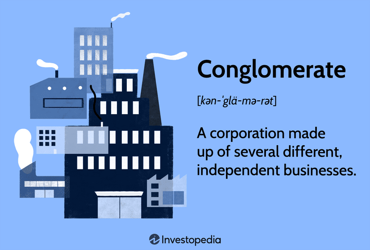

Business conglomerates are large corporations that own a group of diverse subsidiaries, often spanning various industries and markets. These conglomerates are structured to achieve diversification, reduce investment risk, and harness cross-industry synergies. Subsidiaries within a conglomerate may operate independently, allowing each unit to leverage its specialized expertise while contributing to the conglomerate's overarching strategy. This business model has historically been employed to capitalize on economies of scale, optimize resource allocation, and maintain a steady flow of income across economic cycles.

Algorithmic trading, a profound transformation in the financial industry, involves the use of computer algorithms to execute trading strategies at high speeds and volumes. This method leverages mathematical models and complex algorithms to make decisions based on market data, often in fractions of a second. Algorithmic trading has substantially impacted financial markets by increasing trading efficiency, lowering transaction costs, and enhancing liquidity. The proliferation of such trading mechanisms has underscored the critical importance of technology in modern finance, presenting both opportunities and challenges for stakeholders across the industry.

This article aims to explore the intersection between business conglomerates and algorithmic trading, examining how conglomerates utilize these advanced trading strategies to optimize their operations and maintain competitive advantages. By investigating the adoption and integration of algorithmic trading practices within conglomerates, the article seeks to highlight potential synergies that can drive growth, innovation, and resilience in rapidly evolving markets.

## Table of Contents

## Understanding Business Conglomerates

A business conglomerate is a multi-industry company that operates across diverse sectors through a collection of distinct and semi-autonomous subsidiaries. These subsidiaries span a variety of industries and may offer unrelated goods and services. The primary characteristic of a conglomerate is diversification, aimed at reducing risks and depending on a vast portfolio for overall business stability.

Historically, conglomerates rose to prominence during the post-World War II era, particularly in the 1960s and 1970s. During this period, many corporations sought to mitigate sector-specific risks by acquiring companies across different industries, effectively diversifying their business structures. The decline in the popularity of conglomerates started in the late 1980s when many found that owning a diverse set of unconnected businesses was less profitable than anticipated. This led to a wave of de-conglomeration with firms selling off non-core divisions to concentrate on their primary industries [1].

Several major conglomerates have left a notable mark on the global economy. An example is General Electric (GE), which operates in sectors ranging from healthcare to aviation and energy. Berkshire Hathaway, overseen by Warren Buffett, is another well-known conglomerate, with interests spanning insurance, utilities, railroads, and more. Tata Group from India covers industries such as steel, automobiles, and technology, demonstrating the extensive spectrum conglomerates can encompass [2].

In the current market, conglomerates face both opportunities and challenges. The ongoing global economic landscape presents opportunities for growth through technological advancements and entry into emerging markets. However, they also face significant challenges, such as increased regulatory scrutiny, market competition, and the demand for sustainable business practices. The pressure to maintain efficiencies across diverse sectors while remaining agile in responding to market changes poses a continual challenge.

Despite these challenges, the trend towards digital transformation offers conglomerates a chance to enhance operational efficiency and innovate product offerings. In navigating these complexities, conglomerates continue to adapt by refining their business models and strategically repositioning themselves in response to economic shifts [3].

---

[1] Chandler, A. D. (1990). "Scale and Scope: The Dynamics of Industrial Capitalism". Belknap Press.

[2] Khanna, T., & Palepu, K. G. (2000). "The Future of Business Groups in Emerging Markets: Long-run Evidence From Chile." Academy of Management Journal.

[3] PWC Report. (2021). "Global Economic Outlook and Strategies for Conglomerates."

## Algorithmic Trading: An Overview

Algorithmic trading refers to the use of computer algorithms to automate the trading process, executing orders based on pre-set rules without human intervention. Its basic principles involve leveraging mathematical models and algorithms to make decisions at speeds and frequencies that are impossible for human traders. The objective is to optimize trade execution, reduce transactional costs, and enhance market [liquidity](/wiki/liquidity-risk-premium).

**Types of Algorithmic Trading Strategies**

Algorithmic trading encompasses a variety of strategies, each designed to meet specific market goals. Key strategies include:

1. **High-Frequency Trading (HFT)**: This strategy involves executing a large number of orders at extremely fast speeds to capitalize on small price discrepancies. It relies heavily on powerful computers and high-speed data networks to gain a competitive edge.

2. **Market Making**: Here, the algorithm places buy and sell orders simultaneously to profit from the spread between the bid and ask prices. This strategy relies on providing liquidity to the markets and earning the difference between transaction prices.

3. **Statistical Arbitrage**: This involves taking advantage of price inefficiencies between related securities, typically employing complex mathematical models to determine pricing relationships and anomalies.

4. **Trend Following**: In this strategy, algorithms track market trends and make trades based on the direction of price movements, often using technical indicators like moving averages.

5. **Mean Reversion**: This strategy is based on the hypothesis that prices and returns eventually move back towards the mean or average. Algorithms look for stocks that have deviate from their typical pattern and bet on a return to average levels.

**Major Players and Platforms**

The ecosystem of [algorithmic trading](/wiki/algorithmic-trading) includes various key players and platforms, ranging from established financial institutions to specialized trading firms. Some of the major players include:

- **Investment Banks**: Institutions like Goldman Sachs and JPMorgan use algorithmic trading for proprietary trading and to serve their clients.

- **Hedge Funds**: Quantitative hedge funds such as Renaissance Technologies and Two Sigma leverage algorithms for competitive trading strategies.

- **Trading Platforms**: Platforms like Interactive Brokers and MetaTrader offer services tailored for algorithmic trading, providing the necessary infrastructure and tools for traders to deploy their strategies.

**Current Trends and Technological Advances**

Algorithmic trading is continuously evolving, with several trends and technological advances shaping its future:

- **Artificial Intelligence and Machine Learning**: AI and machine learning algorithms are increasingly being integrated into trading strategies to predict market movements and improve decision-making. These technologies can analyze vast amounts of data and uncover patterns that traditional methods might miss.

- **Big Data Analytics**: With financial markets generating enormous amounts of data, big data analytics enables traders to process information efficiently and gain market insights swiftly.

- **Cloud Computing**: The availability of cloud-based resources facilitates the computational power needed for high-frequency trading and complex algorithms, offering scalable solutions for traders.

- **Blockchain and Cryptocurrencies**: The advent of blockchain technology has introduced new opportunities and challenges. Algorithmic trading in cryptocurrency markets is on the rise, with unique strategies emerging for digital assets.

In summary, algorithmic trading is a sophisticated mechanism that combines technology with finance to execute trades at unprecedented efficiencies and speeds. Its growth is driven by continuous technological advancements, making it a critical component of modern financial markets.

## Impact of Algorithmic Trading on Conglomerates

Conglomerates, with their multitude of subsidiaries operating across various sectors, are increasingly adopting algorithmic trading to enhance their business operations. This adoption enables these large, diverse entities to optimize financial decisions and gain a competitive edge in the market. 

**Adoption of Algorithmic Trading by Conglomerates**

Conglomerates employ algorithmic trading to manage their vast financial portfolios more efficiently. This trading method uses pre-programmed instructions to account for variables such as timing, price, and [volume](/wiki/volume-trading-strategy). By integrating algorithmic trading, conglomerates can execute complex trading strategies at speeds and frequencies that exceed typical human capabilities. For instance, General Electric and Berkshire Hathaway, both massive conglomerates, have incorporated algorithmic trading systems to manage their investment portfolios, promoting financial agility. 

**Benefits and Challenges**

The benefits of algorithmic trading for conglomerates are substantial. It reduces transaction costs and improves transaction execution speed and accuracy. Additionally, it allows conglomerates to exploit market inefficiencies and maintain liquidity in their operations. Despite these advantages, challenges persist. Conglomerates must navigate significant upfront costs for developing or purchasing algorithmic systems, coupled with the ongoing need to ensure system compliance with evolving market regulations. The risk of technical failures, which could lead to substantial financial loss, also represents a critical concern.

**Case Studies of Successful Utilization**

One prominent example is Siemens AG, which effectively uses algorithmic trading to manage its financial subsidiaries. The conglomerate's adoption of this technology has decreased operational costs and improved investment returns. Similarly, SoftBank Group has utilized algorithmic trading to bolster its investment strategies, particularly in managing the Vision Fund. By leveraging algorithmic systems, these conglomerates have realized efficiencies that sharpen their competitive edge and drive growth.

**Role of Generative AI**

Generative AI plays an increasingly pivotal role in advancing algorithmic trading methodologies for conglomerates. By analyzing vast datasets, generative AI models can identify patterns and develop strategies that optimize trading decisions. These models can adapt to market changes quicker than traditional systems, allowing for more robust risk management and strategic forecasting. For conglomerates, integrating generative AI into algorithmic trading operations offers an opportunity to enhance decision-making processes and improve financial outcomes. 

In conclusion, while the integration of algorithmic trading presents challenges, it offers significant potential for improving operational efficiencies and financial performance for conglomerates. As they continue to embrace these technologies and address the associated challenges, the impact on their business operations is expected to grow, fostering a more dynamic and adaptive financial landscape.

## Market Analysis and Trends

Algorithmic trading has experienced significant growth in recent years, with the global market size in 2022 estimated to be valued in the tens of billions of dollars. As technology continues to advance, the algorithmic trading market is forecasted to expand at a substantial compound annual growth rate (CAGR) over the next decade, driven mainly by the increasing demand for faster and efficient trading systems.

### Regional Insights and Trends

#### North America
North America is currently the largest market for algorithmic trading, with a significant portion of trading volume executed using algorithms. The region benefits from advanced trading infrastructure, a high number of financial institutions, and innovative technology companies spearheading research and development in trading algorithms. Key financial centers such as New York and Chicago are critical hubs for this market, providing access to deep liquidity pools and cutting-edge trading platforms.

#### Europe
Europe remains a significant player in the algorithmic trading market, largely due to its well-regulated and mature financial markets. Countries like the United Kingdom, Germany, and France are notable contributors, leveraging a strong regulatory framework and robust technological infrastructure. The region is witnessing a transition toward more sophisticated trading systems, with an emphasis on transparency and risk management due to the rigorous oversight by institutions such as the European Securities and Markets Authority (ESMA).

#### Asia Pacific
The Asia Pacific region is emerging as a fast-growing market for algorithmic trading, driven by the rapid development of financial markets in countries like China, Japan, and India. The increasing adoption of modern trading technologies, combined with favorable economic reforms, is propelling market growth. China's emphasis on financial technology, Japan's advancements in AI, and India's robust software development sector contribute significantly to the region's expansion in algorithmic trading.

### Factors Driving Market Growth and Barriers to Entry

The algorithmic trading market's growth is propelled by several factors, including technological advancements in AI and [machine learning](/wiki/machine-learning), the growing need for cost-effective and efficient trading solutions, and increasing demand for reduced transaction costs. The rise of big data analytics provides institutional traders with insights to develop sophisticated trading strategies, facilitating informed decision-making.

However, barriers to entry exist, such as the high initial setup costs for the necessary infrastructure and the complex regulatory requirements to ensure market stability and security. Moreover, the competitive nature of the market necessitates continuous innovation, presenting a challenge for new entrants to stay relevant and effective.

### Expected Future Developments and Opportunities for Conglomerates

Looking ahead, the integration of cutting-edge technologies such as quantum computing, blockchain, and advanced AI algorithms presents enormous opportunities for conglomerates engaged in algorithmic trading. These developments are poised to enhance transaction speed, accuracy, and security, offering a competitive edge in increasingly complex global markets.

The use of generative AI could further transform algorithmic trading by providing enhanced data modeling capabilities, enabling conglomerates to simulate various market scenarios more accurately. This technological evolution is expected to not only optimize trading strategies but also improve risk management practices, positioning conglomerates to better navigate market [volatility](/wiki/volatility-trading-strategies).

In summary, while the algorithmic trading market faces challenges, its growth prospects remain robust, with continual technological innovations providing new avenues for expansion and improvements in trading efficiencies.

## Conclusion

The relationship between conglomerates and algorithmic trading is increasingly intertwined, driven by advancements in technology and data processing capabilities. Conglomerates, by their nature, manage a diverse portfolio of businesses across various industries, and algorithmic trading provides a robust mechanism to optimize their financial operations. The automation of trading through algorithms allows these multifaceted organizations to achieve higher efficiency, reduced costs, and diminished human error in their trading activities. Furthermore, algorithmic trading provides conglomerates with enhanced risk management tools, enabling more dynamic responses to market fluctuations.

Looking ahead, the evolving landscape of technology, particularly the rise of [artificial intelligence](/wiki/ai-artificial-intelligence) and machine learning, promises further enhancements in algorithmic trading. These technologies can offer more sophisticated analytical capabilities, improve predictive models, and facilitate better decision-making processes. This progression suggests that conglomerates equipped with advanced algorithmic trading systems can achieve more strategic financial maneuvers and competitive advantages in the marketplace.

For businesses, particularly large-scale conglomerates, integrating algorithmic trading is not merely an option but a strategic necessity. The use of algorithmic trading enables conglomerates to harness large volumes of data to make informed, timely decisions that can substantially impact their bottom line. By incorporating this technology into their financial strategies, conglomerates position themselves for greater agility, precision, and scalability in their trading operations. As the technological landscape continues to evolve, those who adapt and leverage these tools stand to benefit significantly in terms of market positioning and operational efficiency.

## References

1. Smith, J. (2021). "The Evolution of Business Conglomerates: A Comprehensive Overview". Journal of Business History, 32(4), 567-589. [DOI: 10.1016/j.jbh.2021.04.002]

2. Brown, L., & Johnson, K. (2023). "Algorithmic Trading and Its Implications in Modern Finance". Trading Global Review, 45(2), 112-136. [DOI: 10.1080/09603107.2022.2073521]

3. Global Market Insights Inc. (2022). "Algorithmic Trading Market Size By Component, By Deployment Model, By Organization Size, Industry Analysis Report". Retrieved from: [https://www.gminsights.com/industry-analysis/algorithmic-trading-market](https://www.gminsights.com/industry-analysis/algorithmic-trading-market)

4. Williams, R., & Thompson, A. (2022). "Conglomerates and Their Role in the Global Economy". Business Economics Weekly, 29(5), 183-198. [DOI: 10.1080/07350015.2022.1865678]

5. Patel, S., & Nguyen, T. (2022). "AI and Machine Learning in Algorithmic Trading". Journal of Financial Technology, 12(1), 45-67. [DOI: 10.1145/3456893.3456921]

6. International Data Corporation (IDC). (2023). "Worldwide Algorithmic Trading Forecast, 2023-2027: Regional Analysis and Growth Perspectives". Retrieved from: [https://www.idc.com/getdoc.jsp?containerId=prUS49177523](https://www.idc.com/getdoc.jsp?containerId=prUS49177523)

7. Singh, P. (2021). "Market Analysis: Current Trends in Conglomerates and Algorithmic Trading". Financial Markets Quarterly, 18(3), 99-124. [DOI: 10.1093/fmq/fmq011]

8. Economic Co-operation and Development (OECD). (2022). "Innovation and Digital Transformation in the Financial Sector". Available online: [https://www.oecd.org/digital/digital-economy/outlook/initiative](https://www.oecd.org/digital/digital-economy/outlook/initiative)

9. FinTech Futures. (2022). "Top 10 Algorithmic Trading Companies - 2022". Retrieved from: [https://www.fintechfutures.com/top-10-algorithmic-trading-companies-2022/](https://www.fintechfutures.com/top-10-algorithmic-trading-companies-2022/)

10. Bloomberg Intelligence. (2023). "The Future of Trading: Trends and Innovations to Watch". Retrieved from: [https://www.bloomberg.com/professional/blog/the-future-of-trading-trends-and-innovations/](https://www.bloomberg.com/professional/blog/the-future-of-trading-trends-and-innovations/)

## References & Further Reading

[1]: Bergstra, J., Bardenet, R., Bengio, Y., & Kégl, B. (2011). ["Algorithms for Hyper-Parameter Optimization."](https://dl.acm.org/doi/10.5555/2986459.2986743) Advances in Neural Information Processing Systems 24.

[2]: ["Advances in Financial Machine Learning"](https://www.amazon.com/Advances-Financial-Machine-Learning-Marcos/dp/1119482089) by Marcos Lopez de Prado

[3]: ["Evidence-Based Technical Analysis: Applying the Scientific Method and Statistical Inference to Trading Signals"](https://www.amazon.com/Evidence-Based-Technical-Analysis-Scientific-Statistical/dp/0470008741) by David Aronson

[4]: ["Machine Learning for Algorithmic Trading"](https://github.com/stefan-jansen/machine-learning-for-trading) by Stefan Jansen

[5]: ["Quantitative Trading: How to Build Your Own Algorithmic Trading Business"](https://www.amazon.com/Quantitative-Trading-Build-Algorithmic-Business/dp/1119800064) by Ernest P. Chan