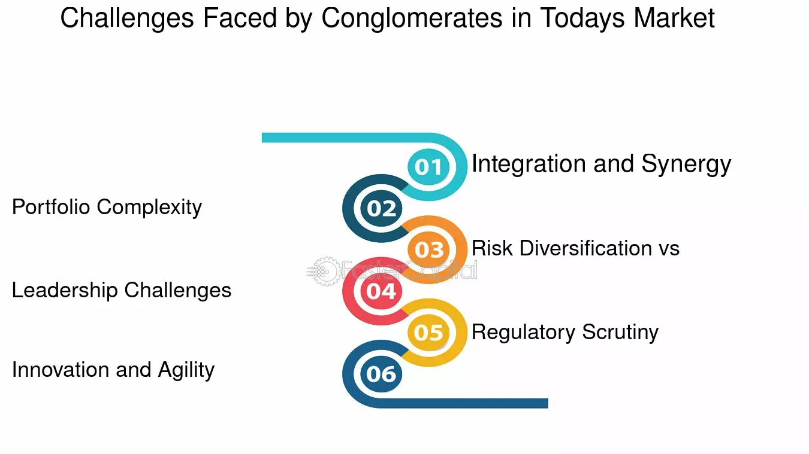

## Table of Contents

## What is a conglomerate and how does it differ from other types of businesses?

A conglomerate is a big company that owns many smaller companies in different kinds of businesses. These smaller companies can be in industries like food, cars, or technology. The main idea behind a conglomerate is to spread out the risk. If one part of the business is not doing well, the other parts might still be making money. This can help the whole company stay strong even when times are tough for some of its businesses.

Conglomerates are different from other types of businesses because they are not focused on just one industry. For example, a car company only makes cars and parts for cars. A conglomerate might own a car company, but it could also own a food company and a tech company. This mix of businesses is what makes a conglomerate unique. Other businesses, like a retail chain or a manufacturing company, usually stick to one main type of business and do not have such a wide range of different industries under one roof.

## How can one identify the financial stability of a conglomerate?

To identify the financial stability of a conglomerate, you should look at its financial statements. These include the income statement, balance sheet, and cash flow statement. The income statement will show you if the conglomerate is making more money than it spends. The balance sheet will tell you about its assets, like money and property, and its liabilities, like debts. The cash flow statement shows how money moves in and out of the conglomerate. By looking at these, you can see if the conglomerate is financially stable or if it might be struggling.

Another way to check the financial stability of a conglomerate is by looking at financial ratios. These are numbers that help you understand the conglomerate's financial health better. For example, the debt-to-equity ratio shows how much the conglomerate relies on borrowed money. A lower ratio might mean the conglomerate is more stable. The return on equity ratio tells you how well the conglomerate is using the money that shareholders have invested. If this number is high, it could mean the conglomerate is financially strong. By using these ratios, you can get a clearer picture of the conglomerate's financial stability.

Lastly, it's important to consider external factors that can affect a conglomerate's financial stability. These include economic conditions, industry trends, and competition. For example, if the economy is doing well, the conglomerate might be more stable. But if one of its industries is facing tough times, it could impact the whole conglomerate. Also, if there are many strong competitors, it might be harder for the conglomerate to stay financially stable. By keeping an eye on these external factors, you can better understand the conglomerate's overall financial health.

## What are the common financial ratios used to evaluate conglomerates?

When evaluating conglomerates, several key financial ratios are commonly used to assess their financial health. One important ratio is the debt-to-equity ratio, which shows how much the conglomerate relies on borrowed money compared to the money invested by shareholders. A lower debt-to-equity ratio generally indicates a more financially stable conglomerate because it means the company isn't heavily reliant on debt. Another useful ratio is the return on equity (ROE), which measures how well the conglomerate is using the money that shareholders have invested to generate profits. A high ROE can be a sign of a financially strong conglomerate.

Another ratio to consider is the current ratio, which compares the conglomerate's current assets to its current liabilities. This ratio helps determine if the conglomerate can pay off its short-term debts with its short-term assets. A current ratio above 1 is generally seen as a good sign of financial stability. Additionally, the price-to-earnings (P/E) ratio is often used to gauge investor expectations about the conglomerate's future earnings. A lower P/E ratio might suggest that the conglomerate is undervalued, which could be attractive to investors looking for stability and growth potential. By examining these ratios, one can gain a comprehensive view of a conglomerate's financial stability.

## What role does diversification play in the financial stability of conglomerates?

Diversification is important for conglomerates because it helps them spread out their risks. When a conglomerate owns businesses in many different industries, it can balance out the ups and downs of each one. For example, if the car industry is having a tough time, the conglomerate might still do well if its food or tech businesses are doing great. This way, the conglomerate is less likely to fail if one part of its business struggles.

Diversification can also help conglomerates find new ways to grow. By having businesses in different industries, a conglomerate can use the strengths of one business to help another. This can lead to more money coming in and make the whole conglomerate more stable. But, it's important for the conglomerate to manage all its different businesses well. If it doesn't, diversification might not help as much, and the conglomerate could still face financial problems.

## How do conglomerates manage risks associated with operating in multiple industries?

Conglomerates manage risks by spreading their businesses across many different industries. This way, if one industry has problems, the other industries can help keep the conglomerate strong. For example, if the car industry is doing badly, but the conglomerate also has a food business that's doing well, the food business can help balance things out. This is called diversification, and it's like not putting all your eggs in one basket. By having different kinds of businesses, conglomerates can protect themselves from big problems in any one industry.

Another way conglomerates manage risks is by using their size and resources to their advantage. They can move money and people around to where they're needed most. If one part of the business needs more money to grow or fix a problem, the conglomerate can use profits from another part to help out. They can also share knowledge and skills between different businesses, which can help them solve problems faster. By doing these things, conglomerates can handle risks better and keep their whole business stable.

## What are the key management challenges faced by conglomerates?

Conglomerates face big challenges in managing their many different businesses. One main challenge is keeping all the parts of the conglomerate working well together. Each business might be in a different industry, so they need different skills and knowledge. The conglomerate's leaders have to understand all these different areas and make sure each part is doing its job right. This can be hard because they need to balance the needs of each business while also thinking about the whole conglomerate.

Another challenge is managing the money across all the businesses. Conglomerates need to decide where to spend their money and how to share it fairly. If one business is doing really well, the leaders might want to put more money into it to help it grow. But they also have to make sure they don't ignore the other businesses that might need help. This can be tricky because the leaders have to think about the short-term needs and the long-term goals of the whole conglomerate.

Lastly, conglomerates have to deal with changes in the market and the economy. Since they have businesses in many industries, they have to keep an eye on what's happening in all of them. If one industry starts to have problems, the conglomerate needs to act fast to protect that part of the business. At the same time, they need to look for new opportunities in other industries. This means the leaders have to be good at planning and adapting to new situations all the time.

## How does the structure of a conglomerate affect its management and operational efficiency?

The structure of a conglomerate can make managing it more complicated. When a conglomerate has many different businesses in different industries, it's like trying to take care of many different kinds of pets at the same time. Each business needs special attention and knowledge. The leaders of the conglomerate have to make sure they understand what each business needs and how to help it grow. This can be hard because they have to balance the needs of all the businesses while also thinking about the whole conglomerate. If they don't manage this well, some businesses might not do as well as they could.

The structure also affects how efficiently the conglomerate can operate. When a conglomerate is big and has many parts, it can be harder to make quick decisions. Imagine trying to turn a huge ship - it takes a lot more effort than turning a small boat. The same goes for a conglomerate. The leaders have to coordinate with many different teams and make sure everyone is working together. If the structure is too complicated, it can slow things down and make it harder to get things done quickly. But if the conglomerate can find a good way to organize its businesses, it can use its size to its advantage and operate more efficiently.

## What strategies can conglomerates use to optimize resource allocation across different business units?

Conglomerates can optimize resource allocation by carefully analyzing the performance of each business unit. They need to look at which units are making the most money and which ones need help to grow. By doing this, they can decide where to put their money and people. For example, if one business unit is doing really well, the conglomerate might want to invest more money in it to help it grow even bigger. On the other hand, if another unit is struggling, they might need to give it extra resources to fix its problems. This way, the conglomerate can make sure all its businesses are working as well as they can.

Another strategy is to share resources between different business units. Since conglomerates have businesses in many industries, they can use the strengths of one unit to help another. For example, if one unit has a lot of extra money, it can share some with another unit that needs it. Or if one unit has experts in a certain area, they can help other units that need that kind of knowledge. By moving resources around like this, the conglomerate can make sure all its businesses are strong and working together. This can help the whole conglomerate be more successful and stable.

## How do conglomerates handle internal competition and synergies among their various divisions?

Conglomerates handle internal competition by setting clear goals and rules for each division. They make sure each part of the business knows what it's supposed to do and how it fits into the bigger picture. This way, even though different divisions might be working on similar things, they are not fighting against each other. Instead, they work together to help the whole conglomerate succeed. The leaders of the conglomerate often step in to make sure everyone is working toward the same goals and that no one division is trying to take business away from another.

Synergies among divisions are important for conglomerates because they can help the whole business do better. Conglomerates look for ways that different divisions can help each other. For example, one division might have a lot of knowledge about a certain technology that another division can use to improve its products. By sharing resources and working together, the conglomerate can save money and make better products. The leaders of the conglomerate need to make sure that the divisions are talking to each other and working together to find these synergies. This way, the whole conglomerate can be more successful than if each division was working on its own.

## What are the implications of regulatory environments on conglomerate operations and management?

Regulatory environments can have a big impact on how conglomerates operate and manage their businesses. Different countries and industries have different rules that conglomerates need to follow. For example, some countries might have strict rules about how much money a conglomerate can borrow or how it has to report its finances. These rules can make it harder for conglomerates to do business in those places. They might need to spend more time and money making sure they follow all the rules, which can slow them down and make it harder to grow.

On the other hand, regulatory environments can also help conglomerates by providing a clear set of rules to follow. When conglomerates know what the rules are, they can plan their business strategies better. For example, if there are rules about how to treat the environment, the conglomerate can make sure all its businesses follow those rules and use that to their advantage. This can help them avoid fines and build a good reputation. But, if the rules change a lot or are different in different places, it can be hard for conglomerates to keep up and manage their businesses effectively.

## How can advanced financial modeling be used to predict and enhance the stability of conglomerates?

Advanced financial modeling can help conglomerates predict and improve their stability by creating detailed pictures of their financial future. These models use a lot of data from the past and present to guess what might happen next. For example, they can look at how much money each part of the conglomerate is making and spending, and then use that information to see if the whole conglomerate will be stable in the future. By playing around with different numbers and scenarios, financial models can show the conglomerate's leaders where they might have problems and what they can do to fix them before they get too big.

These models can also help conglomerates make better decisions about where to put their money and how to grow. For instance, if the model shows that one part of the business is going to do really well in the future, the conglomerate might decide to put more money into that part to help it grow even more. On the other hand, if the model shows that another part of the business might have trouble, the conglomerate can plan ahead to give it the help it needs. By using advanced financial modeling, conglomerates can be more prepared for the future and make smarter choices to keep their whole business stable and strong.

## What case studies illustrate successful and unsuccessful management of conglomerates and what lessons can be learned?

A successful example of conglomerate management is General Electric (GE) under the leadership of Jack Welch in the late 20th century. Welch focused on making GE more efficient by getting rid of businesses that were not doing well and growing the ones that were strong. He also encouraged different parts of GE to work together and share ideas. This helped GE become a very successful company. The lesson from GE is that it's important for conglomerates to focus on what they do best, get rid of parts that are not working, and make sure all the parts are working together.

An example of unsuccessful conglomerate management is the downfall of Enron in the early 2000s. Enron tried to grow too fast and got into many different businesses without understanding them well. They also hid their financial problems instead of fixing them. This led to a big scandal and the company going bankrupt. The lesson from Enron is that conglomerates need to be careful about growing too fast and should always be honest about their financial situation.

Another case study is the Tata Group from India, which has been successful in managing its diverse businesses. Tata focuses on long-term growth and social responsibility, which has helped it build a strong reputation. They also make sure that each part of their business is run by people who know that industry well. The lesson from Tata is that conglomerates can be successful if they take a long-term view, care about more than just making money, and let experts run each part of the business.

## References & Further Reading

[1]: Bergstra, J., Bardenet, R., Bengio, Y., & Kégl, B. (2011). ["Algorithms for Hyper-Parameter Optimization."](https://dl.acm.org/doi/10.5555/2986459.2986743) Advances in Neural Information Processing Systems 24.

[2]: ["Advances in Financial Machine Learning"](https://www.amazon.com/Advances-Financial-Machine-Learning-Marcos/dp/1119482089) by Marcos Lopez de Prado

[3]: ["Evidence-Based Technical Analysis: Applying the Scientific Method and Statistical Inference to Trading Signals"](https://www.amazon.com/Evidence-Based-Technical-Analysis-Scientific-Statistical/dp/0470008741) by David Aronson

[4]: ["Machine Learning for Algorithmic Trading"](https://github.com/stefan-jansen/machine-learning-for-trading) by Stefan Jansen

[5]: ["Quantitative Trading: How to Build Your Own Algorithmic Trading Business"](https://www.amazon.com/Quantitative-Trading-Build-Algorithmic-Business/dp/1119800064) by Ernest P. Chan