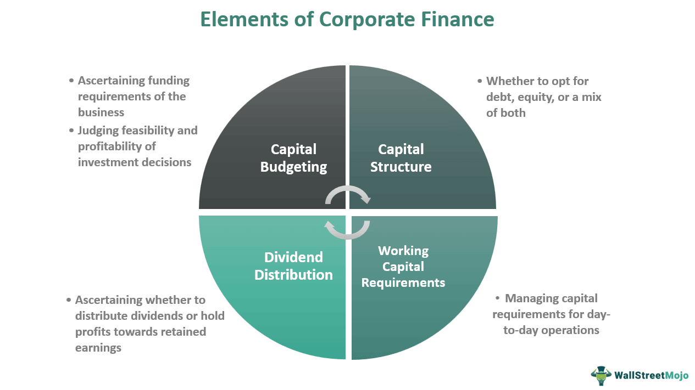

This article explores the intricate relationship between corporate management, financial stability, conglomerates, and algorithmic trading, which are pivotal components of the modern financial landscape. As financial markets grow increasingly complex, understanding how these elements interact is essential for navigating and strategizing within corporate finance.

Corporate management is the backbone of any successful organization, responsible for planning, organizing, directing, and controlling resources to achieve financial stability. This stability is crucial for conglomerates, which are large corporations owning a diverse array of businesses, to withstand economic fluctuations and maintain competitive advantages.



Algorithmic trading, characterized by the use of complex algorithms to execute trades with precision and speed, enhances market efficiency and liquidity. Its integration into corporate strategies presents both opportunities and challenges. The confluence of these elements significantly shapes financial outcomes and strategies, demanding a nuanced understanding to leverage their potential effectively.

In this article, we aim to unpack the roles, benefits, and challenges associated with corporate management, conglomerates, and algorithmic trading. A comprehensive exploration of these topics will provide valuable insights into how they collectively contribute to the financial stability and strategic evolution of modern enterprises.

## Table of Contents

## Understanding Corporate Management and Financial Stability

Corporate management plays a pivotal role in ensuring financial stability through meticulous strategic planning and prudent resource allocation. Effective corporate management involves setting clear goals, devising detailed action plans, and optimally utilizing resources to achieve organizational objectives. It functions as the backbone of financial stability by guiding decision-making processes and steering the organization towards sustainable growth and profitability.

Financial stability is integral to a conglomerate's success, allowing the organization to navigate economic downturns and market volatility. Conglomerates, due to their diverse portfolio of businesses, are particularly influenced by the effectiveness of their management strategies. The stability provided by sound financial management enables conglomerates to mitigate risks and capitalize on opportunities in unfavorable economic conditions. 

Effective corporate management encompasses a variety of principles, including financial forecasting, cost management, and risk assessment. Financial forecasting involves predicting future revenue, expenses, and cash flow to inform strategic decisions. This is often supported by mathematical models and financial metrics, such as the debt-to-equity ratio and return on investment (ROI), which help managers assess the financial health of the organization.

Cost management focuses on minimizing unnecessary expenses while ensuring that resources are allocated efficiently across different business units. This principle is particularly important for conglomerates, where the diversification of business operations can lead to complex financial management challenges.

Risk assessment is another crucial component of corporate management, involving the identification, analysis, and mitigation of potential financial risks. This process often involves scenario analysis and stress testing to evaluate how the conglomerate might perform under different economic conditions. 

Overall, the impact of corporate management on maintaining financial stability cannot be overstated. Efficient strategic planning and resource allocation ensure that the organization is resilient in the face of economic challenges, thereby enhancing its long-term viability and success.

## Conglomerates: Engine of Diversification

Conglomerates are significant players within the global economy, characterized by their ownership of diverse business units operating across various industries. This diversification offers conglomerates distinct advantages in terms of financial stability and growth prospects. The strategic expansion across multiple sectors allows conglomerates to mitigate risk, as downturns in one industry can potentially be offset by stability or growth in others.

Diversification within conglomerates contributes significantly to financial stability. By spreading investments and operational focus across a wide array of business units, conglomerates reduce their exposure to sector-specific risks. This strategy is akin to portfolio diversification in investment management, where a mix of asset types can lead to more consistent returns over time. For instance, if a conglomerate's portfolio includes businesses in technology, manufacturing, and healthcare, a decline in the tech sector could be balanced by growth in healthcare, maintaining overall financial equilibrium.

However, the concept of a 'conglomerate discount' presents a notable challenge. This term refers to the market's tendency to value a diversified conglomerate lower than the sum of its individual business units if they were assessed independently. Investors may perceive conglomerates as less focused, assuming management inefficiencies and potential conflicts of interest between different business units. This perception can result in a lower stock price, reflecting a discount relative to the company's actual break-up value.

The conglomerate discount often prompts companies to justify their multi-industry presence by demonstrating synergies—where combined business operations result in greater efficiency or cost savings than the individual units alone. Such synergies can manifest through shared technology platforms, integrated supply chains, or consolidated management functions, enhancing the overall value proposition of remaining a unified entity.

Despite the challenges associated with the conglomerate discount, many conglomerates continue to thrive by leveraging economies of scale and scope, optimizing resource allocation, and maintaining a robust balance sheet through diversified income streams. In conclusion, while conglomerates face unique valuation challenges, their inherent diversification strategy remains a powerful tool for achieving long-term financial stability amidst fluctuating market conditions.

In evaluating the role of conglomerates as engines of diversification, it becomes evident that the structure enables both risk mitigation and potential undervaluation in market perception. Addressing these elements through effective management and communication of strategic benefits is crucial to realizing the full potential of a conglomerate's diverse business portfolio.

## Algorithmic Trading and Its Role in Financial Stability

Algorithmic trading has become an integral part of modern financial markets due to its ability to execute trades with high speed and precision. Utilizing complex mathematical models, these algorithms analyze various market variables and execute orders without human intervention. The primary advantage is the increased efficiency, allowing for the seamless execution of large volumes of trades while minimizing market impact and transaction costs.

Algorithmic trading contributes to financial stability by enhancing the [liquidity](/wiki/liquidity-risk-premium) of financial markets. Liquidity, the ease with which assets can be bought or sold without affecting the asset's price, is crucial for stable and efficient markets. Algorithms can quickly match buy and sell orders, reducing price [volatility](/wiki/volatility-trading-strategies) and ensuring that asset prices reflect their true economic values. This efficiency in market operations aids in maintaining overall financial robustness.

One of the key aspects of [algorithmic trading](/wiki/algorithmic-trading) is its role in efficient price discovery. By processing vast amounts of data rapidly, algorithms contribute to more accurate asset pricing. With timely trade executions based on real-time data analysis, the price discrepancies are quickly rectified, which supports market equilibrium. This process is vital for financial stability as it mitigates the risk of bubbles and crashes by ensuring that asset prices reflect underlying fundamentals instead of speculative behaviors.

Risk management within algorithmic trading systems is critical to prevent unforeseen market disruptions. Algorithms are equipped with risk management strategies that include stop-loss mechanisms, diversification, and real-time monitoring of market conditions. Stop-loss orders automatically sell an asset at a predefined price to prevent further losses, while diversification ensures that not all trades are concentrated in a single asset, reducing exposure to specific market risks.

Furthermore, algorithmic trading platforms often incorporate [backtesting](/wiki/backtesting) frameworks to simulate trading strategies on historical data. This practice allows for refining algorithms to anticipate and mitigate potential risks. For example, consider a simple moving average crossover strategy implemented in Python:

```python
import pandas as pd

# Load historical market data
data = pd.read_csv('market_data.csv')

# Calculate moving averages
data['SMA_50'] = data['Close'].rolling(window=50).mean()
data['SMA_200'] = data['Close'].rolling(window=200).mean()

# Signal generation: Buy when SMA_50 crosses above SMA_200, sell otherwise
data['Signal'] = 0
data.loc[data['SMA_50'] > data['SMA_200'], 'Signal'] = 1
data.loc[data['SMA_50'] <= data['SMA_200'], 'Signal'] = -1

# Simulate trading
data['Position'] = data['Signal'].shift()
data.dropna(inplace=True)

# Evaluate strategy performance
returns = data['Close'].pct_change() * data['Position'].shift()
cumulative_returns = (1 + returns).cumprod()

print("Cumulative Returns: ", cumulative_returns.iloc[-1])
```

This example highlights the use of simple moving averages to generate buy/sell signals based on historical closing prices, showcasing a fundamental algorithmic risk management tactic.

Despite the benefits, algorithmic trading can pose challenges, particularly concerning market stability during abnormal conditions. Instances such as the "Flash Crash" of 2010 evidenced the potential for these programs to exacerbate market volatility rapidly. Thus, robust regulatory frameworks and continuous monitoring are essential to safeguard against systemic risks linked to high-frequency trading.

In conclusion, algorithmic trading serves as a pivotal mechanism in promoting financial stability by enhancing market efficiency and liquidity. Yet, the complexities and speed involved necessitate advanced risk management strategies and regulatory oversight to mitigate related challenges effectively.

## Synergies Between Conglomerates and Algorithmic Trading

Conglomerates, which are large corporations operating in diverse industries, can significantly benefit from algorithmic trading to refine their decision-making processes and improve financial outcomes. Algorithmic trading employs advanced mathematical models and high-speed data analysis to execute trades with utmost precision and efficiency. This technology offers conglomerates several strategic advantages, primarily by enhancing their ability to process vast amounts of market data and make informed investment decisions rapidly.

One of the primary advantages of integrating algorithmic trading within conglomerates is the improvement in decision-making accuracy. Algorithmic trading systems analyze historical data, market trends, and real-time information to predict future market movements. This enables conglomerates to optimize their investment portfolios, allocate resources more effectively, and hedge against risks. For instance, conglomerates can use [machine learning](/wiki/machine-learning) algorithms to identify patterns and correlations that may not be apparent through traditional analysis methods, thus providing an edge in competitive markets.

Furthermore, algorithmic trading can lead to cost reductions by minimizing transaction costs and preventing human errors. The automation of trade execution ensures that trades occur under optimal conditions, reducing the likelihood of market impact costs that can arise from large transactions. Additionally, the high-frequency trading capabilities of algorithmic systems enable conglomerates to exploit short-term market inefficiencies for profit, further enhancing their financial stability.

However, the integration of algorithmic trading within conglomerates poses certain challenges and regulatory considerations. One major challenge is the need for significant investment in technological infrastructure and skilled personnel to develop and maintain sophisticated trading algorithms. Moreover, conglomerates must navigate a complex regulatory landscape, as financial authorities continually update rules to ensure market fairness and stability. Regulations such as the Markets in Financial Instruments Directive (MiFID II) in the European Union necessitate extensive compliance efforts, as they impose stringent requirements on transparency and risk management in algorithmic trading practices.

In summary, while conglomerates stand to gain substantial benefits from incorporating algorithmic trading into their operations, they must address challenges related to technology investment and regulatory compliance. By striking a balance between leveraging advanced trading technologies and adhering to regulatory standards, conglomerates can harness algorithmic trading to bolster their financial standing and ensure long-term success in the dynamic global market.

## Case Studies: Successful Integrations

The integration of algorithmic trading within conglomerates has shown remarkable success in enhancing financial performance. This section examines real-world examples that highlight the tangible benefits and considerations associated with implementing algorithmic trading strategies.

One prominent example is the industrial conglomerate General Electric (GE), which has integrated algorithmic trading strategies to optimize its financial operations. By utilizing sophisticated algorithms, GE has been able to effectively manage its extensive asset portfolio, ensuring that capital is allocated efficiently across its diverse business sectors. This has not only maximized returns but also minimized risk exposure by dynamically adjusting investments based on market conditions. The company's strategic implementation of these algorithms has provided insights into pricing, demand forecasts, and inventory management, ultimately boosting overall operational efficiency.

Another noteworthy case is the multinational conglomerate Siemens AG. Siemens has embraced algorithmic trading to streamline its energy and financial service divisions. By deploying machine learning algorithms, Siemens has achieved improved prediction accuracy in energy consumption and pricing models. This has allowed the conglomerate to optimize energy distribution, significantly reducing operational costs. Additionally, in financial services, algorithmic trading has enhanced Siemens' investment strategy, allowing for rapid execution of trades, improved liquidity management, and reduction of transaction costs. These improvements demonstrate the critical role of algorithmic trading in refining decision-making processes and financial outcomes.

In the technology sector, Alphabet Inc., the parent company of Google, has effectively incorporated algorithmic trading across its investment portfolio. Through automated trading, Alphabet manages its substantial cash reserves and investment holdings, capitalizing on market movements with precision. The use of advanced trading algorithms has facilitated better risk assessment and management, providing Alphabet with a robust framework to counteract market volatilities. Alphabet's strategic embrace of algorithmic trading has not only safeguarded its investments but also contributed to consistent financial growth.

These case studies underscore the advantages of integrating algorithmic trading within conglomerate operations. They not only highlight the efficiency and speed brought forth by algorithmic systems but also emphasize the importance of sound data-driven decision-making. The successful implementations by GE, Siemens, and Alphabet illustrate that while algorithmic trading offers considerable benefits, it necessitates careful consideration of potential risks and continuous refinement to adapt to evolving market conditions.

## Future Trends and Developments

Algorithmic trading has seen significant advancements due to breakthroughs in technology and data analytics, shaping how corporate conglomerates operate in increasingly complex markets. As we look to the future, several trends are poised to redefine both algorithmic trading and its implications for corporate conglomerates.

### Machine Learning and Artificial Intelligence

Machine learning (ML) and [artificial intelligence](/wiki/ai-artificial-intelligence) (AI) are prominently featured in the next wave of algorithmic trading advancements. These technologies allow the creation of predictive models that can analyze vast datasets to uncover patterns and optimize trading strategies. For conglomerates, these tools offer the potential to significantly enhance decision-making processes by enabling simulations of various market conditions and their impact on diversified portfolios.

For instance, predictive analytics can identify optimal timing for asset allocations or mergers and acquisitions based on historical and real-time data. The ability to predict market movements with higher accuracy can result in improved financial outcomes.

### Quantum Computing

Quantum computing promises to exponentially increase computational speed and solve complex problems that are currently intractable for classical computers. For algorithmic trading, this presents possibilities such as accelerating optimizations of trading strategies, risk analysis, and portfolio management. Corporate conglomerates could leverage this technology to handle complex multi-variable financial models, potentially improving their competitive advantage through superior market insights.

Although still in nascent stages, efforts by companies like IBM and Google in quantum computing suggest that such technological integration could become more feasible and prevalent in the near future.

### Blockchain and Cryptocurrencies

Blockchain technology is paving the way for more secure and transparent trading systems. By enabling decentralized finance (DeFi), blockchain can reduce counterparty risk and enhance trust among market participants. For conglomerates, this could mean the adoption of blockchain-based systems for internal and external transactional processes, leading to cost savings and efficiency gains.

Cryptocurrencies, while volatile, also present new avenues for investment and diversification. Algorithmic trading strategies specifically tailored for cryptocurrencies could offer conglomerates unique returns compared to traditional assets.

### Regulatory Technological Adaptations

As algorithmic trading and conglomerate operations become more intertwined, there will be an increased need for regulatory technologies (RegTech) that ensure compliance with evolving financial regulations. Automated systems that monitor trading activities for compliance will become more sophisticated, helping conglomerates manage risks related to regulatory breaches.

### Conclusion

Emerging trends in financial technology are set to revolutionize algorithmic trading, offering conglomerates new tools for optimizing financial performance. The capacity to rapidly adapt to these technological advancements will be a crucial determinant of sustained competitive advantage in the corporate sector. As these technologies mature, they promise to not only drive efficiency but also foster innovation, presenting opportunities and challenges that conglomerates must strategically embrace.

## Conclusion

In conclusion, the dynamic interplay between corporate management, financial stability, conglomerates, and algorithmic trading forms a complex matrix that defines the contemporary financial landscape. Each element contributes to a comprehensive framework essential for navigating the challenges of the modern economic environment.

Corporate management is a cornerstone in maintaining financial stability, ensuring that strategic planning and efficient resource allocation pave the way for resilience against economic fluctuations. This stability is particularly significant for conglomerates, which benefit from diversification, allowing them to mitigate risks and capitalize on various market opportunities simultaneously.

The advent of algorithmic trading introduces a technological edge, offering unprecedented speed and precision in executing trades. This capability not only enhances market efficiency but also plays a crucial role in stabilizing financial operations by implementing advanced risk management strategies. The integration of algorithmic trading within conglomerate structures can lead to improved decision-making processes and financial outcomes, potentially offering a competitive advantage in a rapidly evolving marketplace.

For corporate strategies to remain robust and adaptive, the seamless integration of these elements is imperative. Embracing innovation, particularly in financial management, ensures that companies are not only prepared for current challenges but are also equipped to exploit future opportunities. The continuous evolution of financial technology suggests that staying ahead of emerging trends and adopting transformative strategies will be vital for maintaining a leading position in the industry.

## References & Further Reading

[1]: Bergstra, J., Bardenet, R., Bengio, Y., & Kégl, B. (2011). ["Algorithms for Hyper-Parameter Optimization."](https://dl.acm.org/doi/10.5555/2986459.2986743) Advances in Neural Information Processing Systems 24.

[2]: ["Advances in Financial Machine Learning"](https://www.amazon.com/Advances-Financial-Machine-Learning-Marcos/dp/1119482089) by Marcos Lopez de Prado

[3]: ["Evidence-Based Technical Analysis: Applying the Scientific Method and Statistical Inference to Trading Signals"](https://www.amazon.com/Evidence-Based-Technical-Analysis-Scientific-Statistical/dp/0470008741) by David Aronson

[4]: ["Machine Learning for Algorithmic Trading"](https://github.com/stefan-jansen/machine-learning-for-trading) by Stefan Jansen

[5]: ["Quantitative Trading: How to Build Your Own Algorithmic Trading Business"](https://www.amazon.com/Quantitative-Trading-Build-Algorithmic-Business/dp/1119800064) by Ernest P. Chan