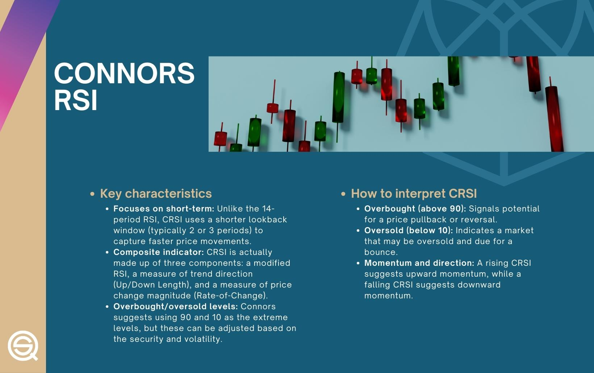

Algorithmic trading, or algo trading, utilizes computer programs to make trading decisions based on pre-determined criteria. This automated approach enables traders to exploit market opportunities with speed and precision unattainable by human execution alone. Central to the success of algorithmic trading are technical indicators—mathematical calculations based on price, volume, or open interest—designed to predict future market movements by analyzing past data. These indicators provide essential signals that guide algorithmic strategies.

One of the widely used technical indicators is the Relative Strength Index (RSI), developed by J. Welles Wilder. RSI measures the magnitude of recent price changes to evaluate overbought or oversold conditions in a market. Typically calculated over a 14-day period, RSI values range from 0 to 100, with a reading above 70 indicating an overbought condition and a reading below 30 signaling an oversold condition. RSI helps traders identify potential reversal points and gauge market momentum, making it an essential tool for many trading strategies.



Connors RSI is an advanced version of the traditional RSI, introduced by Larry Connors. Tailored for short-term trading, it integrates three components to address some limitations of the original RSI: a short-period RSI, an Up/Down Streak length, and a Rate of Change function. This composite indicator provides a more dynamic measure of market momentum and reversals, particularly in short-term scenarios.

The primary objective of this article is to explore how Connors RSI can be harnessed in algorithmic trading. By elaborating on its formulation, calculation, application, and backtesting, this article aims to illustrate the benefits of using Connors RSI to create more effective short-term trading strategies. Understanding these principles allows traders to enhance their approach to capturing market inefficiencies and improve decision-making processes in volatile environments.

## Table of Contents

## Understanding Connors RSI

Connors RSI, developed by trading expert Larry Connors, is an advanced technical analysis indicator designed to enhance traditional RSI's effectiveness by tailoring it for short-term trading scenarios. Unlike the conventional RSI which solely measures price momentum, Connors RSI combines three distinct components to offer a nuanced view of market sentiment, aiming to provide more accurate signals, particularly in volatile markets.

### Components Differentiating Connors RSI from Traditional RSI

1. **3-period RSI**: This component retains the core principle of the traditional RSI but modifies it to span a much shorter period. The 3-period RSI calculates momentum by comparing averages of up and down closes over a brief three-day timeframe. This shorter lookback period allows traders to capture rapid swings in price, offering a more responsive gauge than the usual 14-period RSI found in standard analysis.

2. **Up/Down Streak Length**: This metric calculates the duration for which consecutive up or down closes occur, quantifying the persistence of market moves. It effectively monitors the streak or consecutive sequence of days that close higher or lower than their previous day. This streak length is then converted into an RSI value using a 2-period RSI, which provides insights into the strength and potential exhaustion of ongoing price trends.

3. **Rate of Change (ROC)**: The final component is the Rate of Change measured over the past 100 days. It essentially calculates the percentage change in price over this span, offering a perspective on the underlying momentum beyond short-term fluctuations. By combining this broader view with the brief 3-period RSI, Connors RSI integrates both short-term and intermediate-term momentum insights, making it highly apt for timing trades.

### Intended Improvements of Connors RSI over Traditional RSI

The integration of these three components enables Connors RSI to offer several enhancements over the traditional RSI. Firstly, the combination allows for more sensitive detection of overbought and oversold conditions, a critical aspect for traders focused on short-term reversals. The addition of the up/down streak introduces an innovative dimension that captures the market’s short-term [momentum](/wiki/momentum) persistence, unaccounted for by classical RSI. Furthermore, the inclusion of the Rate of Change incorporates a longer-term view, bridging short-term oscillations with broader market trends.

Collectively, these improvements facilitate a more dynamic and adaptive tool for traders, enabling them to make informed decisions in fast-moving markets. By blending different perspectives of momentum and price change, Connors RSI goes beyond the capabilities of traditional RSI, offering an indicator suited for the nuances of contemporary [algorithmic trading](/wiki/algorithmic-trading) strategies.

## Calculating Connors RSI

Calculating Connors RSI involves combining three distinct components that enhance the traditional RSI by providing a more comprehensive view of short-term market movements. These components include the Simple 3-period RSI, the Up/Down Streak with 2-period RSI, and the Rate-of-Change. Each of these elements is calculated separately and then input into the Connors RSI formula to yield the final value.

### Simple 3-period RSI

The Relative Strength Index (RSI) is a momentum oscillator that measures the speed and change of price movements. The traditional formula for RSI is:

$$
\text{RSI} = 100 - \left( \frac{100}{1 + \frac{\text{Average Gain}}{\text{Average Loss}}} \right)
$$

For the Connors RSI, a 3-period RSI is specifically used, which requires calculating average gains and losses over a 3-time-period window:

1. Calculate the changes in price (today’s close - yesterday’s close) over the last 3 days.
2. Separate these into gains and losses.
3. Compute the average of gains and average of losses.
4. Substitute the values into the RSI formula.

### Up/Down Streak with 2-period RSI

The Up/Down Streak is defined by counting the number of consecutive up or down closes. The 2-period RSI of this streak provides an additional momentum measure:

1. Determine the length of the current Up/Down streak.
2. Use this streak number as the data series for calculating the 2-period RSI.
3. Apply the RSI formula over this 2-day period to the streak length.

### Rate-of-Change (ROC)

The Rate-of-Change component measures the percentage change in price over a specified number of days. For Connors RSI, the conventional span is often used:

$$
\text{ROC} = \left( \frac{\text{Current Price} - \text{Price} \, n \, \text{days ago}}{\text{Price} \, n \, \text{days ago}} \right) \times 100
$$

These values are often normalized or further processed to fit the scale of RSI values.

### Connors RSI Formula

Once all components have been calculated, the final Connors RSI is derived by combining these three equally weighted components, typically as their arithmetic mean:

$$
\text{Connors RSI} = \frac{\text{RSI} + \text{Streak RSI} + \text{ROC}}{3}
$$

This formula provides a numerical value that traders use to identify favorable trading conditions, reflecting a more thorough analysis of price momentum and streak dynamics than traditional RSI. By incorporating short-term shifts and price change rates, Connors RSI offers an enhanced tool for spotting potential market reversals and overbought or oversold conditions.

## How Connors RSI Works in Trading

Connors RSI serves as a refined tool for assessing market momentum, particularly suitable for short-term trading strategies. This specialized indicator incorporates three components to provide a more detailed view of market conditions and investor behavior.

The first component, the three-period RSI, evaluates price movements over a shorter timeframe compared to the traditional 14-period RSI. By focusing on a reduced period, Connors RSI offers enhanced responsiveness to recent price changes, which is essential for traders seeking to capitalize on short-term market fluctuations.

The overbought and oversold thresholds in Connors RSI provide crucial signals for traders. Typically, a Connors RSI value above 70 is considered overbought, suggesting that the asset may be overvalued or poised for a price decline. Conversely, a value below 30 indicates an oversold condition, implying that the asset may be undervalued or ready for a price increase. These thresholds empower traders to make informed entry and [exit](/wiki/exit-strategy) decisions based on anticipated market reversions.

Beyond these thresholds, Connors RSI is effective in short-term trading decisions due to its composite nature. By analyzing up/down streaks alongside rate-of-change measures, traders can discern patterns of sustained price movements—be it momentum continuation or reversal—thereby enhancing the accuracy of trade timing.

Technical traders can leverage Connors RSI across various market trends by adjusting their strategies to match current conditions. In trending markets, the indicator can help identify pullbacks or rallies offering favorable entry points for trend-following strategies. Conversely, in ranging markets, Connors RSI can aid in recognizing reversal points, enabling mean-reversion strategies that capitalize on price fluctuations within a defined range.

Overall, Connors RSI, with its tailored approach and refined signals, allows traders to gauge market momentum with improved precision, adapting to both volatile and stable market settings. This adaptability makes it an invaluable tool for technical traders focused on refining their short-term trading strategies.

## Connors RSI vs. Traditional RSI

Connors RSI and the traditional Relative Strength Index (RSI) are both pivotal in technical analysis, yet they serve slightly different roles due to their distinct structures, responsiveness, and applicability in various trading conditions. A fundamental comparison between these two indicators highlights their potential uses and limitations in market analysis.

### Responsiveness and Volatility

The traditional RSI, developed by J. Welles Wilder, is a momentum oscillator that oscillates between 0 and 100, offering insights into the speed and change of price movements. Typically, RSI measures the magnitude of recent price changes to evaluate overbought or oversold conditions in the price of a stock or other asset across a specified period, usually 14 days. Its formula is:

$$
RSI = 100 - \left( \frac{100}{1 + RS} \right)
$$

where $RS$ is the average gain of up periods during the specified time frame divided by the average loss of down periods over the same period.

Connors RSI, developed by Larry Connors, extends the RSI concept by incorporating not only the traditional RSI values but also short-term price momentum and the duration of price trends. It employs three components:

1. The traditional RSI, generally calculated over a short period (e.g., 3 days) to enhance responsiveness.
2. The Up/Down Streak, representing the number of consecutive days of positive or negative closes.
3. The Rate of Change (ROC) over a specific period, usually 100 days, to measure short-term price momentum.

Connors RSI is mathematically expressed as:

$$
\text{Connors RSI} = \frac{\text{RSI} + \text{Streak RSI} + \text{ROC RSI}}{3}
$$

This formula suggests Connors RSI can respond more rapidly to short-term price movements compared to traditional RSI, making it potentially more useful in volatile or fast-paced markets.

### Appropriate Application Scenarios

**Traditional RSI** is well-suited for traders interested in general market conditions over extended periods. Its traditional 14-day period provides a broader view of medium-term trends, making it ideal for longer-term trading strategies and for identifying more sustained overbought or oversold conditions.

**Connors RSI**, on the other hand, can be particularly advantageous in short-term trading scenarios due to its incorporation of multiple indicators that enhance its sensitivity to recent price movements. This makes it a valuable tool for day traders or those utilizing high-frequency trading strategies who require more immediate feedback on market momentum shifts.

### Advantages and Potential Limitations

**Advantages of Connors RSI:**
- **Enhanced Sensitivity:** By integrating additional components, Connors RSI offers a more nuanced view of price action, enabling traders to identify entry and exit points more precisely in short-term trades.
- **Versatility in Volatile Markets:** Its construction allows it to adapt to varying market volatility, providing potentially more reliable signals in rapidly changing environments.

**Potential Limitations of Connors RSI:**
- **Complex Structure:** The inclusion of multiple components increases the complexity of calculations and interpretation, which might not be ideal for novice traders.
- **Short-Term Bias:** As it emphasizes short-term indicators, there may be increased likelihood of generating false signals over extended periods or in trending markets, necessitating careful validation and backtesting.

Incorporating Connors RSI into trading strategies requires a nuanced understanding of both market dynamics and the trader's specific time horizon. While it offers the potential for more responsive market analysis than traditional RSI, traders must weigh this against its increased complexity and the needs of their particular strategy.

## Backtesting Connors RSI in Algorithmic Trading

Backtesting is a pivotal process in validating trading strategies, offering traders insights into how a strategy would have performed based on historical data. This retrospective analysis helps identify the strengths and weaknesses of a trading strategy before actual capital is risked in the market. When applied to Connors RSI, [backtesting](/wiki/backtesting) allows traders to evaluate its ability to signal profitable entry and exit points in various market conditions.

To illustrate a backtesting scenario using Connors RSI, consider its application on the S&P 500 index. The process involves gathering historical price data of the index and calculating the Connors RSI values based on this data. A typical backtesting procedure might look like this:

1. **Data Preparation**: Acquire historical price data for the S&P 500. Ensure that the dataset is comprehensive, covering a significant period to capture different market conditions (e.g., bull and bear markets).

2. **Calculate Connors RSI**: Implement the Connors RSI formula:
$$
   \text{Connors RSI} = \frac{\text{Simple 3-period RSI} + \text{2-period RSI of the Up/Down Streaks} + \text{Rate of Change (ROC)}}{3}

$$

   Ensure that each component is calculated accurately using the data over the same historical period.

3. **Strategy Development**: Develop a trading strategy using Connors RSI signals. For instance, a simple strategy could involve opening a long position when the Connors RSI is below 20 (indicating oversold conditions) and closing the position when it exceeds 70 (indicating overbought conditions).

4. **Simulation and Analysis**: Implement the strategy in a backtesting platform, simulating trades based on historical data. Analyze the results, focusing on metrics such as the total return, maximum drawdown, and win/loss ratio.

5. **Evaluation**: Interpret the results to assess the strategy's viability. Positive results might show that the strategy consistently yields returns and manages risk effectively. Conversely, a strategy that frequently results in losses or substantial drawdowns may need adjustments, such as refining entry and exit conditions or combining Connors RSI with other indicators.

For Python implementation, libraries like `pandas` for data handling and `Zipline` for backtesting can be instrumental. Here's a simplified example of how Connors RSI might be calculated:

```python
import pandas as pd

def calculate_connors_rsi(df, period_3=3, period_2=2, roc_period=100):
    # Calculate 3-period RSI
    delta = df['Close'].diff()
    gain = (delta.where(delta > 0, 0)).rolling(window=period_3).mean()
    loss = (-delta.where(delta < 0, 0)).rolling(window=period_3).mean()
    rs = gain / loss
    rsi_3 = 100 - (100 / (1 + rs))

    # Calculate Up/Down Streak and 2-period RSI
    df['Direction'] = df['Close'].diff().apply(lambda x: 1 if x > 0 else (-1 if x < 0 else 0))
    streak = df['Direction'] * pd.Series(range(1, len(df) + 1)).where(df['Direction'] != 0)
    streak_rsi = streak.rolling(window=period_2).apply(lambda x: sum(x) / (sum(abs(x))+1e-10))

    # Rate of Change
    roc = df['Close'].pct_change(periods=roc_period) * 100

    # Connors RSI
    connors_rsi = (rsi_3 + streak_rsi + roc) / 3

    return connors_rsi

# Sample DataFrame 'df' with daily closing prices
df = pd.read_csv('historical_data.csv')
df['Connors_RSI'] = calculate_connors_rsi(df)
```

Backtesting results can provide valuable insights, such as identifying the efficacy of the Connors RSI in different time frames or market environments. Insights gained from these tests enable traders to fine-tune their strategies, improving their decision-making process and enhancing overall trading performance. Traders are encouraged to not only rely on backtesting but to also continuously monitor real-time performance and adapt strategies to evolving market dynamics.

## Implementing Connors RSI in Algo Trading

Implementing Connors RSI (CRSI) in algorithmic trading involves a series of strategic steps that consider both the computational and market-oriented aspects of trading. Below, the key steps in effectively integrating CRSI into an algorithmic trading system are outlined:

### Steps for Integrating Connors RSI

1. **Understand the CRSI Formula:**
   Connors RSI is computed using a three-component system: a short-term RSI, an Up/Down Streak with a shorter RSI, and a Rate of Change (ROC). Before implementing, ensure you understand each part and how they contribute to the composite CRSI. The formula is typically:
$$
   \text{CRSI} = \frac{\text{RSI}_{(3)}}{3} + \frac{\text{Up/Down Streak RSI}_{(2)}}{3} + \frac{\text{ROC}}{3}

$$

   - **Simple RSI (3-period)**: This is a traditional RSI calculated over a three-day period.
   - **Up/Down Streak RSI (2-period)**: It measures the RSI over the duration of consecutive up or down closes, typically over two days.
   - **Rate of Change (ROC)**: It assesses price change over the look-back period.

2. **Data Preprocessing:**
   Collect historical price data from reliable financial data providers. Ensure data integrity by cleaning and preparing the dataset, as accurate computation of CRSI depends on precise historical data. 

3. **Algorithm Design and Scripting:**
   - **Select a Programming Language**: Python is highly recommended due to its extensive libraries, ease of use, and community support. 
   - **Scripting**: Write a script to calculate the CRSI using libraries such as Pandas for data handling and NumPy for numerical computations.

   ```python
   import pandas as pd

   def calculate_crsi(data, rsi_period=3, streak_period=2, roc_period=100):
       # Calculate RSI
       delta = data['close'].diff()
       gain = (delta.where(delta > 0, 0)).rolling(rsi_period).mean()
       loss = (-delta.where(delta < 0, 0)).rolling(rsi_period).mean()
       rs = gain / loss
       rsi = 100 - (100 / (1 + rs))

       # Calculate Up/Down Streak RSI
       streaks = delta.where(delta != 0).apply(lambda x: 1 if x > 0 else -1 if x < 0 else 0).rolling(streak_period).sum()
       streak_rsi = 100 - (100 / (1 + streaks))

       # Calculate ROC
       roc = data['close'].pct_change(roc_period) * 100

       # Calculate CRSI
       crsi = (rsi + streak_rsi + roc) / 3
       data['CRSI'] = crsi

       return data
   ```

4. **Backtesting Framework:**
   Select a robust backtesting framework like Backtrader or Zipline. Backtesting is crucial for evaluating CRSI's historical performance on selected financial instruments.

5. **Model Automation:**
   Automate the trading strategy using platforms that support algorithmic trade execution, such as MetaTrader or [Interactive Brokers](/wiki/interactive-brokers-api). Key considerations include latency, execution speed, and reliability in trade execution.

6. **Risk Management and Strategy Optimization:**
   Integrate risk management protocols to mitigate losses and optimize the CRSI parameters. This optimization may involve adjusting look-back periods or sensitivity levels based on different market conditions.

### Tools and Platforms Supporting Connors RSI Implementation

- **Python Libraries**: Utilize libraries like TA-Lib for technical analysis, including CRSI calculation.
- **Backtrader**: An open-source Python framework for backtesting trading strategies, supporting CRSI.
- **QuantConnect**: A cloud-based algorithmic trading platform offering extensive support for custom indicator strategies like CRSI.
- **MetaTrader 4/5**: Offers scripting capabilities via MQL for strategy automation, including CRSI.
- **Interactive Brokers API**: Provides connectivity for automated trade execution once CRSI buy/sell signals are generated.

The incorporation of Connors RSI within an algorithmic framework allows traders to systematically approach short-term trading by harnessing refined momentum analysis, facilitating informed decision-making and enhancing trading strategy performance.

## Best Practices and Tips

To maximize the effectiveness of Connors RSI in trading, it is critical to adopt a set of best practices that ensure both accuracy and adaptability to varying market conditions.

### Optimizing Parameters for Different Market Conditions

One of the fundamental aspects of utilizing Connors RSI effectively is the optimization of its parameters. The Connors RSI is composed of three components: a simple 3-period RSI, a 2-period RSI to measure the Up/Down Streak, and a Rate of Change over a specific period (commonly 100 days). Each component can be fine-tuned to better suit different market environments. For instance:

- **Volatile Markets**: In periods of high volatility, you might consider shortening the look-back period for the RSI components to increase the indicator's sensitivity to rapid price changes. Shorter periods may help capture quick reversals and alert you to overbought or oversold conditions sooner.

- **Stable Markets**: In contrast, longer look-back periods might be more appropriate in stable market conditions to prevent overtrading based on insignificant price movements.

Python code to adjust the RSI period could look like this:

```python
import pandas as pd

def calculate_rsi(data, period=3):
    delta = data.diff()
    gain = (delta.where(delta > 0, 0)).rolling(window=period).mean()
    loss = (-delta.where(delta < 0, 0)).rolling(window=period).mean()
    rs = gain / loss
    return 100 - (100 / (1 + rs))

# Example usage
data = pd.Series([your_price_data_here])
rsi_short = calculate_rsi(data, period=2)  # More reactive RSI
rsi_long = calculate_rsi(data, period=5)  # Less reactive RSI
```

Experimentation with different periods is crucial, and traders should conduct backtests to find optimal settings that fit their specific strategy.

### Combining Connors RSI with Other Indicators

To enhance strategy robustness, Connors RSI can be combined with other technical indicators. Pairing it with complimentary tools can help confirm signals and reduce the likelihood of false alarms.

- **Moving Averages**: Combining Connors RSI with moving averages can help confirm trend direction. For instance, using a 200-day moving average to identify the dominant trend can assist in filtering Connors RSI signals; only taking buy signals when the price is above the moving average and sell signals when below may increase trade effectiveness.

- **Volume Analysis**: Volume indicators, such as the On-Balance Volume (OBV), can be used to validate momentum signals given by Connors RSI. An alignment between Connors RSI signaling oversold conditions and an increasing OBV may strengthen the conviction to enter a long position.

- **Bollinger Bands**: Bollinger Bands can work alongside Connors RSI to indicate overbought or oversold conditions, providing a confluence of signals for higher probability trades.

These combinations allow traders to construct a more holistic view of market conditions and make informed trading decisions. By integrating multiple indicators, traders can devise a more comprehensive strategy that leverages the strengths of each tool while mitigating their weaknesses. Careful testing and validation through backtesting and real-time simulation are necessary steps in this process to ensure alignment with the chosen market conditions and trading objectives.

## Conclusion

Connors RSI, an advanced version of the traditional Relative Strength Index, provides traders with a more nuanced approach to gauging market momentum, especially for short-term trading strategies. It achieves this by integrating three core components: the 3-period RSI, the Up/Down Streak Length, and the Rate of Change, thereby enhancing its responsiveness to market conditions.

The primary advantage of Connors RSI lies in its ability to better capture the immediate market sentiment, which is particularly advantageous for traders focused on short-term market movements. By factoring in additional elements beyond the scope of classical RSI, it offers a more dynamic view of overbought or oversold conditions, helping traders make more informed decisions.

However, the use of Connors RSI, like any technical indicator, demands vigilance. Market conditions are continuously evolving, and indicators can produce false signals if used inflexibly. Traders are encouraged to incorporate Connors RSI within a comprehensive trading framework that considers multiple indicators and market factors to validate signals. This multidimensional approach can help mitigate risks associated with relying solely on one indicator.

Moreover, the importance of backtesting cannot be overstated. Before live deployment, traders should rigorously backtest Connors RSI across varied market scenarios and instruments. This process allows traders to identify potential limitations and optimize their strategies accordingly, ensuring that the indicator’s settings are finely tuned to align with specific market dynamics.

In conclusion, while Connors RSI offers a sophisticated tool for capturing market momentum, its efficacy is greatly enhanced when used as part of a broader, well-tested trading strategy. Traders must engage in continuous research and adapt to evolving market conditions, ensuring that their strategies remain robust and effective.

## References & Further Reading

[1]: Wilder, J. W. (1978). ["New Concepts in Technical Trading Systems."](https://archive.org/details/newconceptsintec00wild) Trend Research.

[2]: Connors, L., & Alvarez, C. (2009). ["Short Term Trading Strategies That Work."](https://www.amazon.com/Short-Term-Trading-Strategies-That/dp/0981923909) TradingMarkets Publishing Group.

[3]: Aronson, D. R. (2006). ["Evidence-Based Technical Analysis: Applying the Scientific Method and Statistical Inference to Trading Signals."](https://www.amazon.com/Evidence-Based-Technical-Analysis-Scientific-Statistical/dp/0470008741) John Wiley & Sons.

[4]: Chan, E. P. (2008). ["Quantitative Trading: How to Build Your Own Algorithmic Trading Business."](https://github.com/ftvision/quant_trading_echan_book) John Wiley & Sons.

[5]: Jansen, S. (2018). ["Machine Learning for Algorithmic Trading."](https://www.amazon.com/Hands-Machine-Learning-Algorithmic-Trading/dp/178934641X) Packt Publishing.

[6]: Lopez de Prado, M. (2018). ["Advances in Financial Machine Learning."](https://www.amazon.com/Advances-Financial-Machine-Learning-Marcos/dp/1119482089) Wiley.

[7]: Connors Research, LLC. (2012). ["The Connors RSI: A Technical Analysis Indicator Created by Connors Research."](https://www.quantifiedstrategies.com/connors-rsi/)